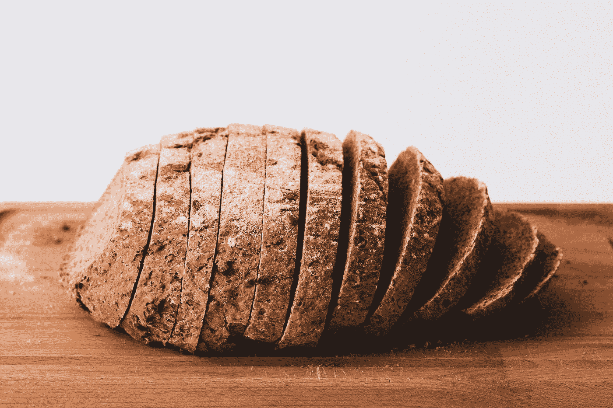

# 材料用户界面-自定义列表

> 原文：<https://javascript.plainenglish.io/material-ui-customizing-lists-2ad166b2ec8a?source=collection_archive---------11----------------------->


Photo by [Louis Hansel @shotsoflouis](https://unsplash.com/@louishansel?utm_source=medium&utm_medium=referral) on [Unsplash](https://unsplash.com?utm_source=medium&utm_medium=referral)

材质 UI 是一个为 React 制作的材质设计库。

这是一组具有材质设计风格的 React 组件。

在这篇文章中，我们将看看如何用材料用户界面定制列表。

# 列表控件

我们可以向列表项添加表单控件。

为此，我们可以写:

```
import React from "react";
import List from "[@material](http://twitter.com/material)-ui/core/List";
import ListItem from "[@material](http://twitter.com/material)-ui/core/ListItem";
import ListItemIcon from "[@material](http://twitter.com/material)-ui/core/ListItemIcon";
import ListItemText from "[@material](http://twitter.com/material)-ui/core/ListItemText";
import Checkbox from "[@material](http://twitter.com/material)-ui/core/Checkbox";export default function App() {
  const [checked, setChecked] = React.useState([0]); const handleToggle = value => () => {
    const currentIndex = checked.indexOf(value);
    const newChecked = [...checked]; if (currentIndex === -1) {
      newChecked.push(value);
    } else {
      newChecked.splice(currentIndex, 1);
    } setChecked(newChecked);
  }; return (
    <List>
      {[0, 1, 2, 3].map(value => {
        return (
          <ListItem
            key={value}
            role={undefined}
            dense
            button
            onClick={handleToggle(value)}
          >
            <ListItemIcon>
              <Checkbox
                edge="start"
                checked={checked.indexOf(value) !== -1}
                tabIndex={-1}
                disableRipple
              />
            </ListItemIcon>
            <ListItemText primary={` item ${value + 1}`} />
          </ListItem>
        );
      })}
    </List>
  );
}
```

添加左侧带有复选标记的项目列表。

我们在`ListItemIcon`里面添加了`Checkbox`。

设置为`start`的`edge`表示它停留在左侧。

`onClick`道具在`ListItem`上。

`handleToggle`函数返回一个将选中项目的索引添加到`checked`状态的函数。

我们通过检查索引是否已经在`checked`数组中来查看它是否被检查。

如果是的话，那就检查过了。

否则就不是了。

如果它没有被选中，那么索引将被推入新的数组。

否则，我们从数组中移除带有`splice`的项目。

然后我们调用`setChecked`来设置状态。

然后我们可以在`Checkbox`的`checked`道具中设置每个复选框的`checked`值。

我们还可以添加复选框作为辅助操作:

```
import React from "react";
import List from "[@material](http://twitter.com/material)-ui/core/List";
import ListItem from "[@material](http://twitter.com/material)-ui/core/ListItem";
import Avatar from "[@material](http://twitter.com/material)-ui/core/Avatar";
import ListItemText from "[@material](http://twitter.com/material)-ui/core/ListItemText";
import Checkbox from "[@material](http://twitter.com/material)-ui/core/Checkbox";
import ListItemAvatar from "[@material](http://twitter.com/material)-ui/core/ListItemAvatar";
import ListItemSecondaryAction from "[@material](http://twitter.com/material)-ui/core/ListItemSecondaryAction";export default function App() {
  const [checked, setChecked] = React.useState([0]); const handleToggle = value => () => {
    const currentIndex = checked.indexOf(value);
    const newChecked = [...checked]; if (currentIndex === -1) {
      newChecked.push(value);
    } else {
      newChecked.splice(currentIndex, 1);
    } setChecked(newChecked);
  }; return (
    <List>
      {[0, 1, 2, 3].map(value => {
        return (
          <ListItem key={value} button>
            <ListItemAvatar>
              <Avatar
                alt={`cat ${value + 1}`}
                src="http://placekitten.com/200/200"
              />
            </ListItemAvatar>
            <ListItemText primary={`item ${value + 1}`} />
            <ListItemSecondaryAction>
              <Checkbox
                edge="end"
                onChange={handleToggle(value)}
                checked={checked.indexOf(value) !== -1}
              />
            </ListItemSecondaryAction>
          </ListItem>
        );
      })}
    </List>
  );
}
```

我们像在前面的例子中一样列出了项目。

`ListItemAvatar`在左侧显示头像。

`ListItemSecondaryAction`显示右侧的复选框。

`edge`设置为`end`在右侧显示复选框。

复选框的逻辑是相同的。

# 转换

我们可以向列表项添加开关。

例如，我们可以写:

```
import React from "react";
import List from "[@material](http://twitter.com/material)-ui/core/List";
import ListItem from "[@material](http://twitter.com/material)-ui/core/ListItem";
import Avatar from "[@material](http://twitter.com/material)-ui/core/Avatar";
import ListItemText from "[@material](http://twitter.com/material)-ui/core/ListItemText";
import Switch from "[@material](http://twitter.com/material)-ui/core/Switch";
import ListItemAvatar from "[@material](http://twitter.com/material)-ui/core/ListItemAvatar";
import ListItemSecondaryAction from "[@material](http://twitter.com/material)-ui/core/ListItemSecondaryAction";export default function App() {
  const [checked, setChecked] = React.useState([0]); const handleToggle = value => () => {
    const currentIndex = checked.indexOf(value);
    const newChecked = [...checked]; if (currentIndex === -1) {
      newChecked.push(value);
    } else {
      newChecked.splice(currentIndex, 1);
    } setChecked(newChecked);
  }; return (
    <List>
      {[0, 1, 2, 3].map(value => {
        return (
          <ListItem key={value} button>
            <ListItemAvatar>
              <Avatar
                alt={`cat ${value + 1}`}
                src="http://placekitten.com/200/200"
              />
            </ListItemAvatar>
            <ListItemText primary={` item ${value + 1}`} />
            <ListItemSecondaryAction>
              <Switch
                edge="end"
                onChange={handleToggle(value)}
                checked={checked.indexOf(value) !== -1}
              />
            </ListItemSecondaryAction>
          </ListItem>
        );
      })}
    </List>
  );
}
```

向右侧的每个列表项添加开关。

我们所做的只是用一个`Switch`替换了`Checkbox`。

他们拿着同样的道具。



Photo by [Jude Infantini](https://unsplash.com/@easy_emu?utm_source=medium&utm_medium=referral) on [Unsplash](https://unsplash.com?utm_source=medium&utm_medium=referral)

# 结论

我们可以在列表项的左侧或右侧添加控件。

此外，我们可以在列表项的左侧添加头像。

复选框和开关可以打开和关闭。

# **简明英语 JavaScript**

你知道我们有三份出版物和一个 YouTube 频道吗？在[**plain English . io**](https://plainenglish.io/)找到一切的链接！