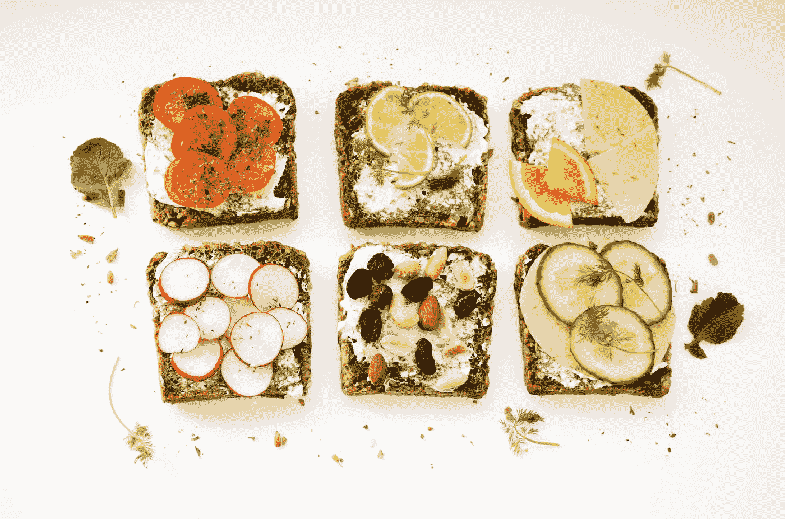

# 材质用户界面-分隔线和图标

> 原文：<https://javascript.plainenglish.io/material-ui-dividers-and-icons-132e70f3dea5?source=collection_archive---------3----------------------->



Photo by [Ola Mishchenko](https://unsplash.com/@olamishchenko?utm_source=medium&utm_medium=referral) on [Unsplash](https://unsplash.com?utm_source=medium&utm_medium=referral)

材质 UI 是一个为 React 制作的材质设计库。

这是一组具有材质设计风格的 React 组件。

在这篇文章中，我们将看看如何用材质 UI 添加分隔线和图标。

# 副标题分隔符

我们可以在分隔线下放置文字。

为此，我们添加了一些自己的样式来移动文本，使其与分隔线齐平。

例如，我们可以写:

```
import React from "react";
import { makeStyles } from "[@material](http://twitter.com/material)-ui/core/styles";
import List from "[@material](http://twitter.com/material)-ui/core/List";
import ListItem from "[@material](http://twitter.com/material)-ui/core/ListItem";
import ListItemAvatar from "[@material](http://twitter.com/material)-ui/core/ListItemAvatar";
import ListItemText from "[@material](http://twitter.com/material)-ui/core/ListItemText";
import Avatar from "[@material](http://twitter.com/material)-ui/core/Avatar";
import BeachAccessIcon from "[@material](http://twitter.com/material)-ui/icons/BeachAccess";
import Divider from "[@material](http://twitter.com/material)-ui/core/Divider";
import Typography from "[@material](http://twitter.com/material)-ui/core/Typography";const useStyles = makeStyles(theme => ({
  root: {
    width: "100%",
    maxWidth: 360,
    backgroundColor: theme.palette.background.paper
  },
  dividerFullWidth: {
    margin: `5px 0 0 ${theme.spacing(2)}px`
  },
  dividerInset: {
    margin: `5px 0 0 ${theme.spacing(9)}px`
  }
}));export default function App() {
  const classes = useStyles(); return (
    <List className={classes.root}>
      <ListItem>
        <ListItemText primary="eat" />
      </ListItem>
      <Divider component="li" />
      <li>
        <Typography
          className={classes.dividerFullWidth}
          color="textSecondary"
          display="block"
          variant="caption"
        >
          drink
        </Typography>
      </li>
      <ListItem>
        <ListItemText primary="drink" />
      </ListItem>
      <Divider component="li" variant="inset" />
      <li>
        <Typography
          className={classes.dividerInset}
          color="textSecondary"
          display="block"
          variant="caption"
        >
          Leisure
        </Typography>
      </li>
      <ListItem>
        <ListItemAvatar>
          <Avatar>
            <BeachAccessIcon />
          </Avatar>
        </ListItemAvatar>
        <ListItemText primary="walk" />
      </ListItem>
    </List>
  );
}
```

添加一些下面带有分隔线的列表项。

然后我们用`Typography`组件添加文本。

通过这种方式，我们可以看到带有页边距的文本。

# 中间分隔器

我们可以添加显示在容器中间的分隔线。

要添加中间分隔线，我们可以写:

```
import React from "react";
import { makeStyles } from "[@material](http://twitter.com/material)-ui/core/styles";
import Button from "[@material](http://twitter.com/material)-ui/core/Button";
import Grid from "[@material](http://twitter.com/material)-ui/core/Grid";
import Divider from "[@material](http://twitter.com/material)-ui/core/Divider";
import Typography from "[@material](http://twitter.com/material)-ui/core/Typography";const useStyles = makeStyles(theme => ({
  root: {
    width: "100%",
    maxWidth: 360
  },
  section1: {
    margin: theme.spacing(4, 2)
  },
  section2: {
    margin: theme.spacing(2)
  }
}));export default function App() {
  const classes = useStyles(); return (
    <div className={classes.root}>
      <div className={classes.section1}>
        <Grid container alignItems="center">
          <Grid item xs>
            <Typography gutterBottom variant="h4">
              Message
            </Typography>
          </Grid>
        </Grid>
      </div>
      <Divider variant="middle" />
      <div className={classes.section2}>
        <Typography gutterBottom variant="body1">
          hello world
        </Typography>
      </div>
      <div>
        <Button color="primary">ok</Button>
      </div>
    </div>
  );
}
```

我们将`Divider`组件的`variant`属性设置为`middle`，使其显示在中间。

然后我们在`makeStyles`回调中使用样式来移动文本，使其与分隔线齐平。

# 垂直分隔线

要添加垂直分隔线，我们可以使用`orientation`道具。

我们可以写:

```
import React from "react";
import FormatAlignLeftIcon from "[@material](http://twitter.com/material)-ui/icons/FormatAlignLeft";
import FormatBoldIcon from "[@material](http://twitter.com/material)-ui/icons/FormatBold";
import Grid from "[@material](http://twitter.com/material)-ui/core/Grid";
import Divider from "[@material](http://twitter.com/material)-ui/core/Divider";export default function App() {
  return (
    <div>
      <Grid container alignItems="center">
        <FormatAlignLeftIcon />
        <Divider orientation="vertical" flexItem />
        <FormatBoldIcon />
      </Grid>
    </div>
  );
}
```

添加垂直分隔线。

`orientation`设置为`vertical`，这样我们就可以看到分割线。

# 核标准情报中心

材质 UI 附带了很多我们可以使用的图标。

我们必须安装`@material-ui/icons`才能使用图标。

为此，我们可以运行:

```
npm install [@material](http://twitter.com/material)-ui/icons
```

或者:

```
yarn add [@material](http://twitter.com/material)-ui/icons
```

将它们添加到我们的代码中。

然后，我们可以通过如下方式导入它们来使用它:

```
import React from "react";
import DeleteIcon from "[@material](http://twitter.com/material)-ui/icons/Delete";export default function App() {
  return (
    <div>
      <DeleteIcon />
    </div>
  );
}
```

我们只需输入它们的名字，就可以看到它们被显示出来。

# SvgIcon

如果我们需要嵌入一个包中没有的图标，我们可以添加自己的 SVG 图标。

例如，我们可以写:

```
import React from "react";
import SvgIcon from "[@material](http://twitter.com/material)-ui/core/SvgIcon";export default function App() {
  return (
    <div>
      <SvgIcon>
        <path d="M5 17H4a2 2 0 0 1-2-2V5a2 2 0 0 1 2-2h16a2 2 0 0 1 2 2v10a2 2 0 0 1-2 2h-1" />
        <polygon points="12 15 17 21 7 21 12 15" />
      </SvgIcon>
    </div>
  );
}
```

添加可从[https://feathericons.com/](https://feathericons.com/)获得的计算监视器图标。


Photo by [Paweł Czerwiński](https://unsplash.com/@pawel_czerwinski?utm_source=medium&utm_medium=referral) on [Unsplash](https://unsplash.com?utm_source=medium&utm_medium=referral)

# 结论

我们可以根据自己的喜好定制分隔线，使其与我们的文本保持一致。

图标可以从`@material-ui/icons`包中添加，或者我们可以使用`SvgIcon`包自己添加。

## 简单英语的 JavaScript

你知道我们有三份出版物和一个 YouTube 频道吗？在[**plain English . io**](https://plainenglish.io/)找到所有内容的链接！