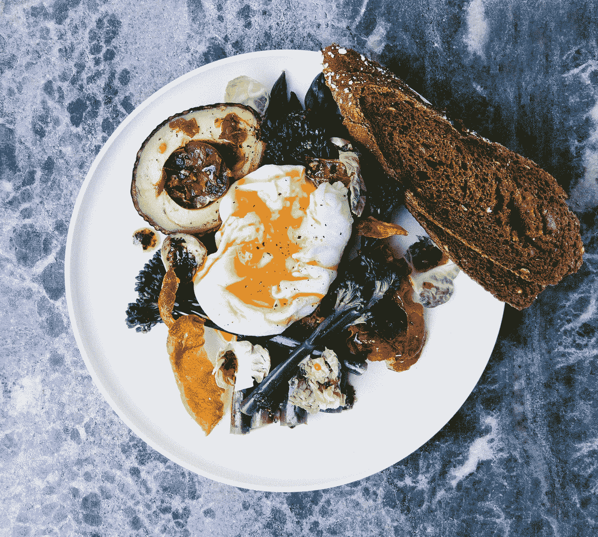

# 材料用户界面-扩展面板

> 原文：<https://javascript.plainenglish.io/material-ui-expansion-panels-e6f8de7753ef?source=collection_archive---------2----------------------->


Photo by [Rachel Park](https://unsplash.com/@therachelstory?utm_source=medium&utm_medium=referral) on [Unsplash](https://unsplash.com?utm_source=medium&utm_medium=referral)

材质 UI 是一个为 React 制作的材质设计库。

这是一组具有材质设计风格的 React 组件。

在本文中，我们将看看如何添加带有材质 UI 的扩展面板。

# 扩展面板

扩展面板让我们添加可以扩展和折叠的盒子。

要添加一个简单的，我们可以写:

```
import React from "react";
import ExpansionPanel from "[@material](http://twitter.com/material)-ui/core/ExpansionPanel";
import ExpansionPanelSummary from "[@material](http://twitter.com/material)-ui/core/ExpansionPanelSummary";
import ExpansionPanelDetails from "[@material](http://twitter.com/material)-ui/core/ExpansionPanelDetails";
import Typography from "[@material](http://twitter.com/material)-ui/core/Typography";
import ExpandMoreIcon from "[@material](http://twitter.com/material)-ui/icons/ExpandMore";export default function App() {
  return (
    <>
      <ExpansionPanel>
        <ExpansionPanelSummary
          expandIcon={<ExpandMoreIcon />}
          id="panel1-header"
        >
          <Typography>Expansion Panel 1</Typography>
        </ExpansionPanelSummary>
        <ExpansionPanelDetails>
          <Typography>
            Lorem ipsum dolor sit amet, consectetur adipiscing elit.
          </Typography>
        </ExpansionPanelDetails>
      </ExpansionPanel>
      <ExpansionPanel>
        <ExpansionPanelSummary
          expandIcon={<ExpandMoreIcon />}
          id="panel2-header"
        >
          <Typography>Expansion Panel 2</Typography>
        </ExpansionPanelSummary>
        <ExpansionPanelDetails>
          <Typography>Sit amet blandit leo lobortis eget.</Typography>
        </ExpansionPanelDetails>
      </ExpansionPanel>
    </>
  );
}
```

使用`ExpansionPanel` s 添加 2 个扩展面板。

`expandIcon`道具包含了让我们展开面板的图标。

`ExpansionPanelDetails`有扩展面板的内容。

`ExpansionPanelSummary`有标题的内容。

# 可控手风琴

我们可以通过将`expanded`和`onChange`道具传递给`ExpansionPanel`来使它成为一个受控组件。

例如，我们可以写:

```
import React from "react";
import ExpansionPanel from "[@material](http://twitter.com/material)-ui/core/ExpansionPanel";
import ExpansionPanelSummary from "[@material](http://twitter.com/material)-ui/core/ExpansionPanelSummary";
import ExpansionPanelDetails from "[@material](http://twitter.com/material)-ui/core/ExpansionPanelDetails";
import Typography from "[@material](http://twitter.com/material)-ui/core/Typography";
import ExpandMoreIcon from "[@material](http://twitter.com/material)-ui/icons/ExpandMore";export default function App() {
  const [expanded, setExpanded] = React.useState(false);const handleChange = panel => (event, isExpanded) => {
    setExpanded(isExpanded ? panel : false);
  };return (
    <>
      <ExpansionPanel
        expanded={expanded === "panel1"}
        onChange={handleChange("panel1")}
      >
        <ExpansionPanelSummary
          expandIcon={<ExpandMoreIcon />}
          id="panel1-header"
        >
          <Typography>Expansion Panel 1</Typography>
        </ExpansionPanelSummary>
        <ExpansionPanelDetails>
          <Typography>
            Lorem ipsum dolor sit amet, consectetur adipiscing elit.
          </Typography>
        </ExpansionPanelDetails>
      </ExpansionPanel>
      <ExpansionPanel
        expanded={expanded === "panel2"}
        onChange={handleChange("panel2")}
      >
        <ExpansionPanelSummary
          expandIcon={<ExpandMoreIcon />}
          id="panel2-header"
        >
          <Typography>Expansion Panel 2</Typography>
        </ExpansionPanelSummary>
        <ExpansionPanelDetails>
          <Typography>Sit amet blandit leo lobortis eget.</Typography>
        </ExpansionPanelDetails>
      </ExpansionPanel>
    </>
  );
}
```

使扩展面板像手风琴一样一起工作。

我们有`expanded`属性来设置扩展面板是否应该扩展。

`onChange`是一个让我们设置面板展开的功能。

我们用`handleChange`函数的`panel`参数设置面板名称。

# 定制的扩展面板

我们可以用`withStyles`高阶组件改变扩展面板组件的样式。

例如，我们可以写:

```
import React from "react";
import { withStyles } from "[@material](http://twitter.com/material)-ui/core/styles";
import MuiExpansionPanel from "[@material](http://twitter.com/material)-ui/core/ExpansionPanel";
import MuiExpansionPanelSummary from "[@material](http://twitter.com/material)-ui/core/ExpansionPanelSummary";
import MuiExpansionPanelDetails from "[@material](http://twitter.com/material)-ui/core/ExpansionPanelDetails";
import Typography from "[@material](http://twitter.com/material)-ui/core/Typography";const ExpansionPanel = withStyles({
  root: {
    color: "blue"
  },
  expanded: {}
})(MuiExpansionPanel);const ExpansionPanelSummary = withStyles({
  root: {
    backgroundColor: "pink"
  },
  content: {
    "&$expanded": {
      margin: "12px 0"
    }
  },
  expanded: {}
})(MuiExpansionPanelSummary);const ExpansionPanelDetails = withStyles(theme => ({
  root: {
    padding: theme.spacing(2)
  }
}))(MuiExpansionPanelDetails);export default function App() {
  const [expanded, setExpanded] = React.useState(false); const handleChange = panel => (event, isExpanded) => {
    setExpanded(isExpanded ? panel : false);
  }; return (
    <>
      <ExpansionPanel
        expanded={expanded === "panel1"}
        onChange={handleChange("panel1")}
      >
        <ExpansionPanelSummary id="panel1-header">
          <Typography>Expansion Panel 1</Typography>
        </ExpansionPanelSummary>
        <ExpansionPanelDetails>
          <Typography>
            Lorem ipsum dolor sit amet, consectetur adipiscing elit.
          </Typography>
        </ExpansionPanelDetails>
      </ExpansionPanel>
      <ExpansionPanel
        expanded={expanded === "panel2"}
        onChange={handleChange("panel2")}
      >
        <ExpansionPanelSummary id="panel2-header">
          <Typography>Expansion Panel 2</Typography>
        </ExpansionPanelSummary>
        <ExpansionPanelDetails>
          <Typography>Sit amet blandit leo lobortis eget.</Typography>
        </ExpansionPanelDetails>
      </ExpansionPanel>
    </>
  );
}
```

我们将`MuiExpansionPanel`、`MuiExpansionPanelSummary` 和`MuiExpansionPanelDetails`传入由`withStyles`高阶组件返回的函数。

我们将文本颜色设为蓝色，将摘要的背景设为粉红色。

如果我们使用组件，那么我们将看到显示的那些颜色。



Photo by [Chris Ralston](https://unsplash.com/@thisisralston?utm_source=medium&utm_medium=referral) on [Unsplash](https://unsplash.com?utm_source=medium&utm_medium=referral)

# 结论

我们可以创建扩展面板，按照我们的意愿扩展或折叠。

此外，我们可以改变每个组件的风格，以适应我们的需要。

## **用简单英语写的 JavaScript**

你知道我们有三份出版物和一个 YouTube 频道吗？在[**plain English . io**](https://plainenglish.io/)找到所有内容的链接！