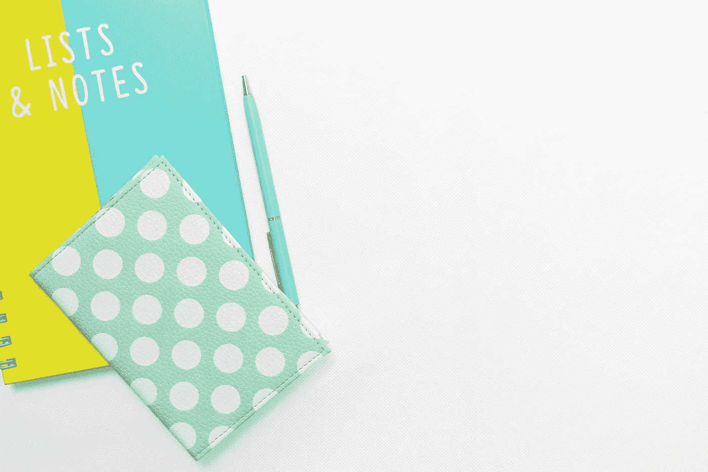

# 材料用户界面-图标和列表

> 原文：<https://javascript.plainenglish.io/material-ui-icons-and-lists-a98c8ccbdac0?source=collection_archive---------6----------------------->



Photo by [Chimene Gaspar](https://unsplash.com/@chigraph?utm_source=medium&utm_medium=referral) on [Unsplash](https://unsplash.com?utm_source=medium&utm_medium=referral)

材质 UI 是一个为 React 制作的材质设计库。

这是一组具有材质设计风格的 React 组件。

在这篇文章中，我们将看看如何用材质 UI 添加图标和列表。

# 图标颜色

我们可以改变图标的颜色。

为此，我们在图标上添加了`color`道具。

例如，我们可以写:

```
import React from "react";
import red from "[@material](http://twitter.com/material)-ui/core/colors/red";
import MailIcon from "[@material](http://twitter.com/material)-ui/icons/Mail";export default function App() {
  return (
    <div>
      <MailIcon />
      <MailIcon color="primary" />
      <MailIcon color="secondary" />
      <MailIcon color="action" />
      <MailIcon color="disabled" />
      <MailIcon style={{ color: red[500] }} />
    </div>
  );
}
```

添加不同颜色的图标。

道具让我们改变图标的颜色风格。

我们也可以用`style`道具来改变它。

我们通过从材质界面导入颜色来设置颜色。

# 大小

要改变图标的大小，我们可以改变`fontSize`道具。

例如，我们可以写:

```
import React from "react";
import MailIcon from "[@material](http://twitter.com/material)-ui/icons/Mail";export default function App() {
  return (
    <div>
      <MailIcon fontSize="small" />
      <MailIcon />
      <MailIcon fontSize="large" />
      <MailIcon style={{ fontSize: 50 }} />
    </div>
  );
}
```

`fontSize`可以设置为`small`或`large`。

要设置自定义尺寸，我们也可以用我们选择的`fontSize`来设置`style`道具。

# 字体图标

为了从材质图标 CDN 添加我们自己的图标，我们可以向`index.html`添加一个`link`标签:

```
<link rel="stylesheet" href="https://fonts.googleapis.com/icon?family=Material+Icons" />
```

一旦我们这样做了，我们就可以使用`Icon`组件:

```
import React from "react";
import Icon from "[@material](http://twitter.com/material)-ui/core/Icon";export default function App() {
  return (
    <div>
      <Icon>star</Icon>
    </div>
  );
}
```

我们也可以用这个组件改变`color`。

例如，我们可以写:

```
import React from "react";
import green from "[@material](http://twitter.com/material)-ui/core/colors/green";
import Icon from "[@material](http://twitter.com/material)-ui/core/Icon";export default function App() {
  return (
    <div>
      <Icon>star</Icon>
      <Icon color="primary">star</Icon>
      <Icon color="secondary">star</Icon>
      <Icon style={{ color: green[500] }}>star</Icon>
      <Icon fontSize="small">star</Icon>
    </div>
  );
}
```

标签之间有图标的名称。

我们设置`color`道具来改变颜色。

# 字体真棒

除了材质图标，我们还可以添加字体牛逼的图标。

我们可以不用注册就能使用第 5 版。

我们只需要补充一点:

```
<link
  rel="stylesheet"
  href="https://use.fontawesome.com/releases/v5.13.1/css/all.css"
/>
<link
  rel="stylesheet"
  href="https://use.fontawesome.com/releases/v5.13.1/css/v4-shims.css"
/>
```

然后我们可以写:

```
import React from "react";
import green from "[@material](http://twitter.com/material)-ui/core/colors/green";
import Icon from "[@material](http://twitter.com/material)-ui/core/Icon";export default function App() {
  return (
    <div>
      <Icon className="fa fa-close" />
      <Icon className="fa fa-close" color="primary" />
      <Icon className="fa fa-close" color="secondary" />
      <Icon className="fa fa-close" style={{ color: green[500] }} />
      <Icon className="fa fa-close" fontSize="small" />
    </div>
  );
}
```

添加我们的字体图标。

这些道具和字体很棒的图标一起工作。

# 列表

列表是文本和图像的连续容器。

例如，我们可以写:

```
import React from "react";
import List from "[@material](http://twitter.com/material)-ui/core/List";
import ListItem from "[@material](http://twitter.com/material)-ui/core/ListItem";
import ListItemIcon from "[@material](http://twitter.com/material)-ui/core/ListItemIcon";
import ListItemText from "[@material](http://twitter.com/material)-ui/core/ListItemText";
import Divider from "[@material](http://twitter.com/material)-ui/core/Divider";
import InboxIcon from "[@material](http://twitter.com/material)-ui/icons/Inbox";
import DraftsIcon from "[@material](http://twitter.com/material)-ui/icons/Drafts";export default function App() {
  return (
    <div>
      <List component="nav">
        <ListItem button>
          <ListItemIcon>
            <InboxIcon />
          </ListItemIcon>
          <ListItemText primary="home" />
        </ListItem>
        <ListItem button>
          <ListItemIcon>
            <DraftsIcon />
          </ListItemIcon>
          <ListItemText primary="mail" />
        </ListItem>
      </List>
      <Divider />
      <List component="nav">
        <ListItem button>
          <ListItemText primary="logout" />
        </ListItem>
      </List>
    </div>
  );
}
```

使用`List`组件添加列表。

要在列表中添加项目，我们可以在列表中添加一个或多个`ListItem`组件。

`button`道具会让它们渲染成按钮。

列表项旁边可以有图标。

另外，我们可以添加`Dividers`来添加分频器。

# 嵌套列表

列表可以嵌套。

为此，我们在我们的`List`中添加了一个`Collapse`组件。

例如，我们可以写:

```
import React from "react";
import List from "[@material](http://twitter.com/material)-ui/core/List";
import ListItem from "[@material](http://twitter.com/material)-ui/core/ListItem";
import ListItemIcon from "[@material](http://twitter.com/material)-ui/core/ListItemIcon";
import ListItemText from "[@material](http://twitter.com/material)-ui/core/ListItemText";
import Collapse from "[@material](http://twitter.com/material)-ui/core/Collapse";
import InboxIcon from "[@material](http://twitter.com/material)-ui/icons/MoveToInbox";
import DraftsIcon from "[@material](http://twitter.com/material)-ui/icons/Drafts";export default function App() {
  const [open, setOpen] = React.useState(true); const handleClick = () => {
    setOpen(!open);
  }; return (
    <div>
      <List component="nav">
        <ListItem button>
          <ListItemIcon>
            <InboxIcon />
          </ListItemIcon>
          <ListItemText primary="home" />
        </ListItem>
        <ListItem button onClick={handleClick}>
          <ListItemIcon>
            <DraftsIcon />
          </ListItemIcon>
          <ListItemText primary="mail" />
        </ListItem>
        <Collapse in={open} timeout="auto" unmountOnExit>
          <List component="div" disablePadding>
            <ListItem button>
              <ListItemText primary="important mail" />
            </ListItem>
          </List>
        </Collapse>
      </List>
    </div>
  );
}
```

给我们的`List`增加一个`Collapse`组件。

`in`属性控制嵌套列表何时展开。

`unmountOnExit`将从 DOM 中移除嵌套列表。

我们用第二个`ListItem`控制是否打开。

`handleClick`组件切换`open`状态。


Photo by [Nick Fewings](https://unsplash.com/@jannerboy62?utm_source=medium&utm_medium=referral) on [Unsplash](https://unsplash.com?utm_source=medium&utm_medium=referral)

# 结论

我们可以用材质 UI 添加各种来源的图标。

此外，我们可以添加列表来垂直显示项目。