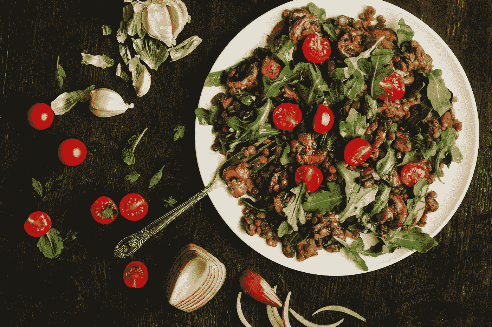

# 材料用户界面-链接和菜单

> 原文：<https://javascript.plainenglish.io/material-ui-links-and-menus-cea96901d650?source=collection_archive---------3----------------------->


Photo by [Ella Olsson](https://unsplash.com/@ellaolsson?utm_source=medium&utm_medium=referral) on [Unsplash](https://unsplash.com?utm_source=medium&utm_medium=referral)

材质 UI 是一个为 React 制作的材质设计库。

这是一组具有材质设计风格的 React 组件。

在这篇文章中，我们将看看如何添加链接和菜单到材料用户界面。

# 简单链接

我们可以用`Link`组件添加链接。

例如，我们可以写:

```
import React from "react";
import Link from "[@material](http://twitter.com/material)-ui/core/Link";export default function App() {
  const preventDefault = event => event.preventDefault(); return (
    <div>
      <Link href="#" onClick={preventDefault}>
        Link
      </Link>
    </div>
  );
}
```

我们添加了一个带有`href`的链接，当我们点击它的时候就可以转到我们想要的 URL。

`onClick`让我们传入一个点击处理程序来改变链接的行为。

我们也可以通过改变颜色来改变链接的颜色。

例如，我们可以写:

```
import React from "react";
import Link from "[@material](http://twitter.com/material)-ui/core/Link";export default function App() {
  const preventDefault = event => event.preventDefault(); return (
    <div>
      <Link href="#" onClick={preventDefault} color="primary">
        Link
      </Link>
    </div>
  );
}
```

我们将`color`设置为`primary`，使其变成紫色。

此外，我们可以向`variant`属性传递一个值来更改样式:

```
import React from "react";
import Link from "[@material](http://twitter.com/material)-ui/core/Link";
import Typography from "[@material](http://twitter.com/material)-ui/core/Typography";export default function App() {
  const preventDefault = event => event.preventDefault(); return (
    <div>
      <Typography>
        <Link href="#" onClick={preventDefault} variant="inherit">
          Link
        </Link>
      </Typography>
    </div>
  );
}
```

# 菜单

我们可以用`Menu`组件添加一个菜单。

在里面，我们可以添加带有`MenuItem`组件的项目。

例如，我们可以写:

```
import React from "react";
import Button from "[@material](http://twitter.com/material)-ui/core/Button";
import Menu from "[@material](http://twitter.com/material)-ui/core/Menu";
import MenuItem from "[@material](http://twitter.com/material)-ui/core/MenuItem";export default function App() {
  const [anchorEl, setAnchorEl] = React.useState(null); const handleClick = event => {
    setAnchorEl(event.currentTarget);
  }; const handleClose = () => {
    setAnchorEl(null);
  };
  return (
    <div>
      <Button onClick={handleClick}>Open</Button>
      <Menu
        anchorEl={anchorEl}
        keepMounted
        open={Boolean(anchorEl)}
        onClose={handleClose}
      >
        <MenuItem onClick={handleClose}>home</MenuItem>
        <MenuItem onClick={handleClose}>profile</MenuItem>
        <MenuItem onClick={handleClose}>logout</MenuItem>
      </Menu>
    </div>
  );
}
```

添加菜单。

我们有一个`Button`，它将`onClick`属性设置为`handleClick`函数。

它将锚元素设置为元素，以便我们可以打开菜单。

我们将菜单的`open`属性设置为锚元素。

锚定元件是按钮，如`handleClick`功能所示。

这样，我们可以确定按钮是否被点击，如果设置好了，我们就可以打开菜单。

要关闭菜单，我们将`anchorEl`设置为`null`，这样`open`将会传入`false`。

# 选定的菜单

我们可以保持菜单项被选中。

为此，如果项目被选中，我们可以将`selected`属性设置为`true`。

例如，我们可以写:

```
import React from "react";
import List from "[@material](http://twitter.com/material)-ui/core/List";
import ListItem from "[@material](http://twitter.com/material)-ui/core/ListItem";
import Menu from "[@material](http://twitter.com/material)-ui/core/Menu";
import MenuItem from "[@material](http://twitter.com/material)-ui/core/MenuItem";const options = ["apple", "orange", "grape"];export default function App() {
  const [anchorEl, setAnchorEl] = React.useState(null);
  const [selectedIndex, setSelectedIndex] = React.useState(1); const handleClickListItem = event => {
    setAnchorEl(event.currentTarget);
  }; const handleMenuItemClick = (event, index) => {
    setSelectedIndex(index);
    setAnchorEl(null);
  }; const handleClose = () => {
    setAnchorEl(null);
  }; return (
    <div>
      <List component="nav">
        <ListItem button onClick={handleClickListItem}>
          open
        </ListItem>
      </List>
      <Menu
        anchorEl={anchorEl}
        keepMounted
        open={Boolean(anchorEl)}
        onClose={handleClose}
      >
        {options.map((option, index) => (
          <MenuItem
            key={option}
            selected={index === selectedIndex}
            onClick={event => handleMenuItemClick(event, index)}
          >
            {option}
          </MenuItem>
        ))}
      </Menu>
    </div>
  );
}
```

添加菜单。

我们用`selectedIndex`保存所选项目的索引。

它是在我们点击`MenuItem`时设置的。

我们有一个`selected`属性，它有一个布尔表达式来比较项目的`index`和`selectedIndex`值，以确定选择哪个值。

# 定制菜单

我们可以用`Popper`、`Paper`和`ClickAwayListener`组件创建自己的菜单。

例如，我们可以写:

```
import React from "react";
import Button from "[@material](http://twitter.com/material)-ui/core/Button";
import ClickAwayListener from "[@material](http://twitter.com/material)-ui/core/ClickAwayListener";
import Grow from "[@material](http://twitter.com/material)-ui/core/Grow";
import Paper from "[@material](http://twitter.com/material)-ui/core/Paper";
import Popper from "[@material](http://twitter.com/material)-ui/core/Popper";
import MenuItem from "[@material](http://twitter.com/material)-ui/core/MenuItem";
import MenuList from "[@material](http://twitter.com/material)-ui/core/MenuList";export default function App() {
  const [open, setOpen] = React.useState(false);
  const anchorRef = React.useRef(null);const handleToggle = () => {
    setOpen(prevOpen => !prevOpen);
  };const handleClose = event => {
    if (anchorRef.current && anchorRef.current.contains(event.target)) {
      return;
    }setOpen(false);
  };function handleListKeyDown(event) {
    if (event.key === "Tab") {
      event.preventDefault();
      setOpen(false);
    }
  } const prevOpen = React.useRef(open);
  React.useEffect(() => {
    if (prevOpen.current === true && open === false) {
      anchorRef.current.focus();
    } prevOpen.current = open;
  }, [open]); return (
    <div>
      <Button ref={anchorRef} onClick={handleToggle}>
        menu
      </Button>
      <Popper open={open} anchorEl={anchorRef.current} transition disablePortal>
        {({ TransitionProps, placement }) => (
          <Grow
            {...TransitionProps}
            style={{
              transformOrigin:
                placement === "bottom" ? "center top" : "center bottom"
            }}
          >
            <Paper>
              <ClickAwayListener onClickAway={handleClose}>
                <MenuList autoFocusItem={open} onKeyDown={handleListKeyDown}>
                  <MenuItem onClick={handleClose}>home</MenuItem>
                  <MenuItem onClick={handleClose}>profile</MenuItem>
                  <MenuItem onClick={handleClose}>logout</MenuItem>
                </MenuList>
              </ClickAwayListener>
            </Paper>
          </Grow>
        )}
      </Popper>
    </div>
  );
}
```

我们添加了`Button`来切换菜单。

`Popper`有实际菜单。

`Grow`组件为带有`TransitionProps`的菜单添加过渡。

我们可以设置`transformOrigin`来设置菜单的放置方式。

`Paper`按住了`ClickAwayListener`，这样当我们在菜单外点击时，菜单就会关闭。

`MenuList`有菜单项。

`handleClose`将`open`状态设置为`false`关闭菜单。

我们还有`handleListKeyDown`功能来处理 Tab 键的按下。

当它被按下时，我们关闭菜单。



Photo by [Clarissa Carbungco](https://unsplash.com/@clariiidot?utm_source=medium&utm_medium=referral) on [Unsplash](https://unsplash.com?utm_source=medium&utm_medium=referral)

# 结论

我们可以使用`Link`和`Menu`组件轻松添加链接和菜单。

## **简单英语的 JavaScript**

你知道我们有三份出版物和一个 YouTube 频道吗？在[**plain English . io**](https://plainenglish.io/)找到所有内容的链接！