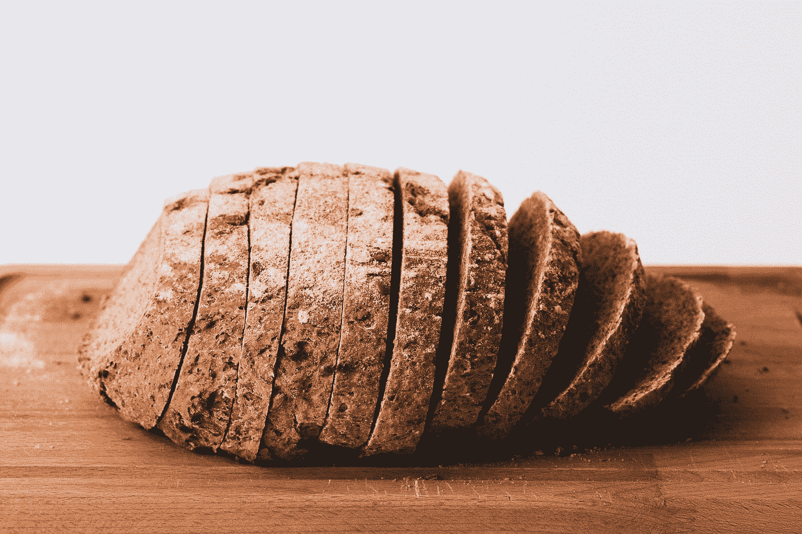

# 材料用户界面-列表

> 原文：<https://javascript.plainenglish.io/material-ui-lists-dc49f4488a3a?source=collection_archive---------2----------------------->


Photo by [Rod Long](https://unsplash.com/@rodlong?utm_source=medium&utm_medium=referral) on [Unsplash](https://unsplash.com?utm_source=medium&utm_medium=referral)

材质 UI 是一个为 React 制作的材质设计库。

这是一组具有材质设计风格的 React 组件。

在这篇文章中，我们将看看如何添加带有材质 UI 的列表。

# 交互式列表

我们可以用材质界面添加各种列表。

最简单的类型是每个条目中只有文本的类型。

要添加纯文本列表，我们可以这样写:

```
import React from "react";
import List from "[@material](http://twitter.com/material)-ui/core/List";
import ListItem from "[@material](http://twitter.com/material)-ui/core/ListItem";
import ListItemText from "[@material](http://twitter.com/material)-ui/core/ListItemText";const fruits = [
  { key: 1, name: "apple" },
  { key: 2, name: "orange" },
  { key: 3, name: "banana" }
];export default function App() {
  return (
    <div>
      <List component="nav">
        {fruits.map(f => (
          <ListItem key={f.key}>
            <ListItemText primary={f.name} />
          </ListItem>
        ))}
      </List>
    </div>
  );
}
```

我们使用`ListItemText`组件添加一个包含所有文本的列表。

`primary`是为每个项目显示的主要文本。

要添加带有图标的列表，我们可以写:

```
import React from "react";
import List from "[@material](http://twitter.com/material)-ui/core/List";
import ListItem from "[@material](http://twitter.com/material)-ui/core/ListItem";
import ListItemText from "[@material](http://twitter.com/material)-ui/core/ListItemText";
import ListItemIcon from "[@material](http://twitter.com/material)-ui/core/ListItemIcon";
import FolderIcon from "[@material](http://twitter.com/material)-ui/icons/Folder";const fruits = [
  { key: 1, name: "apple" },
  { key: 2, name: "orange" },
  { key: 3, name: "banana" }
];export default function App() {
  return (
    <div>
      <List component="nav">
        {fruits.map(f => (
          <ListItem key={f.key}>
            <ListItemIcon>
              <FolderIcon />
            </ListItemIcon>
            <ListItemText primary={f.name} />
          </ListItem>
        ))}
      </List>
    </div>
  );
}
```

我们有`ListItemIcon`来定位图标。

`FolderIcon`有图标。

图标将显示在文本的左侧。

此外，我们可以用类似的方式添加头像。

例如，我们可以写:

```
import React from "react";
import List from "[@material](http://twitter.com/material)-ui/core/List";
import ListItem from "[@material](http://twitter.com/material)-ui/core/ListItem";
import ListItemText from "[@material](http://twitter.com/material)-ui/core/ListItemText";
import ListItemAvatar from "[@material](http://twitter.com/material)-ui/core/ListItemAvatar";
import Avatar from "[@material](http://twitter.com/material)-ui/core/Avatar";
import FolderIcon from "[@material](http://twitter.com/material)-ui/icons/Folder";const fruits = [
  { key: 1, name: "apple" },
  { key: 2, name: "orange" },
  { key: 3, name: "banana" }
];export default function App() {
  return (
    <div>
      <List component="nav">
        {fruits.map(f => (
          <ListItem key={f.key}>
            <ListItemAvatar>
              <Avatar>
                <FolderIcon />
              </Avatar>
            </ListItemAvatar>
            <ListItemText primary={f.name} />
          </ListItem>
        ))}
      </List>
    </div>
  );
}
```

然后我们在文本的左边有一个文件夹图标的头像，而不仅仅是文件夹图标本身。

我们使用`ListItemAvatar`包围`Avater`和`FolderIcon`来正确放置它们。

我们也可以在文本的右边添加一个图标。

它将被放置在列表项的右边缘。

为此，我们可以使用`ListItemSecondaryAction`组件。

例如，我们可以写:

```
import React from "react";
import List from "[@material](http://twitter.com/material)-ui/core/List";
import ListItem from "[@material](http://twitter.com/material)-ui/core/ListItem";
import ListItemText from "[@material](http://twitter.com/material)-ui/core/ListItemText";
import ListItemAvatar from "[@material](http://twitter.com/material)-ui/core/ListItemAvatar";
import Avatar from "[@material](http://twitter.com/material)-ui/core/Avatar";
import FolderIcon from "[@material](http://twitter.com/material)-ui/icons/Folder";
import ListItemSecondaryAction from "[@material](http://twitter.com/material)-ui/core/ListItemSecondaryAction";
import IconButton from "[@material](http://twitter.com/material)-ui/core/IconButton";
import DeleteIcon from "[@material](http://twitter.com/material)-ui/icons/Delete";const fruits = [
  { key: 1, name: "apple" },
  { key: 2, name: "orange" },
  { key: 3, name: "banana" }
];export default function App() {
  return (
    <div>
      <List component="nav">
        {fruits.map(f => (
          <ListItem>
            <ListItemAvatar>
              <Avatar>
                <FolderIcon />
              </Avatar>
            </ListItemAvatar>
            <ListItemText primary={f.name} key={f.key} />
            <ListItemSecondaryAction>
              <IconButton edge="end">
                <DeleteIcon />
              </IconButton>
            </ListItemSecondaryAction>
          </ListItem>
        ))}
      </List>
    </div>
  );
}
```

在`ListItemText`下面加上`ListItemSecondaryAction`。

这将把辅助动作图标放在右边。

# 对齐列表项

为了在显示 3 行或更多行时对齐列表项，我们可以将`alignItems`属性设置为`flex-start`。

例如，我们可以写:

```
import React from "react";
import List from "[@material](http://twitter.com/material)-ui/core/List";
import ListItem from "[@material](http://twitter.com/material)-ui/core/ListItem";
import ListItemText from "[@material](http://twitter.com/material)-ui/core/ListItemText";
import ListItemAvatar from "[@material](http://twitter.com/material)-ui/core/ListItemAvatar";
import Avatar from "[@material](http://twitter.com/material)-ui/core/Avatar";
import FolderIcon from "[@material](http://twitter.com/material)-ui/icons/Folder";
import ListItemSecondaryAction from "[@material](http://twitter.com/material)-ui/core/ListItemSecondaryAction";
import IconButton from "[@material](http://twitter.com/material)-ui/core/IconButton";
import DeleteIcon from "[@material](http://twitter.com/material)-ui/icons/Delete";const fruits = [
  { key: 1, name: "apple" },
  { key: 2, name: "orange" },
  { key: 3, name: "banana" }
];export default function App() {
  return (
    <div>
      <List component="nav">
        {fruits.map(f => (
          <ListItem alignItems="flex-start" key={f.key}>
            <ListItemAvatar>
              <Avatar>
                <FolderIcon />
              </Avatar>
            </ListItemAvatar>
            <ListItemText
              primary={f.name}
              secondary="Lorem ipsum dolor sit amet, consectetur adipiscing elit. Aenean mollis, metus vitae vestibulum suscipit, eros nisi ultrices urna, facilisis dictum erat dolor non justo. "
            />
          </ListItem>
        ))}
      </List>
    </div>
  );
}
```

将图标稍微向下移动，以便更好地与长文本对齐。



Photo by [Jude Infantini](https://unsplash.com/@easy_emu?utm_source=medium&utm_medium=referral) on [Unsplash](https://unsplash.com?utm_source=medium&utm_medium=referral)

# 结论

我们可以在不同的位置用图标制作列表。

图标可以在文本的左边或右边。

## **简单英语的 JavaScript**

你知道我们有三份出版物和一个 YouTube 频道吗？在[**plain English . io**](https://plainenglish.io/)找到所有内容的链接！