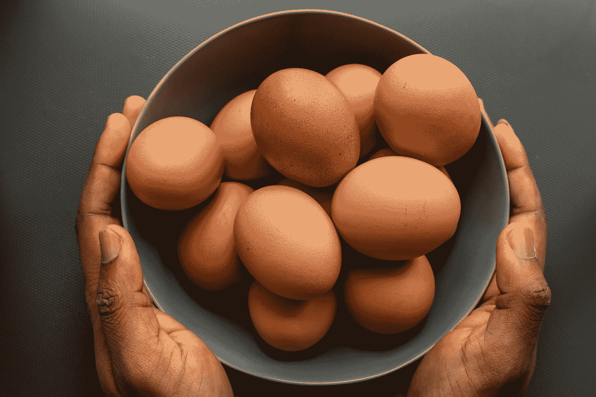

# 材料用户界面—移动步进机

> 原文：<https://javascript.plainenglish.io/material-ui-mobile-steppers-63f42f4ae0e9?source=collection_archive---------4----------------------->


Photo by [Vaishnav Chogale](https://unsplash.com/@vshnv_c?utm_source=medium&utm_medium=referral) on [Unsplash](https://unsplash.com?utm_source=medium&utm_medium=referral)

材质 UI 是一个为 React 制作的材质设计库。

这是一组具有材质设计风格的 React 组件。

在这篇文章中，我们将看看如何添加带有材质 UI 的移动步进器。

# 移动式步进机

我们可以用`MobileStepper`组件创建一个移动步进器。

例如，我们可以写:

```
import React from "react";
import MobileStepper from "@material-ui/core/MobileStepper";
import Typography from "[@material](http://twitter.com/material)-ui/core/Typography";
import Button from "[@material](http://twitter.com/material)-ui/core/Button";
import Paper from "[@material](http://twitter.com/material)-ui/core/Paper";
import KeyboardArrowRight from "[@material](http://twitter.com/material)-ui/icons/KeyboardArrowRight";
import KeyboardArrowLeft from "[@material](http://twitter.com/material)-ui/icons/KeyboardArrowLeft";const steps = [
  {
    label: "cat 1",
    imgPath: "http://placekitten.com/200/200"
  },
  {
    label: "cat 2",
    imgPath: "http://placekitten.com/199/199"
  },
  {
    label: "cat 3",
    imgPath: "http://placekitten.com/201/201"
  }
];export default function App() {
  const [activeStep, setActiveStep] = React.useState(0);
  const maxSteps = steps.length; const handleNext = () => {
    setActiveStep(prevActiveStep => prevActiveStep + 1);
  }; const handleBack = () => {
    setActiveStep(prevActiveStep => prevActiveStep - 1);
  }; return (
    <div>
      <Paper square elevation={0}>
        <Typography>{steps[activeStep].label}</Typography>
      </Paper>
      
      <MobileStepper
        steps={maxSteps}
        position="static"
        variant="text"
        activeStep={activeStep}
        nextButton={
          <Button
            size="small"
            onClick={handleNext}
            disabled={activeStep === maxSteps - 1}
          >
            Next
            <KeyboardArrowRight />
          </Button>
        }
        backButton={
          <Button size="small" onClick={handleBack} disabled={activeStep === 0}>
            <KeyboardArrowLeft />
            Back
          </Button>
        }
      />
    </div>
  );
}
```

添加移动步进器。

我们使用了`MobileStepper`组件来创建步进器。

`Paper`有装文字的纸盒。

下面是一张图片。

然后我们有带导航按钮的`MobileStepper`。

我们为`nextButtin`和`backButton`道具传入一个按钮。

下一个按钮在被点击时调用`handleNext`函数。

单击后退按钮会调用`handleBack`函数。

这将让我们分别进入下一步和返回。

# 旋转木马效应

为了使步进器自动在幻灯片中移动，我们可以添加`AutoPlaySwipeableViews`组件。

例如，我们可以写:

```
import React from "react";
import MobileStepper from "[@material](http://twitter.com/material)-ui/core/MobileStepper";
import Typography from "[@material](http://twitter.com/material)-ui/core/Typography";
import Button from "[@material](http://twitter.com/material)-ui/core/Button";
import Paper from "[@material](http://twitter.com/material)-ui/core/Paper";
import KeyboardArrowRight from "[@material](http://twitter.com/material)-ui/icons/KeyboardArrowRight";
import KeyboardArrowLeft from "[@material](http://twitter.com/material)-ui/icons/KeyboardArrowLeft";
import SwipeableViews from "react-swipeable-views";
import { autoPlay } from "react-swipeable-views-utils";const AutoPlaySwipeableViews = autoPlay(SwipeableViews);const steps = [
  {
    label: "cat 1",
    imgPath: "http://placekitten.com/200/200"
  },
  {
    label: "cat 2",
    imgPath: "http://placekitten.com/199/199"
  },
  {
    label: "cat 3",
    imgPath: "http://placekitten.com/201/201"
  }
];export default function App() {
  const [activeStep, setActiveStep] = React.useState(0);
  const maxSteps = steps.length; const handleNext = () => {
    setActiveStep(prevActiveStep => prevActiveStep + 1);
  }; const handleBack = () => {
    setActiveStep(prevActiveStep => prevActiveStep - 1);
  }; const handleStepChange = step => {
    setActiveStep(step);
  }; return (
    <div>
      <Paper square elevation={0}>
        <Typography>{steps[activeStep].label}</Typography>
      </Paper>
      <AutoPlaySwipeableViews
        axis="x"
        index={activeStep}
        onChangeIndex={handleStepChange}
        enableMouseEvents
      >
        {steps.map((step, index) => (
          <div key={step.label}>
            {Math.abs(activeStep - index) <= 2 ? (
              
            ) : null}
          </div>
        ))}
      </AutoPlaySwipeableViews>
      <MobileStepper
        steps={maxSteps}
        position="static"
        variant="text"
        activeStep={activeStep}
        nextButton={
          <Button
            size="small"
            onClick={handleNext}
            disabled={activeStep === maxSteps - 1}
          >
            Next
            <KeyboardArrowRight />
          </Button>
        }
        backButton={
          <Button size="small" onClick={handleBack} disabled={activeStep === 0}>
            <KeyboardArrowLeft />
            Back
          </Button>
        }
      />
    </div>
  );
}
```

让幻灯片自动播放。

我们添加了 react-swipeable-views 和 react-swipeable-views-utils 库，以便添加自动播放功能。

我们从那些库中创建的`AutoPlaySwipeableViews`组件被添加到我们的 JSX 代码中，以使视图自动播放。

# 进度条

如果有很多步骤，我们可以添加一个进度条。

要添加带有进度条的步进器，我们可以写:

```
import React from "react";
import MobileStepper from "[@material](http://twitter.com/material)-ui/core/MobileStepper";
import Button from "[@material](http://twitter.com/material)-ui/core/Button";
import KeyboardArrowRight from "[@material](http://twitter.com/material)-ui/icons/KeyboardArrowRight";
import KeyboardArrowLeft from "[@material](http://twitter.com/material)-ui/icons/KeyboardArrowLeft";export default function App() {
  const [activeStep, setActiveStep] = React.useState(0); const handleNext = () => {
    setActiveStep(prevActiveStep => prevActiveStep + 1);
  }; const handleBack = () => {
    setActiveStep(prevActiveStep => prevActiveStep - 1);
  }; return (
    <MobileStepper
      variant="progress"
      steps={10}
      position="static"
      activeStep={activeStep}
      nextButton={
        <Button size="small" onClick={handleNext} disabled={activeStep === 9}>
          Next
          <KeyboardArrowRight />
        </Button>
      }
      backButton={
        <Button size="small" onClick={handleBack} disabled={activeStep === 0}>
          <KeyboardArrowLeft />
          Back
        </Button>
      }
    />
  );
}
```

我们再次使用`MobileStepper`组件。

`nextButton`和`backButton`道具相同。

不同的是我们有`steps`道具。

当达到下一个按钮的最大步数时，我们还必须禁用这些按钮。

当我们遇到后退按钮的最小步数时，我们也这样做。



Photo by [Louis Hansel @shotsoflouis](https://unsplash.com/@louishansel?utm_source=medium&utm_medium=referral) on [Unsplash](https://unsplash.com?utm_source=medium&utm_medium=referral)

# 结论

我们可以为旋转木马添加移动步进器，或者添加更紧凑的步进器组件。

## **用简单英语写的 JavaScript**

你知道我们有三份出版物和一个 YouTube 频道吗？在[**plain English . io**](https://plainenglish.io/)找到所有内容的链接！