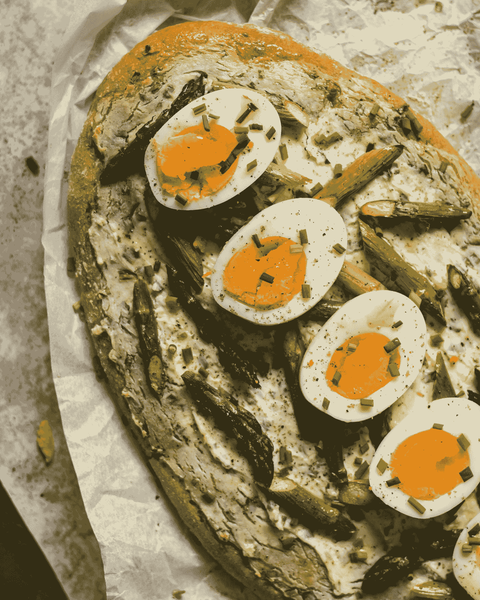

# 材料用户界面——反应灵敏且持久耐用的抽屉

> 原文：<https://javascript.plainenglish.io/material-ui-responsive-and-persistent-drawers-8821a344af10?source=collection_archive---------3----------------------->


Photo by [Louis Hansel @shotsoflouis](https://unsplash.com/@louishansel?utm_source=medium&utm_medium=referral) on [Unsplash](https://unsplash.com?utm_source=medium&utm_medium=referral)

材质 UI 是一个为 React 制作的材质设计库。

这是一组具有材质设计风格的 React 组件。

在这篇文章中，我们将看看如何添加抽屉到材料用户界面。

# 响应抽屉

我们可以通过添加一些媒体查询来显示和隐藏抽屉，从而制作一个有响应的抽屉。

例如，我们可以写:

```
import React from "react";
import PropTypes from "prop-types";
import AppBar from "[@material](http://twitter.com/material)-ui/core/AppBar";
import CssBaseline from "[@material](http://twitter.com/material)-ui/core/CssBaseline";
import Divider from "[@material](http://twitter.com/material)-ui/core/Divider";
import Drawer from "[@material](http://twitter.com/material)-ui/core/Drawer";
import Hidden from "[@material](http://twitter.com/material)-ui/core/Hidden";
import IconButton from "[@material](http://twitter.com/material)-ui/core/IconButton";
import InboxIcon from "[@material](http://twitter.com/material)-ui/icons/MoveToInbox";
import List from "[@material](http://twitter.com/material)-ui/core/List";
import ListItem from "[@material](http://twitter.com/material)-ui/core/ListItem";
import ListItemIcon from "[@material](http://twitter.com/material)-ui/core/ListItemIcon";
import ListItemText from "[@material](http://twitter.com/material)-ui/core/ListItemText";
import MailIcon from "[@material](http://twitter.com/material)-ui/icons/Mail";
import MenuIcon from "[@material](http://twitter.com/material)-ui/icons/Menu";
import Toolbar from "[@material](http://twitter.com/material)-ui/core/Toolbar";
import Typography from "[@material](http://twitter.com/material)-ui/core/Typography";
import { makeStyles, useTheme } from "[@material](http://twitter.com/material)-ui/core/styles";const drawerWidth = 240;const useStyles = makeStyles(theme => ({
  root: {
    display: "flex"
  },
  drawer: {
    [theme.breakpoints.up("sm")]: {
      width: drawerWidth,
      flexShrink: 0
    }
  },
  appBar: {
    [theme.breakpoints.up("sm")]: {
      width: `calc(100% - ${drawerWidth}px)`,
      marginLeft: drawerWidth
    }
  },
  menuButton: {
    marginRight: theme.spacing(2),
    [theme.breakpoints.up("sm")]: {
      display: "none"
    }
  },toolbar: theme.mixins.toolbar,
  drawerPaper: {
    width: drawerWidth
  },
  content: {
    flexGrow: 1,
    padding: theme.spacing(3)
  }
}));export default function App(props) {
  const { window } = props;
  const classes = useStyles();
  const theme = useTheme();
  const [mobileOpen, setMobileOpen] = React.useState(false); const handleDrawerToggle = () => {
    setMobileOpen(!mobileOpen);
  }; const drawer = (
    <div>
      <div className={classes.toolbar} />
      <List>
        <ListItem button key="home">
          <ListItemIcon>
            <MailIcon />
          </ListItemIcon>
          <ListItemText primary="home" />
        </ListItem>
      </List>
    </div>
  );const container =
    window !== undefined ? () => window().document.body : undefined;return (
    <div className={classes.root}>
      <CssBaseline />
      <AppBar position="fixed" className={classes.appBar}>
        <Toolbar>
          <IconButton
            color="inherit"
            edge="start"
            onClick={handleDrawerToggle}
            className={classes.menuButton}
          >
            <MenuIcon />
          </IconButton>
          <Typography variant="h6" noWrap>
            Responsive drawer
          </Typography>
        </Toolbar>
      </AppBar>
      <nav className={classes.drawer}>
        <Hidden smUp implementation="css">
          <Drawer
            container={container}
            variant="temporary"
            open={mobileOpen}
            onClose={handleDrawerToggle}
            classes={{
              paper: classes.drawerPaper
            }}
            ModalProps={{
              keepMounted: true
            }}
          >
            {drawer}
          </Drawer>
        </Hidden>
        <Hidden xsDown implementation="css">
          <Drawer
            classes={{
              paper: classes.drawerPaper
            }}
            variant="permanent"
            open
          >
            {drawer}
          </Drawer>
        </Hidden>
      </nav>
      <main className={classes.content}>
        <div className={classes.toolbar} />
        <Typography paragraph>Lorem ipsum dolor sit amet</Typography>
        <Typography paragraph>
          Consequat mauris nunc congue nisi vitae suscipit.
        </Typography>
      </main>
    </div>
  );
}
```

我们使用`Hidden`组件显示带有给定断点的项目。

如果屏幕遇到断点`sm`或更高，我们保持抽屉总是打开的。

否则，我们会显示一个带有打开抽屉按钮的菜单。

主要内容是在`main`元素中。

`AppBar`具有始终显示的顶部栏。

我们有`mobileOpen`状态来跟踪开放状态。

它被设置为`open`道具的值。

# 持久抽屉

我们可以添加一个持久抽屉来显示总是显示一个打开抽屉的按钮。

例如，我们可以写:

```
import React from "react";
import clsx from "clsx";
import { makeStyles, useTheme } from "[@material](http://twitter.com/material)-ui/core/styles";
import Drawer from "[@material](http://twitter.com/material)-ui/core/Drawer";
import CssBaseline from "[@material](http://twitter.com/material)-ui/core/CssBaseline";
import AppBar from "[@material](http://twitter.com/material)-ui/core/AppBar";
import Toolbar from "[@material](http://twitter.com/material)-ui/core/Toolbar";
import List from "[@material](http://twitter.com/material)-ui/core/List";
import Typography from "[@material](http://twitter.com/material)-ui/core/Typography";
import Divider from "[@material](http://twitter.com/material)-ui/core/Divider";
import IconButton from "[@material](http://twitter.com/material)-ui/core/IconButton";
import MenuIcon from "[@material](http://twitter.com/material)-ui/icons/Menu";
import ChevronLeftIcon from "[@material](http://twitter.com/material)-ui/icons/ChevronLeft";
import ChevronRightIcon from "[@material](http://twitter.com/material)-ui/icons/ChevronRight";
import ListItem from "[@material](http://twitter.com/material)-ui/core/ListItem";
import ListItemIcon from "[@material](http://twitter.com/material)-ui/core/ListItemIcon";
import ListItemText from "[@material](http://twitter.com/material)-ui/core/ListItemText";
import InboxIcon from "[@material](http://twitter.com/material)-ui/icons/MoveToInbox";
import MailIcon from "[@material](http://twitter.com/material)-ui/icons/Mail";export default function App() {
  const [open, setOpen] = React.useState(false);const handleDrawerOpen = () => {
    setOpen(true);
  };const handleDrawerClose = () => {
    setOpen(false);
  };return (
    <div>
      <CssBaseline />
      <AppBar position="fixed">
        <Toolbar>
          <IconButton color="inherit" onClick={handleDrawerOpen} edge="start">
            <MenuIcon />
          </IconButton>
          <Typography variant="h6" noWrap>
            Persistent drawer
          </Typography>
        </Toolbar>
      </AppBar>
      <Drawer variant="persistent" anchor="left" open={open}>
        <List>
          <ListItem button key="home">
            <ListItemIcon>
              <MailIcon />
            </ListItemIcon>
            <ListItemText primary="home" />
          </ListItem>
          <ListItem button key="close" onClick={handleDrawerClose}>
            <ListItemText primary="close" />
          </ListItem>
        </List>
      </Drawer>
      <main style={{ marginTop: 50 }}>
        <Typography paragraph>Lorem ipsum dolor sit amet</Typography>
        <Typography paragraph>
          Consequat mauris nunc congue nisi vitae suscipit
        </Typography>
      </main>
    </div>
  );
}
```

创建带有抽屉的应用程序栏，抽屉上有关闭按钮。

我们将`variant`设置为`persistent`以保持它一直打开，除非我们在列表项文本中单击关闭。

关闭按钮位于:

```
<ListItem button key="close" onClick={handleDrawerClose}>
  <ListItemText primary="close" />
</ListItem>
```



Photo by [Svitlana Denysiuk](https://unsplash.com/@svitlandia?utm_source=medium&utm_medium=referral) on [Unsplash](https://unsplash.com?utm_source=medium&utm_medium=referral)

# 结论

我们可以用多种方式打造抽屉。

我们可以让抽屉变得有反应或持久。

## **简单英语的 JavaScript**

你知道我们有三份出版物和一个 YouTube 频道吗？在[**plain English . io**](https://plainenglish.io/)找到所有内容的链接！