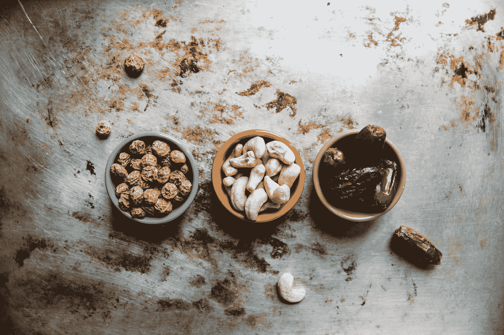

# 物料界面—小吃店定制

> 原文：<https://javascript.plainenglish.io/material-ui-snack-bar-customization-1c0261bdc419?source=collection_archive---------5----------------------->


Photo by [Brooke Lark](https://unsplash.com/@brookelark?utm_source=medium&utm_medium=referral) on [Unsplash](https://unsplash.com?utm_source=medium&utm_medium=referral)

材质 UI 是一个为 React 制作的材质设计库。

这是一组具有材质设计风格的 React 组件。

在本文中，我们将看看如何用 Material UI 定制小吃店。

# 连续小吃店

我们可以用一些逻辑连续显示多个小吃店。

例如，我们可以写:

```
import React from "react";
import Button from "[@material](http://twitter.com/material)-ui/core/Button";
import Snackbar from "[@material](http://twitter.com/material)-ui/core/Snackbar";
import IconButton from "[@material](http://twitter.com/material)-ui/core/IconButton";
import CloseIcon from "[@material](http://twitter.com/material)-ui/icons/Close";export default function App() {
  const [snackPack, setSnackPack] = React.useState([]);
  const [open, setOpen] = React.useState(false);
  const [messageInfo, setMessageInfo] = React.useState(undefined); React.useEffect(() => {
    if (snackPack.length && !messageInfo) {
      setMessageInfo({ ...snackPack[0] });
      setSnackPack(prev => prev.slice(1));
      setOpen(true);
    } else if (snackPack.length && messageInfo && open) {
      setOpen(false);
    }
  }, [snackPack, messageInfo, open]); const handleClick = message => () => {
    setSnackPack(prev => [...prev, { message, key: new Date().getTime() }]);
  }; const handleClose = (event, reason) => {
    if (reason === "clickaway") {
      return;
    }
    setOpen(false);
  }; const handleExited = () => {
    setMessageInfo(undefined);
  }; return (
    <div>
      <Button onClick={handleClick("Message A")}>Show A</Button>
      <Button onClick={handleClick("Message B")}>Show B</Button>
      <Snackbar
        open={open}
        autoHideDuration={6000}
        onClose={handleClose}
        onExited={handleExited}
        message={messageInfo ? messageInfo.message : undefined}
        action={
          <React.Fragment>
            <Button color="secondary" size="small" onClick={handleClose}>
              foo
            </Button>
            <IconButton color="inherit" onClick={handleClose}>
              <CloseIcon />
            </IconButton>
          </React.Fragment>
        }
      />
    </div>
  );
}
```

`snackPack`状态有要显示的项目。

我们用`setMessageInfo`设置消息。

这是在`useEffect`回调中完成的。

当点击一个按钮时，用`setSnackPack` 从`snackPack`中删除旧消息，然后我们添加新消息。

`handleClick`功能让我们改变`message`。

现在，当我们单击该按钮时，旧的会消失，新的会显示出来。

# 小吃店和浮动操作按钮

我们应该让小吃店显示在移动操作按钮的上方。

为此，我们可以写:

```
import React from "react";
import AppBar from "[@material](http://twitter.com/material)-ui/core/AppBar";
import Toolbar from "[@material](http://twitter.com/material)-ui/core/Toolbar";
import Typography from "[@material](http://twitter.com/material)-ui/core/Typography";
import Button from "[@material](http://twitter.com/material)-ui/core/Button";
import Fab from "[@material](http://twitter.com/material)-ui/core/Fab";
import AddIcon from "[@material](http://twitter.com/material)-ui/icons/Add";
import Snackbar from "[@material](http://twitter.com/material)-ui/core/Snackbar";
import { makeStyles } from "[@material](http://twitter.com/material)-ui/core/styles";const useStyles = makeStyles(theme => ({
  fab: {
    position: "absolute",
    bottom: theme.spacing(2),
    right: theme.spacing(2)
  },
  snackbar: {
    [theme.breakpoints.down("xs")]: {
      bottom: 90
    }
  }
}));export default function App() {
  const classes = useStyles(); return (
    <div>
      <AppBar position="static" color="primary">
        <Toolbar>
          <Typography variant="h6" color="inherit">
            App
          </Typography>
        </Toolbar>
      </AppBar>
      <Fab color="secondary" className={classes.fab}>
        <AddIcon />
      </Fab>
      <Snackbar
        open
        autoHideDuration={6000}
        message="hello"
        action={
          <Button color="inherit" size="small">
            ok
          </Button>
        }
        className={classes.snackbar}
      />
    </div>
  );
}
```

用一些样式将小吃店移动到浮动动作按钮上方。

当断点为 xs 时，我们将小吃店显示在底部，并将`snackbar`类设置为`bottom: 90`。

同样，我们用`fab` 类设置浮动动作按钮的绝对位置。

这些都在`makeStyles`函数里。

# 改变过渡

我们可以在小吃店开门时给它添加过渡效果。

为此，我们为`TransitionComponent`传入一个值。

例如，我们写道:

```
import React from "react";
import Button from "[@material](http://twitter.com/material)-ui/core/Button";
import Snackbar from "[@material](http://twitter.com/material)-ui/core/Snackbar";
import Grow from "[@material](http://twitter.com/material)-ui/core/Grow";function GrowTransition(props) {
  return <Grow {...props} />;
}export default function TransitionsSnackbar() {
  const [open, setOpen] = React.useState(false); const handleClick = () => {
    setOpen(true);
  }; const handleClose = () => {
    setOpen(false);
  }; return (
    <div>
      <Button onClick={handleClick}>Grow</Button>
      <Snackbar
        open={open}
        onClose={handleClose}
        TransitionComponent={GrowTransition}
        message="lorem ipsum"
      />
    </div>
  );
}
```

我们创建了`GrowTransition`组件，并将其传递给`TransitionComponent` prop。

备选方案包括`Fade`和`Slide`转换。

# 控制滑动方向

如果我们使用`Slide`过渡效果，我们也可以改变滑动方向。

例如，我们可以写:

```
import React from "react";
import Button from "[@material](http://twitter.com/material)-ui/core/Button";
import Snackbar from "[@material](http://twitter.com/material)-ui/core/Snackbar";
import Slide from "[@material](http://twitter.com/material)-ui/core/Slide";function TransitionLeft(props) {
  return <Slide {...props} direction="left" />;
}export default function TransitionsSnackbar() {
  const [open, setOpen] = React.useState(false); const handleClick = () => {
    setOpen(true);
  }; const handleClose = () => {
    setOpen(false);
  }; return (
    <div>
      <Button onClick={handleClick}>Slide</Button>
      <Snackbar
        open={open}
        onClose={handleClose}
        TransitionComponent={TransitionLeft}
        message="lorem ipsum"
      />
    </div>
  );
}
```

我们有一个`Snackbar`，其中`TransitionComponent`设置为`TransitionLeft`。

`TransitionLeft`有`Slide`组件来添加滑动过渡，将`direction`设置为`left`，使其从右向左滑动。



Photo by [Rachael Gorjestani](https://unsplash.com/@rachaelgorjestani?utm_source=medium&utm_medium=referral) on [Unsplash](https://unsplash.com?utm_source=medium&utm_medium=referral)

# 结论

我们可以给小吃店添加过渡。

此外，我们可以连续显示小吃店。

## **简单英语的 JavaScript**

喜欢这篇文章吗？如果是这样，通过 [**订阅解码得到更多类似内容，我们的 YouTube 频道**](https://www.youtube.com/channel/UCtipWUghju290NWcn8jhyAw) **！**