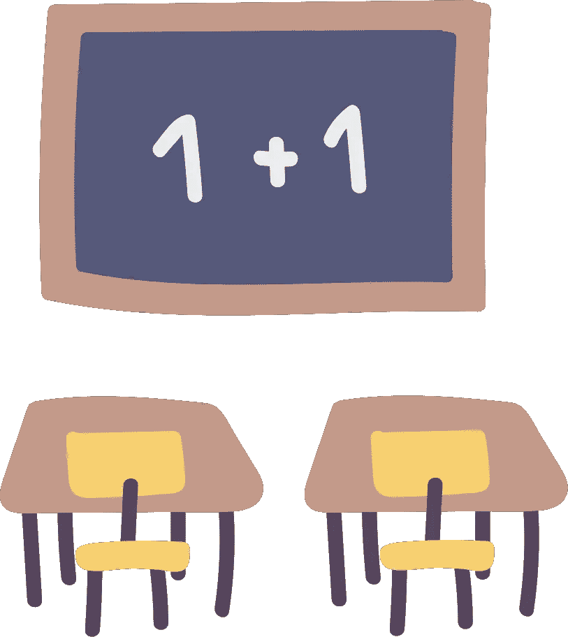
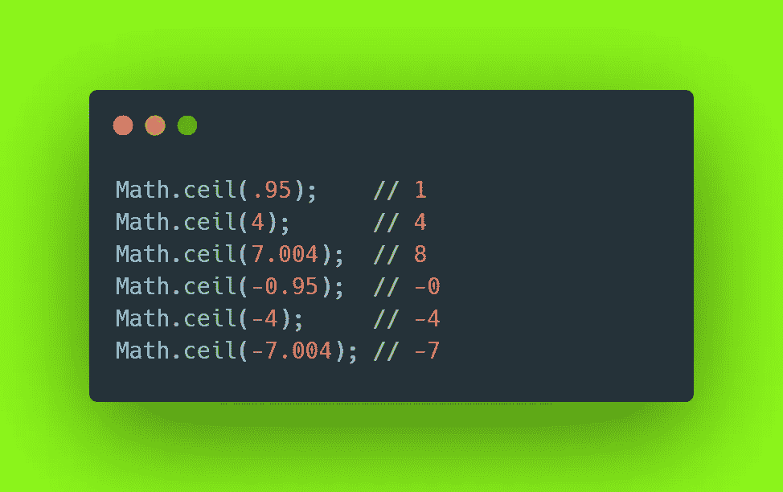
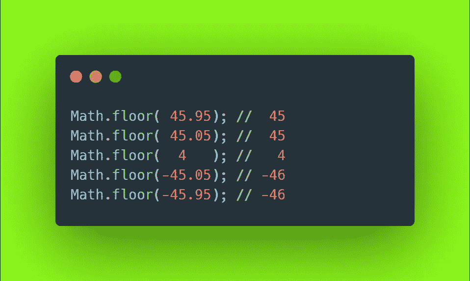
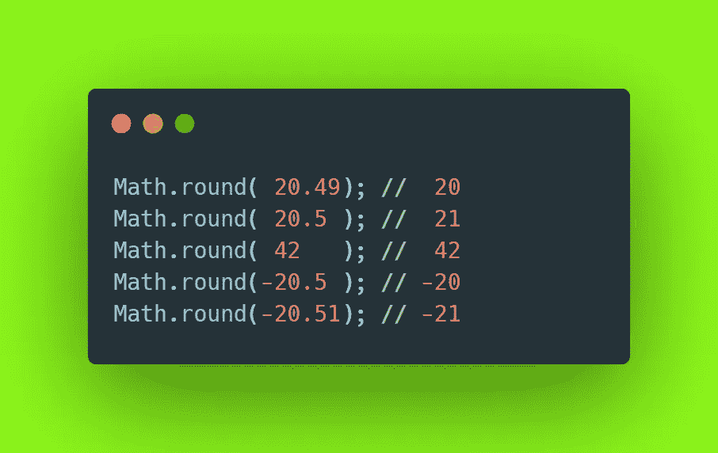

# JavaScript 中的 Math.ceil、Math.round 和 Math.floor

> 原文：<https://javascript.plainenglish.io/math-ceil-math-round-and-math-floor-in-your-javascript-7142fde2c56d?source=collection_archive---------6----------------------->

## 如何正确处理数字的指南

Illustration by Icons 8 from [Icons8](https://icons8.com/)

“**宇宙是由数学公式**规定的”我那脾气暴躁的老师过去常说。正如我所希望的那样，大量的代码不会很快脱离这条规则。幸运的是，像 JavaScript 这样的语言给了我们像 [*数学对象*](https://developer.mozilla.org/it/docs/Web/JavaScript/Reference/Global_Objects/Math) 这样的工具来处理数字和它们的运算。

说到舍入数字， *Math* 用三个主要函数帮你:`Math.ceil`、`Math.floor`和`Math.round`。

## 数学.细胞

该方法将唯一传入的值向上舍入到最接近的大整数。我发现 ceil 这个词在这种情况下很有意义，因为它让人想起天花板，想起提起什么东西。或者在我们的情况下，提高一个数字到下一个。

Using Math.ceil

## 数学.地板

在这个上下文中使用的这个词可以帮助你想象这个方法是干什么的。把某物倒在地板上，把唯一提供的数字降低到最接近的整数。

Using Math.floor

## 数学.圆

如果你比我更注意的话，这个方法将类似于你可能在学校学到的:最终的舍入值取决于小数部分。因此，如果该值≥ 5，则提供的数字将向上取整，否则向下取整。

Using Math.round

## 结论

一如既往，感谢您花时间阅读这篇文章。不要忘记在评论区提供反馈和意见。

— *皮耶罗*

## 资源

*   [数学对象文档](https://developer.mozilla.org/it/docs/Web/JavaScript/Reference/Global_Objects/Math)。
*   [数学细胞](https://developer.mozilla.org/it/docs/Web/JavaScript/Reference/Global_Objects/Math/ceil)。
*   [数学楼](https://developer.mozilla.org/it/docs/Web/JavaScript/Reference/Global_Objects/Math/floor)。
*   [数学回合](https://developer.mozilla.org/it/docs/Web/JavaScript/Reference/Global_Objects/Math/round)。

## **简单英语的 JavaScript**

喜欢这篇文章吗？如果有，通过 [**订阅获取更多类似内容解码，我们的 YouTube 频道**](https://www.youtube.com/channel/UCtipWUghju290NWcn8jhyAw) **！**