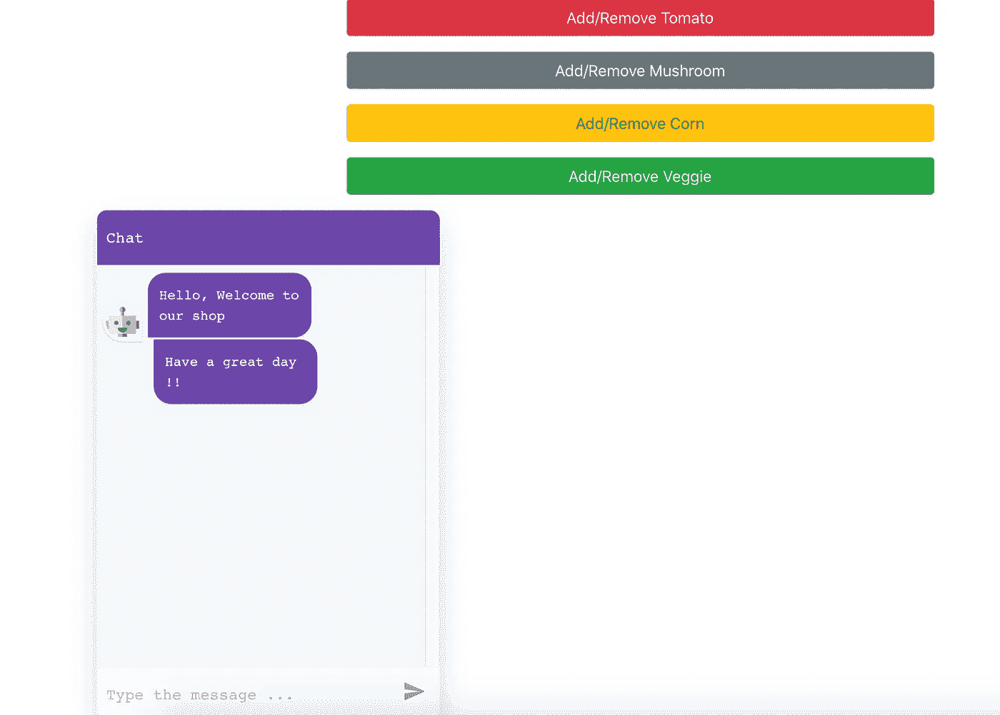
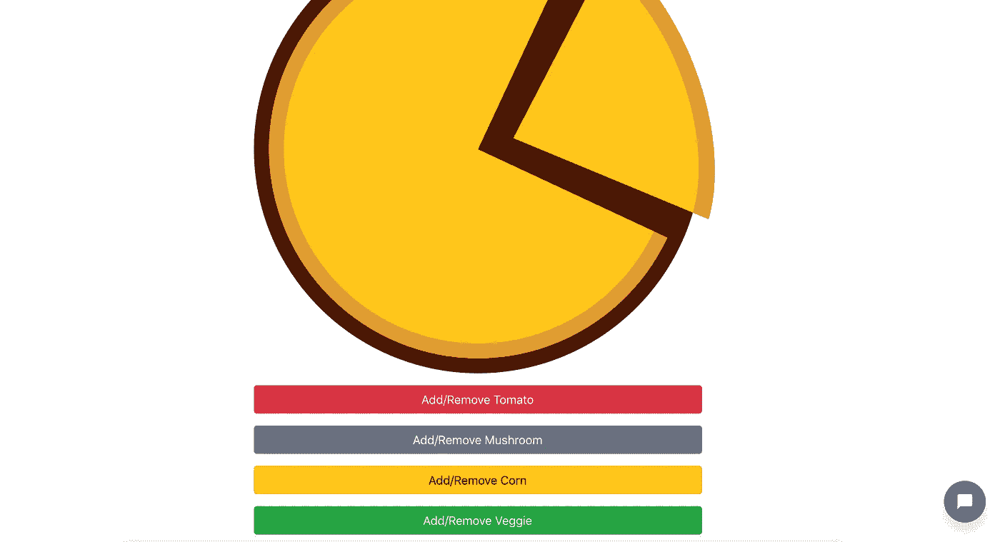
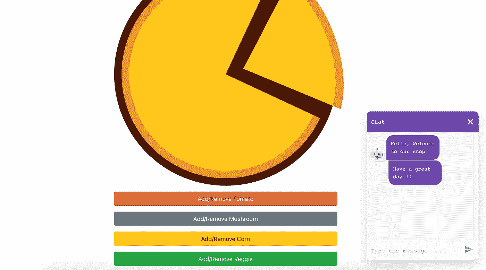

# 我能帮助你吗？用 React 在 10 分钟内创建一个聊天机器人

> 原文：<https://javascript.plainenglish.io/may-i-help-you-build-a-chatbot-in-10-minutes-with-react-df19e940bbc8?source=collection_archive---------1----------------------->


Photo by [Lefteris kallergis](https://unsplash.com/@lefterisk?utm_source=medium&utm_medium=referral) on [Unsplash](https://unsplash.com?utm_source=medium&utm_medium=referral)

# 如今，在构建任何应用程序时，用户体验都是非常重要的。越来越多的品牌正在利用聊天机器人来服务他们的客户，营销他们的品牌，甚至销售他们的产品。

有很多很棒的工具可以帮助我们非常容易地构建智能机器人，比如 Google 的 DialogFlow、Amazon Lex 等，其中大多数都实现了自己的自然语言处理(NLP)逻辑。然而，在某些情况下，我们并不真正需要智能机器人。

每当我们有一个可供选择的选项有限的小应用程序时，就没有必要使用基于 NLP 的工具，比如 Google 的 DialogFlow。您需要与它们集成(虽然这很容易)，并且您需要进行网络调用来获得结果。相反，在这些情况下，您可能希望在本地定义您的规则。在这里，我们将使用 **React Simple Chatbot** 库构建一个简单的聊天机器人，并将其添加到我们的 [***pizza-builder 应用程序***](https://medium.com/@himanshujaiswal_58882/not-a-hello-world-application-getting-started-with-react-c02879d8bde3) 中，使用它我们可以通过聊天机器人助手构建我们自己定制的披萨。最终的项目将如下图所示:

# 入门指南

React Simple Chatbot 是一个简单的库，它提供了一个 Chatbot 组件，我们可以将会话流作为道具传递给它。此外，我们可以定制聊天机器人的风格。让我们从深入研究代码开始。

从[https://github.com/hjaiswal/pizza-builder-tutorial](https://github.com/hjaiswal/pizza-builder-tutorial)克隆代码。*(确保你在主分支上工作)*。使用以下命令安装 chatbot 库:

```
**npm install react-simple-chatbot styled-components** **--save**
```

*styled-components 是 react-simple-chatbot 的依赖项之一，没有它就会失败。更多信息，请阅读* [*此处*](https://github.com/LucasBassetti/react-native-chatbot/issues/35)

创建一个聊天机器人组件**/src/components/Chatbot/custom Chatbot . js**

```
import React from "react";
import ChatBot from "react-simple-chatbot";function CustomChatbot(props) { const steps = [
      {
       id: "Greet",
       message: "Hello, Welcome to our shop",
       trigger: "Done"
      },
      {
       id: "Done",
       message: "Have a great day !!",
       end: true
      }
    ]; return <ChatBot steps={steps} />;
}export default CustomChatbot;
```

将此组件包含在您的披萨组件中

```
import React, { Component } from "react";
import "./Pizza.css";*..... Rest of the code .....***import CustomChatbot from "./chatbot/CustomChatbot";**class Pizza extends Component {*..... Rest of the code .....*

   return (
      <div>
        <div className="container mt-5"> *...... Rest of the code .....* **<CustomChatbot />**
        </div>
      </div>
    );
  }
}export default Pizza;
```

用`**npm start**`启动应用程序。您将在屏幕的左下角看到一个聊天窗口，如下所示:



React Chatbot Window

如果你想调整你的聊天机器人的大小并使其可折叠，你可以传递 **width** 、 **height** 和 **floating** 属性作为组件的道具。

```
function CustomChatbot(props) {
   const config = {
     width: "300px",
     height: "400px",
     floating: true
   }; const steps = [
      {
       id: "Greet",
       message: "Hello, Welcome to our shop",
       trigger: "Done"
      },
      {
       id: "Done",
       message: "Have a great day !!",
       end: true
      }
    ];

   return <ChatBot steps={steps} {...config} />;
  } export default CustomChatbot;
```

现在，您将在页面的右下方看到一个可折叠的元素。点击后，聊天窗口将会打开



Chatbot component (collapsible) on the bottom right — Before clicking



Chatbot component (collapsible) on the bottom right — After clicking

# 配置

```
const steps = [
    {
      **id**: "Greet",
      **message**: "Hello, Welcome to our shop",
      **trigger**: "Done"
    },
    {
      **id**: "Done",
      **message**: "Have a great day !!",
      **end**: true
    }
 ];
```

目前，CustomChatbot 组件中的 steps 数组有两个 JSON 对象。这些 JSON 对象将代表对话的流程。

*   **id** :当前步骤的标识。它可以是字符串或数字。但是我会推荐 string，因为它更具描述性，如果我们决定在两者之间添加一个步骤，我们不必改变编号。任何步骤都需要
*   **消息**:一旦该步骤被调用，将在聊天窗口显示的消息
*   **触发器**:下一步要触发的 id。它也可以是返回下一步 id 的函数
*   **结束**:如果为真，表示这一步是最后一步

在我们的例子中，在步骤 ***问候*** 中，我们显示消息*“您好，欢迎光临我们的商店”*，然后调用触发器中的 ***完成*** 步骤。在 ***完成*** 的步骤中，我们显示消息*“祝您有美好的一天！!"*然后用*“end:true”*结束对话。让我们的对话更有互动性。

```
const steps = [
   {
     id: "Greet",
     message: "Hello, Welcome to our shop",
     trigger: "Ask Name"
   },
   {
     id: "Ask Name",
     message: "Please type your name?",
     trigger: "Waiting user input for name"
   },
   {
     id: "Waiting user input for name",
     **user**: true,
     trigger: "Asking options to eat"
   },
   {
     id: "Asking options to eat",
     message: "Hi {**previousValue**}, Glad to know you !!",
     trigger: "Done"
   },
   {
     id: "Done",
     message: "Have a great day !!",
     end: true
   }
];
```

*   **用户**:如果为真，表示机器人必须等待用户类型的动作
*   **previousValue** :我们从上一步得到的值(在本例中是从用户输入得到的值)

这里，我们在第一步中问候用户，然后在第二步中询问姓名。在第三步中，对话暂停，等待用户响应。当用户输入名称时，它将被存储在 *previousValue* 变量中，该变量将在下一步中可用。然后，在第四步中，机器人再次用我们在上一步中获得的用户名问候用户，在第五步中，对话结束。

让我们添加一个“**选项**”功能，其中将显示一个选项列表，并根据用户的选择，配置接下来的步骤。

```
{
 id: "Displaying options to eat",
 **options**: [
      {
        **value**: "pizza",
        **label**: "Pizza",
        **trigger**: "Asking for Tomatoes in Pizza"
      },
      { 
        **value**: "burger",
        **label**: "Burger",
        **trigger**: "Burger Not available"
      } 
          ]
}
```

*   **选项:**选项列表供用户从中选择，需要点击选项。列表中的每个选项都是具有三个属性的 JSON
*   **value:** 选项中 JSON 的属性，用户点击该选项将设置值。例如，在上面的步骤*、*中，会显示披萨&汉堡两个选项。如果用户点击比萨饼，步骤的值将是比萨饼，如果用户点击汉堡，步骤的值将是汉堡
*   **标签:**这是聊天窗口中将显示的内容
*   **触发:**如果用户点击比萨，下一步将是 ***要求比萨中的西红柿*** ，如果用户点击汉堡，下一步将是 ***汉堡不可用。*** 触发器也可以是如下图的功能。返回值将是下一步的 id

```
{
  id: "Displaying options to eat",
  **options**: [
             { **value**: "pizza",**label**: "Pizza",**trigger**: () => {
                    console.log("Clicked on Pizza");
                    return "Asking for Tomatoes in Pizza";                                                               
             }, 
             { **value**: "burger",**label**: "Burger",**trigger**: () => {
                    console.log("Clicked on Burger");
                    return "Burger Not available";                                                               
             }
           ]
}
```

# 完整的对话

现在让我们为应用程序添加完整的对话

```
const steps = [
        {
           id: "Greet",
           message: "Hello, Welcome to our shop",
           trigger: "Ask Name"
        }, {
           id: "Ask Name",
           message: "Please type your name?",
           trigger: "Waiting user input for name"
        }, {
           id: "Waiting user input for name",
           user: true,
           trigger: "Asking options to eat"
        }, {
           id: "Asking options to eat",
           message: "Hi {previousValue}, Please click on what you
                     want to eat!",
           trigger: "Displaying options to eat"
        }, {
           id: "Displaying options to eat",
           options: [
                      {
                        value: "pizza",
                        label: "Pizza",
                        trigger: "Asking for Tomatoes in Pizza"
                      },
                      { 
                        value: "burger",
                        label: "Burger",
                        trigger: "Burger Not available"
                      } 
                    ]
        }, {
           id: "Burger Not available",
           message: "Sorry, We don't have burger available at the
                     moment. Would you like to try our pizza?",
           trigger: "Asking for pizza after burger"
        }, {
           id: "Asking for pizza after burger",
           options: [
                      {
                        value: true,
                        label: "Yes",
                        trigger: "Asking for Tomatoes in Pizza"
                      },
                      { 
                        value: "false",
                        label: "No",
                        trigger: "Done"
                      } 
                    ]
        }, {
           id: "Asking for Tomatoes in Pizza",
           message: "Would you like to have tomatoes in your pizza",
           trigger: "Adding Tomatoes in Pizza"
        }, {
           id: "Adding Tomatoes in Pizza",
           options: [
                      {
                        value: true,
                        label: "Yes",
                        trigger: () => {
                           props.eventHandler("tomato");
                           return "Asking for Mushroom in Pizza"  
                         }
                      },
                      { 
                        value: "false",
                        label: "No",
                        trigger: "Asking for Mushroom in Pizza"
                      } 
                    ]
        },

        {
           id: "Asking for Mushroom in Pizza",
           message: "Would you like to have mushroom in your pizza",
           trigger: "Adding Mushroom in Pizza"
        },

        {
           id: "Adding Mushroom in Pizza",
           options: [
                      {
                        value: true,
                        label: "Yes",
                        trigger: () => {
                           props.eventHandler("mushroom");
                           return "Asking for Corn in Pizza"  
                         }
                      },
                      { 
                        value: "false",
                        label: "No",
                        trigger: "Asking for Corn in Pizza"
                      } 
                    ]
        }, {
           id: "Asking for Corn in Pizza",
           message: "Would you like to have corn in your pizza",
           trigger: "Adding Corn in Pizza"
        },

        {
           id: "Adding Corn in Pizza",
           options: [
                      {
                        value: true,
                        label: "Yes",
                        trigger: () => {
                           props.eventHandler("corn");
                           return "Asking for Veggies in Pizza"  
                         }
                      },
                      { 
                        value: "false",
                        label: "No",
                        trigger: "Asking for Veggies in Pizza"
                      } 
                    ]
        },

        {
           id: "Asking for Veggies in Pizza",
           message: "Would you like to have veggies in your pizza",
           trigger: "Adding Veggies in Pizza"
        },

        {
           id: "Adding Veggies in Pizza",
           options: [
                      {
                        value: true,
                        label: "Yes",
                        trigger: () => {
                           props.eventHandler("veggie");
                           return "Done"  
                         }
                      },
                      { 
                        value: "false",
                        label: "No",
                        trigger: "Done"
                      } 
                    ]
        }, {
            id: "Done",
            message: "Have a great day !!",
            end: true
        }
];
```

在 Pizza 组件中，将 **clickEventHandler** 作为道具传递给聊天机器人组件

```
<CustomChatbot eventHandler={this.clickEventHandler} />
```

看起来很复杂？是的，但是它真的很容易理解。让我们来分解一下:

*   在步骤 ***问候*** 中，聊天机器人会在窗口显示问候信息
*   在步骤 ***询问姓名*** 中，聊天机器人会显示询问姓名的信息
*   在步骤 ***中，等待用户输入姓名*** ，聊天机器人将等待用户输入姓名，该值将被存储并传递到下一步
*   在步骤 ***询问选项吃*** 中，聊天机器人将使用 previousValue 显示用户名
*   在步骤 ***显示吃*** 的选项中，聊天机器人会显示两种吃的选项，披萨和汉堡。如果用户选择比萨选项，将触发 ***在比萨中索要西红柿*** 步骤否则将触发 ***汉堡不可用*** 步骤选择汉堡选项
*   如果步骤 ***汉堡不可用*** 被触发，将显示信息并触发步骤 ***汉堡后要求比萨饼*** ，将显示两个选项。如果点击“是”选项，将触发 ***在披萨中索要西红柿*** 步骤，如果没有点击选项，将触发 ***完成*** 步骤，通话结束
*   在 ***步骤中询问比萨中的番茄，*** 聊天机器人将询问用户是否想要番茄，并触发 ***在比萨中添加番茄*** 步骤，该步骤将显示是和否选项。如果选择 Yes，将调用 props.eventHandler 方法，该方法是 Pizza 组件中的 clickEventHandler 函数，它将呈现番茄组件。如果选择“否”,将触发 ***要求比萨饼中的蘑菇*** 步骤
*   其他成分也会发生类似的事情。最后，当 ***完成时*** 步骤将被触发，对话将结束。

# 式样

风格可以添加到聊天机器人一样，窗口颜色，字体大小，字体系列等。我们需要从“styled-components”库中导入 **ThemeProvider** ，并将我们的聊天机器人包装在其中，如下所示:

```
import React from "react";
import ChatBot from "react-simple-chatbot";
import { ThemeProvider } from "styled-components";function CustomChatbot(props) {

    *..... Rest of the code .....* const theme = {
         background: "white",
         fontFamily: "Arial, Helvetica, sans-serif",
         headerBgColor: "#00B2B2",
         headerFontColor: "#fff",
         headerFontSize: "25px",
         botBubbleColor: "#00B2B2",
         botFontColor: "#fff",
         userBubbleColor: "#fff",
         userFontColor: "#4c4c4c"
        }; *..... Rest of the code .....* return (
      <ThemeProvider theme={theme}>
         <ChatBot steps={steps} {...config} />
      </ThemeProvider>
     );
```

应用程序可以进一步改进。目前，添加配料的按钮仍处于活动状态。当我们通过聊天机器人添加配料时，它可以被禁用。我将留给读者去实现

祝贺你，你已经成功地在 React 上构建了一个聊天机器人，它应该像开始时发布的视频一样工作。最终的代码库可以在这个 git 链接中找到:【https://github.com/hjaiswal/pizza-builder-tutorial】*(git 分支:****pizza-builder-with-chatbot****)*

非常感谢你阅读这篇文章。如果你有问题，欢迎在下面评论。

## 进一步阅读

[](https://medium.com/@himanshujaiswal_58882/not-a-hello-world-application-getting-started-with-react-c02879d8bde3) [## 不是 Hello World 应用程序 React 入门

### 通过构建一个真正的应用程序(Pizza Builder)而不仅仅是一个 Hello World 示例来开始使用 React

medium.com](https://medium.com/@himanshujaiswal_58882/not-a-hello-world-application-getting-started-with-react-c02879d8bde3)  [## 如何使用最小特权原则自动化 AWS IAM 最佳实践

### 云是一项神奇的技术，可用于构建可扩展的应用程序，轻松提供对弹性计算的访问…

简明英语. io](https://plainenglish.io/blog/how-to-automate-aws-iam-best-practices-using-the-principle-of-least-privilege) 

*更多内容看* [***说白了。报名参加我们的***](https://plainenglish.io/) **[***免费周报***](http://newsletter.plainenglish.io/) *。关注我们关于*[***Twitter***](https://twitter.com/inPlainEngHQ)，[***LinkedIn***](https://www.linkedin.com/company/inplainenglish/)*，*[***YouTube***](https://www.youtube.com/channel/UCtipWUghju290NWcn8jhyAw)*，以及* [***不和***](https://discord.gg/GtDtUAvyhW) ***。*****

***有兴趣缩放你的软件启动*** *？检查出* [***电路***](https://circuit.ooo?utm=publication-post-cta) *。*