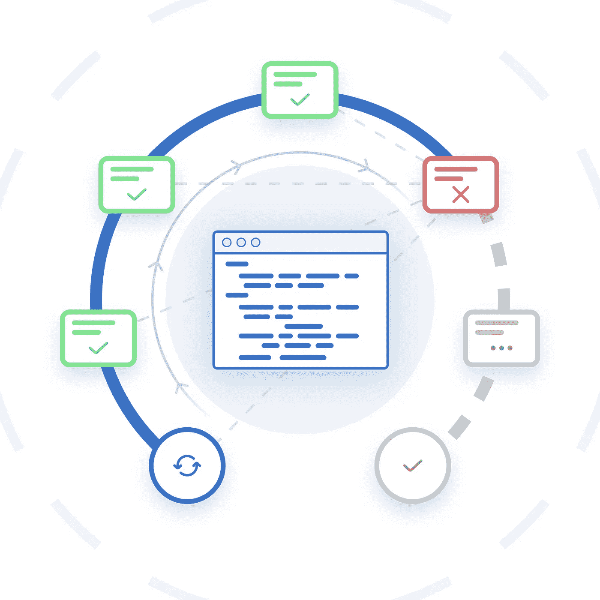

# 前端有意义的单元测试

> 原文：<https://javascript.plainenglish.io/meaningful-unit-testing-on-the-front-end-85403b1e2ca?source=collection_archive---------3----------------------->

Illustration by [Thomas Renon](https://www.behance.net/ui-ux-designs?fbclid=IwAR1W38mG5qeH3pyA08JTpJHsn4L3HuBgdiBsU7YYKQ2XDtjxrzMauG9K-2M)

你是那种知道单元测试很重要但却讨厌编写它们的人吗？我以前也是这样，直到我试图赋予它们一些意义。现在吗？我爱他们。我可以很快地写出它们，它们是一个适当的安全网，足够好，所以它们不会轻易破裂。让我们看看我们能做些什么。

# 单元测试有什么问题？

很多事情会让他们变成噩梦:

*   源函数(即需要单元测试的函数)非常难以进行单元测试
*   即使您没有修改链接到它们的任何内容，它们也会断开
*   除非是写它的人，否则它们是不可读的
*   一旦重构完成，它们就会崩溃。这一点，即使行为和输入/输出是相同的
*   它们被编写来通过覆盖阈值，但是不测试任何东西
*   嘲讽很难
*   等等…

听起来很熟悉？嗯，我们可以很容易地解决所有这些问题。其中一半来自源代码本身。其余的来自编写单元测试时使用的方法。它通常倾向于测试实现而不是功能。

既然我们知道什么是痛苦，让我们看看什么对我们有好处:

*   不与代码实现耦合(即，在行为不变的情况下重构代码时不中断)
*   行为改变时中断
*   被孤立
*   描述和测试一个小的逻辑单元
*   从功能上描述我们的服务(或另一个逻辑)行为
*   简单明了

# 如何让源代码单元可测试？

> 可读和可维护的代码。说起来容易做起来难…

我们应该关注三个原则。很多人支持它们，大多数时候社区都同意它们的有效性。

问题是有时我们不知道如何在我们的代码中应用它们。没有奇迹般的解决方案，但我会试着提供一些指导，并找出一些*代码气味*。

## **单一责任原则**

没有它，方法和类会变得庞大，不可读。它们比名字所暗示的要多得多，通常会产生耦合。为了应用 **SRP** ，我们需要记住一些事情。

写小段代码。一个方法应该只做一件事(一个责任)，而且要小。另外，写一个有意义的名字来增加可读性。

如果文件变得太大，这就是代码味道。其中发生了太多的事情(我个人倾向于一个文件不超过 150 行，一个测试文件不超过 200 行)。如果有太多的依赖注入(超过 3 或 4)，这也是一种代码味道，需要提取一些片段。

就单元测试而言，因为你只有很小的功能，所以它们更容易测试。

## 编写纯函数

纯函数是一种对于给定的输入，输出总是相同的方法。另外，纯函数没有副作用。这意味着函数之外的任何东西都不能被它修改。这样的函数是可预测的、可重用的、高度可靠的，这使它们成为单元测试的完美候选。当然，并不是所有的东西都是纯净的，前端本质上有一些副作用，仅仅是通过与 DOM 交互。然而，你的大部分逻辑应该是纯粹的。

> 你所有的商业逻辑都要纯粹！

没有必要进行全函数式编程。您可以选择您喜欢的任何编码风格。但是仅仅在单一职责原则之上编写纯功能将会极大地提高可伸缩性和可维护性。

回到单元测试。功能纯正，无副作用。我们的单元测试是孤立的。不会再无缘无故的断了；输出是可预测的和一致的！它还将极大地帮助编写能够支持重构而不中断的单元测试。

## 接吻原则和常识

这对源代码和测试代码都是值得的。如果小块逻辑开始变得难以读/写，这就是代码味道。大多数时候有一种更简单的做事方法。如果您需要编写额外的代码来进行单元测试，那就有问题了。

> 单元测试插入到源代码中，而不是相反。

关键在于将你的代码分成简单、纯粹的逻辑部分。一旦你拥有了它。测试本身会变得简单。

# 我如何将这一点应用到实际代码中呢？

我们现在将关注一个实际的例子。

Code hardly readable and hardly unit testable

即使这个功能很小，我们也做了很多！有副作用，非直观的链式逻辑等。理解发生了什么需要几秒钟以上的时间。

我们可以把事情分开，这样每个人都有自己的责任。

Refactoring with pure functions and single responsibility principle

我们将`getFans`方法重命名为更有意义。然后所有的逻辑都被提取成更小的块。我们最终得到了一个易读的代码，其中每个功能都集中在一个任务上，并且每个功能都是单元可测试的。

## 让你的测试描述有意义

让我们把重点放在测试部分。看着眼熟？

Pointless unit test

这个测试毫无意义。它迫使你去检查实现，以了解发生了什么。未测试任何逻辑/行为。我们与实施紧密相关。但是管理层会很高兴，我们对这个功能有 100%的覆盖率！

在这个用例中，检查服务是否被调用是没有意义的。从功能上讲，它没有任何价值。谁会在乎一家商店或另一家服务机构是否被要求去接作者呢？

使用它的组件不想知道这些。那么为什么单元测试要检查这个呢？

> 只有合同需要检验。

约定是:‘对于这样的输入，方法将返回这样的输出’。让我们展示测试的需求和期望。

Meaningful unit testing

我们可以看到这些测试在描述上是简单明了的。它们几乎可以被认为是文件。作为项目的新参与者，很容易理解开发人员在编码时想要尊重的需求。

## 模仿呢？

模仿应该是最适合你的。所以即使你模仿一个复杂的服务，你也只需要它的一小部分。

假设我们的商店依赖关系如下所示:

在我们的测试中，我们只需要这个:

> 忽略依赖项中对测试不是强制性的所有内容。

# 应该对什么进行单元测试？

覆盖率是一个没有意义的指标。它只是告诉你一行代码是否在测试中被执行了。100%的覆盖率并不能防止任何错误。

需要回答的问题如下:我的功能受到保护了吗？

如果答案是肯定的，但有些文件只有 60%的覆盖率，这很好。有时不可避免的样板文件不值得测试。

> 服务和实用程序应该包含可重用的逻辑。这意味着它们需要被覆盖。

组件呢？嗯，这是一个值得讨论和广泛争论的问题。

在我看来，答案是否定的。事实上，一个组件应该尽可能小，只包含你的 HTML 所需的框架逻辑或第三方逻辑。

剩下的逻辑要提取出来，要纯粹。此外，如果你试图对你的 HTML 进行单元测试，你就违反了隔离原则！事实上，通常，一个组件会在其 HTML 中加载其他子组件。

如果测试，需要加载子组件及其依赖项！这意味着，添加一个依赖到一个子组件中会迫使你将它添加到父测试中，即使你不想修改它。

那种测试需要更多的资源，应该被认为是集成测试。有其他工具可以做到这一点(例如故事书或 Cypress)。

# 关键注意事项

1.  编写纯代码，每个函数只做一件事。
2.  关注功能，而不是代码
3.  如果不简单，就不是要走的路

感谢阅读。我很高兴听到反馈和意见。黑客快乐！

感谢丹尼尔·克莱格斯对本文的帮助以及与他的多次讨论。