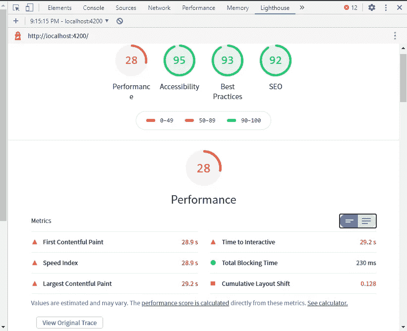
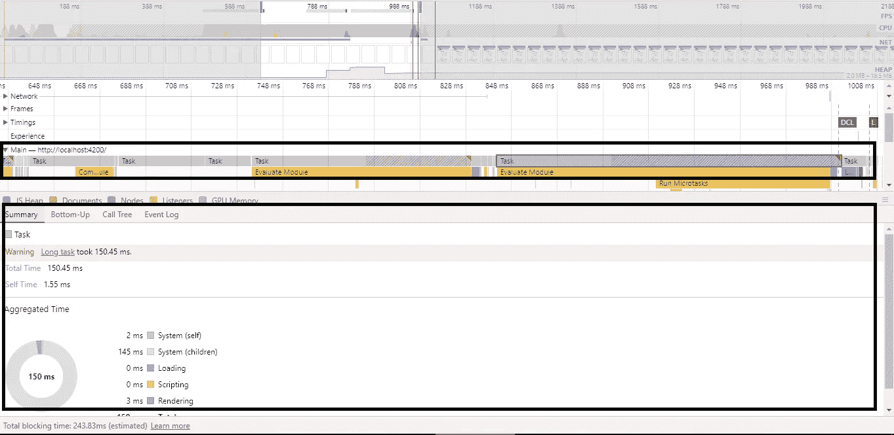
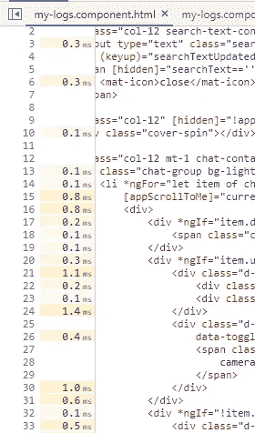
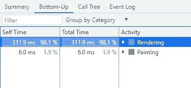

# 测量 JavaScript 性能的简单方法

> 原文：<https://javascript.plainenglish.io/measuring-javascript-performance-the-easy-way-3b13630c025d?source=collection_archive---------12----------------------->

## 有几个第三方工具可以测量 web 应用程序的性能。但是，我们是否使用了我们所掌握的基本工具？


Photo by [José Pinto](https://unsplash.com/@gearfilms?utm_source=medium&utm_medium=referral) on [Unsplash](https://unsplash.com?utm_source=medium&utm_medium=referral)

网页——互联网世界中最简单却最强大的东西之一。我们都会看到一个设计精美的作品慢如蜗牛，我们也会看到至少一个设计糟糕的页面，它运行得如此之快和高效，以至于我们忽略了它的设计。为什么？都是因为幕后的代码。长时间的头脑风暴、研究、设计和对功能的用户体验考虑，如果代码执行得不好，所有这些都没有意义。你有没有想过 JavaScript 代码是如何执行的？深入到代码执行有哪些选项？

像你们大多数人一样，我用的是铬合金，我用的是 T2 角合金。让我们深入研究一下我们应该首先使用的——浏览器中的开发工具。

**Lighthouse &开发者工具中的性能标签**

我们每个人都会在他们的开发工具中看到 Lighthouse 选项卡。Lighthouse 是一个广泛使用的工具，它基于性能、可访问性、SEO 和最佳实践来衡量一个网页。Lighthouse 的建议是，最好以匿名模式运行报告，以避免浏览器扩展干扰您的报告。

让我们以 angular CLI 为我们的小实验提供的样板应用程序为例。



Lighthouse Report for the boilerplate Angular App

只需单击“查看原始跟踪”按钮，我们就可以导航到“性能”选项卡。performance 选项卡显示了对给定事件下浏览器中发生的情况的逐步分析。在从灯塔导航的情况下，它很可能会反映页面负载。我们可以在这里看到页面加载期间发生的所有事件。



Summary Tab with Aggregate time

现在，你可能想知道我的代码在哪里。我们很亲密…

“主”线程包含了我们代码的细节。当我们单击任何任务时，Summary 选项卡显示所选任务花费的总时间。

要记录用户可能完成的一系列操作的性能，请转到 performance 选项卡，点击 record 按钮，在浏览器上执行该操作，然后停止记录以分析结果。

让我们从现在开始举一个真实世界的例子——比较容易理解。🙂


Bottom-Up tab showing the breakdown of Scripting Activity

上面的图像显示了我的一个页面的样本。我们可以在脚本活动下看到对我们代码的引用。单击该文件会将您带到 source 选项卡，突出显示 HTML 中每一行的细目以及相应的时间消耗。您还可以研究 TypeScript/Javascript 代码，看看当用户在 UI 上执行一组任务时，每个函数执行了多长时间。



# **我在页面中改进的内容**

无论应用程序有多大，简单的更改对提高 web 应用程序的性能大有帮助。我遇到过需要删除或简化的代码片段，以提高我的页面的性能。下面是开发/维护应用程序时需要注意的一些事情。

当然，这些来自我的申请页面。所以，你可能会发现类似的/更新的东西来深入挖掘…

## *动画&布局变化*



Rendering and Painting triggered by Animation and Layout Shift

尽可能减少动画和布局的变化。我见过需要大量 CPU 的动画，很少有完全不“用户友好”的。

## *@ViewChild decorator*

@ViewChild 是常用的装饰器之一。最好是查看组件，确保确实需要引用。

如果我们希望注入/引用指令，组件内部的组件，那么我们可以使用装饰器。对于更简单的操作，可能根本不需要@ViewChild。

## *带*ngFor* 的 trackBy 选项

在处理屏幕上绘制的大量项目列表时，将 trackBy 选项与*ngFor 一起使用是一个好方法。当您使用正确的引用指定 trackBy 选项时，只有更改会重新呈现到屏幕上—类似这样。

```
trackByFn(index: number, item: any) {
    return item.id;
}
```

## *ngClass & & ngIf*

将更简单的检查传递给*ngIf 和[ngClass],而不是使用函数引用或复杂的检查。

检查*ngIf 是否可以被[hidden]属性替换，以避免*在屏幕上绘制*ngIf 引用的元素的*。当试图隐藏/显示 DOM 中的复杂元素时，这可能会很方便。

## *自定义指令*

当指令的输入通过来自组件的变量获得更新时，我们的定制指令通常与 *ngOnChanges* 一起发挥作用。在大型列表上设置自定义指令需要更改检测周期来验证传递给指令的输入。如果可能的话，找一个替代的方法。

# **结论**

实现 Angular 中定义的标准指导方针和方法将始终为您的应用程序提供性能方面的提升。即使遵循了所有的指导原则，仍然会有改进的空间，尤其是在维护模式下几个月后。随着变化的到来，回头看看我们的代码库中已经存在的东西总是好的，以确保更好的性能。

感谢阅读…编码快乐！