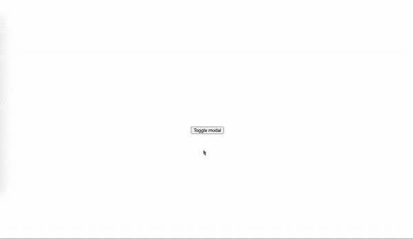
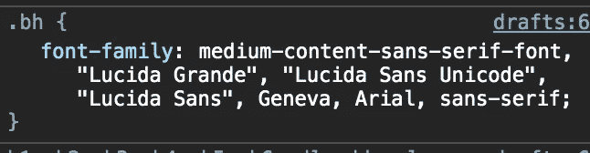
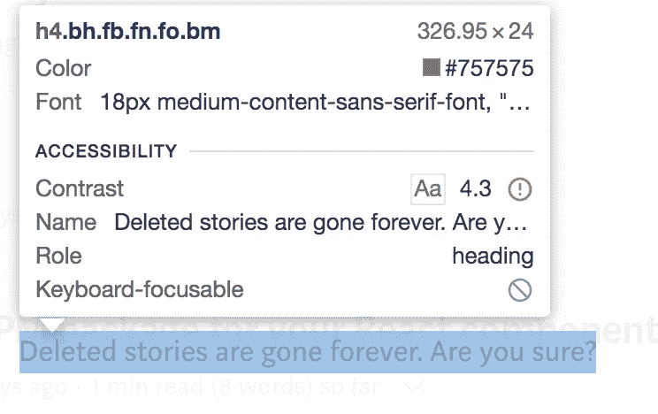
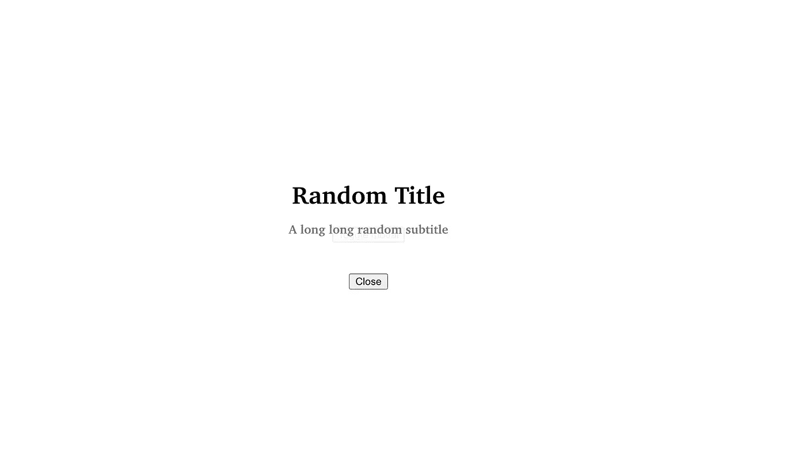
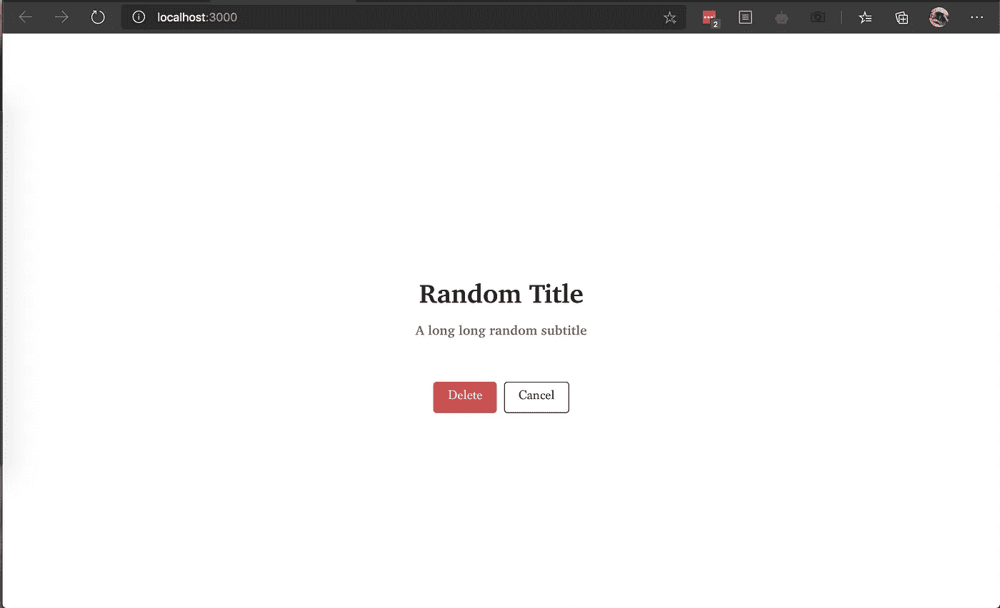
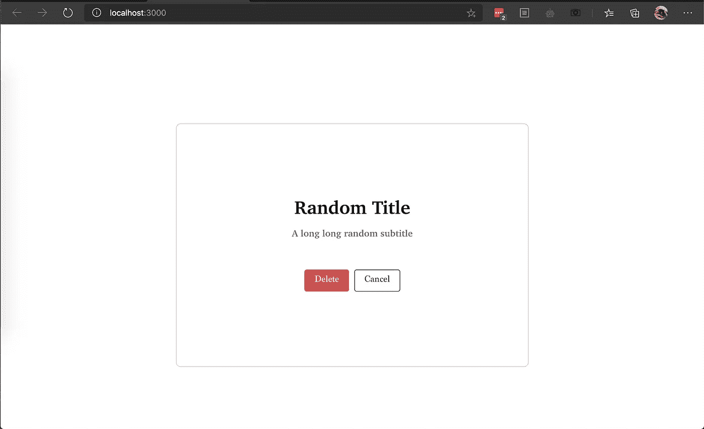

# 用 React 创建一个类似介质的模型

> 原文：<https://javascript.plainenglish.io/medium-like-modal-with-reactjs-3a0db7c0d38c?source=collection_archive---------2----------------------->

## 如何在 React 中创建一个全页的基本模型？射流研究…

在 web 应用程序的上下文中，模态是一个漂亮的工具，它可以呈现信息，而不必强迫用户从当前网页导航。在这篇文章中，我们大胆地

1.  使用 React 创建一个模态。
2.  让情态看起来像是媒介用来寻求确认的令人愉快的情态。


source: Giphy

# 什么是模态？

模式视图是显示在宿主窗口顶部的独特视图。模态可以用来服务于多种用例，从呈现信息或错误到以授权墙或付费墙的形式阻止用户。

模态独立于宿主窗口或视图。这使得模态成为一个典型的可重用组件。这篇文章的目的是模仿 Medium 使用的最小情态动词之一。下面是我们将尝试镜像的模型的图像。


# 第 1 部分:在 React 中创建一个模型

我们首先使用`create-react-app`创建一个 React 应用程序，转到您的终端或命令提示符，导航到首选目录并键入

`npx create-react-app medium-modal-mimic`

这应该会创建一个 React 项目。用您最喜欢的 IDE 打开项目。

## 1.1 使用主机组件-app . js

宿主组件或宿主窗口是将在自身上呈现模式的实体。一旦应用程序被创建，移动到`src/App.js`并移除除了顶部容器`div`之外的所有东西。你的`App.js`应该如下图所示

接下来，移动到`App.css`并遵循类似的模式，删除除`App`以外的所有样式

对`App`类进行以下更改。我们已经使我们的主机屏幕采取全屏高度。由于`align-items`和`justify-content`的缘故，这个 div 中的任何内容都将居中

移回`App.js`并在`div`中添加一个按钮，如下图所示。请确保在页面中央看到这个按钮。

```
<div className="App">
    <button>Toggle Modal</button>
</div>
```

模态的可见性将取决于状态变量。你需要使用`useState`钩子来创建一个状态变量。这个状态变量决定了我们模态的命运。

从导入`App.js`中的`useState`开始

`import React, {useState} from 'React';`

在 App 组件中，创建一个状态变量。状态变量`showModal`的初始值将被设置为 **false** ，因为您不希望在页面首次加载时显示模式。

```
function App() {const [showModal, setShowModal] = useState(false);.....}
```

接下来，您需要一个函数来改变这个状态变量的值。为了实现这一点，您应该创建如下所示的函数

```
const toggleModal = () => { setShowModal(**!**showModal);}
```

当调用上面的函数时，状态变量`showModal`的值被反转。请注意！在 showModal 前面。showModal 的初始值被设置为 false。当第一次单击按钮时，这个函数将被执行，showModal 的取反值(恰好为真)将被赋给状态变量。

但是，您尚未将按钮与功能连接。除非你这样做，否则这不会生效。要在点击按钮时调用`toggleModal`功能，向您的按钮添加一个`onClick`，如下所示

`<button onClick={toggleModal}> Toggle modal</button>`

如果你一直跟着做，你的主机窗口已经设置好了，你应该有一个类似下面的`App.js`

App.js

## 1.2 进入对话的核心——模态

现在，您需要创建模态组件。在`src`目录下，创建一个名为`Modal`的新目录，在模态目录下，创建一个新文件`index.js`这个文件将包含我们想要显示的模态组件。

由于这个模态的范围是只显示**一个标题、一个副标题和两个按钮，**我们将在模态视图中提取这些属性。这些属性稍后将由主机(`App.js`)传递给这个模态组件。

```
const { showModal, 
        onClose, 
        onAction, 
        titleForCloseButton="Cancel", 
        titleForActionButton="Delete", 
        title = "Missing Title", 
        subtitle = ""} = *props*;
```

## 1.2.1 了解道具

**showModal** 是状态变量标志，它决定了模态是可见还是隐藏。我们在和`App.js`一起工作的时候创造了这个

**onClose** 是一个事件处理程序，当你想关闭模态时应该调用它。如果你一直在关注，你会注意到你已经在`App.js`中编写的 *toggleModal* 函数中实现了这一点，你需要将对 toggleModal 函数的引用传递给 onClose 属性。

**onAction** 是当单击主按钮时您想要调用的操作处理程序。

我们暂时还没用过这些。但是，这些可以用来定制按钮标题。关闭按钮的**标题**和动作按钮的**标题**分别是这些按钮的标题。如果没有为这些按钮传递值，它们将分别采用默认值*【取消】*和*【删除】*。

**标题**和**副标题**字段是不言自明的。需要注意的是，我们还没有通过道具。我们将在随后的一个部分中完成这项工作。

## 1.2.2 设计莫代尔风格

此外，您需要有条件地呈现模态。如果 showModal 的标志为 true，则返回一个模态视图。模态视图将具有*全宽和全高*。它将有一个 95% 不透明度的*白色背景。因为您希望它显示时与主窗口没有关联，所以这个模态的位置必须是绝对的。*

最后，您可能希望它总是在主机的顶部，并且您可能希望有一个更高值的 z 索引，比如说 9？这大致编译成下面的一组 CSS 样式

在您的模态组件中，使用模态类在 div 中创建一个按钮来关闭模态。稍后，这将以取消按钮的形式出现。我们还需要创建两个跨度来保存标题和副标题。在这一点上，我们不会担心美学，因为我们将在以后处理 CSS。

如果`shouldShow`为真，我们将用`modal`类有条件地渲染这个`div`。在另一种情况下，我们将返回一个带有`display:none`的`div`

```
const MyModal = (*props*) => { const {shouldShow, 
          onClose, 
          title = "Missing Title", 
          subtitle = ""} = *props*; return shouldShow === true 
            ?
            <div *className*="modal">
              <span *className*="title">{title}</span>
              <span *className*="subtitle">{subtitle}</span>
              <button *onClick*={onClose} *className*="close">Close</button>
            </div> 
             : 
            <div *style*={{display: 'none'}}></div>}
```

## 1.2.3 连接点..

回到`App.js`，把需要的道具传给模特。更新后的`App.js`应该如下图所示。

如果一切顺利，您应该会有如下结果。



# 第二部分:让它看起来像媒介的模态

现在我们已经有了一个工作模式，让我们试着模仿一下中间模式。

## 最初印象

我最初印象的主要部分围绕着三个非常直接的观察。

1.  与许多常见的模态不同，这个模态没有定义明确的内容容器。作为参考，看看下面的维基百科模式。有一个单独的部分包含内容，在这个例子中是消息表单，背景有一个半透明的黑色阴影，目的是使主网页散焦。


Wikipedia modal with a central focused element.

2.这个模态有一个最小的白色背景和一些透明度(透明度 5%/alpha 95%)。我们在使用`modal.css`的时候已经完成了

3.内容居中。

了解了所有的背景和观察之后，下一个合理的行动是卷起袖子，修改一些 CSS。

## 2.1 字体

根据[这个](https://qr.ae/pNsa1A) Quora 的回答，Medium 使用 *Charter* 和 *Kievit* 字体。在检查标题元素时，我发现了这个



不过一个[中帖](https://medium.design/cast-of-characters-17eaa82755cf)，一个[异 Quora 回答](https://qr.ae/pNsa1V)和一个 [Reddit 跟帖](https://www.reddit.com/r/web_design/comments/6a5kvd/where_to_find_mediumcontentseriffont_and_why_are/)证实了这是 ITC Charter 字体。字体可以在 *这里找到[。](https://www.myfonts.com/fonts/itc/charter/)*

为了在模态中使用这种字体，我们使用 CSS `@font-face`，就像下面的`modal.css`

```
@font-face {
  font-family: 'ModalFont';
  src: url('../assets/CharterBold.ttf');
}
```

我们还在同一个 CSS 文件中使用了这个字体。除了设置字体系列，我们还添加了一些视觉属性，如字体大小、边距和颜色。

```
.title{
font-size: 2rem;
color: #000;
margin-bottom: 1rem;
font-family: 'ModalFont';
}
```

类似地，对于字幕跨度，检查时，



我们发现字体是一样的，但是字体颜色是#757575。这使得我们的字幕有如下风格

```
.subtitle{
font-size: 1rem;
font-family:'ModalFont';
margin-bottom: 3rem;
color: #757575;
}
```

由于我们没有完全抄袭 Medium 的模式，我们将跳过确切的字体大小、边距等。就在应用字体之后，我们的模态开始看起来和 Medium 的相似



## 2.2 按钮

我们将为按钮使用两种不同的样式。第一个样式组决定按钮的视觉效果，第二个样式组添加特定于动作按钮的视觉效果。在`modal.css`

```
.btn{
padding: 0.6rem 1rem;
font-family: 'ModalSubtFont';
border-radius: 4px;
font-size: 1rem;
margin:0.3rem
}.action-btn{
color:#FFF;
background-color:#CC5454;
border: 1px solid #CC5454;
}.dismiss-btn{
color:#292929;
background-color:transparent;
border: 1px solid #292929;
}
```

而在`modal/index.js`

```
<div *className*="btns">
  <button *onClick*={onClose} *className*="btn action-btn">Delete</button><button *className*="btn dismiss-btn">Cancel</button>
</div>
```

在上面的代码片段中，我们还引入了一个名为`btns`的 CSS 类，它充当 flex-direction 列的包装器。这是并排放置按钮所需要的。

我们还编写了一个 CSS 类`content-wrapper`，将内容包装在屏幕中央。这个类可以方便地进行微妙的改变，比如给内容添加边框。这将在下面演示。

**A .无边框内容包装**



**B .带边框的内容包装**



完成`modal.css`

完整的`modal/index.js`

# 结论

按照计划，我们可以创建一个类似于媒体的模型。然而，这个模型仍然有点粗略，可以做得更好。当我们将道具从主机传递到模态时，我们缩小了这个模态的范围。这可以通过使用道具来解决

## 简单英语的 JavaScript

喜欢这篇文章吗？如果是这样，通过 [**订阅获取更多类似内容解码，我们的 YouTube 频道**](https://www.youtube.com/channel/UCtipWUghju290NWcn8jhyAw) **！**