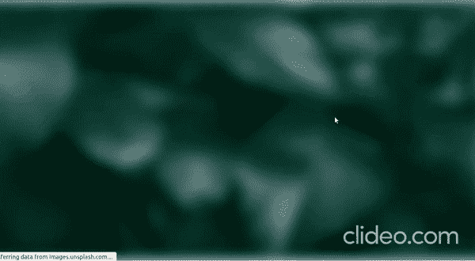

# 像 React 中的渐进图像加载一样的介质

> 原文：<https://javascript.plainenglish.io/medium-like-progressive-image-loading-in-react-eefa49f5c550?source=collection_archive---------3----------------------->



有没有注意到 Medium 平滑加载图像的方式提供了很好的用户体验。然而，只要对环境有一些基本的了解，这个看似令人愉快的动画在任何 React 项目中实现起来都非常容易和简单。这是我们最终的 [***组件***](https://www.npmjs.com/package/react-progress-loading) 的样子，这是它的 [***演示***](https://codesandbox.io/s/react-progress-loading-rcxhl?file=/src/Image.js) 。因此，不再拖延，让我们从理解如何实现这一点开始，然后实现代码来实现这一点。

# 理解这个想法

这里的想法很简单，可以通过以下步骤来解释:

1.  为了实现这个动画，我们需要同一个图像的两个实例(一个具有全分辨率，另一个通过改变像素降低到原始分辨率的 10%)。
2.  然后，在容器 div 中，我们将渲染这两个图像，并将原始图像的不透明度设置为 0，并使第二个图像最初填充整个容器，即，具有与原始图像相同的尺寸，但我们将在某种程度上模糊该图像，以实现最初的渐进加载。
3.  由于该图像的大小相当小，它将在很短的时间内加载，在连接良好的情况下几乎可以立即加载。
4.  现在，当这个原始图像完全加载时，即在其 onLoad()函数调用中，我们将做两件事:

*   将较小图像的不透明度逐渐降低到 0。
*   逐渐增加原始图像的不透明度到 1。

这就是我们需要做的！

# 实现渐进式图像加载

如果你已经跟进到这里，我想你已经有了一个基本的 React 应用程序设置。说到这里，让我们从在 src 文件夹中创建一个 components 文件夹开始。我将使用 scss 进行样式设计，但是您也可以使用普通 css 实现相同的功能，因此在 components 文件夹中创建一个 Image 文件夹，这是我们将要放置 Image 组件的位置，因此在其中创建两个文件，即: **Image.js** 和 **Image.module.scss** ，现在打开 **Image.js** 并粘贴以下代码片段。

现在我们已经完成了 JavaScript 部分的工作，加上一些样式，我们就可以开始了。所以现在打开 **Image.module.scss** 并将下面的代码片段粘贴到那里。

现在有了这些东西，我们的组件就可以使用了。

要在 **App.js** 中使用它，只需像这样渲染组件:

```
return(
    <Image 
        originalImageSrc={originalImageSrc} 
        smallImageSrc={smallImageSrc}  
    />
)
```

其中 originalImageSrc 是原始图像的源(路径), smallImageSrc 是小(调整大小后的)图像的源。

## 享受实验吧！

