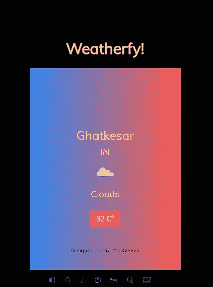
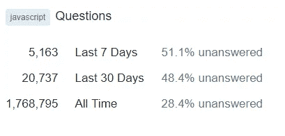

# 中等，StackOverflow &第 100 天代码挑战。

> 原文：<https://javascript.plainenglish.io/medium-stackoverflow-the-100daysofcode-challenge-55c725bd6278?source=collection_archive---------0----------------------->

# 它们是什么，为什么你也应该让它们成为一种习惯。

Photo by [Glen Noble](https://unsplash.com/@glennoble?utm_source=medium&utm_medium=referral) on [Unsplash](https://unsplash.com?utm_source=medium&utm_medium=referral)

几乎任何做过一点编程的人都知道 StackOverflow。这是一个天堂，在这里，如果你知道如何提问，你可以在一瞬间得到所有编程相关问题的解决方案。

100 天代码是一个在线编码挑战，旨在建立一个持续 100 天每天一小时的编码习惯。许多新手参与到这个挑战中，全身心地投入其中，最后他们得到的是几个已经完成的项目或者学习一门新的语言“框架”技术，从长远来看，这些都是有益的。最重要的是养成了一种习惯，你不能一天不写代码。

那么 StackOverflow 和 100DaysOfCode 是什么关系呢？在我看来这很简单。你在 StackOverflow 上连续 100 天写一个小时的代码🤔🤔🤔。

# 〽️edium

我的故事从这里开始。我在 2018 年完成了本科学业。在实习期间，我发现了 medium，并深深爱上了它。发现媒介对我来说就像打开了 1000 扇门，我可以选择任何我想走的路。它对每个人和每件事都有意义。灵媒成了我每天的例行公事。我一醒来就在看书，睡觉前，吃午饭时…你明白我想说的。但我的问题是，我知道我想做什么，只是不知道如何去做。其中，阅读越来越多的 JavaScript 及其相关技术是我的主要关注点。

仅仅在 medium 上呆了 2-3 个月，一个想法突然出现在我的脑海中，我应该自己写一些文章，这就是发生的事情。**坏主意！**我心想，前 4 篇自我发表的文章(*直到我读了《如何为 x 写作，成为 y 的一部分》*才知道出版物是如何运作的)在发表一周后集体观点为 3。L😂但这并没有让我失望，写作也没有停止。这并没有影响我，因为写作只是为了利用一些时间，而且是意料之中的。我也做好了同样的准备，但最终我从没想过自己会成为一名作家。大约在那个时候，在 twitter 上，我开始了解 twitter 上的 100 天挑战，并且毫不犹豫地加入了它。我不停地给媒体写文章，给出版社发了一些文章，但都被拒绝了。有些人很友好地回答道

> 我们不能接受你的文章，因为它不符合我们的标准，有些人甚至不在乎回复。

最终，在遭到多次拒绝后，我的一篇文章让我成为了 3 个出版物的作者，此后我继续毫无目的地发表文章，但它很好地帮助了我学习新主题，重温旧主题。一天早上，我收到一封意想不到的邮件，说我现在是标签技术领域的顶尖作家。起初我不相信自己，因为我只发表了 13 篇文章，但我还是坚持了下来，仅此而已。

# 💯DaysOfCode

Source: [https://www.instagram.com/_100DaysOfCode/](https://www.instagram.com/_100DaysOfCode/)

我仍在学习 JavaScript 的基本知识。JavaScript 不是我们像 Java 或 C++那样的常规编程语言。JavaScript 是一个完全不同的世界。在学习和使用它的时候，有数以百万计的新事物和新方法要记住。100DaysOfCode 的目标是那些想变得更擅长编码的人。它为个人创造了每天解决编码问题或学习新东西的习惯。如果它被认真对待，最终它是我们自己的利益。首先，你几乎每隔一天就会学习一些新东西，在 100 天结束时，即使你学习了大约 60 种解决问题的新技术/方法或 n 种新语言/框架，也会对你的职业生涯产生巨大影响。

Source: [http://www.keepcalmcoding.com](http://www.keepcalmcoding.com)

我从 freeCodeCamp 的 JavaScript 开始，养成了每天解决至少 10 个问题的习惯，不管我花多少时间去理解概念和解决相关的问题。FCC 有很好的资源，对于刚开始接触 Web 技术(特别是 JavaScript)的人来说是绝对必要的。当我完成 JavaScript &算法部分并获得证书后，我就开始做一些兼职项目。

创建你自己的兼职项目是实践你所学知识的好方法。我创建了许多小项目，其中一些是我自己创建的&一些是通过观看教程创建的。从 **n** 项目中，有 2 个脱颖而出。不是因为它们超级先进什么的，而是因为我在开发它们的过程中学到了很多。

首先是气象服务。它从一个免费的 API 获取天气数据，并根据你的位置显示数据。你也可以看到一周的天气预报，天气图标会根据天气变化。超级基础的东西，但它教会了我如何在服务器和客户端之间发送和接收数据的 ajax 调用，如何处理 JSON 数据，使用地理定位 API 检索您的当前位置等等。

第二个是网飞类型的流媒体服务，可以在局域网内播放电影和视频。许多新的技术和框架被用来制作它，如 Node.js，Express，PouchDB，jQuery。我学到了很多关于 HTTP 如何工作，我们如何创建数据块，即把大文件分成小数据块，这是流式传输所必须的，因为大小在几 GB 范围内的文件不能一次发送到客户端。由于项目的性质，我在 Node.js 中学到了很多关于文件处理的知识。项目需要我在客户端和服务器之间交换数据，但同样需要使用全新的方法。我还学习了如何在局域网上广播服务器，这样局域网上的所有用户都可以通过登录应用程序来加入。所有的用户信息都存储在数据库中，所以 NoSQL 数据库中的 CRUD 也被添加到列表中。

参与所有这些项目给了我很大的信心，因为我终于很好地掌握了 JavaScript 概念，而且我不再需要谷歌我的问题，因为我越来越有能力自己找到并解决它们。

除了 StackOverflow，我还加入了很多自由职业网站。我加入 StackOverflow 的目的是帮助刚开始编程的人，因为有时编程会很难。以上所有帮助我开始，但加入 StackOverflow 对我来说是一个游戏改变者，因为它帮助我在我已经知道的基础上更进一步，并在网站上发布的每个其他问题上学习一个新概念或技术。

# StackOverflow

Source: www.stackoverflow.com

> StackOverflow 拥有互联网上最好的开发者社区之一。

随着我开始熟悉 JavaScript 及其底层机制，我开始享受解决问题的乐趣，我观看了许多教程来了解越来越多的关于 JavaScript 的方式和内容。但问题是我觉得教程太慢了。此外，我跟随的所有教程都讲述了一两个技巧。在使用 JavaScript 相当长一段时间后，我学到的一件事是一个任务可以用 1000 种方法来完成。这是搬到 StackOverflow 的主要动机。

在撰写本文时，StackOverflow 仅在 JavaScript 上就有 **1，768，795** 个问题。这个数额是巨大的。所以我开始日以继夜地呆在网站上。从不提问，但关注其他用户提出的所有问题。有些是好的，有些是坏的，有些就在我头上弹来弹去。因此，我学到的第一件事是，关于 JS 有成千上万我不知道的事情，每回答一次，我就像**哇！可以这么用？从未想过。许多才华横溢、经验丰富的开发人员在几秒钟内就回答了问题。最初，我只是关注网站上的每个人如何回答，以及应该如何提问。对我来说，与其他来源相比，StackOverflow 在很多方面都很突出**

*   你得到 n 个用户对一个问题的个人看法。如果一个问题有 10 个答案，你可以保证其中的 8 个会有不同的独特的解决方法。
*   网站上大多数高声誉的用户要么是 JS 或相关技术书籍的作者，要么是专业人士。他们给出的答案很小，很快，而且大多是解决问题的最佳或推荐方法。
*   StackOverflow 有关于所有与编码相关的技术/语言/框架的信息，所以每个人都会有所收获。
*   **完全免费！**

当我开始回答问题时，我面临着许多其他答案的否决，因为有些答案是完全错误的，有些没有直接回答问题，或者直到我回答了别人已经张贴了相同的内容，我的就成了重复的。随着票数的下降，评论中出现了批评。好的一面是，批评是建设性的，即使是负面的评论，我也学会了正确的做法和我错在哪里。直到今天，我一有空就上网站。我试着每天至少花一个小时在这上面。我回答一些问题，几乎每天都有一个**到**的时刻。

# 最后…

我就是这样熟悉了自己选择的语言。到目前为止，它对我来说工作得很好，我知道这在将来也会对我有所帮助，因为编码和开发世界是不断变化和发展的。对我有效的方法可能对你无效，因为每个人都有不同的学习曲线或他们自己喜欢的完成工作的方式。这是对我有用的，我想和大家分享。

如果你喜欢这个，一定要在下面留下评论！