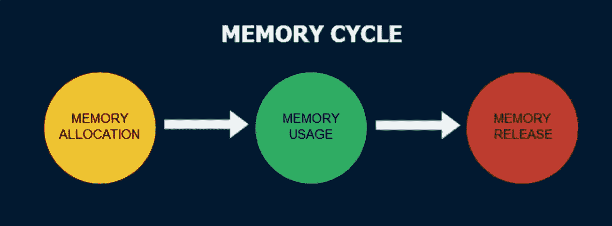
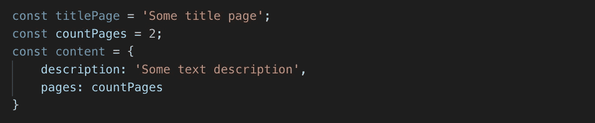
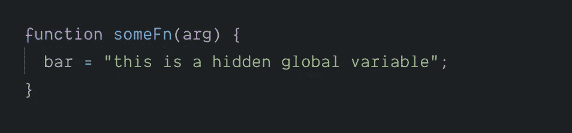
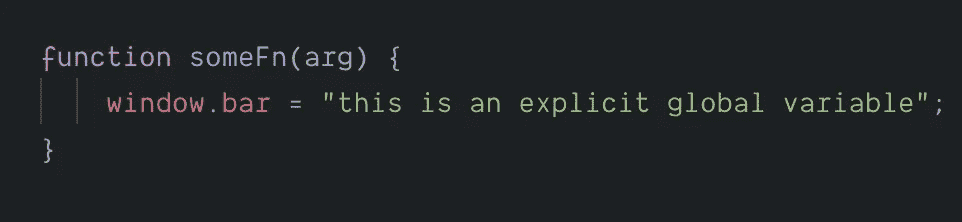
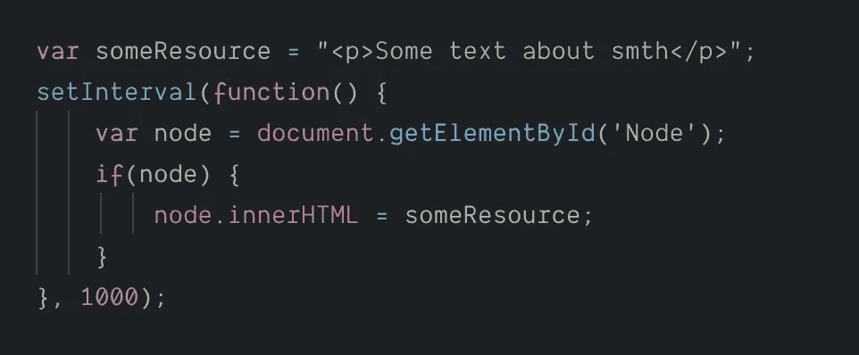
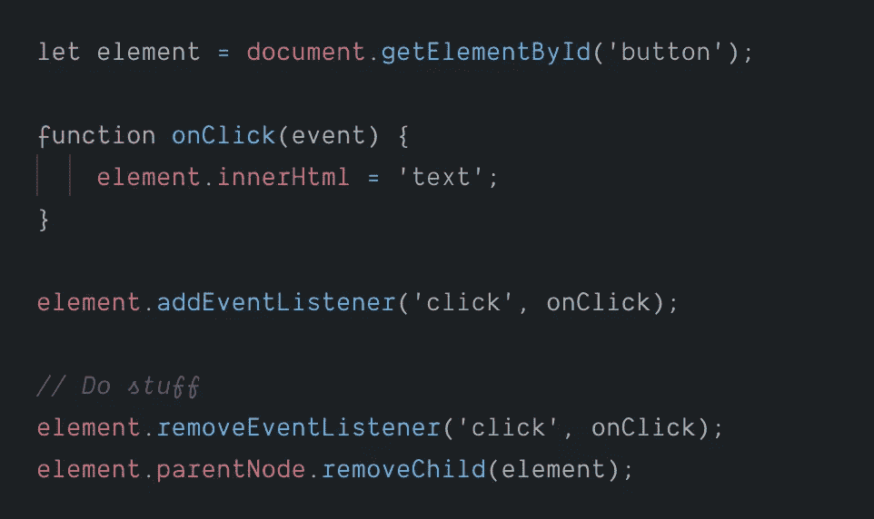
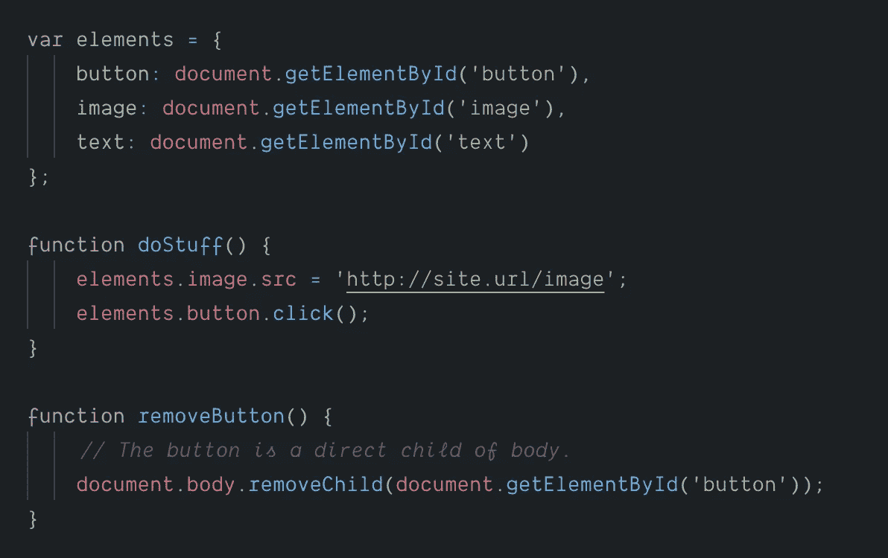

# JavaScript 中的🧠内存泄漏和垃圾收集🗑️。

> 原文：<https://javascript.plainenglish.io/memory-leaks-and-garbage-collection-%EF%B8%8F-in-javascript-you-need-to-know-this-3fa8173e8b3c?source=collection_archive---------1----------------------->

## 你应该知道这个

内存泄漏是每个开发人员最终都要面对的问题。

# 什么是内存泄漏？

本质上，内存泄漏可以定义为应用程序不再需要的内存，由于某种原因，这些内存没有返回到操作系统或空闲内存池。

> 当然，您可以选择不同的内存管理方式，这些方式可能会减少内存泄漏的机会。
> 
> 但是，某块内存是否闲置，其实是一个不可判定的问题。

# Javascript 中的内存管理和内存生命周期👇

我们定义了各种原语、对象、函数等。在我们的节目中。当我们这样做时，JavaScript 引擎会在设备的主内存中为它们分配一个空间。不同的浏览器有不同的技术来管理它们的数据。

**内存生命周期**在 ***高级语言*** 中，我们只会显式地读写内存(使用内存)。在 ***低级语言*** 中，所有三个步骤开发者都需要明确地照顾到。

✅ **给变量分配内存。**

✅ **使用已定义的变量。**

✅ **把它们从记忆中删除。**

> 我们之所以在学习任何编程语言时都需要理解内存管理的概念，是为了防止内存泄漏。
> 
> 在任何程序中，内存泄漏都可能导致几个问题， ***包括执行缓慢、程序崩溃、*** (处理数据时的大延迟)等。
> 
> 💡管理内存最重要的任务是检测程序中未使用的变量，并将它们从内存中移除。

当声明变量时，Javascript 会自动为变量分配内存

define various primitives

当不再需要该内存时，分配的内存将被释放。内存泄漏和大多数与内存相关的问题都是在释放内存时出现的。最难的部分是找到不再需要的内存，并由**垃圾收集器**找到。

# 垃圾收集工👇

> 垃圾收集语言中泄漏的主要原因是不需要的引用。" via[@ auth 0](http://twitter.com/auth0)[http://auth 0 . com/blog/four-types-of-leaks-in-your-JavaScript-code-and-how-to-get-off-them/](http://auth0.com/blog/four-types-of-leaks-in-your-javascript-code-and-how-to-get-rid-of-them/)

JavaScript 使用垃圾收集器来决定一段代码是否需要内存。大多数垃圾收集器使用一种叫做 ***标记-清除*** 的算法。

简单来说，算法“*”由以下步骤组成:*

*1️⃣ **垃圾收集器建立了一个“根”列表。***

*根通常是全局变量，对它的引用保存在代码中。**窗口**对象始终存在，因此垃圾收集器可以认为它及其所有子对象始终存在(即 ***不是垃圾*** )。*

*2️⃣ **所有根都被检查并标记为活动。***

*所有的子节点也被递归地检查。从一个根 ***可以到达的一切都不被认为是垃圾*** 。*

*3️⃣ **所有没有被标记为活动的内存现在都被认为是垃圾。***

*收集器现在可以释放内存并将其返回给操作系统。*

> *现代垃圾收集器以不同的方式改进了这种算法，但本质是相同的:可到达的内存块被如此标记，其余的被视为垃圾。*

# *三种常见的 JavaScript 漏洞*

*👉**偶然的全局变量***

*JavaScript 允许的方式之一是它处理未声明变量的方式**:对未声明变量的引用会在全局对象中创建一个新变量。***

*在浏览器的情况下，全局对象是一个“**窗口**”。例如:*

**

*但是，事实上*

**

*如果`**bar**`应该只保存对`**someFn**`函数范围内的变量的引用，而您忘记了使用 var 来声明它，则会创建一个意外的全局变量。*

*为了防止这些错误发生，请在 JavaScript 文件的开头添加`'**use strict**';`。这使得解析 JavaScript 的模式更加严格，可以防止意外的全局变量。*

* [## 严格模式

### ECMAScript 5 中引入的 JavaScript 的严格模式是一种选择 JavaScript 的受限变体的方式，因此…

developer.mozilla.org](https://developer.mozilla.org/en-US/docs/Web/JavaScript/Reference/Strict_mode) 

👉**遗忘的回调或定时器**

setInterval 的使用在 JavaScript 中相当普遍。大多数库都提供了接受回调的观察器和其他工具。

下面的例子说明了悬空定时器会发生什么: ***引用不再需要的节点或数据的定时器。***

由`node`表示的对象将来可能会被移除，使得区间处理程序中的整个块变得不必要。然而，由于时间间隔仍处于活动状态，处理程序无法被收集(**需要停止时间间隔，这样才会发生**)。

如果不能收集间隔处理程序，也不能收集它的依赖项。这意味着，`someResource`可能存储了相当大的数据，也不能被收集。

**对于观察者**来说，重要的是一旦不再需要它们，就要明确地调用来移除它们

像 *jQuery e.t.c* 这样的框架和库确实会在释放节点之前移除监听器。

这是由库内部处理的，确保不会产生泄漏，即使是在有问题的浏览器下运行，如🎃旧的网络浏览器。

👉**超出 DOM 引用范围**

有时，将 DOM 节点存储在数据结构中可能很有用。

假设您想要快速更新表中几行的内容。在字典或数组中存储对每个 DOM 行的引用可能是有意义的。

发生这种情况时，会保留对同一个 DOM 元素的两个引用:一个在 DOM 树中，另一个在字典中。

**如果将来您决定删除这些行，您需要使这两个引用都不可访问。*** 

*如果你喜欢这篇文章，请在社交媒体上与你的开发者朋友分享。*

**

# *推荐阅读*

* [## 理解使用垃圾收集的 JavaScript 内存管理

### 内存管理的主要目标是为系统提供动态分配的内存

medium.com](https://medium.com/front-end-weekly/understanding-javascript-memory-management-using-garbage-collection-35ed4954a67f)  [## JavaScript 垃圾收集——用图表和例子解开它

### 对于那些想要掌握任何编程语言(包括 JavaScript)的人来说，垃圾收集是必不可少的

数据-天赋.培训](https://data-flair.training/blogs/javascript-garbage-collection/)  [## JavaScript 中的 4 种内存泄漏类型以及如何消除它们

### 在本文中，我们将探讨客户端 JavaScript 代码中常见的内存泄漏类型。我们还将学习如何…

auth0.com](https://auth0.com/blog/four-types-of-leaks-in-your-javascript-code-and-how-to-get-rid-of-them/)  [## 标记和清除:垃圾收集算法

### 所有动态创建的对象(在 C++和 Java 中使用 new)都在堆中分配了内存。如果我们继续下去…

www.geeksforgeeks.org](https://www.geeksforgeeks.org/mark-and-sweep-garbage-collection-algorithm/)*