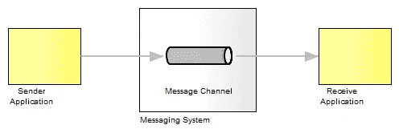
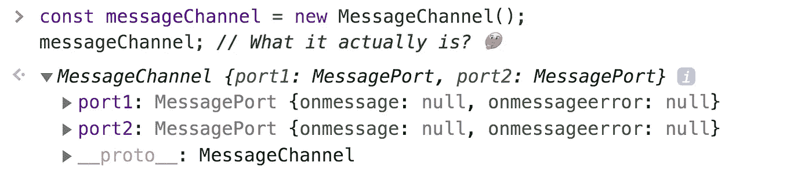
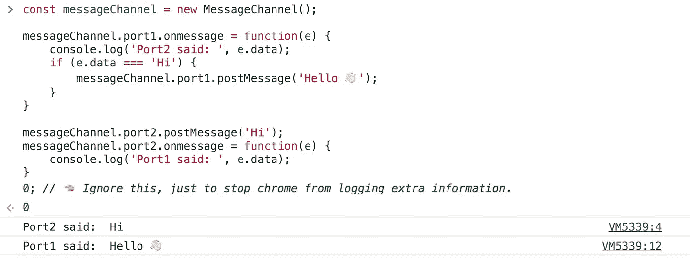
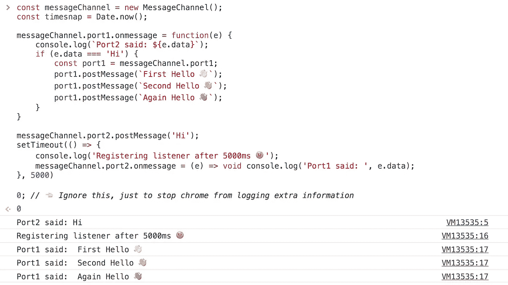
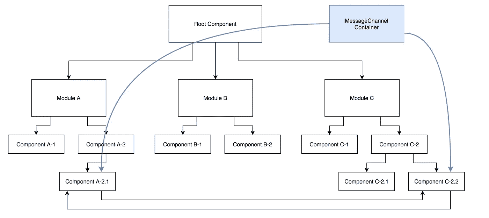
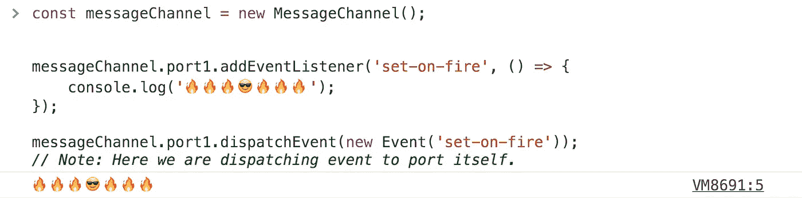

# 如何使用 MessageChannel 建立双向通信

> 原文：<https://javascript.plainenglish.io/message-channels-f94de3488b1a?source=collection_archive---------1----------------------->

## 释放 JavaScript 应用程序中未被充分利用的 MessageChannel WebAPI 的力量

消息通道是双方之间的通信媒介，双方通过它发送和接收消息。

在我们深入探讨如何在我们的 JavaScript 应用程序中使用 MessageChannel 之前，让我们看看它实际上做了什么，以及我们如何简单地使用它们(没有任何框架相关的代码)。当然，有很多例子，但我发现他们都使用旧的 iframe 示例，这不是 MessageChannel 唯一有用的地方。

> [通道消息 API](https://developer.mozilla.org/en-US/docs/Web/API/Channel_Messaging_API) 的`**MessageChannel**`接口允许我们创建一个新的消息通道，并通过它的两个`[MessagePort](https://developer.mozilla.org/en-US/docs/Web/API/MessagePort)`属性发送数据。
> 
> — Mozilla

因此，MessageChannel 是 WebAPI，它使我们能够在任意两个消费者之间建立消息传递通道。

A typical representation of a message channel used in apps

让我们建立第一个信息渠道。

消息通道意味着在两个消费者之间建立双向通信，我们可以看到 *messageChannel* 实例有两个端口，一些方法似乎有助于建立这种通信。我们在这里试图实现的是，我们是否可以在端口之间来回触发事件或数据。

我们做到了，我们刚刚成功地建造了(好吧，用一个已经建造好的🙄)双向通信信道。

嗯，在开始使用 *postMessage* 之前，我认为有几点是必须知道的。一个是不要像循环 JSON 那样传递不可序列化的数据。
其次， *MessageChannel* 有一个内置的缓冲区，这意味着如果接收者监听的时间晚于事件调度时间，消息也不会丢失。这可能很难理解，但下面的代码片段会有所帮助。

太酷了，不是吗？不是吗？好问题“在我们的 JavaScript 应用程序中，我们可以在架构的什么地方使用它？”

根据下面给出的图表，考虑一个场景，其中您希望单向或双向传递消息，但没有适当的钻探地狱。一个简洁的方法是:

隔离消息通道容器或文件，并在您想要使用的组件中使用您的消息通道，例如，在此图中，组件 A-2.1 和组件 C-2.2 之间建立了一个通信通道。
**注意:在通道实例的一个端口上，只能注册一个 *onmessage* 监听器方法。**

很好，但是如果我们想将一个事件发送到端口本身，而不是将一个消息发送到其他端口，该怎么办呢？我们甚至可以这样做，因为 *MessageChannel* 是基于[**event target API**](https://developer.mozilla.org/en-US/docs/Web/API/Event/target)**。**

在这一点上，我们知道了解这个 API 可以在很多方面帮助我们(不仅仅是 IFrames 或 Worker 类型)。
如果你关心 *postMessage* 频道的表现，我发现 [**这个博客**](https://surma.dev/things/is-postmessage-slow/) 确实不错。我希望你今天学到了一些东西。**干杯🍻**

## **用简单英语写的 JavaScript 笔记**

我们已经推出了三种新的出版物！请关注我们的新出版物:[**AI in Plain English**](https://medium.com/ai-in-plain-english)[**UX in Plain English**](https://medium.com/ux-in-plain-english)[**Python in Plain English**](https://medium.com/python-in-plain-english)**——谢谢，继续学习！**

**我们也一直有兴趣帮助推广高质量的内容。如果您有一篇文章想要提交给我们的任何出版物，请发送电子邮件至[**submissions @ plain English . io**](mailto:submissions@plainenglish.io)**，并附上您的 Medium 用户名，我们会将您添加为作者。另外，请让我们知道您想加入哪个/哪些出版物。****