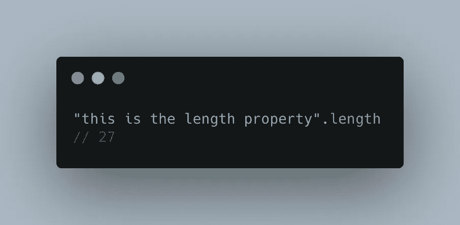
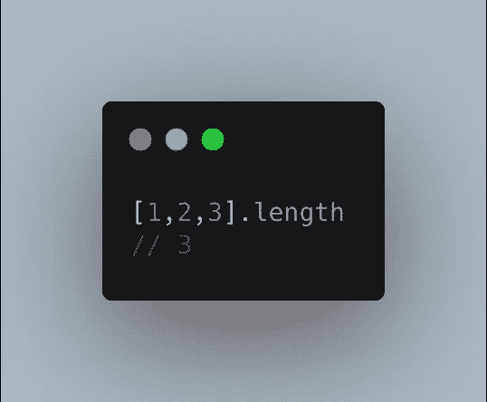
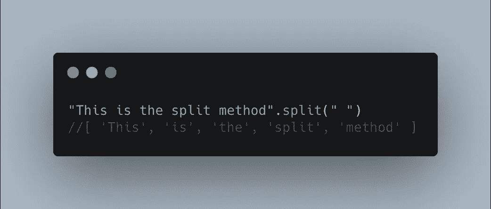

# JavaScript 中的方法和属性是什么？

> 原文：<https://javascript.plainenglish.io/methods-properties-in-javascript-bf4fe688d39e?source=collection_archive---------13----------------------->

## 特定值类型可以访问的行为和特征

Photo by [Markus Spiske](https://unsplash.com/@markusspiske?utm_source=unsplash&utm_medium=referral&utm_content=creditCopyText) on [Unsplash](/s/photos/javascript?utm_source=unsplash&utm_medium=referral&utm_content=creditCopyText)

# 介绍

在 JavaScript 中，几乎所有的数据类型都有方法和属性。方法和属性是特定值类型可以访问的行为或特征。您很可能在日常与 JS 的交互中遇到过方法或属性。

# 属性和方法

为了调用值的属性或方法，可以使用点运算符，后跟 property 或 method 关键字。您可能知道的两个常见方法和属性是`.length`和`.split()`。

属性和方法的区别在于方法需要括号和可选参数。另一方面，属性不需要括号或任何参数。方法和属性都返回一些值。

## 财产--。长度

.length with string

`.length`属性可以和上面例子中的字符串一起使用。

.length with array

它也可以用于数组。

如您所见，我们可以直接调用这两种数据类型的`.length`属性。

对于字符串值，`.length`将返回字符串中的字符数(包括空格)。在第一个例子中，有 27 个字符。对于数组，它返回数组中值的个数。我们不需要使用括号或者任何参数来使它工作。

## 方法--。拆分()

为了使用`.split()`方法，我们必须使用括号，并且我们可以选择传入一个参数。

我们使用带`split` 关键字的点运算符，我们将传入的参数是`“ ”`(空格)。如果您不熟悉`.split()`的工作方式，请查看 [MDN 文档](https://developer.mozilla.org/en-US/docs/Web/JavaScript/Reference/Global_Objects/String/split)。

在上面的例子中，我们希望在每一个有空白的地方分割字符串，并将值放回一个新的数组中。我们的返回值是:

`['This', 'is', 'the','split', 'method']`

# 结论

这就是 JavaScript 中方法和属性的工作方式。

## 以下是一些你可能知道的其他常用方法:

1.  `.indexOf()`
2.  `.slice()`
3.  `.splice()`
4.  `.includes()`

# 资源

[MDN](https://developer.mozilla.org/en-US/docs/Web/JavaScript/Reference/Global_Objects/String/split)

[MDN](https://developer.mozilla.org/en-US/docs/Web/JavaScript/Reference/Global_Objects/String/length)

[MDN](https://developer.mozilla.org/en-US/docs/Web/JavaScript/Reference/Global_Objects/Array/length)