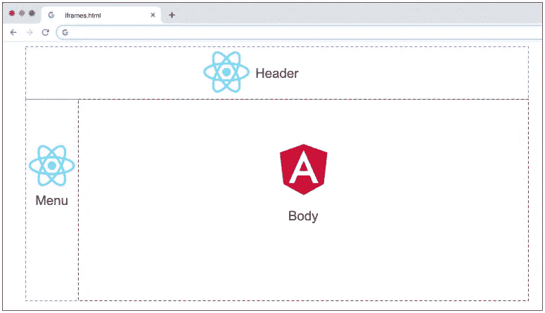
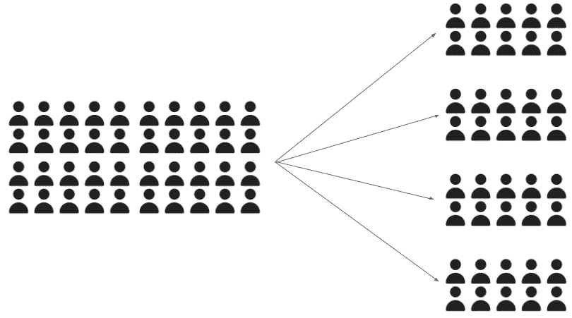
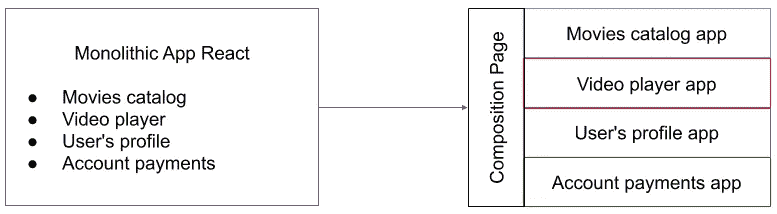
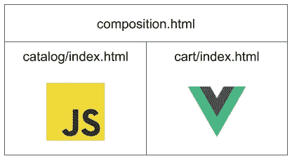
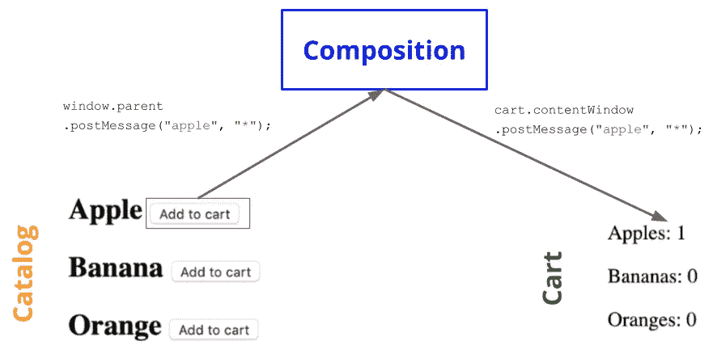

# 微型前端变得简单

> 原文：<https://javascript.plainenglish.io/micro-frontends-made-easy-e49acceea536?source=collection_archive---------1----------------------->

## 今天我们要用一种非常简单的方式来解释它，并用一个例子来说明如何使用它。

## 这是什么？(简答)

粗略地说，您只是将一个复杂的 web 应用程序拆分成较小的项目，然后用 iframes 将它们放在一个页面上。

Iframes 并不是唯一的方法。我们将展示最常用的解决方案。但是，现在，让我们探索一下为什么我们应该使用微前端。

## 为什么公司在使用它？

管理 10 个 10 人的项目比管理一个 100 人的大项目更容易。这里的关键概念是**可扩展性**。通过打破大项目，我们可以:

*   分离的储存库
*   独立部署
*   更快的构建和发布
*   自主团队
*   更容易调试和维护

## 按域划分应用程序

假设您正在为电影流创建一个复杂的 React 应用程序。你会有很多开发人员，但管理起来仍然很有挑战性。因此，您可以将应用程序分为四个主要领域:

*   **电影目录**
*   **视频播放器**
*   **用户资料**
*   **账户支付**

现在，您为每个域创建一个单独的 React 应用程序，并使用一些资源(如 iframes)来合成一个页面，将四个应用程序作为一个显示给用户。

如果您向**账户支付**添加新的支付方式，您只需重新部署其应用程序，而不是整个网站。

# 怎么做

## Iframes

最简单的开始方式。我们可以使用窗口`postMessage()`在应用程序之间进行通信。我们将在我们的例子中使用它。

## 单人水疗

这是一个在前端编写应用程序的框架。如果你今天需要开始一个现实生活中的项目，选择这个:
[single-spa.js.org](https://single-spa.js.org/)

## 弗林特

在前端编写应用程序的另一个框架。比单一水疗更灵活，但更新，更不受欢迎:
[frint.js.org](https://frint.js.org/)

## Web 组件

它不是一个框架，而是一个浏览器特性，也许是互联网的未来。这里有一篇关于它的文章:
[https://www.webcomponents.org/introduction](https://www.webcomponents.org/introduction)

## 泰勒

它使用了一种不同的方法，用 node.js 在后端编写路由页面。如果你喜欢这个想法，值得一试:
[https://github.com/zalando/tailor](https://github.com/zalando/tailor)

# 在 3 个文件中组成微前端

现在，我们将使用 3 个文件创建一个极简的微前端集成:

*   产品**目录**，一个用普通 javascript 做的微前端。
*   购物**购物车**，另一个用 Vue.js 创建的微前端。
*   **Composition** ，一个将两个 app 显示为一个页面的 html 文件。

主要的想法是在产品**目录**上放置水果，允许用户将水果添加到购物车**中**。`PostMessage()`是一种浏览器资源，我们可以通过它进行亲子交流。

好了，现在让我看看一些代码。

## composition.html

在第 13 行，我们将`cart` iframe 与一个常量相关联。在第 14 行，我们设置复合页面监听消息事件，然后将相同的消息重定向到`cart` iframe。

## 目录/索引. html

这里我们将所有按钮的点击与`addToCart`功能相关联。这将向父窗口(即合成页面)发送一条消息，其中包含目标的值，即水果名称。

## cart/index.html

最后，我们在 Vue.js 中的购物车。在`beforeMount()`上，我们设置了`cart`窗口来监听来自父节点的消息。根据水果名称，`add()`方法在`products`数据上加 1。

## Git 储存库

你可以在 GitHub 上查看这个项目。我们改进了消息处理，并用 bootstrap 添加了一些样式。

[https://github.com/andregardi/micro-frontends-iframe](https://github.com/andregardi/micro-frontends-iframe)