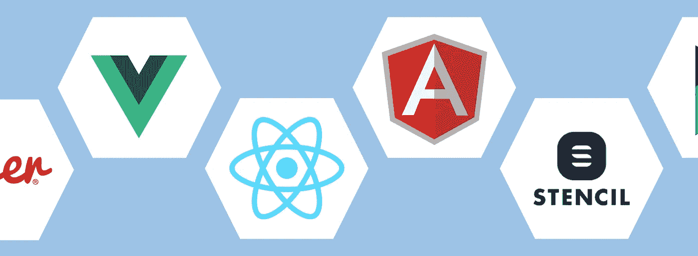
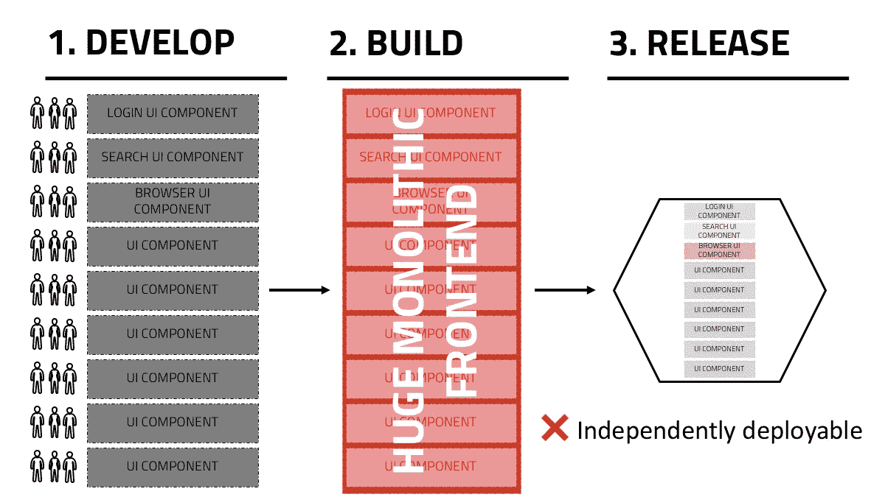
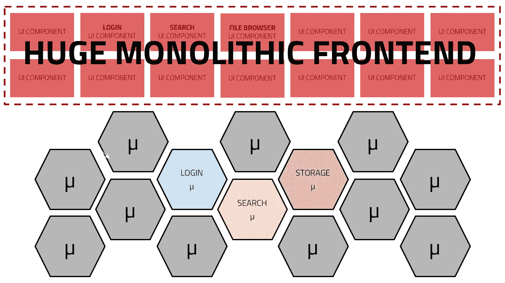
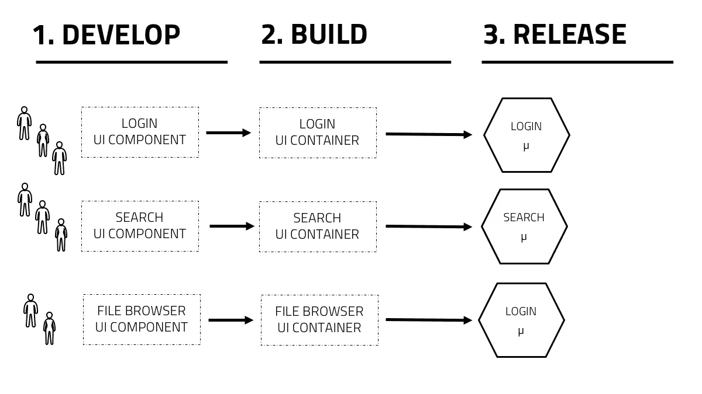
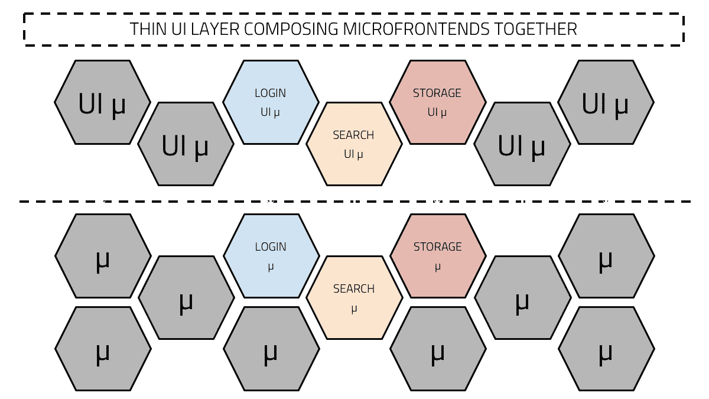

# 微前端——整合 JavaScript 框架(React、Angular、Vue 等)

> 原文：<https://javascript.plainenglish.io/microfrontends-bringing-javascript-frameworks-together-react-angular-vue-etc-5d401cb0072b?source=collection_archive---------0----------------------->

## *反应，角，Vue，余烬，骨干，模板，预反应…* 。事实上，现在可能又有一部正在上映！

像生活中的大多数事情一样，各种选择传达了一种有毒的文化*我的比你的好*和*你错了，我是对的*。

既然技术进步让我们陷入了这种困境，那么它有没有可能让我们摆脱困境呢？

*输入微前端…*

# 微前端简介

不管你的框架如何，现代的 UI 开发已经变成了关于**组件组合**的事情:你适应框架的*做事方式*通过遵循它们的模式和惯例来创建组件，这些组件通常由某种数据模型支撑，通常以服务或状态对象的形式。

*例如:* Angular 对如何在前端构建一切有强烈的看法。尽管 React 只处理组件，但它有一个由以 React 为中心的开发人员社区驱动的庞大生态系统。

微前端最近聚集了巨大的动力，因为它允许多个团队使用多个框架在单个 UI 上工作，但是它真的能改变 UI 开发的前景吗？

在本文中，我将花一些时间研究 SDLC(软件开发生命周期)以及采用这种架构的优势。

# 问题出在哪里？

UI 开发的当前趋势是使用选定的框架构建功能丰富且强大的浏览器应用程序(单页面应用程序)。

开发导致构建许多小组件，然后在某种构建过程中使用 webpack 或 rollup 之类的东西将这些组件捆绑在一起。

随着时间的推移，通常由单独或多个团队开发的 UI 层不断增长，变得越来越难以维护，从而创建了一个巨大的单片前端。

Monolithic frontend SDLC

Monolithic frontends deployment architecture

# 逆转微服务反模式:

Microfrontends 着眼于消除整体构建步骤，并产生可以独立构建和部署的完全解耦的服务:

Microfrontend SDLC

Microfrontend deployment architecture

现在我们的 UI 架构具备了传统微服务的所有品质:

*   高度可维护和可测试
*   松散耦合
*   可独立部署
*   围绕业务能力组织

# 这怎么能把大框架结合在一起呢？

由于我们已经将 UI 组件解耦到许多微前端中，我们不再需要指定每个组件使用哪个框架。

下图显示了我们如何*能够*潜在地让不同的应用团队使用不同的技术来创建他们独立构建和发布的微前端:

SDLC using multiple frameworks

有几种方法利用技术解决这个问题，但让我举一个例子:

1.  **开发:**三个团队为每个微前端使用不同的 JavaScript 框架
2.  **构建:**将他们的微前端组件包装成 ***web 组件*** 并将他们的项目构建成一个 JavaScript 文件
3.  **Release:** 在使用 Ngnix 的 docker 容器中发布一个 JavaScript 文件

一旦我们发布了我们的微前端，我们应该将它们组合在一个 UI 层中。微前端之间的通信应该由复合层来处理，复合层应该有一个明确定义的契约。

***免责声明:*******Web 组件*** *并不是解决这个问题的唯一方法，但是如果你想进一步探索这个问题，请查看本文:**

* [## 使用 Web 组件创建微前端(支持 Angular 和 React)

### 如果你是 React 或 Angular，Ember 或 Vue，让我们创建一个地方，让他们都可以生活在一起，在完美的和谐使用…

medium.com](https://medium.com/javascript-in-plain-english/create-micro-frontends-using-web-components-with-support-for-angular-and-react-2d6db18f557a)* **

*Deployment architecture using multiple frameworks*

*从用户的角度来看，他们访问单个应用程序，但是开发人员解决问题的能力不再受应用程序使用的单个框架的限制。*

*这可能是 Angular v React v Vue 的宗教辩论的结束吗？
我全部选择！*

> *感谢您花时间阅读我的文章。*