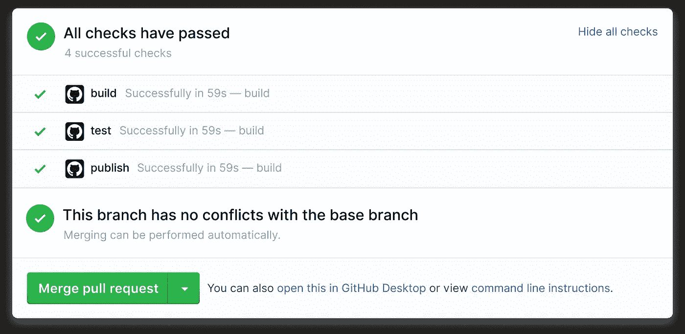

# 将 Travis CI 迁移到 Node.js 的 GitHub 操作

> 原文：<https://javascript.plainenglish.io/migrate-travis-ci-to-github-actions-for-node-js-4ab21e28d63c?source=collection_archive---------4----------------------->



[GitHub Actions](https://b.remarkabl.org/github-actions)

本文将介绍如何为 GitHub 上的 [Node.js](https://b.remarkabl.org/nodejs-site) 项目从 [Travis CI](https://b.remarkabl.org/travis-ci) 迁移到 [GitHub Actions](https://b.remarkabl.org/github-actions) 。

# 特拉维斯·CI

鉴于`.travis.yml`:

# GitHub 操作

首先制作目录`.github/workflows`:

```
mkdir -p .github/workflows/
```

创造`.github/workflows/build.yml`:

```
touch .github/workflows/build.yml
```

添加 Node.js 工作流:

工作流程受[模板](https://docs.github.com/en/free-pro-team@latest/actions/guides/building-and-testing-nodejs#starting-with-the-nodejs-workflow-template)的启发。

# 工作流程

下面是每个 YAML 场的作用分析。

## 名字

`[name](https://docs.github.com/en/free-pro-team@latest/actions/reference/workflow-syntax-for-github-actions#name)`是工作流名称。这是可选的，您可以随意命名:

## 在

`[on](https://docs.github.com/en/free-pro-team@latest/actions/reference/workflow-syntax-for-github-actions#on)`是触发工作流的事件。在我们的例子中，git `push`触发了我们的工作流。

添加`pull_request`事件:

这和:

# 工作

`[jobs](https://docs.github.com/en/free-pro-team@latest/actions/reference/workflow-syntax-for-github-actions#jobs)`是工作流运行的作业。在我们的示例中，我们有一个名为`build`的作业:

# 连续运行

`[runs-on](https://docs.github.com/en/free-pro-team@latest/actions/reference/workflow-syntax-for-github-actions#jobsjob_idruns-on)`是工作流运行的环境。要指定操作系统版本:

# 战略矩阵

`[strategy.matrix](https://docs.github.com/en/free-pro-team@latest/actions/reference/workflow-syntax-for-github-actions#jobsjob_idstrategymatrix)`是构建矩阵。在我们的示例中，我们正在为单节点版本运行一个作业。要为多个节点版本运行作业，请执行以下操作:

# 步伐

是一项工作的任务。在我们的例子中，我们使用 GitHub 动作:

*   [结账](https://github.com/marketplace/actions/checkout)
*   [设置 Node.js 环境](https://github.com/marketplace/actions/setup-node-js-environment)
*   [连体工作服 GitHub 动作](https://github.com/marketplace/actions/coveralls-github-action)

`actions/checkout`签出存储库，`actions/setup-node`设置节点环境:

`coverallsapp/github-action`发送覆盖报告给[工作服](https://coveralls.io/):

# 步骤.运行

`[steps.run](https://docs.github.com/en/free-pro-team@latest/actions/reference/workflow-syntax-for-github-actions#jobsjob_idstepsrun)`运行命令。这些命令可以是来自`package.json`的 [npm 脚本](https://docs.npmjs.com/cli/v6/commands/npm-run-script/)或其他 bash 命令:

`actions/setup-node@v2`安装`npm`、`npx`和`yarn`。`--if-present`选项仅在脚本存在时运行脚本。

# 包封/包围（动词 envelop 的简写）

`[env](https://docs.github.com/en/free-pro-team@latest/actions/reference/workflow-syntax-for-github-actions#jobsjob_idenv)`为整个工作流程或单个步骤设置环境变量。参见`[env](https://docs.github.com/en/free-pro-team@latest/actions/reference/workflow-syntax-for-github-actions#env)`和`[jobs.<job_id>.steps.env](https://docs.github.com/en/free-pro-team@latest/actions/reference/workflow-syntax-for-github-actions#jobsjob_idstepsenv)`。

虽然 [Travis CI 设置了默认的环境变量](https://docs.travis-ci.com/user/environment-variables/#default-environment-variables)，但是我们不需要为我们的工作设置`CI=true`，因为`actions/checkout@v2`已经为我们做了:

# 资源

*   [从 Travis CI 迁移到 GitHub 动作](https://docs.github.com/en/free-pro-team@latest/actions/learn-github-actions/migrating-from-travis-ci-to-github-actions)
*   [构建并测试 Node.js](https://docs.github.com/en/free-pro-team@latest/actions/guides/building-and-testing-nodejs)

[*本文原载于 2020 年 12 月 11 日《remarkablemark.org》。*](https://b.remarkabl.org/3mOZa7B)