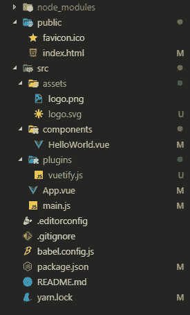
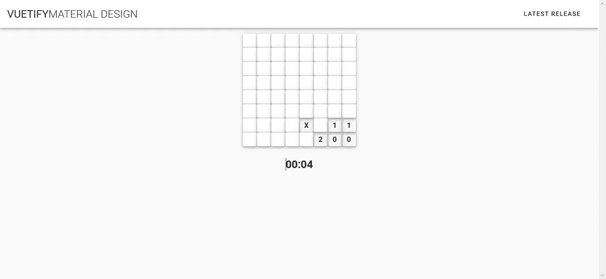
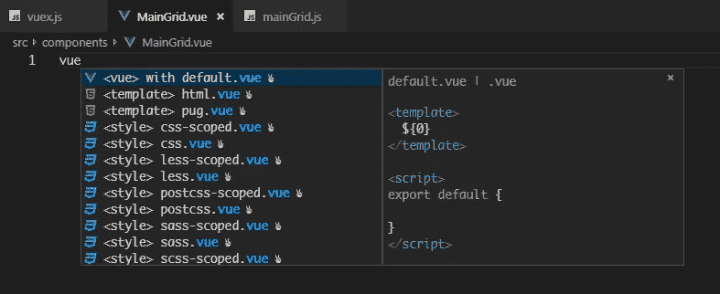
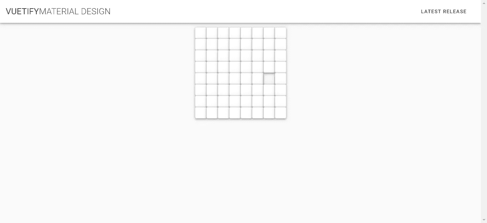
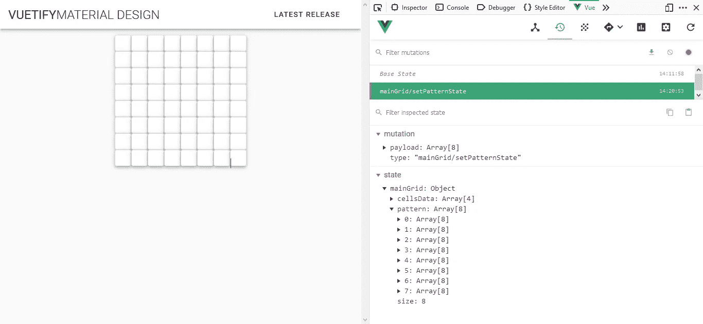
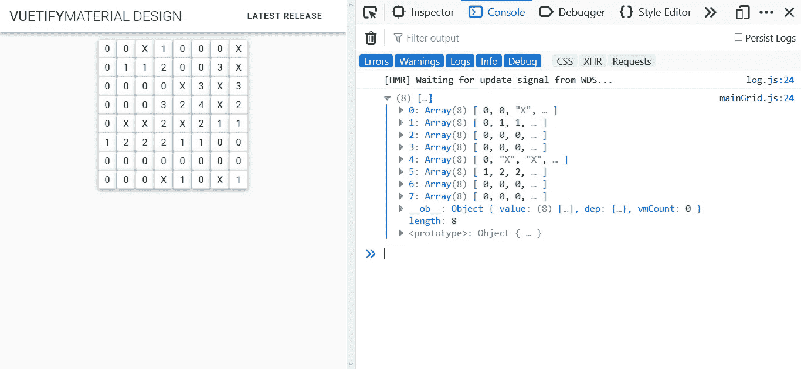

# 用 Vue 构建你自己的扫雷游戏

> 原文：<https://javascript.plainenglish.io/minesweeper-rebuild-with-vue-vuex-and-vuetify-ab1921e5258e?source=collection_archive---------2----------------------->

## 用 Vue、Vuex 和 Vuetify 构建经典游戏的克隆版！


编程的世界，尤其是前端工程今天似乎被框架的使用激活了。当然，目标是提高工作效率和时间效率。在过去的几个月里，我一直在做的一个框架是 [Vue](https://vuejs.org/) 。

# **简介**

为了提高我的编程知识，我决定在[这里](https://vuejsexamples.com/)搜索一些 Vue 项目的例子。然后，我发现了一个吸引人的项目要克隆，它就是扫雷。

因此，在这篇文章中，我将尝试显示和建立由 Vue CLI，Vuex 和 Vuetify 支持的扫雷应用程序。不是游戏的每一个细节，但我希望这一个能启发你。

# 内容

1.  扫雷怎么玩？
2.  为什么是 Vuex？
3.  为什么要 Vuetify？
4.  设置应用程序
5.  添加 Vuex
6.  添加 Vuetify
7.  应用程序的结构
8.  设置主网格组件
9.  设置主网格存储模块
10.  主网格:setPattern
11.  主网格:getPattern
12.  主网格:隐藏和显示单元格的数据
13.  主网格:洪水填充算法
14.  主网格:标记单元格
15.  设置定时器组件和存储模块
16.  定时器:设置定时器
17.  计时器:getTimer

# 1.扫雷怎么玩？

Oct 3, 2006 — Uploaded by Llamallover

用户将能够点击单元格，选择网格的大小，或重新开始游戏。如果用户点击了被炸的单元格，游戏就结束了。或者，用户可以通过右键单击单元格来标记它，如果他们认为这是一个被轰炸的单元格。如果玩家可以打开所有未被炸毁的房间，他们就赢得了游戏。

# 2.为什么是 Vuex？

因为我想建立一个有一些组件的应用程序，(为了可伸缩性和效率)，维护每个组件的状态是相当困难的。Vuex 之所以如此强大，是因为组件从 Vuex 存储中获取它们的状态，并可以在存储状态发生变化时快速有效地进行更新。

# 3.为什么要 Vuetify？

Vuetify 是一个基于 Vue 环境的材质设计框架。它有体面和微妙的用户界面组件，并在 Vue 上随时可用。

# 4.设置应用程序

Vue 提供了名为 Vue CLI 的标准开发工具。它可以通过一个简单的命令轻松设置应用程序。

```
vue create minesweeper-vue
```

如果您的电脑中没有安装 Vue CLI，请将其作为全局软件包安装。

```
npm install -g @vue/cli
# OR
yarn global add @vue/cli
```

# 5.添加 Vuex

正如已经讨论过的，我使用 Vuex 作为我们应用程序的商店管理模式。简单键入

```
yarn add vuex
# OR
npm install vuex
```

# 6.添加 Vuetify



它与 Vuex 略有不同，因为我是通过 Vue CLI 设置 Vuetify 的。我可以通过键入以下内容将 Vuetify 添加到应用程序中

```
vue add vuetify
```

安装后，我们的根应用程序结构将如左图所示。

# 7.应用程序的结构

我用两个组件构建了这个应用程序:

*   主网格组件
*   计时器组件

由内部含有`v-card`的硫化材料`v-hover`制成的主要栅格部件。然后把`v-hover`裹在里面`v-row.`

计时器组件包含关于用户玩游戏花费的时间的信息。当玩家第一次点击单元格时，它会被实时更新。



# 8.设置主网格组件

首先，您可以从`components`文件夹中删除`HelloWorld.vue`，因为它不会被使用。然后，你必须创建新的组件，例如`MainGrid.vue`。

> 温馨提示:
> 使用 VSCode IntelliSense 加载 Vue 模板更快



现在，我想建立主网格，有“多维数组”一样，其中有相同的行和列数。在这个例子中，应用程序使用 8 作为行和列。为此，我可以使用来自 Vuetify 的`v-row`和`v-col`。为了增加悬停效果，我用了`v-hover`。

将`MainGrid.vue`注册到`App.vue`上的组件

要查看网格的结果，您可以运行命令

```
yarn run serve
```

现在，我们的应用程序看起来像这样:



# 9.设置主网格存储模块

我使用 Vuex 作为我们应用程序的状态管理。首先，我为主网格设置了状态管理。

1.  *创建*文件夹`*store*`文件夹*内*文件夹`*src*`文件夹*文件夹*
2.  在这个应用程序中，我使用模块系统。因此，我创建了名为 `*vuex.js*` *的文件，该文件将 Vuex 注册到应用程序中，并导出 Vuex 存储本身中的模块。*
3.  *创建文件夹* `*modules*`
4.  *创建文件* `*mainGrid.js*` *来配置它自己的* `*getters*` *、* `*state*` *、* `*actions*` *和* `*mutations.*`
5.  *包括我们的* `*vuex.js*` *到我们的入口点文件，通常是* `*main.js*`

# 10.主网格:setPattern

主网格组件依赖于一些状态。首先，我需要为我们的主网格设置网格模式。所以，我知道如何在每个单元格内随机放置数字和炸弹。

为了创建模式，声明**状态，动作，**和**突变**用于在存储中设置模式。

那么，如何初始化组件来设置模式呢？我用的是 Vuex 的`map`。`map`将商店连接到组件，然后异步启动 set 模式。

第一步是使用析构赋值从 Vuex 导入`mapActions`。并将`setPattern`动作分配给组件的方法。

如你所见，当组件进入*创建的*生命周期钩子时，我执行`setPattern`。在*创建的*钩子中，你将能够访问反应性的*数据*和*事件*是活动的，但是模板和虚拟 DOM 还没有被挂载或者渲染。

要检查模式，您可以在 Vue devtools 上轻松检查。



# 11.主网格:getPattern

在创建了模式之后，模板必须与商店进行通信。因此，模板可以呈现从存储区传来的模式。可以使用 Vuex 的`mapGetters`来完成。

首先，将`getters`和名为`getPattern`的创建方法添加到我们的主网格存储中，并将其包含在导出对象中。

像以前一样，使用析构赋值从 Vuex 导入`mapGetters`，并将`getPattern`动作分配给组件的计算属性。

映射后，使用*上的`*getPattern*` 计算出的*属性作为组件的数据源。您可以通过将每次迭代放入`v-card`文本来显示每个单元格数据。

现在，我们的应用程序看起来像这样



# 12.主网格:隐藏和显示单元格的数据

我们需要考虑如何打开一个通过左键点击关闭的单元格。首先要做是在每个单元格中设置一个表示为“关闭”状态的状态，并在我们左键单击单元格时更改该状态。

将`show`键添加到之前创建的单元格中，并修改一些代码以保持单元格的数据被定义。

接下来，用 Vue 条件渲染“隐藏”单元格的数据`v-if`。为了显示单元格的数据，分配名为`openCell`的方法并传递单元格的`row_idx`和`col_idx`。

在存储中添加`openCell`方法处理程序。将其放入*动作*属性，然后将单元格目标传递给*突变*属性。我必须传递给*突变*，因为我想改变`pattern`状态。只有*突变*属性才允许这样做。

试试看。

让我们再次感谢 Vue 的反应。你已经恋爱了吗？

# 13.主网格:洪水填充算法

Flood fill 是一种算法，主要用于确定连接到多维数组中给定节点的有界区域。它与绘画程序中的桶工具非常相似。

在这种情况下，我使用洪水填充算法来寻找连接的细胞有" 0 "值，并显示它。当指定的单元格被点击时，这种递归开始。为此，需要注意以下几点:

1.  仅在覆盖的单元上操作
2.  仅在电网范围内运行
3.  查找相邻单元格的数量
4.  如果有，显示编号的单元格(大于 0)
5.  如果不是，显示一个空白单元格(0)并继续递归
6.  如果单元格已经显示，则跳过显示过程
7.  如果单元格已编号或者单元格位于数组末尾，则停止递归

我在`openCell`方法中添加了一些条件语句来处理递归。首先，如果递归到达数组末尾，就停止递归。第二个是处理单元的数据是否等于“0”或已被泄露。

接下来是在*动作*属性中定义`floodFill`方法。在方法内部，我显示单元格的数据并再次调用`openCell`方法，但是传递不同的行和列索引。我用四个方向打电话，北，西，东，南。

# 14.标记单元格

在扫雷游戏中，如果我们通过右键点击它来假设它是一个炸弹，那么这个单元可以被标记。有一些事情需要注意:

1.  如果已经显示，则不能标记该单元格
2.  在单元格中放置标志图标
3.  如果标记了单元格，则无法打开该单元格，除非再次右键单击该单元格取消标记

在组件文件中，插入用于处理单元格属性的右键单击的方法。我使用了阻止处理程序来阻止右击对话框的显示。

然后，通过从存储映射右键单击处理程序，将其注册到组件的方法。

在主网格存储模块中，我做了三个部分:

1.  `flag`在 state 属性上按键，将旗帜图标注册到网络上。
2.  *上的`flag`属性获取*以获取标志图标并与组件交流状态。
3.  `flagged`在图案中的每个单元格属性上按键。我这样做是因为这个类似于`show`键，它使用布尔值来由组件进行反应渲染。
4.  如果单元格被标记，则`openCell`方法中要跳过的条件语句。

最后，将组件配置为当用户右键单击单元格时显示标志。

# 15.设置定时器组件和存储模块

这就像通常的计时器，计时是基于秒的。当用户点击单元格时，计时器将开始计时。步骤与主网格几乎相同:

1.  创建文件组件，例如 *Timer.vue*
2.  导入组件，添加到 *App.vue* 注册的组件中，并在`<main-grid>`标签下记下自定义标签
3.  创建定时器存储模块文件，例如 *timer.js*
4.  导入模块并添加到 Vuex store 的模块中的 *vuex.js* 文件中

# 16.定时器:设置定时器

如果所有的要素都已设置好，下一步就是制作一个触发器来启动计时器。时间以秒为单位计时，每当用户单击单元格时，时间就会开始计时。这可以通过设置一个状态作为计时器的“主控件”来告诉何时开始计时来实现。它可以作为新的状态属性放在主网格存储中。

为了能够改变状态，我还在*突变*属性上添加了一个突变。从这段代码中，我们知道当用户第一次点击时,`timerInit`状态属性将以毫秒为单位变成当前时间。我设置初始时间，因为我想计算初始时间和实际时间之间的差异。

计时器值实际上是在我之前创建的计时器存储中处理的。让我们在计时器存储中创建*状态*属性，以接受小时、分钟和秒的值；还创建基于毫秒的时间划分。

在*动作*属性上，我添加了`setInterval`方法来处理定时器初始化。

对于`setTimer`动作，只要主网格存储上的`timerInit`状态被设置为当前时间值，它就会工作。我在之前的解释中设置了如果用户点击单元格`timerInit`会发生变异。

为了在商店之间进行连接，我使用了 Vuex 的 *rootState* 属性。它为所有在 app initiation 中注册的 Vuex 模块提供服务。那么可以简单地使用点符号或括号符号来访问主网格存储。

下一步是每当计时器计时时处理小时、分钟和秒钟；然后通过*突变*在*状态*属性中设置这些值。因此，我们的 *timer.js* 存储文件将如下所示:

您可以在 Vue devtools 上的 *Vuex* 条菜单中检查定时器状态的变化。

然后通过将`setTimer`动作添加到定时器组件中，将其连接到应用程序，并放置在*创建的*钩子中。

# 17.计时器:getTimer

为了获得时间值，我使用了 *getters* 属性。时间由小时、分钟和秒状态组成。首先，我们通过使用 getter 分别获得每个小时、分钟和秒的值。我还添加了秒和分钟的条件返回值，如果这些值低于 10，则返回两位数。

然后使用`mapGetters`将时间获取器映射到定时器组件上

# 就在那里！

我希望你喜欢跟随。如果你喜欢这个内容，并想进一步讨论，请留下你的掌声和评论！

你可以在游戏中加入一些额外的功能:

1.  每当用户点击炸弹时，停止计时器并弹出通知
2.  给数字和炸弹一些风格
3.  重启按钮
4.  网格大小选择
5.  关于地雷的信息留下了。当用户在单元格上放置一个标志时，它可以减少，反之亦然

我也做了一些有特色的扫雷舰。你可以看看，我非常欢迎反馈！

GitHub:[https://github.com/naufaliqbal/minesweeper-vue](https://github.com/naufaliqbal/minesweeper-vue)

领英:[https://www.linkedin.com/in/muhamad-iqbal-naufal/](https://www.linkedin.com/in/muhamad-iqbal-naufal/)