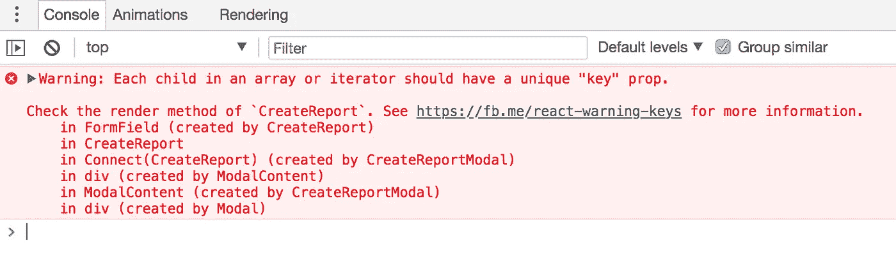

# 反应中容易犯的错误

> 原文：<https://javascript.plainenglish.io/mistakes-to-avoid-in-react-development-42db9788a5aa?source=collection_archive---------12----------------------->

## 以及如何避免犯这些错误


Photo by [Estée Janssens](https://unsplash.com/@esteejanssens?utm_source=medium&utm_medium=referral) on [Unsplash](https://unsplash.com?utm_source=medium&utm_medium=referral)

如果你是一个探索反应堆的新手，那么你来对地方了。作为初学者，我们会遇到很多错误和警告。这些常见的错误可以帮助你更好地了解 reactjs。我想分享一下我学习反应堆的经历和我从中学到的东西。这篇文章一定会帮助你梳理关于 ReactJs 的概念

> “从错误中吸取教训是件好事。最好从别人的错误中吸取教训”——沃伦·巴菲特

1.  **直接修改状态:**
    

react 中的状态被认为是不可变的，所以不应该在状态中直接改变。我们应该使用方法调用 setState()来更新状态。

问题是状态的直接更新不会反映 UI 中的变化，因为状态是用相同的引用更新的，所以不会触发重新渲染。

```
// Correct
this.setState({comment: 'Hello'});
```

使用贴图或展开对象不改变项目原始状态。

```
// Managing old state also *this.setState({…this.state, name: “Test”})*
```

2.**不使用列表组件上的键:**



大多数 react 初学者会跳过这个警告，但是你不应该。要提高 React 应用程序的性能，密钥是必不可少的。关键字有助于识别哪些项目已经更改、添加或删除。应该给数组内部的元素赋予键，以给元素一个稳定的标识。

```
const numbers = [1, 2, 3, 4, 5];
const listItems = numbers.map((number,index) =>
  <li key={index}>    {number}
  </li>
);
```

# 在哪些情况下使用索引作为键是安全的？

1.  如果你的列表是静态的，不会改变。
2.  该列表将永远不会重新排序。
3.  将不筛选列表(从列表中添加/删除项目)。
4.  列表上的项目没有 id。

如果所有这些例外都符合条件，那么就可以使用索引作为键。

如果项的顺序可能改变，Reactjs 不建议对键使用索引。这可能会对性能产生负面影响，并可能导致组件状态出现问题。查看 Robin Pokorny 的文章，深入了解使用索引作为关键字的负面影响。

3.**忘记 setState 是异步的**

另一个常见的错误是试图在设置状态值后立即访问它。

```
handleChange = count => {
      this.setState({ count });
      this.props.callback(this.state.count); // Old state value
    };
```

设置新值不会立即发生，通常会在下一次可用渲染时完成，或者可以批处理以优化性能。因此，在设置状态值后访问它可能不会反映最新的更新。这个问题可以通过对`setState`使用可选的第二个参数来解决，这是一个回调函数，在状态用其最新值更新后调用。

```
handleChange = count => {
      this.setState({ count }, () => {
        this.props.callback(this.state.count); // Updated state value
      });
    };
```

4.**不使用道具类型**

我经常在应用程序中看到不正确的数据类型。

例如，假设您想通过 props 将数字 2 传递给另一个组件。通常，你会看到它是这样做的:

```
<MyComponent value="2" />
```

这会将值 2 作为字符串而不是数字发送给`MyComponent`。要以数字形式发送，请这样写:

```
<MyComponent value={2}/>
```

通过[道具类型包](http://npmjs.com/package/prop-types)定义类型是确保你发送正确道具的最可靠方式。

属性类型用于记录传递给组件的预期属性类型。React 将根据这些定义检查传递给组件的属性，如果不匹配，将在开发中发出警告。

你可以在这里了解更多道具类型[。](https://github.com/facebook/prop-types)

5.**不使用助手类或函数。**

这是大多数开发人员常犯的错误。就像可重用组件一样，我们的应用程序中也有可重用的功能。

该功能通常是在组件到组件的基础上硬编码的，这导致了相似组件之间的低效和不一致的行为。

所有容器组件都包含获取资源、将其保存到状态和管理错误的逻辑。

大多数情况下，这种行为在不同的容器组件中是相同的，但是如果编写不当，可能会表现得不一致。

6.**使用 Redux 或 Flux 管理所有应用程序状态**

在更大的 react 应用中，你应该使用 redux 来维护全局状态。但是大部分初学者都会跳过。

但是，不建议在应用程序的每个状态中使用 redux。

Redux 在开始时可能很难理解，但是它会让你的组件很容易地共享状态。所以会让你的开发变得容易。

7.**不使用 React 和 Redux 开发工具**

应用程序总会在一段时间后出现问题。调试通常是一项繁重的工作，因为大多数时候会涉及到许多组件。

使用 [React 开发工具](https://chrome.google.com/webstore/detail/react-developer-tools/fmkadmapgofadopljbjfkapdkoienihi?hl=en)，您可以检查 React 元素的渲染树，这对于查看各种组件如何构建页面非常有用。

[Redux dev tools](https://chrome.google.com/webstore/detail/redux-devtools/lmhkpmbekcpmknklioeibfkpmmfibljd?hl=en) 还附带了许多功能，让您可以看到已经发生的每个操作，查看这些操作导致的状态变化，并返回到特定操作发生之前。

您可以添加 React 开发工具作为开发依赖项或浏览器扩展。使用它们将节省您大量的开发时间。

# 结论

在本文中，我们讨论了我们在 react 开发中经常犯的错误。

你有任何提示或常见错误来分享，放弃回应和任何与文章相关的建议，因为这是我的第一篇文章，所以任何建议都可以让我的下一篇文章更好。

## **用简单英语写的 JavaScript 笔记**

我们已经推出了三种新的出版物！请关注我们的新出版物: [**AI in Plain English**](https://medium.com/ai-in-plain-english) ，[**UX in Plain English**](https://medium.com/ux-in-plain-english)，[**Python in Plain English**](https://medium.com/python-in-plain-english)**——谢谢，继续学习！**

**我们也一直有兴趣帮助推广高质量的内容。如果您有一篇文章想要提交给我们的任何出版物，请发送电子邮件至[**submissions @ plain English . io**](mailto:submissions@plainenglish.io)**，使用您的 Medium 用户名，我们会将您添加为作者。另外，请让我们知道您想加入哪个/哪些出版物。****