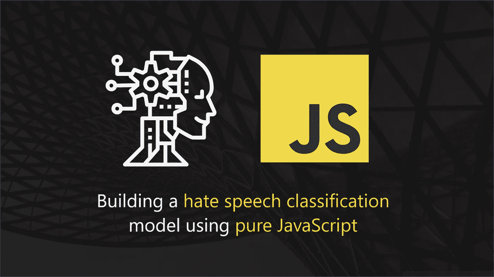

# 10 分钟内 JavaScript 开发人员的机器学习

> 原文：<https://javascript.plainenglish.io/ml-for-js-devs-in-10-minutes-46794782762e?source=collection_archive---------0----------------------->



*本文旨在向 JavaScript 开发人员介绍并教授不到 10 分钟的机器学习:*

*   *之前没有 ML 的经验。*
*   *对学习 ML 感兴趣但害怕它的复杂性*
*   *对学习 ML 感兴趣但是害怕 Python、Anaconda、Jupyter 笔记本。*
*   *对使用纯 JavaScript 构建 ML 驱动的 API 感兴趣*
*   *对仅使用两个 JavaScript 文件构建 ML 模型感兴趣！*

如果你能把自己归入这些类别，去[下载这个文件夹](https://github.com/allanchua101/serverless-ninja/tree/master/006-ai-apis/001-classifiers)，它可以在下面的资源库中找到:

[](https://github.com/allanchua101/serverless-ninja/tree/master/006-ai-apis/001-classifiers) [## allancha 101/无服务器-忍者

### 本节包含使用以下技术的仇恨言论分类的简单实现

github.com](https://github.com/allanchua101/serverless-ninja/tree/master/006-ai-apis/001-classifiers) 

# 机器学习

对于大多数人来说，机器学习听起来很可怕，也很花哨。我总是喜欢将它描述为训练计算机软件如何处理特定情况的能力，而无需为它可能做出的每一个决策排列编码。

将机器学习融入您的软件使您的组织能够:

*   自动化传统的**决策制定**由人工完成的工作量
*   **通过工作负载自动化降低**运营成本
*   使员工能够**更快地完成任务**

现在你知道了什么是 ML，是时候开始做脏活了，训练你的第一个 ML 模型。

# 问题陈述

2019 年是我们开始看到聊天机器人应用成为竞争数字平台之间的差异化资产的一年。它使组织能够处理更多的客户查询，即使是在员工休息或休假的时候！

然而，聊天机器人应用程序遇到的一个常见攻击是发送仇恨言论和攻击性语言的垃圾邮件。

微软的自我学习机器人 Tay 是这种攻击中最受欢迎的受害者。发布 16 个小时就被关闭了！

如果将**仇恨言论/攻击性语言分类**应用于用于训练 Tay 的数据，那么 tay 就可以避免收到仇恨信息。

我们的 ML 模型可能是一个解决方案！

你猜对了！我们将在机器学习领域建立一个原型用例；它是一个文本分类器，预测给定文本是否:

*   仇恨言论
*   攻击性的语言
*   也不

# 我们从哪里获得数据？

训练最大似然模型需要大量的数据，但不需要太多！我建议您不要构建自己的数据集，除非您的用例特定于某个特定的上下文，因为它需要大量的时间和人力来执行、编译和清理数据！

对于这个示例，我从下面的 awesome 存储库中借用了一个数据集！非常感谢 t-davison 编译了这个数据集！。

[](https://github.com/t-davidson/hate-speech-and-offensive-language) [## t-Davidson/仇恨言论和攻击性语言

### 托马斯戴维森，达纳沃姆斯利，迈克尔梅西和英格玛韦伯的仓库。2017.“自动化仇恨言论检测…

github.com](https://github.com/t-davidson/hate-speech-and-offensive-language) 

# 训练模型

是时候开始训练我们的分类模型了！我将把用于训练这个模型的脚本文件分解成更小的块，以温和地描述每个步骤的目的。基本上，可以在下面的代码中看到训练过程的总结版本:

为了简洁起见，培训脚本的某些部分被省略了。原始文件可以在 [Github](https://github.com/allanchua101/serverless-ninja/blob/master/006-ai-apis/001-classifiers/natural-js/naive-bayes/001_train.js) 上找到

A simplified view of the entire [source code](https://github.com/allanchua101/serverless-ninja/blob/master/006-ai-apis/001-classifiers/natural-js/naive-bayes/001_train.js) which you can download from Github

你们可能会骂我 ATM 浪费时间在这个简单、简短又无聊的 JavaScript 文件上。好吧，让我弥补一下！为了解释整个过程，让我们把它分解成更小的部分！

# 利用自然 JS 访问朴素贝叶斯

为了向 JavaScript 开发人员教授机器学习，我使用了一个名为 [Natural](https://github.com/NaturalNode/natural) 的 JS 框架。这个框架包含一个预构建的算法，允许您使用非常简单的 JavaScript APIs 来执行文本分类。

```
const natural = require("natural");let classifier = new natural.BayesClassifier();
```

# 加载数据

为了训练 ML 模型，我们必须向它输入数据，我们可以通过使用下面的代码利用 [**csvtojson**](https://www.npmjs.com/package/csvtojson) 库从磁盘加载 CSV 文件来实现这一点:

A concise view of data-loading related code

# 预处理数据集

为了提供一组更好的人类可读的标签，我们将每行的数字标签(0，1，2)转换为人类可读的标签(“仇恨言论”、“攻击性语言”和“都不是”)。

Code related to data-preprocessing where we assign human-readable labels.

# 将权重保留在磁盘上

为了避免每次我们需要预测/分类传入消息时都需要重新训练模型，我们必须将模型执行其工作所需的维度的权重持久存储到磁盘，以便重新加载:

Persisting models to the disk help you speed-up the utilization of machine learning models in their inference applications.

# 评估准确性

最终，大多数企业主感兴趣的是结果，而不是你的模型训练技术有多棒。在 ML 领域，模型是由产品负责人根据它的工作表现来评判的！在我们的例子中，将仇恨文本从非仇恨文本中分类出来。

为了评估准确性，我们将不得不从前面的部分重新加载我们冻结在磁盘中的模型，并使用它来分类训练数据集！这使我们能够对分类模型的表现进行数据驱动的测量。

我已经编写了一个[脚本，可以在 Github](https://github.com/allanchua101/serverless-ninja/blob/master/006-ai-apis/001-classifiers/natural-js/naive-bayes/002_evaluate.js) 中访问它来对我们的模型进行评估。查看下面的代码片段:

Accuracy and error rate calculations

# 结果

```
Correctly Predicted Items: 17,706 out of 24,783 (71.44)
False Classifications: 7,077 out of 24,783 (28.56)
```

我们的模型能够正确分类代表总训练人口的 71.44% 的 **17k 个项目！不是 90%+但是嘿！这意味着我们可以正确地预测大量的工作量，而这些工作量是人类以前必须手动完成的！**

如果我是一个企业主，我的工程师告诉我，我可以用 JavaScript 在浏览器上屏蔽掉我的聊天机器人处理的 71%的恶意信息，再加上他在 10 分钟内就完成了这个任务，我应该为^_^感到骄傲

# 摆弄我们的分类器

下面是您可以用来测试冻结模型的代码。就像我之前提到的，由于缺乏数据，它并不完美！请随意替换下面的输入字符串来试试吧！

通过摆弄 Github 的这个脚本，您可以做的另一件很酷的事情是，您可以继续区分朴素贝叶斯和逻辑回归算法的准确性！

Code used for fiddling and testing the classifier!

# 处理错误分类

错误的分类会以你只能想象的不同和怪异的方式伤害组织！优雅地管理错误分类是我们可以长期讨论的另一个大话题。为了快速结束本文，这里列出了处理错误分类的常用方法:

*   添加一个阈值来防止执行低置信度分类！
*   将低置信度的分类卸载给人类(这并不太糟糕，因为我们的目标是减少人类的干预，而不是将它们全部解雇！).
*   对误报进行手动重新分类。
*   使用不同的算法构建额外的模型，并将预测合并到选举系统中，在该系统中，获得最多票数的类别/标签将作为结果呈现(我将很快写一篇文章来解释这一点！)
*   收集所有错误的分类，并使用它们来重新训练增强的模型，以使模型熟悉看不见的数据集。

如果您对重新分类感兴趣，我已经写了一篇文章，解释了如何使用 AWS、Lambda 函数、Slack API 和 NodeJS 向 Slack 发送通知。

这是一个完美的基线，告诉人们如何(实时)对你的 ML 模型做出的预测进行重新分类！

[](https://medium.com/@ac052790/serverless-ninja-part-02-reporting-errors-via-chatops-using-aws-lambda-nodejs-8d56dccadc9b) [## 使用 AWS Lambda & NodeJS 通过 ChatOps 报告错误

### 本文解释了如何使用 Slack、ChatOps、Lambda 和 NodeJS 添加实时通知

medium.com](https://medium.com/@ac052790/serverless-ninja-part-02-reporting-errors-via-chatops-using-aws-lambda-nodejs-8d56dccadc9b) 

# 有没有一个模型可以提供“100%”的准确性？

是的，我称他为上帝！！玩笑归玩笑(请不要像我全心全意爱上帝一样评判我)，100%的准确率好得不像真的！甚至人类也会犯错！***Le problème vient de la configuration des données****(法语中我典型的责备关键词)。*

*好的 ML 工程师不会 100%的追求和过度训练他们的模型！您的模型具有极高的准确性，这通常表明模型偏向于以前看到的数据，并且将屈服于新的文本形式和变体，您将不得不在未来对其进行分类。*

# *感谢您的阅读*

*我希望你们喜欢阅读我的文章，并找到一份涉及机器学习的工作！数字化转型给我们带来了前几代人从未见过的激动人心的能力！如果我至少可以影响人们成为机器学习工程师并驾驭数字化转型浪潮，我会很高兴！*

*我将撰写[文章](https://medium.com/@ac052790/deploying-natural-js-inference-model-to-aws-lambda-ff2f9719b5d0)，讲述如何将这种 ML 模型(以及其他变体)注入 Lambda 函数中，使组织能够运行 ML 模型而无需花费太多资金！*

## *第 2 部分:将其部署到 AWS Lambda！*

*你想知道如何操作这个 ML 模型吗？给下面的文章一个机会，你将了解为什么机器学习模型更好地驻留在 API 中！*

*[](https://medium.com/javascript-in-plain-english/deploying-natural-js-inference-model-to-aws-lambda-ff2f9719b5d0) [## 将自然 JS 推理模型部署到 AWS Lambda

### 一个全面的指南，解释了如何使用自然 JS 训练推理模型可以部署到一个关键保护…

medium.com](https://medium.com/javascript-in-plain-english/deploying-natural-js-inference-model-to-aws-lambda-ff2f9719b5d0) 

## 我写的文章多了！

[](https://itnext.io/serverless-ninja-part-01-serverless-efficiency-64cf77915838) [## 无服务器忍者第 1 部分:无服务器=效率

### 本文旨在解释组织和个人如何从无服务器的高效率中获益…

itnext.io](https://itnext.io/serverless-ninja-part-01-serverless-efficiency-64cf77915838) [](https://medium.com/javascript-in-plain-english/route-management-frameworks-for-aws-lambda-and-node-js-ab685aeec839) [## AWS Lambda 和 Node JS 的路由管理框架

### NodeJS 开发人员在构建无服务器 API 时可以利用的路由管理框架的综合列表…

medium.com](https://medium.com/javascript-in-plain-english/route-management-frameworks-for-aws-lambda-and-node-js-ab685aeec839) [](https://medium.com/javascript-in-plain-english/the-pros-and-cons-of-aws-serverless-express-789996e4be32) [## AWS 无服务器快递的利与弊

### serverless-express 是一个基于 NodeJS 的 API 框架，用于模拟 express 框架的路由功能…

medium.com](https://medium.com/javascript-in-plain-english/the-pros-and-cons-of-aws-serverless-express-789996e4be32)*