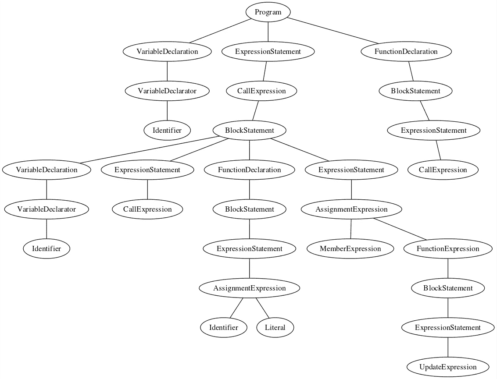

# 使用 ASTs 修改 Web 应用程序

> 原文：<https://javascript.plainenglish.io/modding-web-apps-with-asts-5a7ac7d1f65d?source=collection_archive---------5----------------------->

# 动机

我正在做一个前端项目，这个项目有很多贡献者，编码风格被放错了地方。这意味着不同的开发人员编写不同的模式。随着项目的增长，不同的 JavaScript 文件暴露了不同的类和模块(不使用模块导出:(只是为了清楚起见)很难识别哪个文件依赖于另一个文件。这意味着调试和修复代码气味具有挑战性。更不用说循环依赖地狱了。就像用枪一样，我需要一个瞄准镜来更好地瞄准虫子。

[*这里的*](https://github.com/divyamamgai/skope/tree/master/article#developing-better-code-using-asts) *是这篇文章的降价版。*

# 开发范围计算器

我们将使用抽象语法树(或简称 AST)来获取关于我们的代码的信息，我们可以很容易地分析这些信息。我不会在这里详细讨论 AST，因为[这篇](https://medium.com/basecs/leveling-up-ones-parsing-game-with-asts-d7a6fc2400ff)文章已经很好地介绍了它，所以请仔细阅读。很好地总结一下，然后继续前进，不要太深入-

> *AST 仅包含与分析源文本相关的信息，并跳过解析文本时使用的任何其他额外内容。*

为了给我们的 JavaScript 文件构建这样一个 AST，我们将使用 [acorn](https://github.com/acornjs/acorn) (它是一个 JavaScript 解析器)和 [acorn-walk](https://github.com/acornjs/acorn/tree/master/acorn-walk) (一个语法树，通过 acorn，walker 生成)。让我们举一个(写得很差的)JavaScript (ES5)代码的例子。

在我们开始开发一个检测声明的逻辑之前，让我们列出我们所期望的结果声明。

1.  变量`a`和函数`f()`在全局范围内声明。
2.  根据定义，变量`d`是一个全局变量，因为我们省略了`var`关键字。
3.  `window`对象的函数属性`e()`在浏览器中本来就是一个全局标识符。

因此，对于我们的代码片段，我们期望声明为`a`、`f`、`d`和`e`(对于这个例子，我们保持简单，不要分离函数和变量)，它们被暴露给其他可能使用或包含的代码片段。

要使用 acorn 生成 AST，首先我们需要从文件中读取 JavaScript 代码。解析器返回一个由 [ESTree spec](https://github.com/estree/estree) 指定的 AST 对象，这是一个类型为`Program`的节点，其主体包含根据代码片段定义的连续类型节点。

为了可视化生成的树，我写了一个[脚本](https://gist.github.com/divyamamgai/396a4424cd1b04ac415bc4ec72b087e4)，它创建了树的一个 [SVG](https://raw.githubusercontent.com/divyamamgai/skope/master/article/images/fileGraph.svg?sanitize=true) 文件(不包括一些节点)，附在下面。我建议通过控制台日志记录或调试节点来获得更多信息，目前，这只是一个简单的例子，只显示了节点的`type`。

Visualization of the sample code in form of AST

现在，我们可以使用 Acorn AST walker 以多种方式遍历生成的树，如这里的[所述](https://github.com/acornjs/acorn/tree/master/acorn-walk#interface)，在继续前进之前，请花时间阅读这些方法。我们将使用`ancestor`遍历器，它对一棵树进行`simple`遍历，构建一个祖先节点数组(包括当前节点),并将结果数组作为第二个参数传递给回调函数。

您可以将回调与每个节点类型相关联。只要遍历器到达一个特定的节点，它就用`node`和它的`ancestors`作为参数为该节点触发回调。

## 获取 JavaScript 中标识符的范围

在 JavaScript 中，标识符的作用范围是功能性的(考虑到 ES5 的语法，并将复杂性保持在最低限度)。因此，如果我们想得到任何标识符节点的作用域，我们只需要冒泡到它的祖先节点，直到我们到达一个函数节点(`[FunctionExpression](https://github.com/estree/estree/blob/master/es5.md#functionexpression)`或`[FunctionDeclaration](https://github.com/estree/estree/blob/master/es5.md#functiondeclaration)`),如果我们这样做了，这将使它成为本地的或函数作用域。否则，如果我们到达`[Program](https://github.com/estree/estree/blob/master/es5.md#programs)`节点，那么它就是全球范围的。让我们创建一个简单的存根，它接受一个标识符的祖先节点数组，并将该标识符的范围返回为- `Program|FunctionExpression|FunctionDeclaration`节点。

## 全球范围内的直接声明

要知道变量或函数声明是否直接在全局范围内完成，使用我们的图作为基础，很明显我们需要检测声明节点的直接父节点是否是`Program`节点。为了做到这一点，我们将使用`[VariableDeclarator](https://github.com/estree/estree/blob/master/es5.md#variabledeclarator)`和`FunctionDeclaration`回调(因为它将给我们的标识符命名为`node.id.name`)与祖先 walker。我们将使用`getScope`存根获取节点的范围，并将范围节点类型与`Program`进行比较，如果是，我们将其推送到`globalDeclarations`列表。

当我们执行上面的代码(用我们的`[sample.js](https://gist.github.com/divyamamgai/93c1b55e7c38faa6f28e10df555da862)`)时，我们期望输出是`a`和`f`。

## 全局范围内的间接声明

标识符可以在全局范围内间接声明，甚至可以从功能块中声明。我们将专注于两种可以实现的方法-

1.  在`window`对象中创建标识符的属性。
2.  在声明(或分配)标识符时省略`var`关键字。

为了检测上述两种情况，我们将使用`[AssignmentExpression](https://github.com/estree/estree/blob/master/es5.md#assignmentexpression)`节点，因为在这两种情况下都执行赋值。`AssignmentExpression`节点有两个子节点- `left`和`right`。

## 案例 1

对于案例#1，我们必须检查`AssignmentExpression`的`left`节点是否是`window`对象的`[MemberExpression](https://github.com/estree/estree/blob/master/es5.md#memberexpression)`。一个`MemberExpression`访问一个对象的成员或属性(例如`window.location`)。因此，在`AssignmentExpression`的上下文中，我们正在访问`window`对象的指定键，并为其赋值。

在我们继续之前，让我们编写一个简单的实用程序`getName()`来从`MemberExpression`节点获取一个可读的名称。在一个`MemberExpression`节点中，我们有两个属性- `object`和`property`。`object`将是一个`[Identifier](https://github.com/estree/estree/blob/master/es5.md#identifier)`，而`property`将是`Identifier|MemberExpression`，因此我们将需要递归调用该实用程序，直到我们到达一个`Identifier`节点，其名称可以使用`name`属性来检索。

我们必须使用祖先步行者的`AssignmentExpression`回调。调用我们的实用程序`getName(node.left)`来获取名称，检查左侧节点的类型是否为`MemberExpression`，名称的格式是否为- `window.identifier`。如果是，那么`identifier`就是一个全局变量。

当我们执行上面的代码(用我们的`[sample.js](https://gist.github.com/divyamamgai/93c1b55e7c38faa6f28e10df555da862)`)时，我们期望输出是`e`。

## 案例 2

对于第二种情况，情况会有点复杂。检测关键字`var`是否被省略的一个简单方法如下。

1.  捕获给定代码片段中的所有声明。
2.  捕获给定代码片段中对非函数参数标识符的所有赋值。
3.  过滤掉所有具有相应声明的捕获的标识符分配。

在前面的章节中，我们已经看到了如何捕获声明。让我们看看如何捕捉标识符的赋值，特别是非函数参数的。我们所说的“非功能参数”是什么意思？本质上，我们可以在不使用`var`关键字的情况下为函数参数重新赋值。对于这些参数，没有对应的声明，因此我们必须事先排除它们。

为了检测是否正在对一个函数参数赋值，我们可以利用我们的`getScope(node)`实用程序来获取正在赋值的函数的范围。为了保持复杂性最小，让我们考虑在嵌套函数中没有对父函数的参数进行赋值(为了检测这一点，我们可以转换我们的`getScope(node)`实用程序来返回一个作用域数组，然后我们可以迭代所有嵌套的作用域来识别这样的函数参数)。我们只需要检查这个标识符是否属于[函数](https://github.com/estree/estree/blob/master/es5.md#functions)的`params`数组。如果任务是在全局(或`Program`)范围内完成的，我们可以直接将它包含在我们的任务列表中。

当我们执行上面的代码(用我们的`[sample.js](https://gist.github.com/divyamamgai/93c1b55e7c38faa6f28e10df555da862)`)时，我们期望输出是`d`。

## 拼凑起来

将前几节中提到的所有内容放在一起，我们可以得到在给定的 JavaScript 代码片段中做出的所有全局声明(做了一些假设)。

当我们执行上面的代码(用我们的`[sample.js](https://gist.github.com/divyamamgai/93c1b55e7c38faa6f28e10df555da862)`)时，我们期望输出是`a`、`d`、`e`和`f`。

## 我们解决方案的局限性

如果你是一个敏锐的观察者，并且一直在自己进行实验，你可能已经注意到我们当前的解决方案有一些明显的局限性。以下是其中的一些限制。

1.  未使用的函数中的声明也在考虑之列。
2.  不考虑对`window`对象的引用。
3.  父函数的函数参数不排除在赋值之外。

这些限制是可以解决的，但是对于 AST 的介绍以及可以用它做什么来说，解决方案会变得更加复杂。

# 使用范围信息

使用我们刚刚创建的方便的小插件，我们可以生成许多关于代码的有用见解和信息。

## 检测和消除循环依赖

循环依赖对你的代码库没有好处。在这种情况下，两个模块相互依赖，因此你不能确定哪个模块应该先加载。使用 Tarjan 的强连通分量算法，您可以检测依赖图中的循环，然后努力消除它们。

## 模块的包含顺序

在我们的实用程序生成的模块依赖图上使用拓扑排序，我们可以得到理想情况下应该包含的模块的顺序。唯一的警告是拓扑排序只对有向非循环图有效，你需要从你的代码库中删除所有的循环依赖来获得这些信息。

# 抽象语法树的力量

使用 ASTs 可以实现很多目标。他们可以帮助你执行关键的代码分析，比如计算出你的代码库的圈复杂度 T2，让它在 T4 的控制之下。ASTs 的另一个有趣的用途是[代码修改](https://www.toptal.com/javascript/write-code-to-rewrite-your-code)，有了它，你基本上可以重新编写你的代码，以符合更新的[框架](https://github.com/reactjs/react-codemod)或特定语言的标准，而不需要任何开发人员的努力。您已经看到了本文中概述的一种用法，它有助于弄清楚前导入和导出时代的遗留 JavaScript 之间的依赖关系。在你的开发中，这项技术总有一个空间来简化这个过程，你只需要把它弄清楚。