# 9 个现代实用的 JavaScript 代码片段

> 原文：<https://javascript.plainenglish.io/modern-practical-javascript-code-snippets-4002a7a4ba9c?source=collection_archive---------6----------------------->

## 2020 年如何更快更好的做编码


Photo by [Eugene Shelestov](https://www.pexels.com/es-es/@bocman?utm_content=attributionCopyText&utm_medium=referral&utm_source=pexels) en [Pexels](https://www.pexels.com/es-es/foto/calor-fuego-hora-llama-33930/?utm_content=attributionCopyText&utm_medium=referral&utm_source=pexels)

本文向您展示了如何通过编写更少的代码和更直接地使用该语言的最新特性来解决日常的 JavaScript 任务。

有十个小窍门，你可以毫无困难地在代码的任何部分使用。

我们开始吧

# 索引

1.  同时变换和过滤一个数组。
2.  获取并重试。
3.  递归 setTimeout。
4.  通过析构从数组中获取字段和长度。
5.  反转字符串。
6.  清除数组。
7.  修剪数组。
8.  扩展数组。
9.  从对象创建数组。

# 1.同时变换和过滤一个数组

我们可以分两步使用 *map* ()和 *filter()* 方法来转换和过滤一个数组，但是为什么我们不一步完成转换和过滤呢？

分两步用*滤镜*()和*贴图*():

```
let anArrray= [ 0, 1, 2, 3, 4, 5, 6, 7, 8, 9, 10];let by2= anArrray
  .filter( (n) => n >= 5 )
  .map( (n) => n  * 2);
```

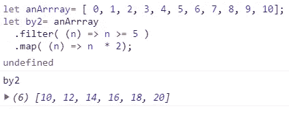

Result in the google chrome console.

与 f *latmap* ():

```
let anArrray= [ 0, 1, 2, 3, 4, 5, 6, 7, 8, 9, 10];let by2= anArrray.flatMap( (n) => n >=5 ? [ n * 2 ] : [] );
```

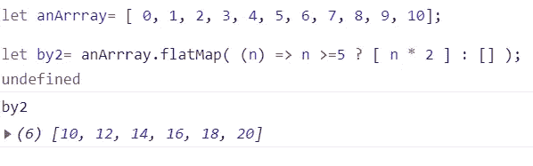

Result in the google chrome console.

# 2.获取并重试

我们可以使用 ES6 *Fetch* 方法从服务器恢复数据，但是有时候，服务器或者网络会宕机，我们会收不到正确的答案。例如，服务器可能因为繁忙而失败。在这种情况下，我们可以重试呼叫。

## 使用承诺:

```
fetch("/someUrl/json").then( function handleResponse (response) {
  if (response === 200) {
    return response;
  } else {
    fetch("/some/json").then(handleResponse);
  }
  catch (err{
    console.error(err);
  }
});
```

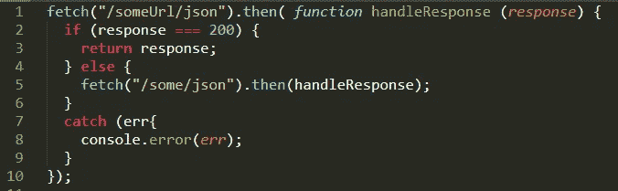

Code image for small screens.

## 使用循环和 ES7 异步等待

n:重试次数

```
const fetch_retry = async (url, options, n) => {
    let error;
    for (let i = 0; i < n; i++) {

        try {
            response = await fetch(url, options);
            if (response === 200) {
               return response;
            }else{
               throw new Error(response)
            }
        } catch (err) {
           error = err;     
           //1\.           
           if (i + 1 === n) throw err;
        }
    }
    throw error;
};let response = fetch_retry("/someUrl/json", options, 10);
```


Code image for small screens.

1.  如果达到重试次数，我们将触发一个错误。

## 使用递归和 ES7 异步等待

n:重试次数

```
const fetch_retry = async (url, options, n) => {
    try {
       response = await fetch(url, options);
       if (response === 200) {
         return response;
       }else{
         throw new Error(response)
       }
    } catch(err) {
      //.1      
      if (n === 1) throw err;

      //2.
      response = await fetch_retry(url, options, n - 1);
      if (response === 200) {
         return response;
      }else{
         throw new Error(response)
      }
    }
};
let response = fetch_retry("/someUrl/json", options, 10);
```

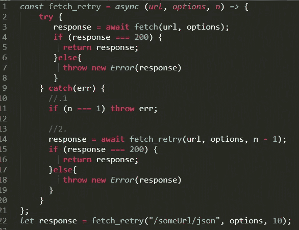

Code image for small screens.

1.  如果达到重试次数，我们将触发一个错误并停止执行。
2.  我们通过调用 *fetch_retry* 函数并减少尝试次数来重试请求。

# **3。递归 setTimeout()**

要定期执行一个函数，我们可以使用 *setInterval()* 方法。只要要快速和同步地执行函数，这个选择就是正确的选择。另一种情况，递归调用 setTimeout()比较好*。*

## 同 *setInterval()*

```
const everySecond= () => console.log("Second:" +new Date().getSeconds());setInterval(everySecond, 1000);
```

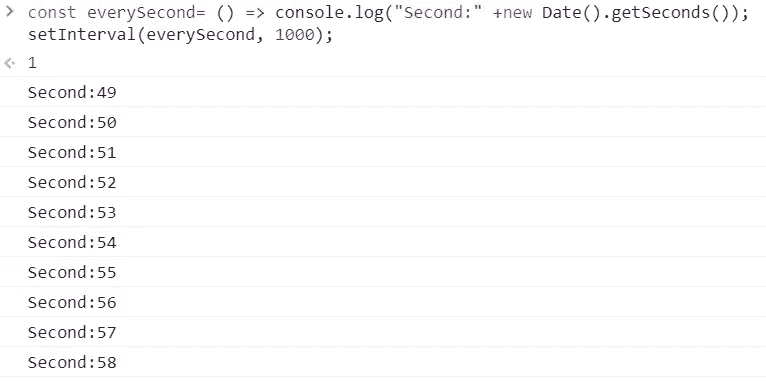

Result in the google chrome console.

## 带*设置超时*()

```
const everySecond= () => console.log("Second:" +new Date().getSeconds());setTimeout( function namedFunction() {
  everySecond();
  setTimeout(namedFunction, 1000);
}, 1000);
```

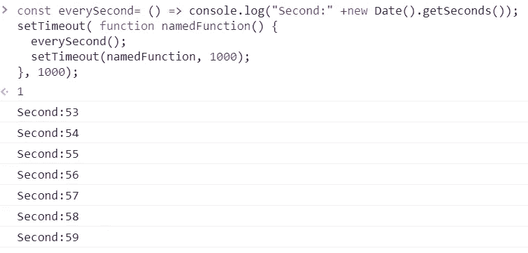

Result in the google chrome console.

# **4。通过析构**从数组中获取字段和长度

我认为这个例子不言自明:

```
let anArray= [ "a", "b", "c", "d", "e", "f", "g", "h"];
let { 0: v1, 2: v2, length } = anArray;
```

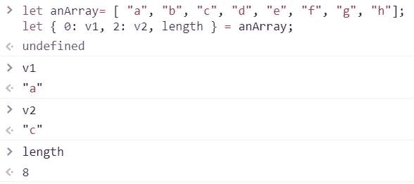

Result in the google chrome console.

# 5.反转一根绳子

```
const hello = "Hello Kesk!";
const reverseString = (s) => [...s].**reverse**();
```

通过析构和逆向方法，我们获得了与字符串“s”对应的字母逆序的数组:

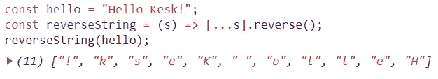

Result in the google chrome console.

现在，我们只需要使用“join”方法再次连接所有的字母，在这种情况下没有空格。

```
const hello = "Hello Kesk!";
const reverseString = (s) => [...s].reverse()**.join('');**
reverseString(hello);
```

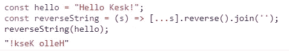

Result in the google chrome console.

# 6.清除数组

我们没有用于清空数组的" *Empty"* 方法，但是我们有 length 属性。数组的这个属性反映了数组中包含的字段数量。如果我们将这个属性设置为零，数组将被清空。

```
let anArray= [ "val1", "val2", "val3", "val4" ];
anArray.length = 0;anArray.forEach(element => console.log(element))
```

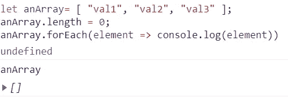

Result in the google chrome console.

或者:

```
let anArray= [ "val1", "val2", "val3", "val4" ];
anArray = [];anArray.forEach(element => console.log(element))
```

# 7.修剪数组

同样，我们可以使用这个属性来修剪一个数组:

```
let anArray= [ "v0", "v1", "v2", "v3", "v4", "v5", "v6", "v7"];
anArray.length = 4;anArray.forEach(element => console.log(element))
```


Result in the google chrome console.

# 8.扩展数组

或者我们可以用同样的方式扩展阵列:

```
let anArray= [ "val1", "val2", "val3" ];
anArray.length = 10;anArray.forEach(element => console.log(element))
```

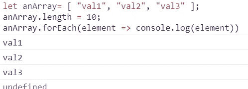

Result in the google chrome console.

# 9.从对象创建数组

我们可以使用 Object.keys()和 map()简单地做到这一点:

```
const kesk = {
 name: "Kesk",
 age : 36,
 eyes: 'green'
}const convertoObjectToArray = obj => Object.keys(obj).map(e => 
[e, obj[e] ]);convertoObjectToArray(kesk);
```

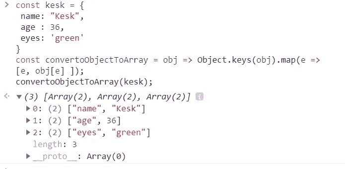

Result in the google chrome console.

# 结论

我希望你喜欢这些小技巧，它们会在你的每一天帮助你。

更多提示请点击此处:

*   [JavaScript 中 12 个超级有用的技巧](https://medium.com/javascript-in-plain-english/12-super-useful-tricks-in-javascript-65c0595d309b)
*   [JavaScript 中 12 个新的超级有用的技巧](https://medium.com/javascript-in-plain-english/12-more-new-super-useful-tricks-in-javascript-497062e67e08)

如果你喜欢这篇文章，可以考虑通过我的[个人资料](https://kesk.medium.com/membership)订阅 Medium。谢谢大家！