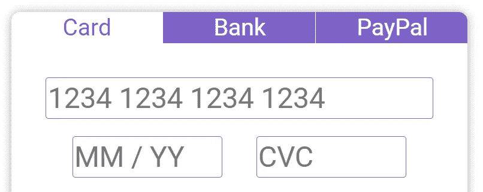
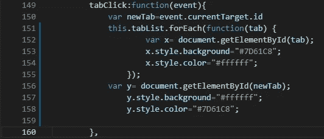
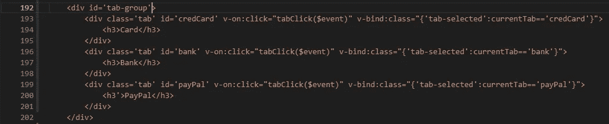
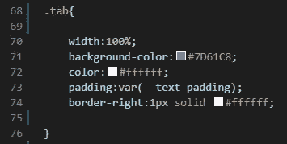
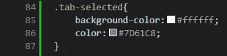
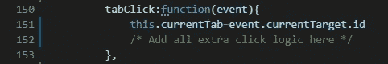

# Vue 支持的现代标签。射流研究…

> 原文：<https://javascript.plainenglish.io/modern-tabs-powered-by-vue-js-127e1fef8412?source=collection_archive---------4----------------------->

With Vue tabs are simpler than ever before

TL；博士
+Vue。JS 是一个强大的基于状态的框架，简化了 web 开发
+使用类绑定来清理响应标签
+~ v-bind:class = " { ' tab-selected ':current tab = = ' cred card ' } " ~
+资源:【https://vuejs.org/v2/guide/class-and-style.html】

任何在使用 HTML、CSS 和 JavaScript 的 web 开发领域呆过一段时间的人都明白我说的这是开发的“蛮荒之地”的意思，没有现代框架，很容易就能开发出一些最杂乱、最复杂的代码。然而，随着现代 JS 框架的出现，这种情况(大部分)已经改变了。

现在，我知道 React 或 Angular 的支持者可能会说 Vue 是框架的狂野西部，但我发现它对于开发来说非常令人耳目一新，其结构化程度刚好达到我的最佳点。在这一点上，我对其他 JS 框架并不了解，所以我不能说它们有多接近我将要描述的内容。但是，我发现 Vue 使某些组件变得优雅，开发起来令人愉快，否则这将是一场噩梦。

我正在为一个客户开发这个自定义事务组件，它将管理多种不同的事务类型。我们毫无疑问地认为需要不同的选项卡来保存不同的类型。最初我认为它需要一些愚蠢的元素 id 分组，以便我可以查询和操作它们。然而，我的大部分经验和研究是在 Vue 之前，我记得 Vue 有一些偷偷摸摸的工具来简化这一点。现在，我可以让每个元素自行响应，单独更新一个基本的状态变量，并使用连接到该变量的绑定来更改它们的样式。

我今天提倡的具体特性是 Vue 的 HTML 类绑定。当你在一组相互依赖的元素上工作时，比如这些标签，这是非常强大的。首先让我们谈谈我最初是如何用基本的 JavaScript 做到这一点的。(免责声明:我不是一个“JavaScript 向导”)我不知道可能有更好的方法来做到这一点，但在 basic JS 中，我可能会让我的 click 函数(附加到每个选项卡)接受事件目标并修改其样式以适应被单击的选项卡，然后按 ID 列出所有选项卡，循环更新其他选项卡的样式。它可能看起来像这样(以 Vue 方法格式):

Possible Function for Relative Styling of Tabs

这可能看起来相当简单，但是请记住，这些额外的代码会弄乱您的单击操作(它应该只管理事件和状态更改)。另外，不要忘记你必须保存一个不同标签 id 的列表，并确保你能跟上 CSS 之外的样式。我个人觉得这个更像锤子，不像扳手。

现在，你能用 Vue 做什么？如果你不熟悉 Vue，或者一般的反应式框架，你可以考虑阅读 Vue 指南简介:[https://vuejs.org/v2/guide/index.html](https://vuejs.org/v2/guide/index.html)。否则，我建议您查看“类&样式绑定”部分:【https://vuejs.org/v2/guide/class-and-style.html】的来熟悉这些特定的概念。我将特别使用类绑定来使我的标签简单&反应。简而言之，这些绑定允许基于组件变量或计算属性应用 CSS 类。在本例中，我们将这样编写元素:

Vue HTML class binding for reactive styling

关键部分是~ v-bind:class = " { * * style * *:* * logic * * } " ~部分。在这个声明中，我们能够操作可以添加到元素中的类。允许样式操作局限于元素本身。

Basic CSS for unselected tabs

我们的基本选项卡类可以有正常的样式，我们不必从外部直接操作特定于元素的样式。然后我们只需要添加一个“tab-selected”类，绑定根据应用程序的状态来操作它。这个选定的类将只保存特定于选定选项卡的样式操作。将此添加到冒号前面的绑定中(如果是 kebab-case，则使用单引号):~ v-bind:class = " { ' tab-selected ':* * logic * * } " ~。

Style changes for the selected tab

样式都解决了，最后一部分是添加管理选项卡状态所需的基本逻辑。为此，我们将首先回到点击事件。因为 Vue 是基于状态的，所以我们希望有一个变量来保存当前所选选项卡的 ID。我把这个状态变量叫做“currentTab”。当选项卡被单击时，我们只需要 click 事件来更新该变量以反映状态变化。它应该是这样的:

就像在通用 JS 中一样，我们能够使用事件来检索被单击的选项卡的 id，但是现在我们将它保存在状态中。一旦在 click 事件上更新了该状态，Vue 反应就会更新所有包含“currentTab”变量的绑定。因为我们现在知道当前选项卡的 ID 是什么，我们可以让每个元素绑定检查它是否拥有那个 ID。使我们的绑定看起来像上面这样~ v-bind:class = " { ' tab-selected ':current tab = = ' cred card ' } " ~，其中 Vue 看到状态变化，并根据绑定逻辑添加/删除类。好的方面是 Vue 在静态类之后设置了绑定类，允许在这种情况下进行直观的覆盖。

所以通过使用 Vue。JS 作为我们的 web 框架，并利用类绑定特性，我们能够使一个更复杂的 UI 元素变得非常简单和组织良好，这在过去可能是不太可能的。我是 Vue 的拥护者吗？当然，我希望能发布更多关于我使用 Vue 的经历，因为我大部分时间都在使用它。然而，鉴于我缺乏其他框架的知识，我不会说这是最好的或者其他人做不到。我要说的是，如果你还没有考虑迁移到一个现代的 web 框架，我强烈建议你考虑这样做。它让开发变得更加简单和有趣，而且我发现 Vue 特别容易上手。

如果你一开始就觉得这些概念令人困惑，没关系。我也有同样的感觉，尤其是对于 Vue 提供的一些更复杂的基于状态的逻辑。然而，这确实是一种管理反应性页面的优雅方式，并为用户提供了闪电般的快速体验。希望在 Vue 发展一段时间后，你会发现这是一次和我一样好的经历。原谅我，如果我可以更好地介绍这些概念，我是记录我的学习和经验的新手。请随意说点什么，希望我能继续进步。

感谢您花时间阅读本文；-马库斯