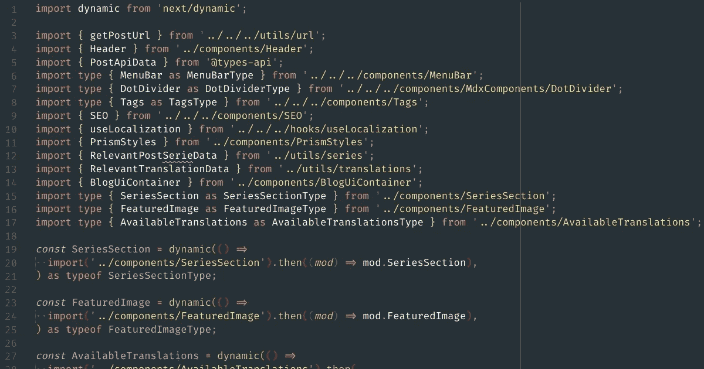

# 模块解析或导入别名:最终指南

> 原文：<https://javascript.plainenglish.io/module-resolution-or-import-alias-the-final-guide-ffda4766be31?source=collection_archive---------18----------------------->

## **如何在(几乎)任何 JS/TS 项目中启用该功能的指南。**



你好，德夫斯。

这可能是一个老话题，但我认为当您尝试进行这种配置时，仍然会有点困惑:

> *如何向我的导入添加别名？*

这里的想法是不要缝合任何特定的框架/工具，而是根据您的应用程序设置，让您知道做什么和如何做。

首先，让我们检查一下我们试图解决什么问题，一个更抽象的解决方案，以及如何配置你的项目来支持它。

# 问题

在结构良好的 JavaScript 应用程序中，我们通常以一种方式组织我们的代码库，使得这些文件做什么或者它们属于哪个领域变得显而易见。

尽管我们没有“如何构建”的标准，但我们总是试图像`components`、`helpers`、`models`等那样进行组织。有时，在这些文件夹中创建子文件夹，从而创建一个深度嵌套的结构。

让我们来看一个小而不太嵌套的应用程序文件夹结构的例子:

```
.
├── package.json
├── src
│   ├── components
│   │   └── Button
│   │       ├── Button.js
│   │       └── index.js
│   ├── helpers
│   │   └── text.js
│   └── index.js
└── yarn-error.log
```

这是一个非常基本的设置，其中:

1.  我们有我们的`src`(源)，它保存了我们的应用程序代码；
2.  `src/components`保存了我们所有的应用组件；
3.  `src/helpers`，它保存了我们所有的助手/实用程序，可以在我们代码的任何地方使用

现在，假设我们要从按钮组件内的助手文本中导入一个名为`sanitizeText`的函数。我们会这样做:

```
import React from "react";
import { sanitizeText } from "../../helpers/text";export const Button = ({ text }) => {
  return <button>{sanitizeText(text)}</button>;
};
```

还不算太糟，但是一旦你开始有越来越多来自不同文件夹和级别的导入，它就开始变得更加混乱。

此外，你总是需要猜测你要经过多少层才能导入你的代码。当然，现代的代码编辑器可以帮你解决这个问题，只需要显示你是哪一级的，有时甚至可以帮你完成，但是。

另一个问题是，如果您最终创建了一个子文件夹(无论出于什么原因)，您需要通过在路径中添加另一个“向上”级别来修复所有导入。

这不是太多的工作，但也不是最理想的。我们有一个更好的方法，那就是通过`module resolution`或`import alias`

# 解决办法

模块解析或导入别名是一种我们可以模拟的方法，与我们导入`node_modules`的方法相同，但是使用我们的内部代码。

我们可以对我们正在使用的工具说:

> *哎，遇到“帮手/文”的时候，能不能考虑一下”。/src/helpers/text "拜托？*

在上面的同一个示例中，我们会有如下代码:

```
import React from "react";
import { sanitizeText } from "helpers/text";export const Button = ({ text }) => {
  return <button>{sanitizeText(text)}</button>;
};
```

酷多了，对吧？

你将从`helpers`导入，不管你在你的应用程序结构中有多深。即使您移动这个文件，导入也总是正确的。

最终，这就像在我们的项目中导入一个库。想象一下，如果你不得不每次都在`node_modules`里上上下下，直到找到你的依赖:

```
import React from "react";
import { sanitizeText } from "helpers/text";
import { camelCase } from '../../../node_modules/lodash'export const Button = ({ text }) => {
  return <button>{camelCase(sanitizeText(text))}</button>;
};
```

这将是地狱。导航到代码会浪费很多精力。

# 配置

JavaScript 本身不允许我们在本地进行这些导入。但幸运的是，我们一直在使用支持该功能的工具(例如 Babel、Webpack 等)。

你可能会想:

> *太好了，我只需要做一次这样的配置！*

答案是:视情况而定……但很可能不是。

您在应用程序中引入的工具越多，配置它就变得越复杂。这里有一些例子，这可能是棘手的:

*   如果你只使用 **Babel** 和添加 **jest** 来测试你的应用，你需要在**和**两个地方都添加别名。
*   如果你在一个带有内置 **Webpack** 配置的 JS 项目中工作，并且你添加了 **Storybook** ，你将需要在`webpack.config.js`和自定义 Storybook `babel.config.js`中添加一个别名。
*   如果你正在用所有这些配置做一个 JS 项目，并且想要转移到 **TypeScript** ，你将需要到处保存这个配置，并且配置`tsconfig.json`文件，让 TS 知道如何解析那些别名。

正如你所看到的，这可能令人困惑，但在这里我想让你了解每一个可能的工具。之后，您将检查您的项目是如何工作的，并做所有需要的配置，以便在您的项目中启用这个特性。

# 编辑器完成

在我们深入研究配置之前，我们先来谈谈开发人员体验(DX)。

如果您使用 VSCode，您可能已经注意到，当您需要导入一些东西时，因为 VSCode 使用 TS，并且它做了很多推理，通常可以自动导入您尝试使用的方法，或者对导入进行自动完成，对吗？

举例来说，当你在 Babel 中配置别名时，你可能会丢失它，这很糟糕。

如果我们想让 VSCode 知道如何建议这些模块，我们需要创建一个名为`jsconfig.json`(在根级别)的文件，它是`tsconfig.json`的 JavaScript 版本，并在那里声明那些别名:

```
{
  "compilerOptions": {
    "baseUrl": ".",
    "paths": {
      "*": [
        "./src"
      ],
      // Your custom aliases here
      "helpers/*": [
        "helpers"
      ],
      "models/*": [
        "models"
      ]
    }
  }
}
```

每次你添加一个新的别名到你的项目中，你需要做的就是到这个文件中添加你的新别名。

如果您使用 Typescript，您不需要这个文件，因为这个配置将在那里进行。

现在，让我们深入研究一下细节。

# 巴比伦式的城市

## 描述

如果您的项目在根级别有一个`babel.config.js`或`.babelrc`文件，您可能需要做这个配置。

## 配置

首先，你需要安装插件`babel-plugin-module-resolver`:

```
yarn install -D babel-plugin-module-resolver
```

然后，将这个插件添加到您的 babel 配置文件中:

```
{
  "presets": [
    // ....
  ],
  "plugins": [
    // ....
    [
      "babel-plugin-module-resolver",
      {
        "root": [
          "./src"
        ],
        "alias": {
		  // Add your aliases here
          "helpers": "./src/helpers",
          "models": "./src/models"
        }
      }
    ]
  ]
}
```

之后，您可以从`helpers/<file>`和`models/<file>`导入文件。

## 资源

*   仅巴别塔演示:[https://git hub . com/raulfdm/别名-演示后/tree/main/仅巴别塔](https://github.com/raulfdm/aliases-post-demo/tree/main/babel-only)
*   巴别塔插件模块解析器:[https://www.npmjs.com/package/babel-plugin-module-resolver](https://www.npmjs.com/package/babel-plugin-module-resolver)

# 卷曲

## 描述

汇总是进行这种配置最烦人的工具之一。这是因为官方插件没有足够的智能识别`index.js`进口。

如果你尝试做类似`models/User/`的事情，插件会抱怨说“模型/用户”是一个文件夹，而不是一个文件。从这个意义上说，您需要完全导入，就像`models/User/index`一样。

经过一些测试，我意识到这不一定是插件的错。如果我们试图通过`@rollup/plugin-babel`启用该功能，我们仍然需要在导入结束时导入`index`。这似乎是汇总处理导入的方式，我们对此无能为力。

## 配置

第一步是安装`@rollup/plugin-alias`。

之后，在您的`rollup.config.js`中导入并设置:

```
import alias from "@rollup/plugin-alias";
import path from "path";export default {
  input: "src/index.js",
  output: {
    format: "cjs",
    dir: "dist",
  },
  plugins: [
    alias({
      /**
       * For custom files extension you might want to add "customerResolver"
       * https://github.com/rollup/plugins/tree/master/packages/alias#custom-resolvers
       *
       * By doing that this plugin can read different kind of files.
       */
      entries: [
        {
          find: "models",
          replacement: path.resolve(__dirname, "src/models"),
        },
        {
          find: "helpers",
          replacement: path.resolve(__dirname, "src/helpers"),
        },
      ],
    }),
  ],
};
```

> *记住:从* `*index.js*` *导入的文件确实需要完全导入*

## 资源

*   汇总演示:[https://github . com/raulfdm/alias-后期演示/tree/main/汇总](https://github.com/raulfdm/aliases-post-demo/tree/main/rollup)
*   汇总+巴贝尔演示:[https://github . com/raulfdm/别名-后期演示/tree/main/汇总-巴贝尔](https://github.com/raulfdm/aliases-post-demo/tree/main/rollup-babel)
*   @ roll up/plugin-alias:[https://git hub . com/roll up/plugins/tree/master/packages/alias # readme](https://github.com/rollup/plugins/tree/master/packages/alias#readme)

# Webpack

## 描述

Webpack 允许我们做和 Babel 一样的事情，但是通过它的配置。如果你正在做的项目在代码的某个地方已经有了一个`webpack.config.js`,你需要调整它。

## 配置

```
const path = require('path');module.exports = {
  // ...
  resolve: {
    alias: {
      // Your custom aliases here
      // __dirname will stands for your root directory level
      // path.resolve will concatenate your project folder location with the aliased folder
      helpers: path.resolve(__dirname, 'src/helpers/'),
      models: path.resolve(__dirname, 'src/models/')
    }
  }
};
```

如果您正在使用一个框架/平台，该框架/平台在幕后与 Webpack 一起工作，并允许您扩展其配置，那么解决方案将略有不同，但概念相同。

例如，我将向您展示来自 NextJS 的一个`next.config.js`文件，它允许我们扩展他们的配置:

```
const path = require('path');module.exports = {
  webpack: (config) => {
    // Mutate the alias configuration
    config.resolve.alias = {
      // Spread everything to avoid remove any alias they might have
      ...config.resolve.alias,
      // Your custom aliases here
      helpers: path.resolve(__dirname, 'src/helpers/'),
      models: path.resolve(__dirname, 'src/models/')
    } // Important: return the modified config
    return config
  },
}
```

## 资源

*   仅演示 web pack:[https://github . com/Raul FDM/aliases-post-demo/tree/main/web pack](https://github.com/raulfdm/aliases-post-demo/tree/main/webpack)
*   扩展 web pack next js:[https://github . com/Raul FDM/aliases-post-demo/tree/main/next-web pack](https://github.com/raulfdm/aliases-post-demo/tree/main/next-webpack)
*   Webpack 文档:[https://webpack.js.org/configuration/resolve/#resolvealias](https://webpack.js.org/configuration/resolve/#resolvealias)

# 玩笑

## 描述

现在我们已经有了在常规环境中工作的别名，让我们看看如何让 Jest 知道如何解析我们的别名

不幸的是，他们的 API 是迄今为止最复杂的 API 之一。这是因为它们用于剔除模拟和测试内容，而不是用于我们有组织的代码。但幸运的是我们能抓住它。

为此，首先，您需要了解 jest 配置在哪里。它可以在`package.json`中，也可以在你的根目录下的一个`jest.config.js`文件中。

## 配置

```
module.exports = {
  // ...
  moduleNameMapper: {
    // Your custom aliases here
    "^helpers/(.*)": "<rootDir>/src/helpers/$1",
    "^modules/(.*)": "<rootDir>/src/modules/$1",
  },
};
```

## 资源

*   jest Docs:[https://jest js . io/Docs/en/configuration . html # modulename mapper-object string-string-array string](https://jestjs.io/docs/en/configuration.html#modulenamemapper-objectstring-string--arraystring)
*   笑话演示:[https://github.com/raulfdm/aliases-post-demo/tree/main/jest](https://github.com/raulfdm/aliases-post-demo/tree/main/jest)

# 以打字打的文件

## 描述

对于 TS 项目，我们通常要从两方面入手:

1.  配置 transpiler/compiler/bundler 工具(如 Webpack、Babel)
2.  配置`tsconfig.json`

这是因为这些工具使用许多内部工具和 Typescript 来生成您的最终文件，对于 Typescript 来说，重要的是您的`tsconfig.json`文件。

此外，您可能想要添加`tsc --noEmit`作为一个奇特的 linter，以确保至少您的代码没有错误并且将正确编译。

## 配置

打开你的`tsconfig.json`文件，设置一个`baseUrl`和`paths`:

```
{
  "compilerOptions": {
    // ... /* Base URL is a MUST. */
    "baseUrl": ".",
    /* Your aliases will live here */
    "paths": {
      "models/*": [
        "src/models/*"
      ],
      "helpers/*": [
        "src/helpers/*"
      ],
    }
  }
}
```

> *提示:如果您正在使用 VSCode，通常您可能需要重启它才能导航这些别名导入。*

为了明确起见，`baseUrl: "."`将告诉 Typescript 考虑项目的**根级别**来构建路径。从这个意义上来说，TS 会找到“模型”并考虑类似于`<root>/src/models/*`的东西。

人们把`baseUrl`定义为`src`也很常见。如果这样做，您可以从路径中删除`src`:

```
{
  "compilerOptions": {
    // ... /* Base URL is a MUST. */
    "baseUrl": "src",
    /* Your aliases will live here */
    "paths": {
      "models/*": [
        "models/*"
      ],
      "helpers/*": [
        "helpers/*"
      ],
    }
  }
}
```

## 资源

*   Typescript 演示:[https://github . com/Raul FDM/aliases-post-demo/tree/main/typescript](https://github.com/raulfdm/aliases-post-demo/tree/main/typescript)
*   typescript Docs:[https://www . typescriptlang . org/Docs/handbook/release-notes/typescript-2-0 . html # base-URL](https://www.typescriptlang.org/docs/handbook/release-notes/typescript-2-0.html#base-url)

# 其他工具

我试图把重点放在我们独立使用的最常用的工具上，一个特定的框架，但是每一个都有一些关于如何以一种简单的方式扩展或做这件事的特性。

我给你的建议是:总是在谷歌上搜索`<framework-or-tool-name> import alias`。通常，你会在前 3 个结果中找到答案。

# 前缀策略

在所有的例子中，我只是使用普通的名字作为我们的别名，但是通常的做法是在它们前面加一个前缀(一个字符)。

就我个人而言，我非常喜欢前缀`@`只是因为它真的很好读`import something "at" components`但是有些人不喜欢这种策略，因为这种特殊字符对于`orgs`来说非常受欢迎，就像`@babel`、`@rollup`，它会误导开发人员认为这种导入来自外部资源。

正如您所注意到的，这是可选的。请随意使用或不使用任何特殊字符来更清楚地说明内部 X 外部导入。

# 结论

我希望在这篇文章结束时，如果你觉得有用的话，你可以调整你的配置并启用这个特性。