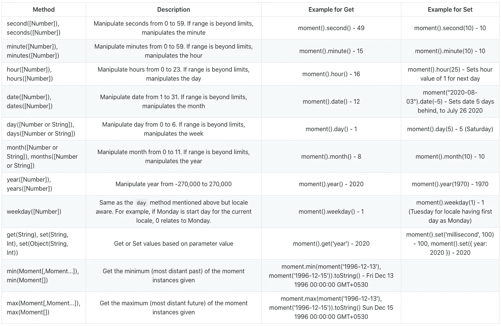
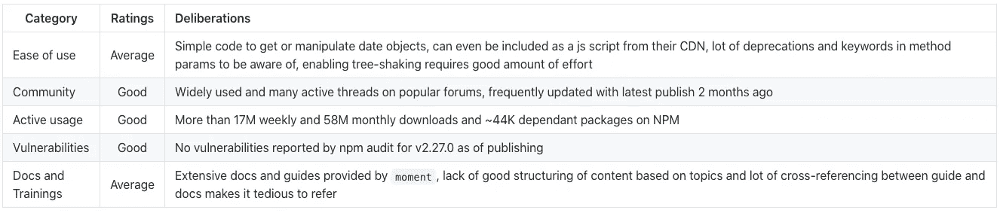

# MomentJS:简洁的日期处理体验！

> 原文：<https://javascript.plainenglish.io/momentjs-a-concise-date-handling-experience-3abad32f7691?source=collection_archive---------3----------------------->


Photo by [NeONBRAND](https://unsplash.com/@neonbrand?utm_source=medium&utm_medium=referral) on [Unsplash](https://unsplash.com?utm_source=medium&utm_medium=referral)

# 概观

时间管理总是讨论的热门话题，对于 JavaScript 应用程序也不例外！管理日期和时间，特别是当要支持不同的格式和时区时，在大多数应用程序中需要一个成熟的库。

`MomentJS`是一个 JavaScript 库，用于在浏览器和 Node.js 环境中解析、验证、操作和格式化日期和时间值。moment.js 作为一个 JS 包提供给大多数捆绑器，并作为一个可以直接从 CDN 导入的 JS 脚本，似乎是所有日期时间需求的可靠解决方案。

# 突出

moment.js 的入门非常简单。可以通过运行命令`npm install moment`来安装。

```
/* Babel or ES6 */
import moment from 'moment';/* Node or requireJs */var moment = require('moment');
```

> 注意:在 2.4.0 中，全局导出的“moment”对象已被弃用。它将在下一个主要版本中被删除。

Moment 通过在 JS 的本机`Date.prototype`对象上创建一个包装器来运行，返回的对象是可变的。

## 解析和提取

获取当前日期时间就像实例化一个 moment 对象一样简单。返回值将是一个`Moment`对象，可以使用`toString()`方法从中提取一个简单的日期和时间字符串。

```
const current = moment(); // current.toString() = "Wed Jul 29 2020 10:44:07 GMT+0530"
```

`Moment`对象中的其他方法可用于提取特定部分的值或设置它们。下面列出了一些使用过的`commonly`:



Some extract method examples

Moment 提供了强大的日期时间解析，并支持所有的 [ISO 8601 字符串](https://momentjs.com/docs/#/parsing/string/)。该 ISO 规范未定义的格式也受支持，但这取决于浏览器通过本机`Date`对象解析该格式的能力。

解析日期时间字符串或对象的几种方法如下。请注意，默认情况下，Moment 在本地模式下提供时间戳。如果您在 UTC 中需要它，必须显式指定它。

## 没有格式说明符

不指定格式字符串的简单解析示例如下:

```
moment("2020-12-30"); // Mon Dec 25 1995 00:00:00 GMT+0530moment("2020W065"); // Basic (short) ISO8061 format with week and weekday - week 6 and 5th day in 2020 - Fri Feb 07 2020 00:00:00 GMT+0530moment(2318788876406) // Unix Epoch value - Thu Jun 25 2043 01:31:16 GMT+0530moment({ year:1996, month:11, day:13, hour:23, minute:10, second:30, millisecond:123}) // Fri Dec 13 1996 23:10:30 GMT+0530 - Observe that month starts from 0!moment(new Date(1996, 11, 13)) // JS Date object - Fri Dec 13 1996 00:00:00 GMT+053moment([2020, 6, 29]) // Wed Jul 29 2020 00:00:00 GMT+0530 - Format is [year, month, day, hour, minute, second, millisecond]moment.utc("1996-12-13", "YYYY-MM-DD") // In UTC - Fri Dec 13 1996 00:00:00 GMT+0000moment.parseZone("2020-01-01T00:00:00+08:00") // With specified timezone - Wed Jan 01 2020 00:00:00 GMT+0800
```

## 使用格式说明符

为了更好地解析，可以指定要解析的值的格式，支持的格式字符串可以在[这里](https://momentjs.com/docs/#/parsing/string-format/)找到

```
moment('24-12-2020 11:15:00', "DD-MM-YYYY hh:mm:ss", true) // Thu Dec 24 2020 11:15:00 GMT+0530
```

在正常的解析中，当指定格式时，非数字字符通常被忽略！这实质上意味着`moment("13-12-1996", “DD-MM-YYYY")`被视为与`moment("13/12/1996", “DD-MM-YYYY")`相同。当解析时间和日期时，这可能会提供不一致的结果，因此建议使用严格模式，传递一个`true`布尔值作为最后一个参数，如上例所示。

也可以向解析器提供多种格式，在这种情况下，Moment 将尝试通过从顺序提供的列表中选择解析器来解析值，并使用它从列表中找到的第一个有效格式

```
moment("13-12-1996", ["MM-DD-YYYY", "DD-MM", "DD-MM-YYYY"]) // Uses the last format in the list
```

还可以通过提供区域设置字符串来为解析指定区域设置

```
moment('2020 juillet', 'YYYY MMM', 'fr') // Wed Jul 01 2020 00:00:00 GMT+0530
```

也可以为解析指定显式的特殊格式，如 ISO 8061

```
moment("1996-12-13T05:06:07", ["YYYY", moment.ISO_8601, "YYYY-MM-DD"])
```

## 检测无效日期

Moment 提供了一个简单的`isValid()`方法来确定是否提供了有效的日期对象。例如

```
moment("2020 13", "YYYY MM").isValid() // false (invalid month)moment("2020 13", "YYYY MM").invalidAt() // 1 - Since the invalid month provided here (13) is the 2nd value, it's position index of 1 is returnedmoment("2020 12", "YYYY MM").isValid() // true
```

由于解析器不是非常严格，意外的行为/问题可能会突然出现，如:

```
moment('2020 is a date', 'YYYY-MM-DD').isValid() // true as 2016 matches YYYY
```

因此，在用力矩检查有效性时应格外小心，建议始终使用`strict`模式。

## 操作

Moment 支持几乎所有常用的日期时间操作，如加、减、最小和最大。一些独特的包括时间开始和时间结束的操作。下面的例子展示了一些你可以操作你拥有的`moment`对象的值的方法！

*   **加减**

```
moment().add(7, 'days') // Add 7 days to current date - Tue Aug 04 2020 to Tue Aug 11 2020moment().add({ days:7, months: 2}) // Add 7 days and 2 months to current date - Tue Aug 04 2020 to Sun Oct 11 2020moment().subtract(1.5, 'months') // Subtract one and half months from today's date - Tue Aug 04 2020 to Thu Jun 04 2020
```

> 如果您将小数值传递给上述天数或月数的持续时间值，它将被四舍五入为最接近的整数。周、季度和年首先转换为天数，然后四舍五入。

*   **开始和结束时间**

这些有趣的方法将原始的`moment`对象值改变为指定单元的开始或结束值。

```
moment().startOf('year') // Sets to January 1st 12:00 am of the current year - Wed Jan 01 2020 00:00:00moment().endOf('year') // Sets to December 31st 11:59 pm of the current year - Thu Dec 31 2020 23:59:59
```

*   **本地和 UTC 值**

力矩对象的本地值和 UTC 值及其偏移可以如下所示获得。`local`和`utc`方法在原始的`moment`对象中设置了一个标志，从它们中的所有进一步检索将给出相应的值。

```
const utcDate = moment.utc("2020-01-13 15:00")
utcDate.hours() // 15
utcDate.minutes() // 0
utcDate.local() // GMT +05:30
utcDate.hours() // 20
utcDate.minutes() // 30const localDate = moment("2020-01-13 15:00") // GMT +05:30
utcDate.hours() // 15
utcDate.minutes() // 0
utcDate.utc()
utcDate.hours() // 9
utcDate.minutes() // 30moment().utcOffset() // Get offset from utc in minutes - 330 for GMT+05:30
moment().utcOffset(8); // Set offset in hours when value in argument is less than 16 or greater than -16, else in minutes, on the moment object returned.
```

## 格式化和查询

格式化和查询是一些最常用的功能，尤其是在前端应用程序中，用于以所需的格式获取和显示日期时间值。Moment 提供的核心功能之一是`format`。它接受格式字符串(其支持的值可以在这里的[中找到](https://momentjs.com/docs/#/displaying/format/))并相应地返回值。如果没有字符串被传递，它以标准的 ISO8601 格式返回。这个标准格式也可以通过将格式字符串设置为 moment 对象的`defaultFormat`属性来覆盖。

```
moment().format() // ISO8601 format - 2020-08-05T10:09:02+05:30moment().format('dddd, MMMM Do YYYY, h:mm:ss') // Wednesday, August 5th 2020, 10:10:27moment().format('[The time is ] h:mm:ss a') // The time is 10:10:27 am
```

虽然`moment`提供了更多的格式选项，但其中一些不常见的是:

```
moment().toArray() // [2020, 7, 5, 10, 18, 36, 699]moment().toDate() // Returns JS's native Date objectmoment().toObject() // { "years": 2020, "months": 7, "date": 5, "hours": 10, "minutes": 21, "seconds": 5 "milliseconds": 108 }moment().inspect() // Returns the string form of the moment command that can be used to get a value - moment("2020-08-05T10:22:30.574")
```

moment 提供的一些有用的查询方法包括:

```
moment('2020-10-20').isBefore('2010-10-30') // false
moment('2015-10-20').isBefore('2020-01-01', 'year') // truemoment('2020-05-20').isSame('2020-05-20') // truemoment('2021-10-20').isAfter('2020-10-15') // truemoment().isDST() // Checks if the current date-time is in daylight saving timemoment().isLeapYear() // Checks if the year in the moment object is a leap yearmoment.isDate(new Date()) // true - Checks if the object in the parameter is a native JS Date object
```

## 其他公用事业

Moment 还提供了对国际化的支持，以 Java 等通用语言的格式处理日期时间的插件，为地区提供自定义值，并根据持续时间进行操作。让我们先睹为快，看看它提供的几个技巧！

*   **i18n**

国际化本身由“时刻”支持，并且允许全局和特定于对象的本地设置。可以使用“区域设置”方法完成全局区域设置。注意，这个包默认带有 en-us 语言环境，其他的必须手动加载。许多常用的语言环境都可以在`locale`目录下的包源代码中使用，并且只需要在运行时加载文件。

> 提示:从包源代码中去掉不需要的语言环境有助于减小包的大小！

```
moment.locale("fr", { ...configObject }) //setting French locale
```

要传递给上述 configObject 的键可以在 [moment docs](https://momentjs.com/docs/#/i18n/changing-locale/) 中找到。

在全局设置区域设置之前加载的对象不会受到区域设置更改的影响。也可以指定一个区域列表，`moment`将选择第一个可用的区域来使用。对于像`en-au`这样的语言环境规范子字符串，Moment 将从最具体到最不具体进行搜索，并加载找到的最合适的子字符串。

```
moment.locale(['gb', 'fr']) // will use fr when gb has not been already loaded
```

要更改特定对象的区域设置，可以调用实例上的`locale`方法:

```
const tempLocale = moment()
tempLocale.locale('fr') // changes locale only for this instance
```

> 加载语言环境文件因平台而异。请查看您选择的平台的 Moment 文档。

可以使用`localeData`方法获取当前加载的语言环境的信息:

```
moment.localeData('fr') // returns the config of the fr locale
```

*   **区域设置定制**

使用 locale 方法可以很容易地修改包的许多值和属性，如果您最终要为您的用例大量修改现有的语言环境，建议您定义自己的定制语言环境并加载它。如果您只想修改某个语言环境的特定方面，也可以使用`updateLocale`方法。

例如，要更新某个地区的最小工作日缩写(工作日的较短形式，如“Sun”代表星期日)，您可以执行以下操作:

```
moment.updateLocale('en', {
        weekdaysMin : ["Su", "Mo", "Tu", "We", "Th", "Fr", "Sa"]
    }
);
```

您可能会发现需要更新的一个方面是针对无效日期返回的消息。

```
moment.updateLocale("en", {
  invalidDate: "INVALID_DATE"
});
```

类似地，几乎所有方面都可以针对一个区域设置进行修改，我们强烈建议在项目开始时花一些时间设置一个自定义区域设置，扩展一个基本区域设置或修改您现有的区域设置，以适应您的用例。

*   **持续时间对象**

Moment 可用于创建和使用持续时间对象。顾名思义，它们包含时间或日期持续时间作为值，而不是典型的日期-时间值。例如:

```
moment.duration(3, 'months') // returns an object containing 3 months duration value
```

像普通的`moment`对象一样，这些对象可以用加、减和其他类似的方法来操作。其中一个有趣的方面是`humanize`方法。这个方法以人性化或简单的英语方式返回持续时间。例如，一个月的持续时间以人性化的方式看起来会像:

```
moment.duration(1, "month").humanize() // "a month"
```

此方法还支持如下所示的后缀:

```
moment.duration(5, "minutes").humanize(true) // "in 5 minutes"moment.duration(-5, "minutes").humanize(true) // "5 minutes ago"
```

*   **插件**

虽然不广泛，但 moment 确实支持插件，你可以在社区中找到相当多的插件，帮助你解决那些普通 Moment 无法满足的利基用例！

大多数插件都围绕着为不同的日历提供支持，如 Jalaali，Hijri 等。特定于语言的日期时间格式，如 Strftime、MSDate、Java DateFormat 等。以及迎合非常具体的用例，比如获取 Twitter 的时间格式或检查给定日期是否是德国节日。

我们建议查看官方文档[中的插件列表](https://momentjs.com/docs/#/plugins/)，并简单地在谷歌上搜索以找到满足您特定需求的插件。

*   **扩展**

如果你正在考虑为 Moment 扩展或编写自定义解析器，那么可以提供一些方法，比如`normalizeUnits`(允许规范化单元枚举的别名)和`invalid`(允许创建无效的 Moment 对象)。由于这些在常规用例中没有广泛使用，如果您想了解更多信息，我们建议查看 [Moment 的文档](https://momentjs.com/docs/#/utilities/)。

# 结论

Moment 是一个强大而广泛的日期时间管理库，可以或多或少地处理任何类型的操作或查询！作为本机 JS Date 对象上的包装器，它遵循 OOPS 方法来处理对象。虽然它没有在特性集上妥协，但是它也有相当多的缺点，比如非常庞大的包大小，很少甚至没有对树抖动的支持，以及对象的可变性。

我们在本指南中介绍的功能集绝不是详尽的，该软件包还有许多有趣和独特的功能。务必检查[文件](https://momentjs.com/docs/)和[指南](https://momentjs.com/guides/)以获得完整的图片！

总之，如果你正在寻找一个只存在于 Moment 中的特定功能，或者你的项目已经在使用它，那么最好坚持使用它，否则，我们可以看看更简单但性能更好的库，比如`date-fns`(我们对`date-fns`的深入指导和评论可以在[这里找到](https://medium.com/javascript-in-plain-english/date-manipulation-in-js-made-easy-with-date-fns-6c66706a5874))。

# 评估指标



Evaluation of the package