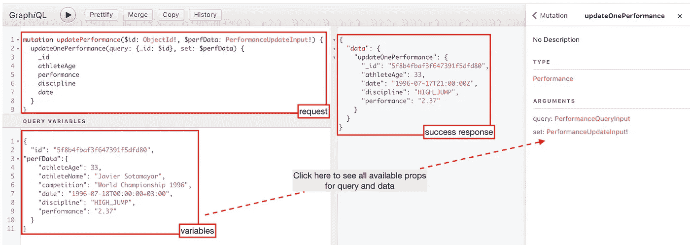
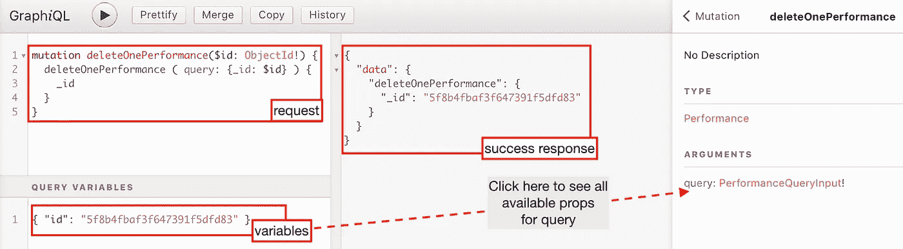

# MongoDB Realm + GraphQL(更新一个删除一个)

> 原文：<https://javascript.plainenglish.io/mongodb-realm-graphql-update-one-and-delete-one-aacf71cd2d7c?source=collection_archive---------8----------------------->


Photo by [Pablo Heimplatz](https://unsplash.com/@pabloheimplatz?utm_source=unsplash&utm_medium=referral&utm_content=creditCopyText) on [Unsplash](https://unsplash.com/s/photos/rock?utm_source=unsplash&utm_medium=referral&utm_content=creditCopyText)

这是“MongoDB Realm+graph QL+Apollo Client(on React)”使用系列的第二部分。你可以在这里找到该系列的第一篇文章[。](https://mathiou.medium.com/how-to-use-mongodb-atlas-graphql-from-a-react-web-app-insert-one-and-search-360cc15cb6fa)

这篇文章将描述我们如何*在我们的数据库中更新或删除一个特定的文档*。

确切地说，正如[在之前的文章](https://mathiou.medium.com/how-to-use-mongodb-atlas-graphql-from-a-react-web-app-insert-one-and-search-360cc15cb6fa)中所说，这两种场景的步骤如下:

1.  我们在 MongoDB Explorer 中解决了我们的查询。
2.  我们将查询复制到我们的 *operations.graphql* 文件中，并执行 *$ npm run generate 命令。*
3.  我们将逻辑移动到组件中，就像我们在创建场景中所做的那样。

## 更新一个文档

为了更新一个文档，我们将做一个**突变**，其中我们需要两件事情:

1.  一个**查询**，通过它我们可以找到特定的文档
2.  **我们想要用来更新文档的新数据**。

对于查询，我们可以使用模式中的任何属性。对于我们的场景，我们将使用一个典型的案例，使用我们文档的惟一 id。

这是您通常定位特定文档的方式，因为这是更高效的方式，因为“_id”是数据库中文档的主要索引。



我们将突变添加到我们的***operations . graph QL***文件中，

```
mutation updatePerformance($id: ObjectId!, $perfData: PerformanceUpdateInput!) {
  updateOnePerformance(query: {_id: $id}, set: $perfData) {
    _id
    // The rest props you want inside the response
  }
}
```

我们在控制台中执行以下命令。

```
***$*** *npm run generate*
```

***(详情:*** [***安装| GraphQL 代码生成器******)***](https://graphql-code-generator.com/docs/getting-started/installation)

上面的命令将自动创建我们突变和查询所需的适当类型(在 *types.ts* 中)和钩子(在 *graphql-operations.ts* 中)。

现在我们已经准备好了钩子，我们可以在我们的组件中调用它们。

## 删除一个文档

为了删除一个特定的文档，我们将做一个**变异**，其中我们只需要一个**查询**，用它我们可以找到特定的文档。

同样，对于我们的查询，我们可以使用模式中的任何属性。对于我们的场景，我们将使用文档的惟一 id。如前所述，这是您通常定位特定文档的方式，因为这是更高效的方式，因为“_id”是数据库中文档的主要索引。



注意*当操作失败时，响应将包含值为空的数据*，

```
{
  "data": {
    "deleteOnePerformance": null
  }
}
```

并且*成功时，响应包含被删除记录*的“_id”。因此，请注意这种行为，因为它可能会令人困惑。

我们将我们的突变添加到我们的***operations . graph QL***文件中，

```
mutation deleteOnePerformance($id: ObjectId!) {
  deleteOnePerformance ( query: {_id: $id} ) {
    _id
  }
}
```

我们在控制台中执行“ *npm run generate”。*

现在我们已经准备好了钩子，我们可以在我们的组件中调用它们。

就是这样！

在下一篇文章中，我们将描述如何在 MongoDB 领域中插入许多文档并使用自定义函数来处理有许多重复的奇怪情况。