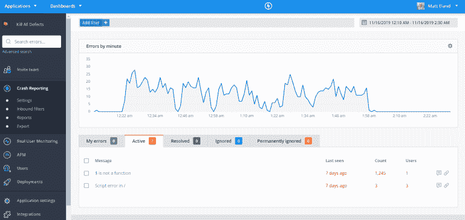
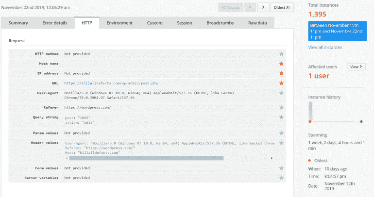

# 通过误差跟踪监控质量

> 原文：<https://javascript.plainenglish.io/monitoring-quality-with-error-tracking-b8c0f87317df?source=collection_archive---------7----------------------->

上次在[软件质量深度防御系列](https://killalldefects.com/2019/11/18/software-quality-defense-in-depth/)中，我们回顾了[有效的计划如何帮助你在早期控制质量风险](https://killalldefects.com/2019/11/22/avoiding-quality-minefields/)。这是对抗缺陷的最早防线之一。这一次，让我们看看最后一道防线:通过错误跟踪监控软件质量。

在本文中，我们将看看错误跟踪解决方案的重要性，它们在软件质量中的作用，以及如何有效地使用它们。

我们还将涉及典型的设置和监控，并查看一些更流行的错误跟踪服务，但本文的重点更多的是错误监控的概念及其在开发生命周期中的作用。

# 问题是

在发布到产品之前，我们花了大量的**时间编写和测试软件。一旦代码进入生产，我们真正花了多少时间来监控和确保软件质量？**

根据我的经验，组织经常在没有主动监控计划的情况下发布代码。当然，我们有支持部门和客户报告问题的方式，但到了那个时候，通常为时已晚，无法纠正问题。

让我这么说吧——如果您对新部署的代码有一个关键问题，您是想在支持票蜂拥而至时从帮助台经理那里了解它，还是想更快地了解它？

# 引入错误跟踪

不足为奇的是，错误跟踪软件是用来跟踪应用程序错误的。可以将该软件视为一个集中的错误或日志收集服务，用于收集在不同地方发生的事件，包括:

*   您的 Web 服务器
*   由 Web 浏览器执行的 JavaScript
*   移动应用
*   桌面应用程序
*   自动化控制台应用程序或服务

通过引入单一的解决方案来收集错误信息，您可以在一个集中的位置监控各种各样的应用程序。这些产品通常基于 API，具有 web 应用程序形式的管理和监控用户界面，可能还附带有移动应用程序。

# 错误收集和分类

一旦发生错误，就会报告给错误跟踪服务，该服务会将有关错误的详细信息存储在其内部数据库中。这些工具会寻找相似的错误，并自动将错误组合在一起，这有助于您跟踪单个问题并确定其优先级。

[Raygun](http://www.Raygun.com) showing exceptions by the minute over a small period of time.

跟踪系统会以您配置的任何方式提醒您——从电子邮件和延期信息，甚至是在吉拉或其他跟踪系统中自动创建新的工作项目。

用户界面将允许您查看未解决的异常，获取关于它们的信息，并查看它们出现的频率以及它们首次被引入的日期。

我要强调的是，为了正确地使用错误跟踪系统，你必须为你的组织定义一个流程来筛选进来的错误。我建议进行轮换，让工程师在指定的一天或一周内查看新的错误，并确定是否需要采取进一步的措施。

如果你不能正确地跟踪和分类物品，它们就会变成噪音，成为日常事务的一部分。错误永远是不可接受的，或者是可以忽略的。

通常情况下，系统会让您分配、合并错误，并将错误标记为已解决，这有助于分类过程。一般来说，如果系统发现错误再次出现，系统会重新打开它们，或者如果错误在新发布的应用程序版本中再次出现，系统会重新打开它们—如果系统配置为跟踪您的部署。

# 错误详细信息

错误跟踪中可用的信息财富真的很惊人，这也是采用这样一个系统的关键原因。

通常情况下，您会得到关于错误中涉及的浏览器、操作系统、设备和/或 web 请求的各种数据(当然，这取决于发生错误的应用程序的类型)。

Error details in [Raygun](http://www.Raygun.com). Note the tabs at the top to give even more detailed information and the history and grouping information on the right pane.

这些额外的细节可以帮助您确定某件事是影响了广泛的用户还是只影响了特定的用户。它还可以识别遇到问题的特定浏览器。后一种情况在客户端 JavaScript 问题中非常常见，不是所有的浏览器都支持所有的 JavaScript 特性(通常[需要一个 polyfill 或 shim](https://en.wikipedia.org/wiki/Polyfill_(programming)) )。

# 使用建议

我建议您在生产系统或即将生产的系统上定期运行的所有应用程序中采用错误跟踪解决方案。

我建议您尽可能在单个 facade 类中管理您的错误日志，并让您的其他代码调用该 facade。这允许您从一个供应商变更到另一个供应商，或者更一致地包含全局数据。

我建议您使用一个配置标志来配置错误日志，以完全禁止向跟踪系统发送错误，并使用一个配置设置来存储跟踪系统提供的 API 键。

我还建议您在测试环境中保持上的**错误记录，因为常规使用可以检测到测试人员可能无法直接看到的隐藏错误。**

出于这个原因，我建议在将任何代码投入生产之前，考虑检查测试中记录的错误。

# 不同的误差跟踪解决方案

好了，现在我们已经讨论了这些解决方案是什么，以及它们如何适应您的日常工作流程，让我们简要了解一下其中的一些主要参与者。

*   Raygun —高端错误跟踪服务，提供流畅的报告和图表。当您添加用户跟踪和应用程序性能监控功能以获得网站性能和行为的真实情况时，真正的价值就来了。
*   [Rollbar](https://rollbar.com/) —一种基于网络的异常跟踪服务，具有每月使用的低容量免费等级。滚动条支持多种语言和环境，并为您提供大量现成的数据。
*   [哨兵](https://sentry.io/) —另一个基于网络的异常跟踪服务。我以前的一些同事非常信任这个。
*   Log Rocket —一个新兴的错误跟踪解决方案，为基于 web 的异常提供了一些有趣的错误重放特性。
*   [AirBrake](https://airbrake.io/) —另一项重要的网络服务。我还没有详细研究过它们。
*   [OverOps](https://www.overops.com/)——另一个我以前没玩过的有趣工具。有一些好看的仪表板和一个非常有趣的性能趋势特性，允许您识别明显较慢的方法。
*   [New Relic](https://newrelic.com/) —从技术上讲，New Relic 更像是一个应用程序性能监控工具，它还可以跟踪错误。然而，通常情况下，您需要转到其他选项之一来获得每个错误的重要细节。
*   特定于云的解决方案( [Azure Monitor](https://azure.microsoft.com/en-us/services/monitor/) ，[AWS cloud watch](https://aws.amazon.com/cloudwatch/))——嵌入到你可能已经在使用的云服务中。对于已经在云中的组织来说，这是一种采用错误监控的简单方法。

我将在年底写更多关于 Raygun 的文章，所以如果你想深入了解如何配置异常日志，请继续关注。

# 推荐

我建议您查看以上选项，并根据您使用的语言和部署的应用程序类型，找出最适合您需求的选项。

给这些工具中的一两个免费试用，看看它们能告诉你关于你的应用和过程的什么。

根据经验，我可以告诉你，第一次打开开关并看到应用程序的所有问题是很糟糕的，但是一旦你通过了最初的解决过程，使用这些工具可以首先防止缺陷通过预览或测试环境，或者为你提供重现棘手的 bug 所需的额外细节。

从客户服务的角度来看，在系统中记录错误已经可以让您从联系您解决问题的客户那里获得更少的数据，因为当他们联系您时，您可能已经拥有了您需要的所有信息，并且正在解决问题。

尝试一下，让我知道你的想法。如果您对我提到的这些解决方案有更多的了解，但还没有尝试过，或者知道另一个我没有提到的解决方案，[请告诉我](https://killalldefects.com/contact/)！

*原载于 2019 年 11 月 23 日*[*【https://killalldefects.com*](https://killalldefects.com/2019/11/23/monitoring-quality-with-error-tracking/)*。*