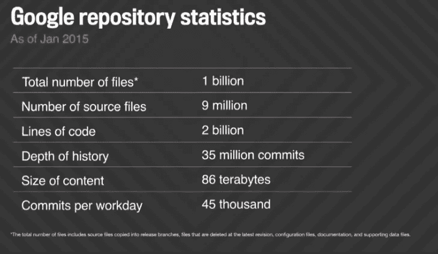
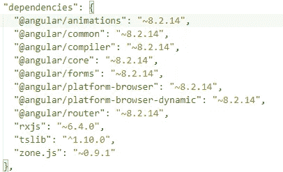
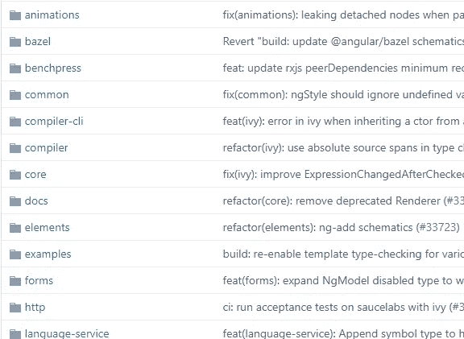
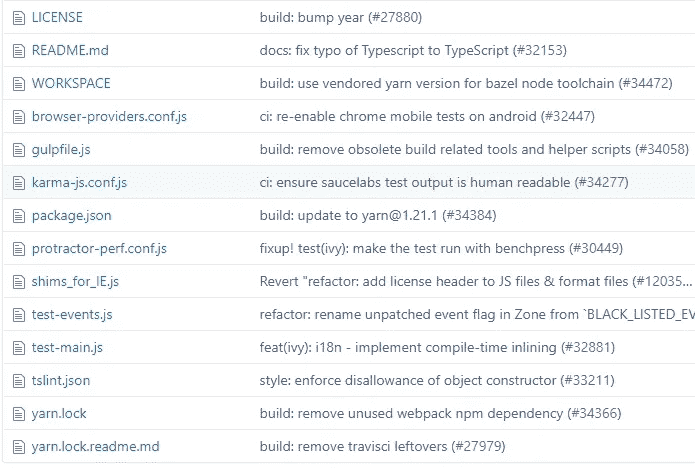
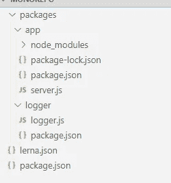
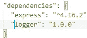

# 什么是单向回购？

> 原文：<https://javascript.plainenglish.io/monorepo-what-is-it-really-ade13aede0cc?source=collection_archive---------8----------------------->


The photo was taken from Costiero Shipping

当一个项目开始时，我们在 VSTS/Github/bitbucket 中创建一个新的源代码库，并开始向其中添加所有的代码。每次我们添加新的模块/可重用组件时，我们都会创建另一个存储库并使用它。这被称为多方回购。这个过程将继续下去，直到我们最终创建许多存储库，因为我们每个包需要一个存储库。一段时间后，这变得不可收拾。

在继续之前，让我们尝试使用 ExpressJs 创建一个小应用程序。

在新创建的文件夹中执行下面的命令。这将创建 package.json 文件。

```
npm init
```

新的应用程序包含两条路线，并且非常简单明了。我们把它命名为 server.js 吧。

```
const logger = require('./logger');
const express = require('express');const app = express();
app.use(function (req, res, next) {
 logger.log(req.originalUrl, "Middleware");
 next()
});
app.get('/', (req, res) => {
 console.log("Hello work");
 res.send('Hello World!');
});
app.get('/info', (req, res) => {
 console.log("Info");
 res.send('This is info!');
});
app.listen(8080, function () {
 console.log("Server is running");
});
```

然后添加一个记录器来跟踪每个请求。下面是 logger.js 的内容。

```
const fsPromises = require('fs').promisesconst log = async (value, context) => {
    const valueToBeLogged = `${new Date()}---${context}---${value}\n`;
    await fsPromises.appendFile("C://logger" + "//" + "track_data.log", valueToBeLogged);
};exports.log = log;
```

这将没有任何问题。整个代码可以驻留在一个存储库中。但是现在让我们假设 logger 需要与另一个 ExpressJs 项目共享。我们有两个选择

*   将 logger.js 复制/粘贴到另一个项目中。
*   将 logger.js 移动到单独的存储库中，并将其打包。

我们显然选择了第二种。但是我们最终只为单个文件创建了一个新的存储库。但不是这样。我们需要复制整个代码质量规则，如 ESlint，测试配置等。

这是我们进行单一回购的时候。

# 什么是 Monorepo？

> 在版本控制系统中，mono repo(monolithic repository 的音节缩写)是一种软件开发策略，其中许多项目的代码存储在同一个库中。—维基百科

简而言之，把你所有的源代码放在一个库中。

💡Monorepo 并不强调单一的软件设计。

这并不是一个新概念，包括谷歌、脸书、微软、优步、Airbnb、Twitter 在内的许多公司已经在效仿。



Google repository statistics

Why Google Stores Billions of Lines of Code in a Single Repository?

让我们探索一下 google 是如何在单一存储库中维护不同的 angular 包的。这种方法被称为多包单一回购。

使用命令“ng new <app>”创建一个新的 angular 应用程序，并检查 package.json 文件。你可以看到像@angular/core、@angular/animations 等包。</app>



From [https://github.com/angular/angular](https://github.com/angular/angular)

现在查看 angular[https://github.com/angular/angular](https://github.com/angular/angular)的源代码，并检查包文件夹。



From [https://github.com/angular/angular](https://github.com/angular/angular)

您可以为每个包找到单独的文件夹。另外，请查看主页。您可以发现配置文件就在主页中，这些文件对于所有的包都是通用的。



From [https://github.com/angular/angular](https://github.com/angular/angular)

这里最好的事情是每个包可以单独发布为一个包或与同一文件夹中的其他包共享，而不用发布到 NPM。

但是在 Multirepo 中，如果你想在这些包之间共享一些代码，你唯一能做的就是把代码发布到 NPM 并使用它。

## 使用 Lerna 管理 Monorepo


将所有源代码保存在一个存储库中可能看起来更简单。但事实并非如此。我们应该能够有效地维护包和代码提交的版本。为此，我们可以使用一个名为 Lerna 的工具。

 [## 一个用多个包管理 JavaScript 项目的工具。

### 将大型代码库分割成单独的独立版本包对于代码共享非常有用…

lerna.js.org](https://lerna.js.org/) 

让我们使用 Lerna 尝试同一个 logger 应用程序示例。

lerna 需要首先安装在您的机器上。

```
npm install --global lerna
```

一旦安装了 lerna，使用 Lerna 初始化新文件夹中的新项目。

```
lerna init
```

如果你打开文件夹，你可以看到下面的文件。

```
packages/
  package.json
  lerna.json
```

*   导航到 packages 文件夹，创建名为 app 的文件夹，并添加 server.js、package.json 文件。
*   在 packages 文件夹中创建另一个名为 logger 的文件夹，并添加 logger.js，然后运行 npm init 进行初始化。这将创建 package.json。将 package.json 中的名称设置为“logger”，版本设置为“1.0.0”。

整个文件夹结构如下所示。



*   打开 app 文件夹内的 package.json，并在 dependencies 部分添加 logger。



*   执行以下代码来安装依赖项，并将日志记录器链接到应用程序。

```
lerna bootstrap
```

就是这样。现在，您可以通过导航到应用程序文件夹来运行应用程序。如果您检查应用程序文件夹的 node_modules，您可以看到 logger 文件夹参考。

如果你愿意，你甚至可以直接将日志发布到 NPM，而不用转移到单独的存储库。

完整的代码可以在[这里](https://github.com/thangaraja/monorepo)和[这里](https://github.com/thangaraja/multirepo)找到。

## 与不在当前存储库中的项目共享包

使用 Lerna 的一个很酷的地方是它使得发布包变得非常容易。你可以使用 NPM 注册表，如果你想共享你的软件包公开，没有特殊的配置需要，或使用自己的注册表，如果你想保持软件包的私人。只需运行下面的命令来启动包发布过程。

```
lerna publish
```

该命令将执行以下操作

1.  提交代码
2.  更改 package.json 文件中的版本
3.  在存储库中创建一个标记。
4.  将包发布到 npm 注册表。
5.  将代码推送到存储库。

## 单一回购的优点

*   维护项目之间的依赖关系很容易。代码可以重用，无需发布到 NPM。
*   为多个项目应用相同的编码/格式很容易。
*   让代码共享变得简单。您可以创建一个用户并将其分配给一个存储库。

## Monorepo 的缺点

*   当源代码很大时，从存储库中提取代码可能需要时间。
*   将项目加载到 IDE 或源代码编辑器可能需要一些时间。
*   同一个代码库被多个开发者共享，这使得所有权变得非常困难。

**如果你喜欢这篇文章，你可以看看我的另一篇文章。**

[](https://medium.com/only-javascript/how-javascript-conquered-the-web-1-6462e5f3d2c0) [## JavaScript 是如何征服网络的？第一部分

### “幸运胜于聪明”——道格拉斯·克洛克福特谈 JavaScript

medium.com](https://medium.com/only-javascript/how-javascript-conquered-the-web-1-6462e5f3d2c0)