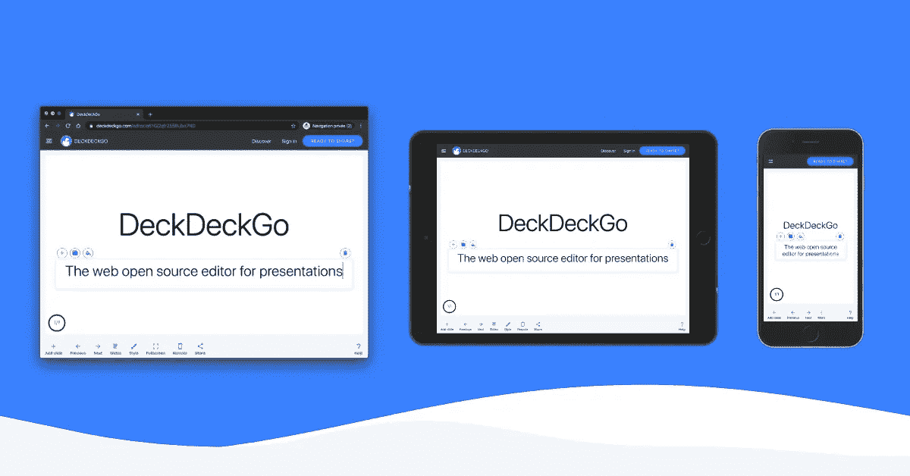

# 更多 Gatsby i18n 提示和技巧

> 原文：<https://javascript.plainenglish.io/more-gatsby-i18n-tips-and-tricks-4b71fc692136?source=collection_archive---------11----------------------->

## 我那篇关于 Gatsby 网站国际化的文章的后续。


Photo by [pure julia](https://unsplash.com/@purejulia?utm_source=unsplash&utm_medium=referral&utm_content=creditCopyText) on [Unsplash](https://unsplash.com/s/photos/world-map?utm_source=unsplash&utm_medium=referral&utm_content=creditCopyText)

今年(2020 年)早些时候，当我在封锁期间每天发布博客时，我与[盖茨比](https://www.gatsbyjs.com/)分享了[我的解决方案](https://medium.com/better-programming/internationalization-with-gatsby-ae3991c39e92)来国际化网站建设。

过去几天，我重新构建了 DeckDeckGo 的网站，目标是从我们的幻灯片编辑器中提取静态内容，并为我们平台的国际化奠定基础。

起初，我想尝试一种新方法，但没有找到任何对我有效的方法。这就是为什么我又一次用我自己的食谱和盖茨比一起开发了这个新网站。

这样做，我学到了一些新的技巧，也改进了，我希望，解决方案。

# 元

本文是我 2020 年 3 月博文的后续:[与盖茨比一起国际化](https://medium.com/better-programming/internationalization-with-gatsby-ae3991c39e92)。

现在的帖子是 2020 年 12 月用 Gatsby v2、 [gatsby-plugin-i18n](https://github.com/angeloocana/gatsby-plugin-i18n) v1、 [React](https://reactjs.org/) v17 和 [react-intl](https://github.com/formatjs/formatjs) v5 写的。

它的代码片段取自我们在 GitHub 上的开源网站。

# JSON 翻译文件

在上一篇文章中，我依靠 JavaScript 文件来处理翻译(`i18n/en.js`)。

```
module.exports = {
  hello: "Hello world",
}
```

不用说，我从来不喜欢这种方法。这就是为什么在我们的新网站中，我用 JSON 数据(`i18n/en.json`)代替了这些。

```
{
  "hello": "Hello world"
}
```

然后，这些 JSON 文件可以导入到它们各自的语言`Layout`组件中，就像我以前用 JS import ( `layout/en.js`)一样。

```
import Reactfrom 'react';
import Layout from './layout';// Previously with JS
// import messages from '../../../assets/i18n/en';// New with JSON
import messages from '../../i18n/en.json';

import '@formatjs/intl-pluralrules/locale-data/en';

export default (props) => (
  <Layout
    {...props}
    messages={messages}
  />
);
```

我没有对通用的`Layout`组件本身做任何修改。它仍然声明布局并将子元素包装在一个`IntlProvider`中。

```
import Reactfrom 'react';
import {useStaticQuery, graphql} from 'gatsby';

import {IntlProvider} from 'react-intl';
import '@formatjs/intl-pluralrules/polyfill';

import {getCurrentLangKey} from 'ptz-i18n';

export default ({children, location, messages}) => {
  const data = useStaticQuery(graphql`
    query SiteTitleQuery {
      site {
        siteMetadata {
          title
          languages {
            defaultLangKey
            langs
          }
        }
      }
    }
  `);

  const {langs, defaultLangKey} = data.site.siteMetadata.languages;
  const langKey = getCurrentLangKey(langs, defaultLangKey, location.pathname);

  return (
    <IntlProvider locale={langKey} messages={messages}>
      {children}
    </IntlProvider>
  );
};
```

# 多个 JSON 数据

我不知道这个习语在英语中是否存在，但是在法语中，with 可以说“不要把所有的鸡蛋放在同一个篮子里”。事实上，我们可能不希望在一个文件中处理所有的翻译，而是将它们分成多个数据。

多亏了 JSON，我能够很容易地解决这个需求。例如，我创建了两个独立的文件`i18n/index.json`和`i18n/common.json`。

需要注意的是，我在翻译的关键字前添加了关键字，比如`index`或`common`，以避免重复的关键字。

```
// A new file i18n/index.json{
  "index.hello": "Hello"
}// Another file i18n/common.json{
  "common.hello": "Hello"
}
```

由于使用了析构对象，每个文件最终都可以导入并连接到相关语言布局的翻译列表中(本例中为`layout/en.js`)。

```
import Reactfrom 'react';
import Layout from './layout';

import index from '../../i18n/index.json';
import common from '../../i18n/common.json';

import '@formatjs/intl-pluralrules/locale-data/en';

export default (props) => (
  <Layout
    {...props}
    messages={{
      ...index,
      ...common,
    }}
  />
);
```

使用这种方法，我们可以将我们的翻译分成尽可能多的独立文件，我们“只”需要导入和连接我们创建的每个新文件。

# 占位符、alt、aria-标签和标题

在 Daniel Yus chick[的一篇](https://twitter.com/Yuschick)[文章](https://medium.com/@Yuschick/translating-placeholder-alt-title-text-with-react-intl-a99d31f4194c)中，我发现 react-intl 现在公开了一个`useIntl`钩子，它在翻译占位符、alt、aria-label 和标题时非常方便。

```
import Reactfrom 'react';

import {useIntl} from 'react-intl';

export const Contact = () => {
  const intl = useIntl();

  return (
    <section>
      <textarea 
           placeholder={intl.formatMessage({id: 'hello.world'})}
           name="message"
           rows={4} /> 
    </section>
  );
};
```

# 链接

翻译有时包含 HTML 元素，如链接。像`The source code on <a href="...">GitHub</a> is super.`这样的句子要么需要多个翻译条目，要么需要一个方便的 react-intl 解决方案😉。

这个技巧可以通过在翻译中为链接引入一个“占位符”来实现(例如`{githubLink}`)。

```
{
  "source.code": "The source code is available on {githubLink}."
}
```

当使用 react-intl 提供的`FormattedMessage`组件时，我们可以用有效链接(HTML 元素)解析或替换这个“占位符”。

```
<FormattedMessage
  id="source.code"
  values={{
    githubLink: (
      <a href="https://github.com/deckgo/deckdeckgo">
        GitHub
      </a>
    ),
  }}
/>
```

# 覆盖主 Index.js

尽管如我在上一篇文章中所展示的，我将网站配置为将根路径查询路由到默认语言，但我注意到用`index.js`文件部署网站是安全的(r)。

```
// ./gatsby-browser.js

exports.onClientEntry = () => {
  if (window.location.pathname === '/') {
    window.location.pathname = `/en`;
  }
};
```

因为我不想手动维护多个条目文件，所以我创建了一个预构建脚本，它在构建时将`index.en.js`(我的主索引文件)复制到`index.js`。

此外，该脚本还在目标文件的开头添加了一个注释，这样我就会记住我不应该手动编辑它😅。

```
// copy-index.js

const fs = require('fs');

try {
  fs.copyFileSync('./src/pages/index.en.js', './src/pages/index.js');

  const content = fs.readFileSync('./src/pages/index.js');

  const comment = '/**\n * Do not modify! This file is overwritten by index.en.js at build time.\n */\n';

  fs.writeFileSync('./src/pages/index.js', comment + content);

  console.log(`index.en.js copied to index.js!`);
} catch (err) {
  console.error(`Cannot copy index.en.js`);
}
```

我通过向我的`package.json`添加一个`prebuild`目标来设置这个脚本。

```
"scripts": {
  "prebuild": "node ./copy-index.js",
  "develop": "gatsby develop",
  "start": "gatsby develop",
  "build": "gatsby build",
  "serve": "gatsby serve",
  "clean": "gatsby clean"
},
```

# 摘要

可能有一些其他更简单的解决方案来翻译 Gatsby 网站，但是，由于已经使用了我自己的食谱两次，我对结果和开发者体验都很满意。也就是说，下次我可能会再次寻找另一个解决方案，之后，永不停止学习是开发的乐趣所在。

圣诞快乐🎄。到无限和更远的地方！

大卫

你可以在推特上联系我，为什么不试着为你的下一次演讲联系 T2。

[](https://deckdeckgo.com)