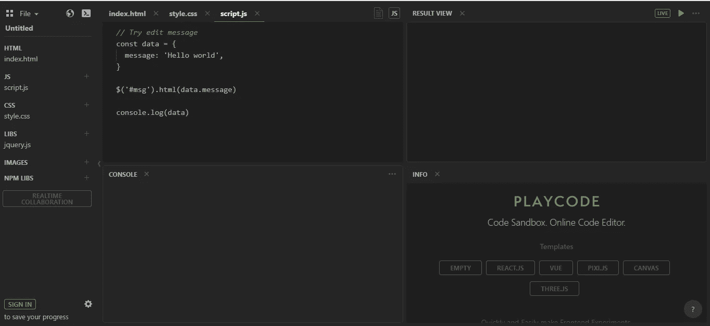
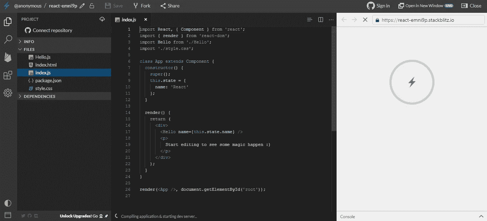
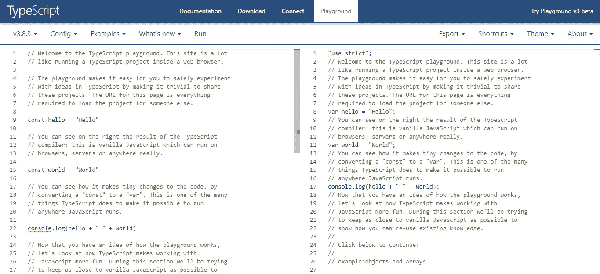
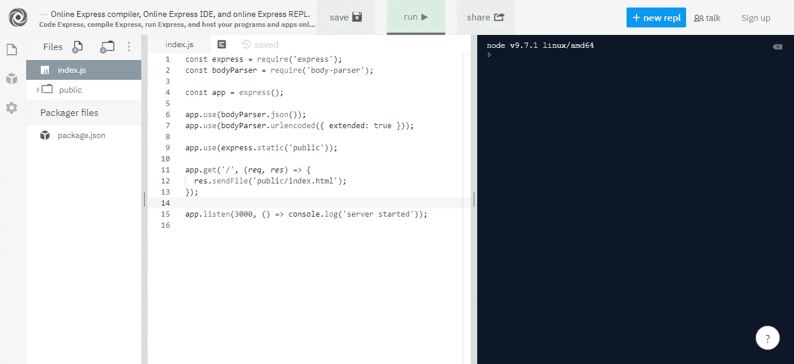

# 更多优秀的 JavaScript 代码编辑器

> 原文：<https://javascript.plainenglish.io/more-great-javascript-code-editors-d762835002cd?source=collection_archive---------7----------------------->

Photo by [Austin Distel](https://unsplash.com/@austindistel?utm_source=medium&utm_medium=referral) on [Unsplash](https://unsplash.com?utm_source=medium&utm_medium=referral)

多亏了互联网，我们可以在网上做很多事情。这包括编写 JavaScript 程序。

在本文中，我们将看看最好的在线 JavaScript 编辑器。我们可以在不下载和安装任何东西的情况下使用它们。

# 游戏代码

PlayCode 是一个简单的代码编辑器，用于处理前端 JavaScript 代码。

如果我们使用的是免费版本，那么除了 jQuery，我们不能使用任何库。我们可以用其他在线编辑器免费安装库，比如 JSFiddle 或 CodeSandvox。

但是，它确实在我们的代码中提供了语法高亮显示和输出及控制台的实时预览。

此外，免费版本附带了一些模板，我们可以免费使用 React 和 Vue 项目模板。

此外，我们可以免费在项目中添加或删除文件。

如果我们想上传图片，那么我们必须在 PlayCode 中为该功能付费。

# SourceLair

[SourceLair](https://www.sourcelair.com/home) 是另一个优质的在线编辑器。我们可以免费试用，但我们必须创建一个新帐户并登录才能试用。

它为我们提供了一个简单的编辑器，让我们摆弄我们的代码。

# 扑通一声

[Plunker](http://plnkr.co/) 让我们像其他在线编辑器一样摆弄前端 JavaScript 代码。

我们不必创建一个帐户并登录来做这件事。这很好，因为登录只是为了摆弄一些代码是不方便的。

在项目中，我们可以添加或删除文件，并编辑它们。它还为我们提供了一个预览，这很好。

它支持一些框架，为我们提供项目模板，使用 Angular 和 React 等框架创建项目。

此外，它支持一键格式化源代码，这样我们就不用自己动手了。

可选地，我们可以注册并登录来保存我们修改过的代码。

# 斯克林巴

Scrimba 不是典型的在线代码编辑器。这也是一个学习前端开发的学习工具。

在线代码编辑器是课程的一部分。它包括流行的前端开发主题，如 ES6 简介、React、GraphQL 等等。

还有其他前端课程，如 CSS 和 HTML。

Vue.js 课程也正在开发中。

# 斯塔克布里茨

一个基于 Visual Studio 代码编辑器的代码编辑器，也就是 Monaco 编辑器。

它还附带了几个创建新项目的模板，包括 Angular、React、Ionic、TypeScript、Rxjs 和 Svelte。

这很棒，因为我们可以创建超越简单 JavaScript 项目的项目。

此外，我们可以将我们自己的 NPM 包添加到我们创建的项目中，这非常好。

因为它是基于 Visual Studio 代码编辑器的，所以我们可以在编辑器中自动完成代码。

我们也可以自己添加和删除项目文件。它还允许我们直接从编辑器中将项目部署到 Firebase。

# 打字游戏场

TypeScript Playground 网站让我们摆弄打字代码。然而，它不让我们保存任何东西。

但是我们可以更改我们想要使用的 TypeScript 版本，以查看哪些版本支持哪些功能。

我们还可以加载一些代码示例。

对于学习 TypeScript 来说是一个很棒的编辑器。

# 回复它

[Repl.it](https://repl.it/) 是一个在线编辑器，让我们可以直接从浏览器运行 Python 或 Node.js 之类的运行时环境。

因此，用它来摆弄 Node.js 代码是很棒的。人们做的模板有 Node.js，Express 等等。

我们也可以在编辑器中运行 Jest 测试。

此外，我们可以在编辑器中安装软件包。此外，我们可以将自己的文件添加到项目中。

整个项目可以从脚本编辑器下载。

有些模板让我们向它的内置终端输入命令。我们也可以创建自己的程序，让我们打开终端并输入命令。

对于摆弄 Node.js 代码，这是一个很难击败的。此外，它还支持 Python 等其他运行时环境。

# 结论

网上有很多在线 JavaScript 编辑器。其中大部分是用来摆弄前端 JavaScript 的，比如 Plunker 和 PlayCode。

但是，也有像 Repl.it 这样用于后端的。

最后，还有在线编辑器，它们是像 StackBlitz 这样的教育网站的一部分，让我们通过实践来学习。

**用简单的英语来自 JavaScript 的一个提示:**我们总是对帮助推广高质量的内容感兴趣。如果你有一篇文章想用简单的英语提交给 JavaScript，用你的中级用户名发邮件到[submissions@javascriptinplainenglish.com](mailto:submissions@javascriptinplainenglish.com)给我们，我们会把你添加为作者。