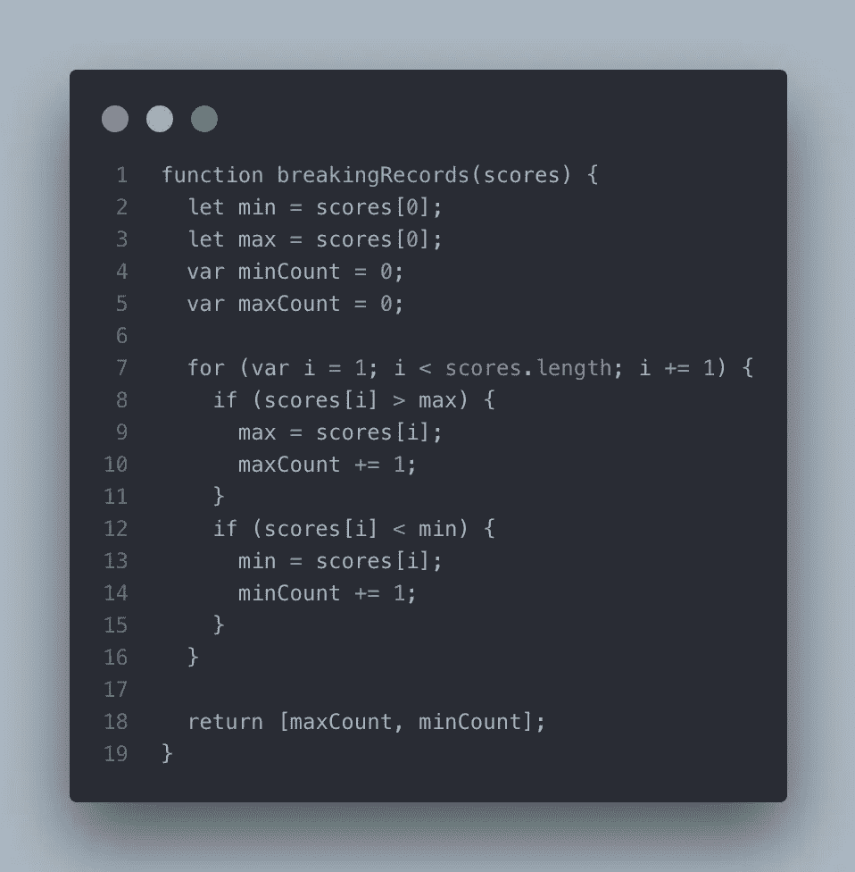
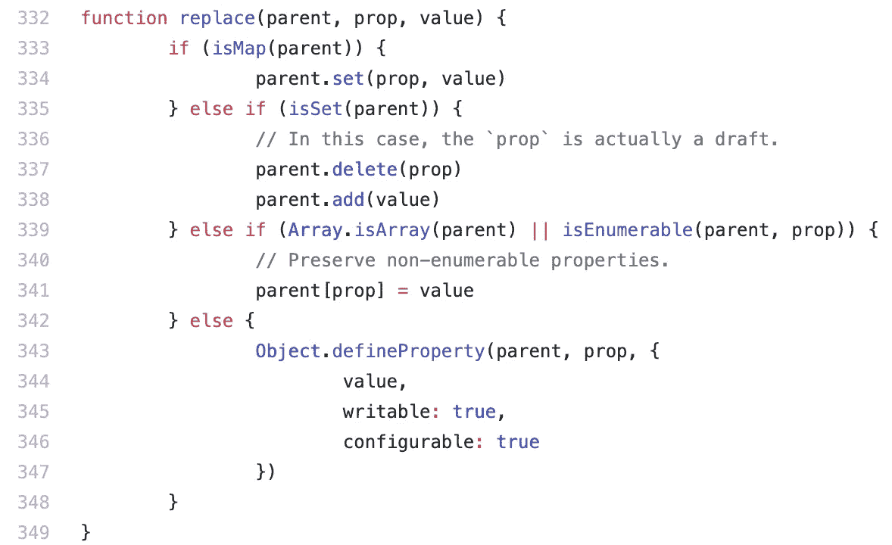
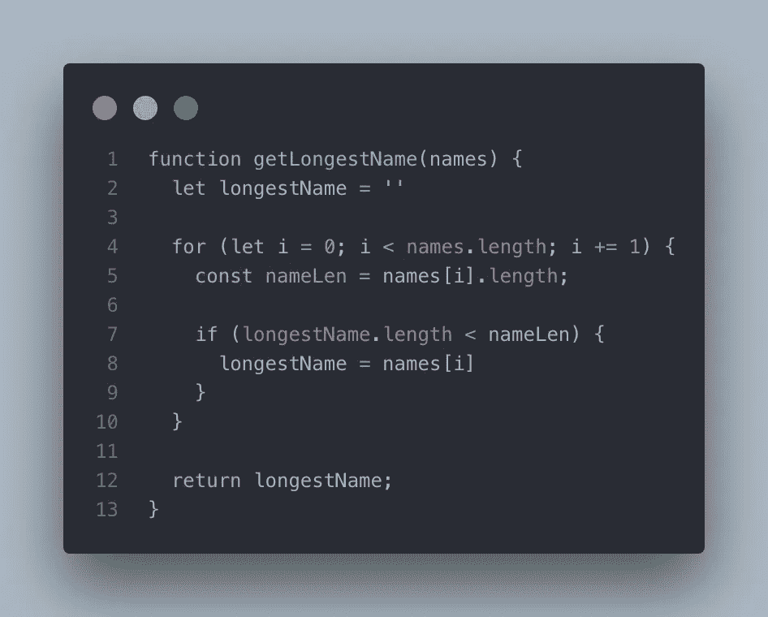
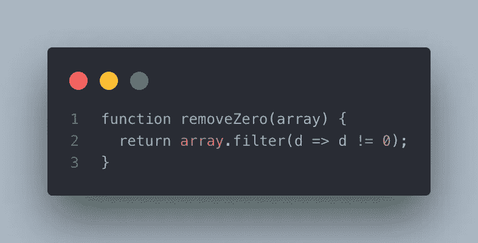
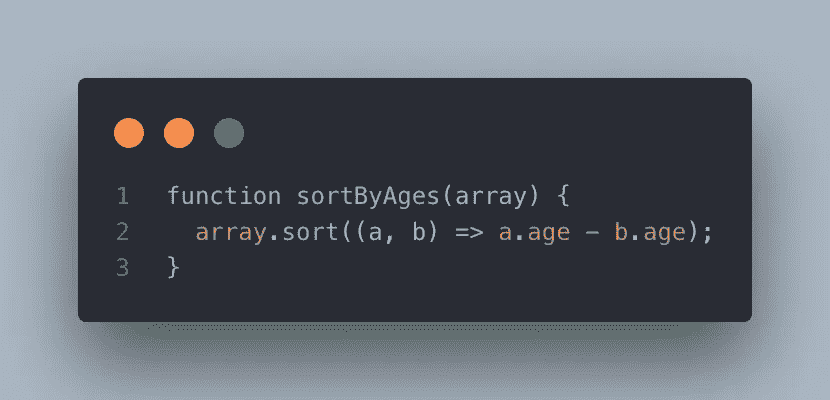

# 算法的 JavaScript 编码测试中最常见的错误

> 原文：<https://javascript.plainenglish.io/most-common-mistakes-in-javascript-coding-test-for-algorithm-42fa93e592a8?source=collection_archive---------4----------------------->

## Java Script 语言

## 即使您熟悉 JavaScript，您也可能在编码测试中出错


Photo by [Nick Morrison](https://unsplash.com/@nickmorrison?utm_source=medium&utm_medium=referral) on [Unsplash](https://unsplash.com?utm_source=medium&utm_medium=referral)

W 找出哪个申请人适合你的团队以及你一直在寻找的人的最佳方式是什么？你认为只看他们的简历可以吗？一些公司要求申请人参加编码测试，一些公司要求他们做一个小项目。

有很多服务，比如*编码*、*黑客银行*、 *TopCoder* 等等，用来练习算法和进行编码测试。其中一种更受欢迎的服务是如今许多公司使用的 [*协同*](https://www.codility.com/demo-2-1?utm_campaign=1730259814&utm_source=google&utm_medium=cpc&utm_term=codility&hsa_grp=67456014853&hsa_ad=389807617348&hsa_kw=codility&hsa_acc=2935819322&hsa_src=g&hsa_mt=e&hsa_ver=3&hsa_net=adwords&hsa_cam=1730259814&hsa_tgt=kwd-316766108300&gclid=CjwKCAiAwZTuBRAYEiwAcr67OaS3PW7W4AZO8bZlnmero3yo1-35HWHnXX_eAJi9BpFricuOfwAgxhoCoJUQAvD_BwE) 。我过去也用其中一些进行练习和测试。

我的团队有一种应用文化。我们作为一个团队一起审查申请人的申请，当然，我们都不会在办公室外透露任何个人信息，这是既定的。对我来说，有机会回顾申请人如何解决编码测试中的问题是一次宝贵的经历。然而，我发现有一些常见的错误，可能会让评审者不喜欢或不喜欢他们的申请。所以在这篇文章中，我将根据我的经验来谈谈编码测试中最常见的错误。

> **免责声明**
> 即使我所在的团队与所有成员一起审查简历和编码测试结果，我也没有任何权力对他们评分或雇用他们。此外，我将谈论的这些错误可能不是什么大问题。我只是想分享我从同事的反应中感受到的东西。这篇帖子所谈论的并不意味着它们是坏的！！ *🧙‍♂️🧙‍♂️*

# 一个。var、let 和 const

根据我的统计数据，我想说没有人相信，超过 50%的申请人使用了两种以上的语言，即 *var* 、 *let* 、 *const* 。我不是说你应该只使用 *var* 或 *const* 。在我们进一步讨论之前，先看看下面的代码。



[Gist source code](https://gist.github.com/moonformeli/1dadab988f019bc4f7e4c0f419232754)

上面这张截图是 HackerRank 中[破分的一个解决代码。你能在代码中看到什么？首先，用关键字声明变量， *var，*和 *let* 。 *let* 是 ECMAScript 2015 中已经包含的变量的关键字；另一方面， *var* 从 ECMAScript 第一版就已经存在。其次，你可以看到循环的*中的另一个*变量*。*](https://www.hackerrank.com/challenges/breaking-best-and-worst-records/problem)

```
var minCount -> let minCount
var maxCount -> let maxCountfor (var i = 1; ...) -> for (let i =1; ...)
```

为什么这些错误会导致评审员的低分，是因为您的代码似乎混淆了不同的 ECMAScript。例如，如果所有变量都只使用 *var* 声明，这可能会更好，因为审查者可能会认为您已经习惯了 ECMAScript 2009 或更早的版本。

当然，最好的选择是不使用 *var* 而只使用 *let* 或 *const* ，因为 ECMAScript 2015 已经发布了四年，这意味着你有足够的时间来习惯现代 JavaScript。

## 做🙆‍♂️

*   使用*让*和*保持不变(推荐！)*或 *var* only

## **不要🙅‍♂️**

*   不要混淆 *var* + ( *let* 或 *const)*

# 两个。分号

许多编程语言在语句末尾使用分号。有些语言，比如 Java，如果你忘记了分号，会给你一个错误。但是 JavaScript 即使没有分号也不会抛出错误。尽管如此，一些开源库并不像下面这样使用分号。



Immer.JS also doesn’t use semicolons — [Source code](https://github.com/immerjs/immer/blob/master/src/immer.js).

这个截图来自 Immer.js，用于创建不可变状态树。您可以看到代码中没有分号。但我不能说这是错的。他们的编码惯例仅仅是不使用分号。如果你想知道更多关于分号以及是否使用它们的信息，点击这里获得更多信息。



[Gist source code](https://gist.github.com/moonformeli/95205178280289c189e5dc00ee2b0ba0)

我希望你不要像上面那样写代码。有些行有分号，有些没有。我建议你一直使用分号。

## 做🙆‍♂️

*   要么一直用(*推荐！*)或省略分号

## 不🙅‍♂️

*   不要混用(*无分号* ) + *分号*

# 三个。等式运算符

这和第二部分有关，分号。在 JavaScript 中，有两种类型的相等运算符，严格比较(`===`)和抽象比较(`==`)。在大多数情况下，JavaScript 开发人员强烈建议您使用严格比较，除非您有特殊的目的。因为抽象比较可能会导致[意外的结果](https://dorey.github.io/JavaScript-Equality-Table/)。



[Gist source code](https://gist.github.com/moonformeli/70a79d8985cbdd8aa691188aa54d02c2)

想象一下函数`removeZero`的参数如下。

```
removeZero([0, 1, 2, '0', '1', '2']); 
// 1, 2, '1', '2'
```

尽管我想得到的结果是`(1, 2, ‘0’, ‘1’, ‘2’)`，`‘0’`也被过滤掉了。这是为什么呢？因为抽象比较运算符(`==`)认为`‘0’`也是`false`。另一方面，严格比较操作符(`===`)并不是这样工作的。`‘0’`是一个字符串，不为空，所以严格比较运算符不考虑`‘0’`是`false`。

## 做🙆‍♂️

*   始终建议使用严格比较(`===`)

## 不🙅‍♂️

*   不要使用抽象比较(`==`)

# 四个。不变

不变性已经成为 JavaScript 的一个重要概念，尤其是在 *React* 、 *Vue* 和 *Angular* 出现之后。许多开发人员研究了如何更有效地管理状态。他们关心的问题之一是更好的不变性。

在函数中，无论如何都不应该改变参数。这个概念也与纯函数有关。给参数赋值可能会产生副作用，这不是绝对推荐的做法。



[Gist source code](https://gist.github.com/moonformeli/670f3bead4cc27619104ffe06ba49ee6)

在编码测试中，您可以按照特定的条件对数组进行排序。但是，JavaScript 内置方法， *sort，*不会返回一个新数组作为结果。这不是你想要的方式。避免潜在的副作用总是更好。

## 做🙆‍♂️

*   将新对象声明为返回值。

## 不🙅‍♂️

*   无论如何都不要改变输入。这会产生副作用。

# 结论

可能还有更多我在这个帖子里没有提到的错误。阅读你的代码的审查员也会犯人为的错误，不要担心。但关键是，确保你的编码风格是一致的，如果可能的话，使用 ECMAScript 2015+方法。

谢谢你看我的帖子。祝您愉快:)

# 资源

*   [2017 年最受欢迎的编码挑战网站](https://www.freecodecamp.org/news/the-10-most-popular-coding-challenge-websites-of-2016-fb8a5672d22f/)
*   [黑客排名](https://www.hackerrank.com/dashboard)
*   [Immer.js Github](https://github.com/immerjs/immer)
*   [为什么显式分号在 JavaScript 中很重要](https://www.freecodecamp.org/news/codebyte-why-are-explicit-semicolons-important-in-javascript-49550bea0b82/)
*   [比较运算符— MDN](https://developer.mozilla.org/en-US/docs/Web/JavaScript/Reference/Operators/Comparison_Operators)
*   [纯函数](https://www.freecodecamp.org/news/what-is-a-pure-function-in-javascript-acb887375dfe/)