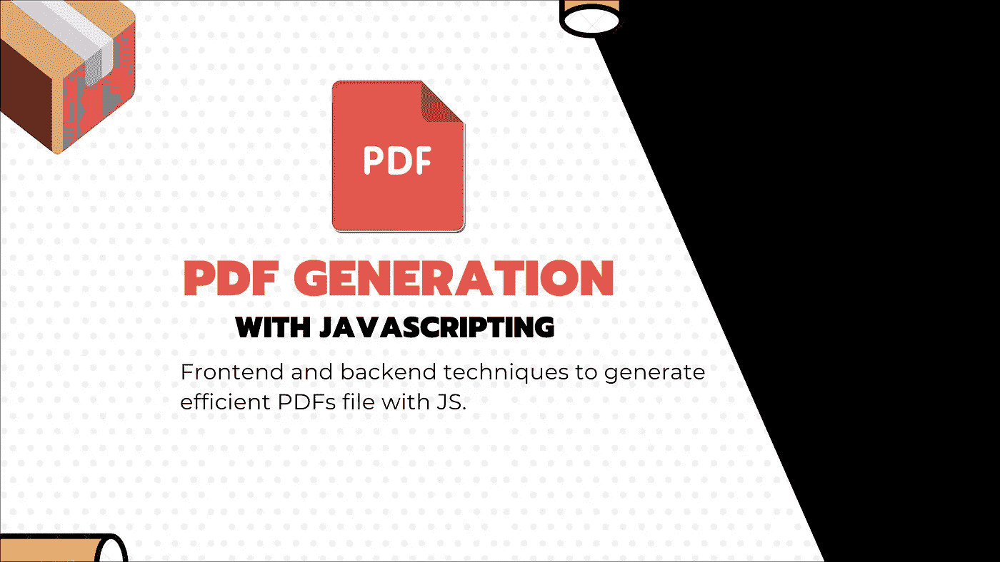

# 用后端和前端 JavaScript 构建 pdf 文件的最有效方法

> 原文：<https://javascript.plainenglish.io/most-efficient-ways-for-building-pdfs-files-with-backend-and-frontend-javascript-environment-68056f73257?source=collection_archive---------0----------------------->

## 体验反馈

## 我研究了用 JavaScript 在前端(React)或后端(云函数、monoliths 等)构建 pdf，以及如何构建之后的一些观察。



每个人在开发生涯的某一天都会面临构建 pdf 的需求。

PDF 是 Adobe 制作的一种非常常见的格式，它是最佳的矢量格式。这意味着，无论您在哪里使用它，任何设备上的所有内容都将适当缩放，以显示为高清内容。

老实说，你必须知道，就当今工具的一个特性而言:**在我看来，构建 pdf 可能是最难做的事情之一……**根据需要，事情可能会变得非常复杂，如果你不能与客户就事情进行权衡，这将非常耗时或昂贵。

但首先，让我们有一个大的图片:pdf 可以分为两种:

*   **简单的 PDF:** 这些是显示文本、链接、重点和图像等基本资产，没有复杂的东西。他们的布局很普通。想象一篇简单的文章 PDF，没有复杂的东西:你可以用 markdown 写然后导出为 PDF。
*   **复杂的 PDF** :需要元数据、防止书写的 SSL 加密、图表、章节摘要、目录、自动页码、混合横向和纵向页面。您可能还需要表单、表单填写、附件，甚至用编辑、融合、覆盖等功能合成 PDF

要解决这两个需求，主要有两种实现方法:

*   **有些 PDF 只是基于图像:**整个 PDF 或某个部分是某个运行时 UI 的截图。这样，如果你放大它，他们会失去质量。这是一个处理 PDF 的拙劣技巧，但它适用于 A4 打印，因为大小是“固定的”。当有人扫描一本书的页面以使其在数字世界中可用时，您经常会看到这些类型的 pdf。
*   **而最佳质量的 pdf 是基于矢量的**，这意味着你可以放大或打印它，你会得到顶级的质量。这就是 PDF 通常应该有的样子。

其中一些技术和库提供了灵活性和如此好的开发人员体验。它们往往受限于高级功能，如目录或 SSL 签名。

**⚡️这篇文章是我的研究和观察的浓缩，它将介绍许多处理 pdf 的方法，并对每种方法进行利弊分析。它也对你们的观察开放，所以如果你们有任何意见，请随时联系我。**

哦，还有最后一件事！您可以根据需要在前端或后端构建 pdf，让我们来详细了解一下。

# 我应该在前端/客户端构建 pdf 吗？

在前端构建 pdf 的过程只是使用网络浏览器来生成文件(或任何类型的前端客户端，如移动应用程序)。

然后浏览器将显示它或触发 BLOB(二进制大对象)的下载，而不进行任何网络请求。

**✅使用前端 PDF 生成有多种好处:**

*   它从您的服务器上节省资源，当您为大量用户生成大量 pdf 时，它尤其有用，而且非常频繁。
*   它允许离线功能，例如渐进式网络应用。因此，您可以从任何地方导出 pdf，即使是在飞机上，所有这些都不需要任何互联网连接。
*   它是安全的，符合 GDPR 标准，因为您可以使用用户数据，而不必让它们在网络中传播，甚至不用让您的服务器知道。

**❌，但它也有这个数量的缺点:**

*   由于代码位于前端，您对访问策略的控制更少，而且可能更难限制对某些功能的访问，比如对付费计划的访问。
*   您可能需要根据平台进行代码调整，因为并非每个浏览器的工作方式都相同，也不等同。有时某些功能可能只是在某些浏览器上缺乏支持。
*   您需要一个后端，当然，您将每月为此付费。有些应用程序没有后端，如果仅仅为了这个用例而构建和托管一个应用程序，那将是可悲的。

## 用纯 JavaScript 编写 PDF

首先，让我们看看在 JavaScript 中使用某种命令式编程的“经典方式”。

为此，您可以在前端使用类似[https://pdfkit.org/](https://pdfkit.org/)的东西(但它也可以在后端工作，因为它是一个多态库，很好！).

让我们来看一个你在[https://pdfkit.org/demo/out.pdf](https://pdfkit.org/demo/out.pdf)能取得什么成就的简单例子

下面的代码片段展示了编写文本、图像和 SVG 是多么容易。

```
// create a document and pipe to a blob
var doc = new PDFDocument();
var stream = doc.pipe(blobStream());// draw some text
doc.fontSize(25).text('Here is some vector graphics...', 100, 80);// some vector graphics
doc
  .save()
  .moveTo(100, 150)
  .lineTo(100, 250)
  .lineTo(200, 250)
  .fill('#FF3300');doc.circle(280, 200, 50).fill('#6600FF');// an SVG path
doc
  .scale(0.6)
  .translate(470, 130)
  .path('M 250,75 L 323,301 131,161 369,161 177,301 z')
  .fill('red', 'even-odd')
  .restore();// and some justified text wrapped into columns
doc
  .text('And here is some wrapped text...', 100, 300)
  .font('Times-Roman', 13)
  .moveDown()
  .text(lorem, {
    width: 412,
    align: 'justify',
    indent: 30,
    columns: 2,
    height: 300,
    ellipsis: true
  });// end and display the document in the iframe to the right
doc.end();
stream.on('finish', function() {
  iframe.src = stream.toBlobURL('application/pdf');
});
```

好吧。太好了。这只是对命令式指令进行排序的问题，仅此而已，是一种低级 API。您需要定制图表吗？您需要使用 SVG 和类似 [d3-js](https://d3js.org/) 的东西自己制作。

由于这是必不可少的，尤其是在 API 较低的情况下，要达到预期的最终结果可能需要一些时间，并且可能需要大量的代码。您可能需要使用向量进行一些 2D 建模来绘制您需要的东西，而该工具对此没有任何帮助。

如果您正在使用 React JS，那么您可以使用声明性包装器来实现类似的功能，该包装器提供了更高层的组件。

## 使用 ReactJS

反应上下文中最好的工具是[https://react-pdf.org/](https://react-pdf.org/)它允许您使用反应组件设计 PDF，并使用某种 CSS 语言进行布局，这很棒。

```
import React from 'react';
import { Page, Text, View, Document, StyleSheet } from '[@react](http://twitter.com/react)-pdf/renderer';// Create styles
const styles = StyleSheet.create({
  page: {
    flexDirection: 'row',
    backgroundColor: '#E4E4E4'
  },
  section: {
    margin: 10,
    padding: 10,
    flexGrow: 1
  }
});// Create Document Component
const MyDocument = () => (
  <Document>
    <Page size="A4" style={styles.page}>
      <View style={styles.section}>
        <Text>Section #1</Text>
      </View>
      <View style={styles.section}>
        <Text>Section #2</Text>
      </View>
    </Page>
  </Document>
);
```

好吧，这个好一点，非常简单，不是吗？它也更容易维护，因为它使用了一种 JSX 指令和组件，这是一个伟大的方式来分割我们的界面。

但它也带来了同样的问题。它仍然是低层次的，也依赖于画布来满足特定的需求，如图表。同样，你需要一些外部库。

在引擎盖下 react-pdf 使用 PDFKit。

对于 JavaScript 中的前端，我想基于 PDFKit 的工具是唯一可行的工具，但我可能缺少一些东西，如果你有更高级别的 API 和更好的支持，请随时联系我:)

在那篇文章中，我们将在前端再看到一个，因为它也是一个跨平台工具:)

# 还是应该用 NodeJS 或者云功能在后端/服务器上构建 pdf？

在这种情况下，每一个逻辑都被委托给服务器，服务器将拥有渲染我们的 PDF 并将其发送到客户端应用程序的一切。

**✅使用后端 PDF 生成有各种好处:**

*   它提供了更多的制作 pdf 的能力，因为你可以依赖于其他语言的一些现有的二进制文件，专门用于 pdf 生成。
*   你有更多的控制一切，如访问控制政策，因为它的服务器权限，你可以切断访问，如果用户没有支付，例如。
*   您可以使用第三方服务并控制对它的访问和使用。
*   您可以确保结果在所有设备上都是相同的，因为您可以控制执行环境。使用后端时，通常要确保客户端平台之间的一致性。

**❌但它也有这样的缺点:**

*   作为主要的缺点，你需要在前端的互联网连接。
*   你需要一个每月花费一些的后端。您可能需要根据访问频率进行扩展的后端。
*   如果后端崩溃，功能也会崩溃，而在前端集成中，一切都还可以工作。
*   这也可能不太安全，因为您可能需要将用户信息发送到后端，而他还没有为其他目的收集这些信息。

## 为后端 pdf 生成选择合适的环境

在后端构建 pdf 之前，您必须了解您的环境和附带的库。举个例子，你不能使用云函数环境中的所有东西，因为它可能缺少一些二进制文件。

*   我有 Ubuntu Linux、CentOS 甚至 Windows 服务器吗？
*   我的代码是运行在一个准系统服务器上还是在一个云函数内部？
*   我的 RAM 和处理器能力如何？

这里有一些你应该问自己的问题。考虑到这一点，在服务器端构建 pdf 有多种方法。

有些是关于 HTML 的，对于小用例非常有用。其他的是关于最基本的 pdf 客户端，对于复杂的用例来说更难，但也更有效。

你甚至可以依靠外部服务，比如 SAAS 软件。

## 使用 Puppeteer 在后端生成 pdf

木偶戏应该是基于 chromium 浏览器的无头客户端，它是由谷歌工程师制作的。您正在编写驱动某些页面上的浏览器的代码，或者在浏览器中注入一些 HTML，然后您可以与 HTML 文档进行交互。

因此，您将使用浏览器的功能`save to PDF`,这样您所要做的就是设计一个专门用于打印的 CSS 页面或添加一个 CSS 打印纸。

我们以这样的代码结束:

```
const chromium = require('chrome-aws-lambda');exports.handler = async (req, res) => {
  let result = null;
  let browser = null;try {
    browser = await chromium.puppeteer.launch({
      args: chromium.args,
      defaultViewport: chromium.defaultViewport,
      executablePath: await chromium.executablePath,
      headless: chromium.headless,
      ignoreHTTPSErrors: true,
    });let page = await browser.newPage();await page.goto('[https://example.com'](https://example.com'));const pdfBuffer = await page.pdf({ printBackground: true });res.set("Content-Type", "application/pdf");
  res.set("Content-Disposition", 'attachment; filename="My-report.pdf"');
  res.status(200).send(pdfBuffer);
  } catch (error) {
    return res.status(500).send(error);
  } finally {
    if (browser !== null) {
      await browser.close();
    }
  }
};
```

**这很棒，但老实说，有点不太好。**

说到困难，当您需要高级功能时，事情可能会变得更困难，例如在 PDF 中混合横向和纵向页面，使用目录，或将许多 PDF 合并在一起。

浏览器不应该是一个以 pdf 为中心的工具，它只是一个方便的功能，用于在源位置快速导出一些页面。我们将用户方便的特性劫持为服务器使用的大规模生产特性。

通过这样做，我们将自己暴露在一些奇怪的行为中。

如果你选择继续这样做，看看[https://github.com/alixaxel/chrome-aws-lambda](https://github.com/alixaxel/chrome-aws-lambda)，这是一个库，它保证在云函数中工作，而纯木偶师可能不会…

**💡如果您运行时间很短，并且您的用例很简单，我会推荐这种方法，因为它很容易实现。**

## 使用 GotenBerg 和 Docker 生成 pdf

以同样的方式，你有了 tenberg，一个基于 Docker 的解决方案，作为一个自治的 API 服务器来处理 pdf

[](https://thecodingmachine.github.io/gotenberg/) [## 降价

### Gotenberg 是一个 Docker 支持的无状态 API，用于将 HTML、Markdown 和 Office 文档转换为 PDF。HTML 和…

thecodingmachine.github.io](https://thecodingmachine.github.io/gotenberg/) 

这是一个伟大的工具，你一定要看看它！

## 使用“PDF lib”库

根据我的研究，这可能是最有希望处理 pdf 的库，因为它支持各种带有表单、元数据和覆盖的用例面板。

**🎉哦，是的，我在这里谈论它，但它是跨平台的**

用 TypeScript 编写，编译成纯 JavaScript，没有原生依赖。适用于任何 JavaScript 运行时，包括浏览器、Node、Deno，甚至 React Native。

 [## 在任何 JavaScript 环境中创建和修改 PDF 文档。

### 在任何 JavaScript 环境中创建和修改 PDF 文档。

在任何 JavaScript environment.pdf-lib.js.org 中创建和修改 PDF 文档](https://pdf-lib.js.org/) 

使用合并，我们可以通过合并两个不同的 pdf 在一个文档上使用不同的方向。您可以把这个库想象成 PDFKit，但是有一些额外的实现，以避免在第一个用例中使用 Canva。

⚡️:这真的是一个很棒的工具，我想它是目前免费开源解决方案的赢家，值得一提的是它是跨平台的。

## 使用第三方服务在 NodeJS 上生成 pdf

本文的最后一个是 SAAS，问题是 SAAS 在大多数情况下是昂贵的，因为你要为集成花费时间。

SAAS 也有一个问题，即您与外部服务紧密耦合，并且您依赖于他们可能变化的策略和价格变化。

但是 SAAS 通常很容易实现，而且安全可靠，因为他们的团队正在开发它，而且可能只使用了很多测试工具。如果发现任何问题，他们也会提供帮助。

以下是一些看起来很有前景的工具:

*   【https://pdfgeneratorapi.com/ 号
*   https://docraptor.com/[(基于 HTML，但具有混合布局等强大功能)](https://docraptor.com/)
*   [https://www.docmosis.com/](https://www.docmosis.com/)

如果你能负担得起，这可能是一个很好的解决方案！

# 外卖食品

考虑你的需求以及你能在多大程度上做出权衡。思考基本问题:

*   它需要离线工作吗？
*   我的 PDF 文件有多复杂？
*   我有后端吗，是服务器还是云功能？
*   我有多少时间做那个？
*   在项目中引入第三方服务可以付费吗？

考虑到这一点，您可以选择是服务器端还是客户端。然后，您可以使用一些技术，如木偶戏或定制实现。如果你赚了很多钱，你甚至可以把责任转移给一个外部服务来负责。

[**🇫🇷如果你是法国人🥖？**我也建议⚡️ **编码火花**并以简讯技术的形式接收内容技术的酬金！](https://codingspark.io?referral=medium)