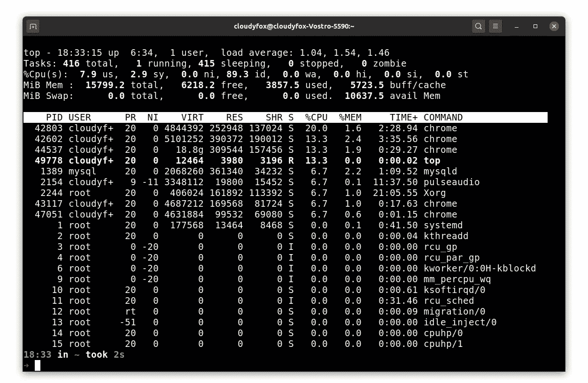
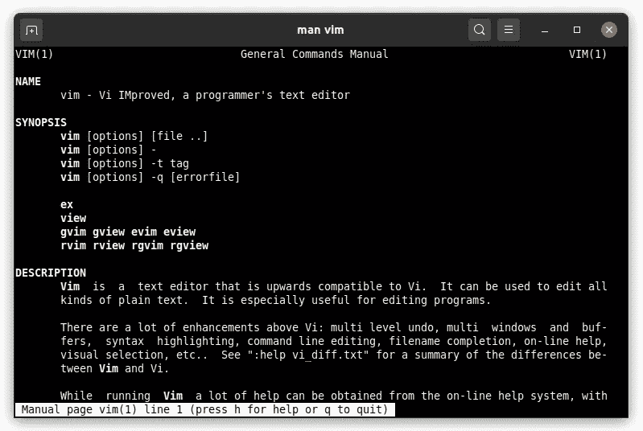
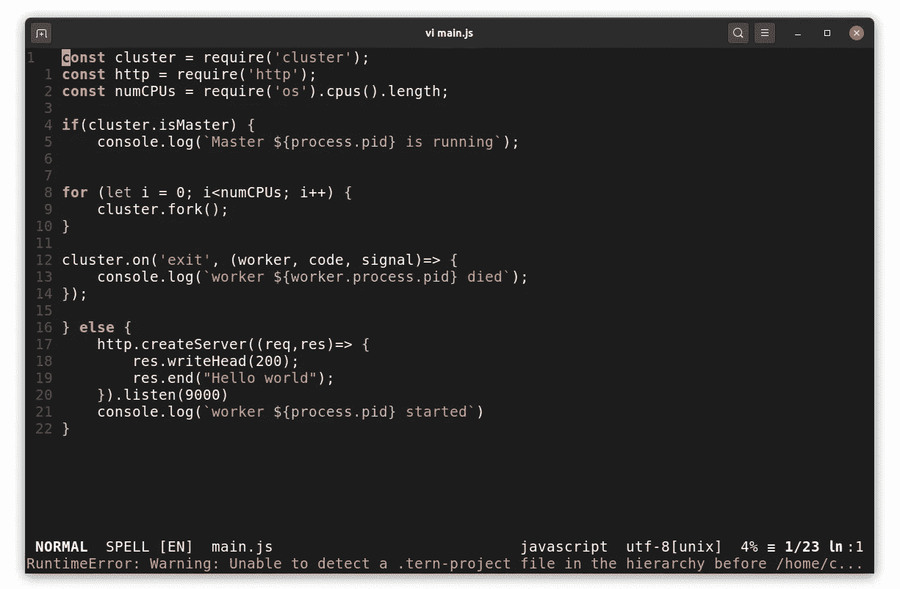
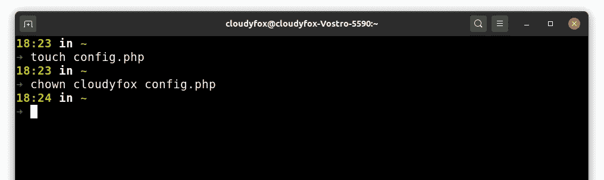
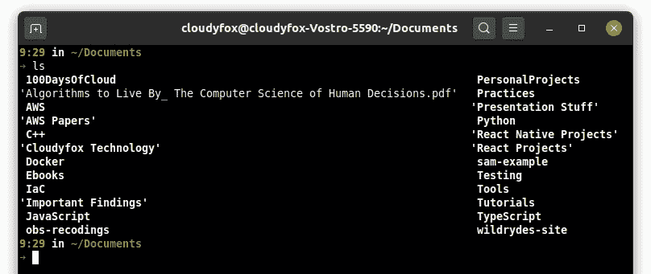
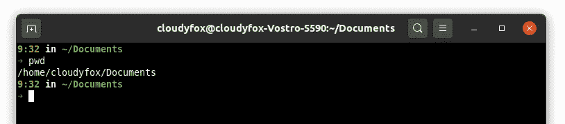
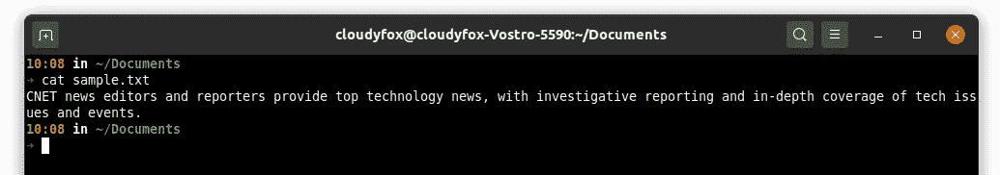
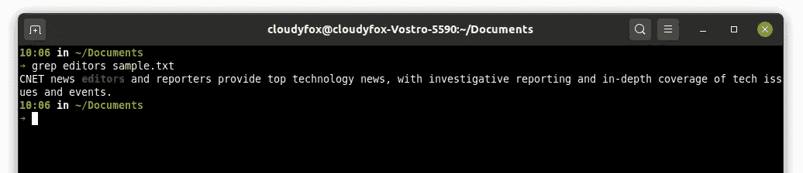
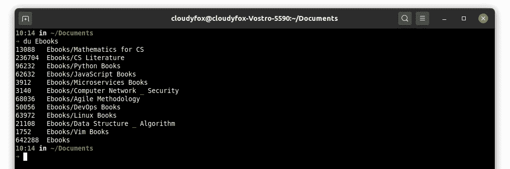
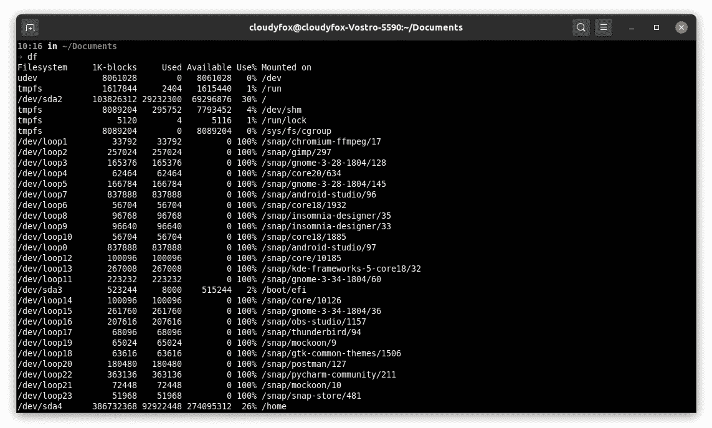

# 开发人员最重要的 Linux 命令

> 原文：<https://javascript.plainenglish.io/most-important-linux-commands-for-developers-d84acd612fb8?source=collection_archive---------3----------------------->



Linx processes

在进入命令列表之前，我们先来谈谈 **Linux Shell** 。

## 什么是壳牌？

外壳是一个命令行解释器，它接受用户的命令，并提供用户和操作系统之间的接口。它可以直接调用操作系统级 API。

Shell 本身就是一种编程语言。它有自己的循环、条件、函数、数组等功能。

一些流行的 shell 示例有:

1.  尝试
2.  Zsh
3.  Ksh
4.  Tcsh 等

> 我个人使用 Zsh。它有很多插件，如 oh-my-zsh，zsh-宇宙飞船等，这使得它更强大。

# 最常用的命令

> 请注意，Linux 命令区分 ASCII 大小写。如果您键入`CD`而不是`cd`，外壳将抛出错误。

## 1.人工指挥

它用于读取工具的文档。每当您需要帮助时，这个命令就变成了一个非常方便的工具。

例如查看 vim hit 的手册`$ man vim`



## 2.vim 命令

vim 是一个基于终端的文本编辑器。您可以将其用作代码编辑器。



## 3.chown 命令

`chown`该命令允许您更改用户或组对文件、目录或符号链接的所有权。

```
chown [OPTIONS] USER[:GROUP] FILE(s)
```



在上面的例子中，cloudyfox 是 config.php 的所有者。还有许多其他选项可以传递给 chown 命令。

## 4.chmod 命令

在类似 Unix 的操作系统中，使用 **chmod** 命令来改变文件的访问模式。

例如让一个文件可执行命中`chmod +x <filename>`

## 5.ls 命令

`ls`列出当前工作目录中的文件和文件夹。



在上例中，`ls`命令列出了所有位于~/Documents 内部的文件和文件夹。

## 6.pwd 命令

`pwd`检查您所在的工作目录。



## 7.mkdir 命令

`mkdir <directory name>` 新建目录或文件夹。

## 8.rmdir 命令

`rmdir <directory name>`删除指定目录。如果目录不为空，它将不会删除该目录。

## 9.触摸命令

`touch <filename>`重新制作新文件。例如，如果你需要`index.html`一个文件，然后点击`touch index.html`

## 10.cd 命令

`cd <path to the location>`变更工作目录。

## **11。cp 命令**

`cp <file> <path to destination>`将文件从一个位置复制到另一个位置。

## 12.mv 命令

`mv <file> <path you want to move`移动文件或文件夹

## 13.卡特彼勒指令

`cat <file>`显示文件的内容。



## 14.grep 命令

Grep 是代表全局正则表达式打印的首字母缩写词。Grep 是一个 Linux / Unix 命令行工具，用于在指定文件中搜索字符串。



在这个例子中，我在 sample.txt 中搜索 word 编辑器，它以红色突出显示。

您可以将这些命令与许多其他选项一起使用。

## 15.tar 命令

Linux 上的 tar 命令经常用于创建. tar.gz 或。tgz 归档文件，也称为“tarballs”

例如`tar -czvf name-of-archive.tar.gz /path/to/directory-or-file`

## 16.杜命令

**du** 命令，磁盘使用量的简称，用于估计文件空间使用量。



在示例中，它显示了目录电子书的磁盘使用情况。`$du Ebooks`

## 17.测向命令

**df** 命令(disk free 的缩写)用于显示与文件系统相关的总空间和可用空间的信息。



## 18.杀

kill 命令用于终止 Linux 系统中的指定进程。

例如`$ kill pid`

你可以传递任何选项到 kill 命令。

就是这样。这些是日常 Linux 用户经常使用的命令。我在工作中几乎每天都使用这些命令。这真的取决于你在做什么工作。如果你做管理类的工作，那么有很多基于命令的工具，比如 htop，top，netstat，ping，ifconfig 等等。

## $快乐学习> _