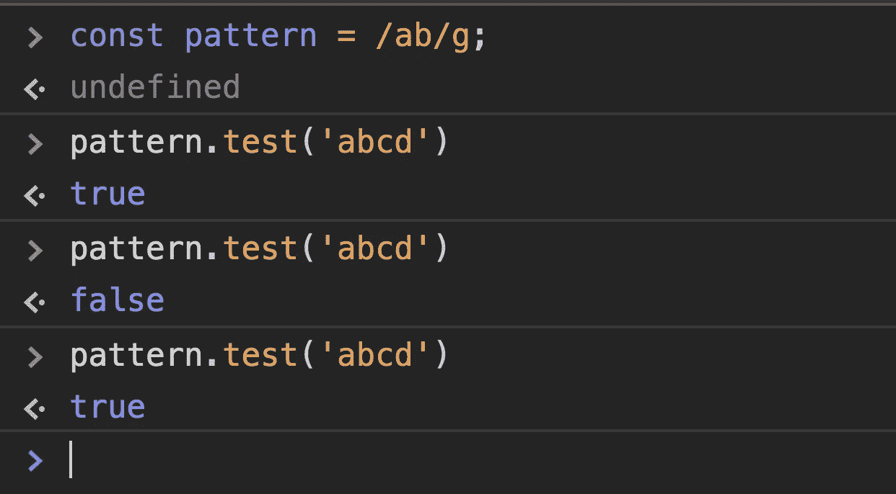

# 你见过的最令人惊讶的 JavaScript 正则表达式行为

> 原文：<https://javascript.plainenglish.io/most-surprising-behavior-of-javascript-regular-expression-you-have-ever-seen-1ddb84539163?source=collection_archive---------4----------------------->

## 我敢肯定，你可能从来没有注意到这个令人惊讶的行为



> **JavaScript 正则表达式对象在模式中有/g 或/y 标志匹配时是有状态的。**

当您创建一个带有`/g`标志的正则表达式时，它维护`lastIndex`属性，该属性跟踪**索引，从哪里开始寻找下一个匹配**。所以下次当我们开始使用相同的模式测试时，它会从找到最后一个匹配的索引开始搜索。

考虑一下，我们有这样一个正则表达式

```
const pattern = /ab/g;
```

如果你想找出这个模式是否存在于任何一个被传递的字符串中，我们可以这样做:

```
console.log(pattern.test('abcd')) // true
console.log(pattern.lastIndex) // 2
```

但是由于`lastIndex`属性是由存储在变量`pattern`中的正则表达式维护的，变量`pattern`最初为 0，当它在字符串`abcd`中的`0th`位置找到匹配时变为 2，所以当我们下次调用`test`方法时，它从`2nd`位置开始搜索匹配，所以匹配失败。

```
console.log(pattern.test('abcd')) // true
console.log(pattern.lastIndex) // 2console.log(pattern.test('abcd')) // false
console.log(pattern.lastIndex) // 0
```

由于它无法从位置 2 开始在`abcd`中找到字符串`ab`，它将`lastIndex`属性重置为`0`，因此当我们再次调用该方法时，它将返回`true`。

```
console.log(pattern.test('abcd')) // true
```

> ***这可能不是您所期望的行为，但这就是正则表达式在使用*** `***test()***` ***或*** `***exec()***` ***方法时维护 lastIndex 属性的方式。***

在某些情况下，这种行为有时很有用。

*假设你想找到一个字符串中所有元音的位置，你可以这样做*

```
const source = "This is some text";
const pattern = /[aeiou]/g;while((result = pattern.exec(source)) !== null) {
  console.log("Character " + result[0] + " found at position " + (pattern.lastIndex - 1));
}/* output:Character i found at position 2
Character i found at position 5
Character o found at position 9
Character e found at position 11
Character e found at position 14*/
```

但这可能不是你一直想要的行为。

所以在那种情况下，你可以使用正则表达式的`match()`方法，而不是`test()`或者`exec()`。

如果您只想使用`test()`方法，那么您需要在每次搜索后将`lastIndex`重置为 0。

```
const pattern = /ab/g;
console.log(pattern.test('abcd')) // true
pattern.lastIndex = 0;
console.log(pattern.test('abcd')) // true
```

*这是你见过的最令人惊讶的正则表达式行为之一。*

今天到此为止。希望你今天学到了新东西。

**别忘了直接在你的收件箱** [**这里**](https://yogeshchavan.dev) **订阅我的每周时事通讯，里面有惊人的技巧、诀窍和文章。**