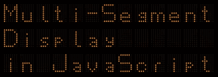
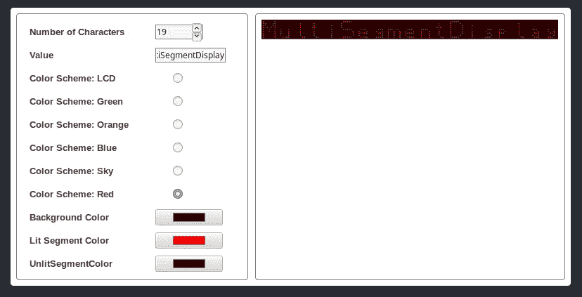

# JavaScript 中的多段显示

> 原文：<https://javascript.plainenglish.io/multi-segment-display-in-javascript-6f256153cda8?source=collection_archive---------15----------------------->

我最近写了一篇关于[用 JavaScript](https://medium.com/javascript-in-plain-english/build-a-seven-segment-display-in-javascript-8822a7332c70) 构建七段显示的文章。在这篇文章中，我将扩展这个想法，创建一个多段显示，正如你从上面的横幅中看到的，不仅可以显示数字，还可以显示字母和标点符号。

## 该项目

该项目由以下文件组成，您可以克隆/下载 [Github 库](https://github.com/CodeDrome/multi-segment-display-javascript)。

*   multi _ segment _ show . js
*   multi _ segment _ 显示器. htm
*   multi _ segment _ show _ page . js

显示器本身位于 **multi_segment_display.js** 中，并作为 ES6/ES2015 类实现。让我们看看代码，从构造函数开始。

首先，`_ColorSchemes`对象被用作`ColorScheme`属性的枚举。对于显示的内容和格式，有许多变量，我们将在后面的使用中看到。最后，有几个函数调用来设置显示，我将在适当的时候详细描述。

接下来我们有属性。

大多数属性只不过是各种支持变量的 getter/setter。然而，最后两个稍微复杂一些:

## 字符数

该属性的设置器首先验证新值，然后需要调用几个函数来完全重新配置显示。

## 文本

这里我们需要检查新值是否太长。如果可以，我们用空格填充字符串，然后调用一个函数来显示它。

现在我们来看看方法。

## _SetHeight

该函数将小部件的高度设置为任意特定字符数的宽度的固定比例。

## _ 创建分段

每个段都是一个 SVG 元素，这些都是由这个函数创建的。

## _ SetSegmentColours

通过将适当的元素设置为点亮或不点亮的段颜色来显示字母、数字和其他字符。`RedrawAll`参数指定是否重画所有元素。如果这是假的，只有改变的字符会被重画，如果`Text`属性已经被改变，这就足够了。然而，如果一种颜色被改变了，即使文本是相同的，这也需要为真来强制小部件重新绘制所有的段。

最后，我们需要为每个字符设置分段打开或关闭模式。

这是一个冗长的函数，它为每个可显示的字符创建一个二维数组，显示哪些段“开”，哪些段“关”。我在这里只展示了一个，分布在多行中，以显示实际的字符“A”可以在 0 和 1 的海洋中辨别出来。

如果`_SetSegmentColours`函数不能从`_SegmentPatterns`的`Text`属性中找到一个字符，它将打印一个空格。不过，如果你觉得有必要的话，可以在这个功能中给`_SegmentPatterns`添加其他角色。

## 尝试一下

小部件的代码现在已经完成了，但是我已经在 Github 存储库中包含了一个 HTML 文件和一个 JavaScript 文件来进行测试。我不会在这里展示这些代码，但是如果你在浏览器中打开这个页面，它看起来就像这样。

如你所见，左边有几个设置属性的控件，右边有一个小部件的实例。**multi _ segment _ display _ page . js**文件只包含处理各种 onchange 事件的代码。花几分钟时间玩一下 UI，请随意使用或修改这个小部件。