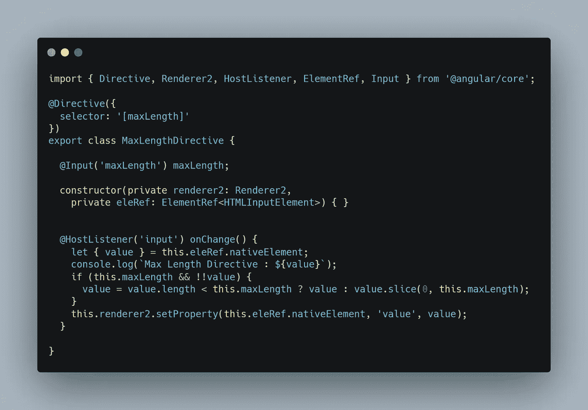
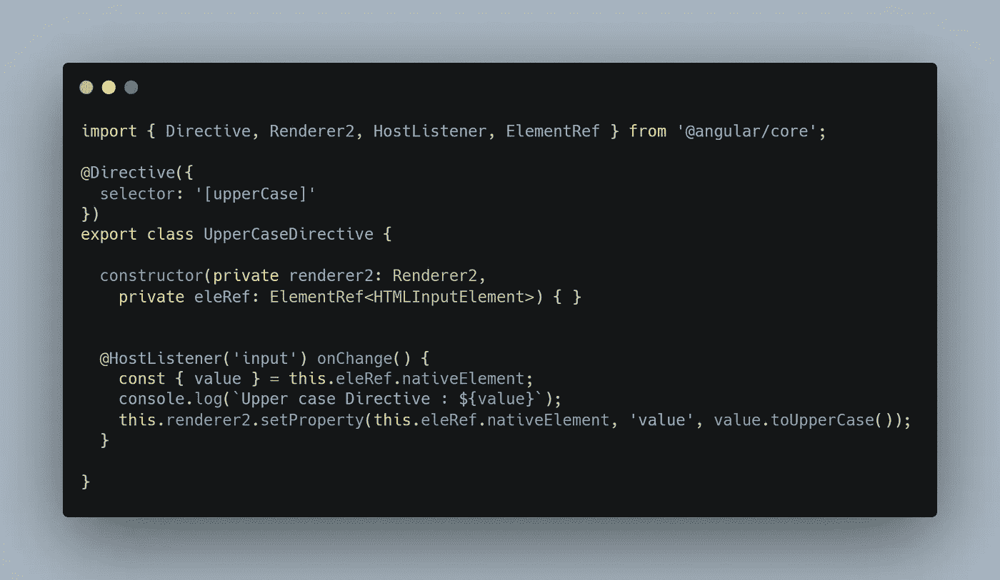
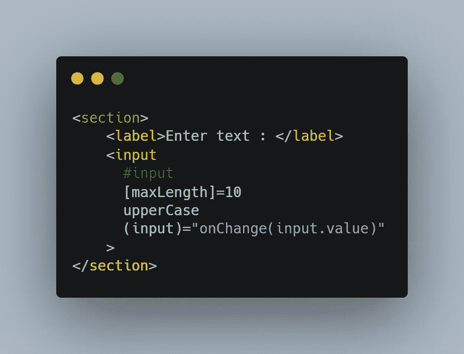
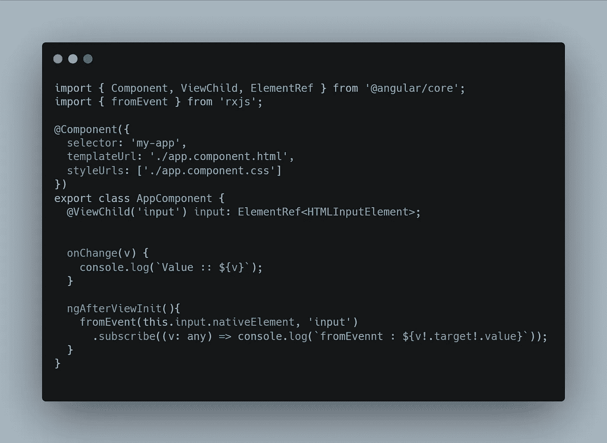

# 元素上的多属性角度指令

> 原文：<https://javascript.plainenglish.io/multiple-attribute-angular-directives-on-an-element-f06312d2a60c?source=collection_archive---------0----------------------->

## *角度属性指令——用于改变元素、组件或不同指令的外观或行为*

在许多情况下，我们可能需要格式化用户的输入，或者在用户输入时改变元素的外观；和指令是 Angular 中这种情况的合适候选者。本文的目标是关注一个元素上多个指令的用例，并学习它在事件委托方面是如何工作的。

*Angular 有几个内置的属性指令 ngStyle 和 ngClass，这使得在组件或元素上动态应用样式变得容易*

## **示例用例/需求**

现在让我们构建两个指令:一个限制用户输入的长度，另一个将用户输入转换成大写。

## **指令执行**

1.  *MaxLength 指令*

我们使用 angular 的主机监听器绑定到主机元素的输入事件。onChange 函数的实现非常简单，只需减少额外的字符，并使用渲染器更新原生元素的值。

2.*大写指令*

另一个简单的指令监听本地元素的输入事件，将文本转换成大写字母，最后使用渲染器更新本地元素。

现在，让我们创建一个带有 input 元素的组件，并将这两条指令添加到其中。

如果您注意到，我们已经添加了两个刚刚创建的指令和一个绑定到输入的新事件。因此，现在我们在这个输入上总共有三个输入绑定:两个在指令中，一个在组件中。

## *这些事件是如何执行的，以什么顺序执行？*

就执行事件处理程序而言，指令比组件具有更高的优先级。而且，如果一个元素有不止一个指令，这正是我们上面的场景，事件处理程序的执行遵循它们在元素上的放置顺序。

为了让这变得更有趣一点，让我们使用 fromEvent 来绑定 app 组件中这个本地元素的输入事件。

现在，如果我开始输入，所有的指令和组件事件都会被执行，然后是 rxjs fromEvent。

我希望这能让你对如何使用这些指令有所了解，尤其是在多个指令拥有相同的事件侦听器来更新本地元素的情况下。

> *源代码:https://github . com/kondareddyyaramala/element-with-multi-attribute-directives*

## **结论**

如果多个指令侦听元素上的同一事件，事件传播取决于指令在主机元素上的放置顺序。感谢阅读！关注更多有趣的文章。