# 面向每个前端开发人员的 20 个 VSCode 扩展

> 原文：<https://javascript.plainenglish.io/must-have-vs-code-extensions-for-every-front-end-developer-3a0de73a7274?source=collection_archive---------5----------------------->

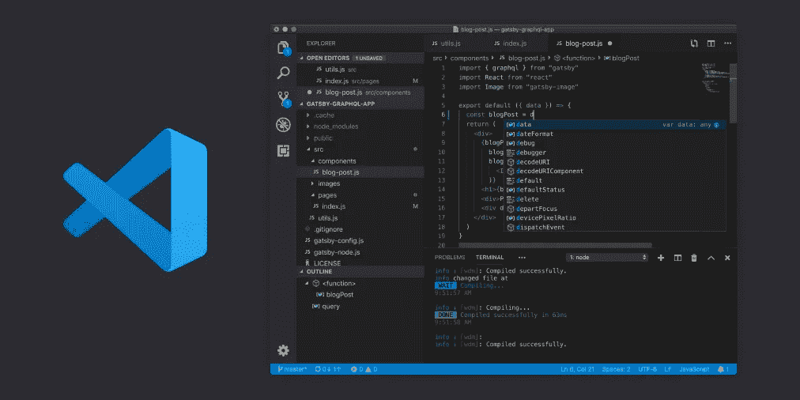

Visual Studio Code (VS Code)是目前开发人员使用的最流行、最受欢迎的 IDE 之一。我做了大量的谷歌搜索来寻找最好的扩展，我想我会总结所有的扩展并写一篇关于它的文章，这样对开发者社区会有帮助。在这篇文章中，我将与你分享所有的好的扩展，以使开发变得快速和容易！

# 棉绒

对于使用哪种编码风格，是使用空格还是制表符，冒号还是分号等等，人们都有强烈的意见。然而，同一个团队中的每个人都需要使用相同的编码风格，不管他们的观点如何。我们在一个配置文件中指定规则，然后 linters 将代码与指定的编码风格进行比较，并显示任何存在的错误。我选择用于林挺的扩展是:

## **ESLint**

*扩展标识符* : `[dbaeumer.vscode-eslint](https://marketplace.visualstudio.com/items?itemName=dbaeumer.vscode-eslint)`
*发布者* : Dirk Baeumer
下载量超过 1000 万，这是最受欢迎的将 ESLint 集成到 VS 代码中的扩展之一。您需要在项目目录中指定一个`.eslintrc`文件，它将指定扩展用来 lint 您的代码的规则。

# 格式程序

有时，我们编写的代码与其他代码不一致，这使得阅读起来有点困难。不仅仅是空格，我们还必须确保括号、标签的格式都是正确的，以便于阅读。手动执行这些操作既繁琐又耗时。这就是代码格式化程序的用武之地。在所有的格式扩展中，漂亮是我最喜欢的。

## 更漂亮—代码格式化程序

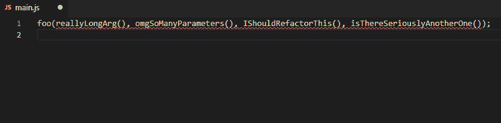

*扩展标识符*:`[esbenp.prettier-vscode](https://marketplace.visualstudio.com/items?itemName=esbenp.prettier-vscode)`
发布者:更漂亮
这是最流行的扩展，支持 JavaScript、TypeScript、CSS、JSX、HTML、JSON 等格式。它有超过 700 万的下载量。

# 版本控制

Git 是一个分布式版本控制系统。几乎每个开发人员都用它来跟踪软件开发过程中源代码的变化。它是为协调程序员之间的工作而设计的。

## GitLens — Git 增压

*扩展标识符* : `[eamodio.gitlens](https://marketplace.visualstudio.com/items?itemName=eamodio.gitlens)`
*发布者* : Eric Amodio
它通过 Git 责备注释和代码透镜帮助您直观地看到代码作者，无缝地导航和探索 Git 存储库，通过强大的比较命令获得有价值的见解，等等。

# API 交互

作为一名前端工程师，70%的时间我们倾向于使用 REST APIs。我同意我们大多数人使用流行的邮差应用程序来实现这些目的。但是如果您想在 VS 代码中与 API 交互，我强烈建议您使用 REST Client。

## REST 客户端

*扩展标识符*:`[humao.rest-client](https://marketplace.visualstudio.com/items?itemName=humao.rest-client)`
发布者:华超毛
REST 客户端允许你发送 HTTP 请求，直接在 Visual Studio 代码中查看响应。

# HTML/XML 相关扩展

## 自动重命名标签

*扩展标识符* : `[formulahendry.auto-rename-tag](https://marketplace.visualstudio.com/items?itemName=formulahendry.auto-rename-tag)`
*发布者*:韩军
这个扩展自动重命名配对的 HTML/XML 标签，这样会节省不少时间。

## html 标记包装

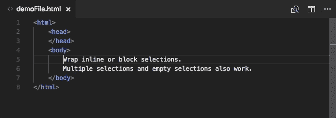

*扩展标识符* : `[bradgashler.htmltagwrap](https://marketplace.visualstudio.com/items?itemName=bradgashler.htmltagwrap)`
*发布者* : Brad Gashler
这将您的选择包装在 HTML 标签中。它还可以将行内选择和跨多行的选择换行。

## 嵌套注释

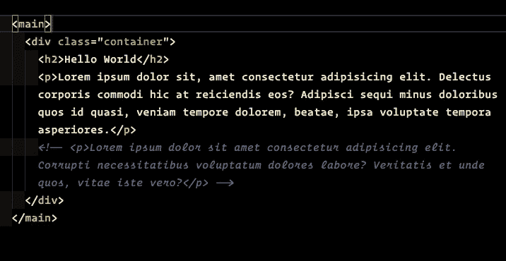

*扩展标识符* : `[philsinatra.nested-comments](https://marketplace.visualstudio.com/items?itemName=philsinatra.nested-comments)`
*发布者*:菲尔·辛纳特拉
这个扩展将把预先存在的注释转换成安全字符，允许包含原始注释的新块注释。取消对同一代码块的注释也会产生相反的效果。

## 实时服务器

*扩展标识符* : `[ritwickdey.liveserver](https://marketplace.visualstudio.com/items?itemName=ritwickdey.LiveServer)`
*发布者* : Ritwick Dey
该扩展启动一个本地开发服务器，具有静态&动态页面的实时重载功能。

# CSS 相关扩展

## CSS 峰值

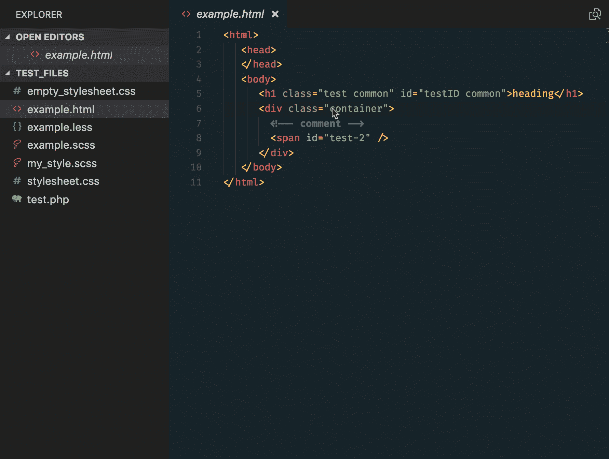

*扩展标识符* : `[pranaygp.vscode-css-peek](https://marketplace.visualstudio.com/items?itemName=pranaygp.vscode-css-peek)`
*发布者* : Pranay Prakash
这个扩展允许窥视 CSS IDs 和类，作为从 HTML 文件到相应 CSS 的定义。

## 实时 Sass 编译器

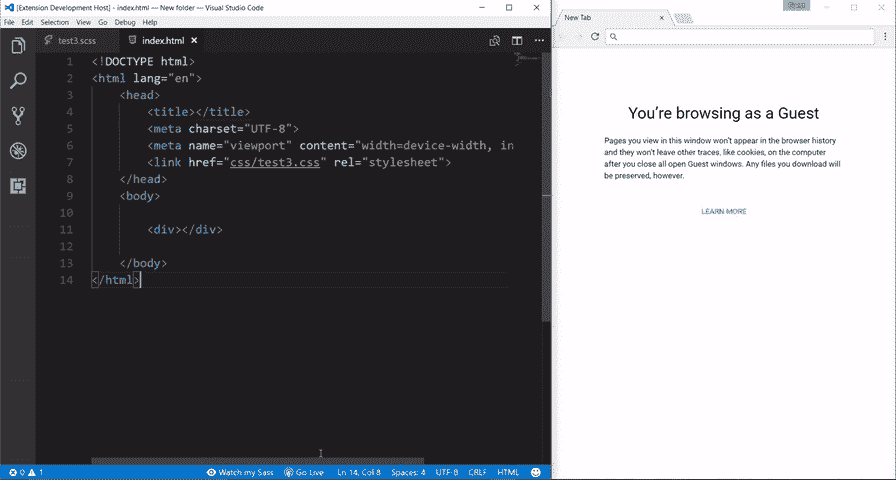

*扩展标识符*:`[ritwickdey.live-sass](https://marketplace.visualstudio.com/items?itemName=ritwickdey.live-sass)`
发布者 : Ritwick Dey
这个扩展帮助你用 live browser reload 实时编译/转换你的 SASS/SCSS 文件为 CSS 文件。

# JavaScript 框架扩展

## 代码拼写检查器

*扩展标识符* : `[streetsidesoftware.code-spell-checker](https://marketplace.visualstudio.com/items?itemName=streetsidesoftware.code-spell-checker)`
*发布者*:街边软件
一个基本的拼写检查器，可以很好地处理 camelCase 代码。这个拼写检查器的目标是帮助捕捉常见的拼写错误，同时保持较低的误报率。

## JavaScript (ES6)代码片段

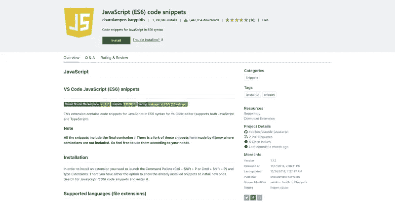

*扩展标识符* : `[xabikos.javascriptsnippets](https://marketplace.visualstudio.com/items?itemName=xabikos.JavaScriptSnippets)`
*发布者*:charalappos karypidis
该扩展包含用于 [Vs 代码](https://code.visualstudio.com/)编辑器的 ES6 语法的 JavaScript 代码片段(支持 JavaScript 和 TypeScript)。

## ES7 React/Redux/graph QL/React-本机代码片段

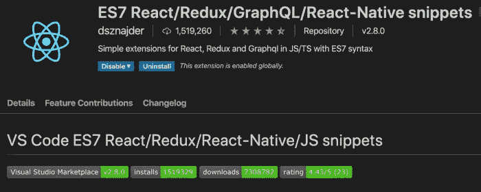

*扩展标识符*:`[dsznajder.es7-react-js-snippets](https://marketplace.visualstudio.com/items?itemName=dsznajder.es7-react-js-snippets)`
发布者 : dsznajder
这个扩展为你提供了带有 Babel 插件特性的 ES7 中的 JavaScript 和 React/Redux 片段。

## 韦图尔

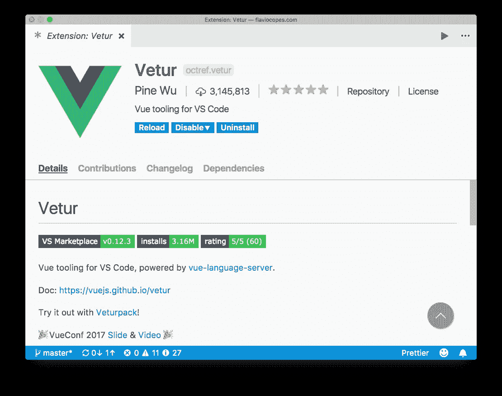

*扩展标识符* : `[octref.vetur](https://marketplace.visualstudio.com/items?itemName=octref.vetur)`
*发布者* : Pine Wu
Vetur 通过提供语法高亮、代码片段、林挺、格式化等等来帮助所有 Vue.js 开发者。

## 角度片段(第 9 版)

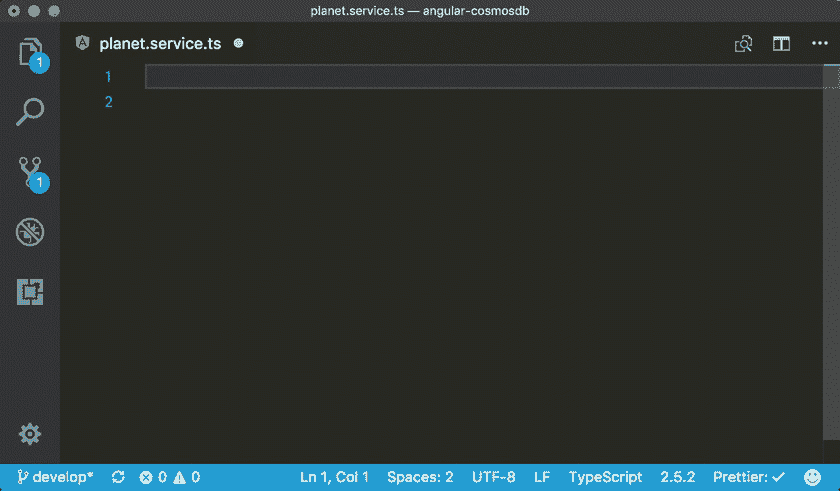

*扩展标识符* : `[johnpapa.angular2](https://marketplace.visualstudio.com/items?itemName=johnpapa.Angular2)`
*发布者*:John Papa
Angular snippets 为 TypeScript 和 HTML 添加 Angular 的代码段。

# 其他奇特的扩展

## 括号对着色程序 2

*扩展标识符* : `[coenraads.bracket-pair-colorizer-2](https://marketplace.visualstudio.com/items?itemName=CoenraadS.bracket-pair-colorizer-2)`
*发布者* : CoenraadS
这个扩展允许匹配的括号用颜色来标识。用户可以定义匹配哪些标记以及使用哪些颜色。

## 缩进-彩虹

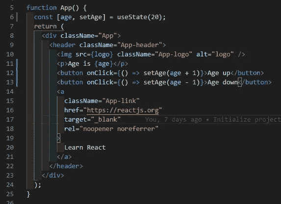

*扩展标识符* : `[oderwat.indent-rainbow](https://marketplace.visualstudio.com/items?itemName=oderwat.indent-rainbow)`
*发布者* : oderwat
一个简单的扩展，使缩进更具可读性。

## 虚拟代码-图标

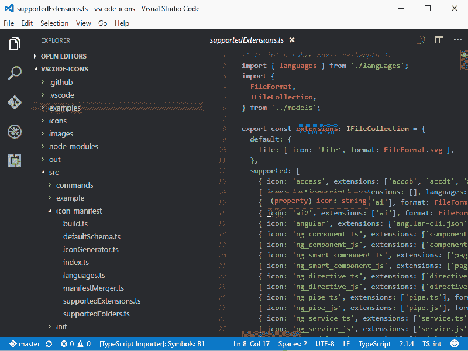

*扩展标识符* : `[vscode-icons-team.vscode-icons](https://marketplace.visualstudio.com/items?itemName=vscode-icons-team.vscode-icons)`
*发布者* : CoenraadS
如果你想在你的代码编辑器中使用漂亮的图标，确保你使用这个扩展，因为它们有很棒的图标。

## 设置同步

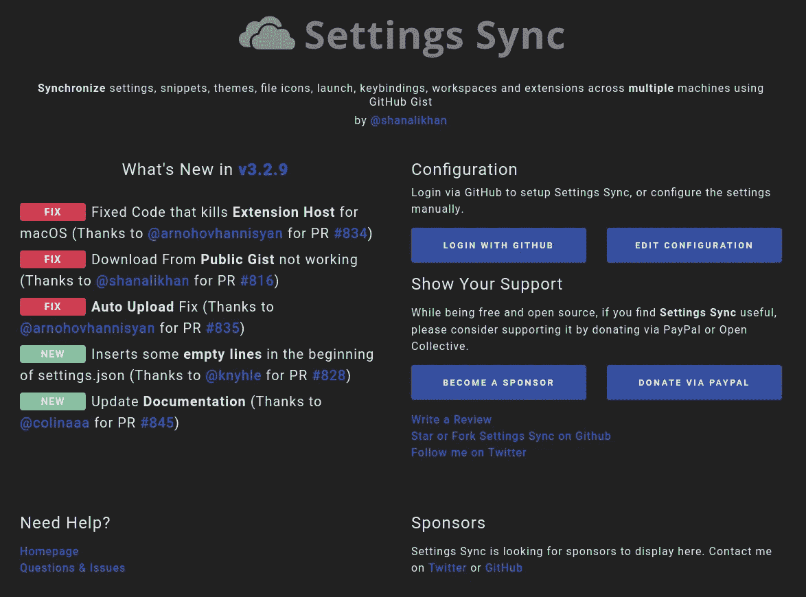

*扩展标识符* : `[shan.code-settings-sync](https://marketplace.visualstudio.com/items?itemName=Shan.code-settings-sync)`
*发布者* : Shan Khan
使用 Github Gist 跨多台机器同步设置、片段、主题、文件图标、启动、按键绑定、工作区和扩展。

这是我最喜欢的扩展的集合，我已经用了几年了。我希望我已经为您提供了一套很好的扩展来加速您的开发。如果您有任何建议或其他有用的扩展，请在下面评论。

感谢您的阅读！