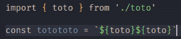
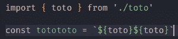
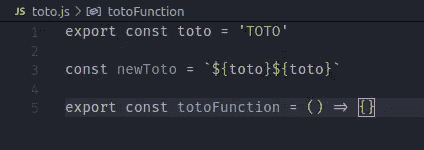
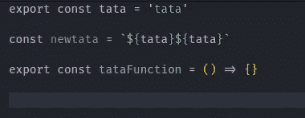
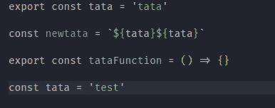

# 我最喜欢的 8 个 VSCode 快捷键

> 原文：<https://javascript.plainenglish.io/my-8-favorite-vs-code-shortcut-1-6747492fc0ef?source=collection_archive---------16----------------------->


嘿！欢迎，我是 CodeOz，我正在和你分享我最喜欢的 VS 代码快捷键。

# 缩进整行

默认情况下，当您在 VSCode 上缩进一行时，不会缩进整行，因此有一个选项:

`editor.action.indentLines`

```
{
   "key": "tab",
   "command": "editor.action.indentLines",
   "when": "editorTextFocus && !editorReadonly"
},
```

## 以前



## 在...之后



# 重命名所有文件中的变量

如果你想从一个文件中重命名一个变量，你将需要在你需要使用这个变量的所有其他文件中更新这个名字。多亏了这个快捷方式，在整个项目中重命名变量将变得更加容易。

`editor.action.rename`

```
{
   "key": "shift+f2",
   "command": "editor.action.rename",
   "when": "editorHasRenameProvider && editorTextFocus && !editorReadonly"
},
```


# 选择文件中的所有单词

你也可以从一个单词中选择所有单词！

`editor.action.changeAll`

```
{
   "key": "ctrl+shift+f2",
   "command": "editor.action.changeAll",
   "when": "editorTextFocus && editorTextFocus && !editorReadonly"
},
```



# 向后、向前和最后一次编辑导航

我的最爱之一！你可以浏览你的鼠标历史，从后退到前进，从你最后一次编辑开始，这非常非常有用。

`workbench.action.navigateBack`

`workbench.action.navigateForward`

`workbench.action.navigateToLastEditLocation`

```
{
   "key": "f1",
   "command": "workbench.action.navigateBack"
}, {
   "key": "f2",
   "command": "workbench.action.navigateForward"
}, {
   "key": "f3",
   "command": "workbench.action.navigateToLastEditLocation"
},
```



# 在行首和行尾导航

用这个你会节省很多时间。正如标题中提到的，您可以从一行的开头或结尾进行导航！

`cursorLineStart`

`cursorLineEnd`

```
{
   "key": "alt+left",
   "command": "cursorLineStart"
}, {
   "key": "alt+right",
   "command": "cursorLineEnd"
}
```



希望你喜欢这篇读物！

🎁你可以免费获得我的新书《javascript 中被低估的技能》,如果你在推特上关注我并给我打电话的话😁

或者在这里得到它

🎁[我的简讯](https://www.getrevue.co/profile/code__oz)

☕️你可以[支持我的作品](https://www.buymeacoffee.com/CodeoZ)🙏

🏃‍♂️，你可以跟着我👇

🕊的推特

👨‍💻Github

你可以标记🔖这篇文章！

*更多内容请看*[***plain English . io***](http://plainenglish.io/)