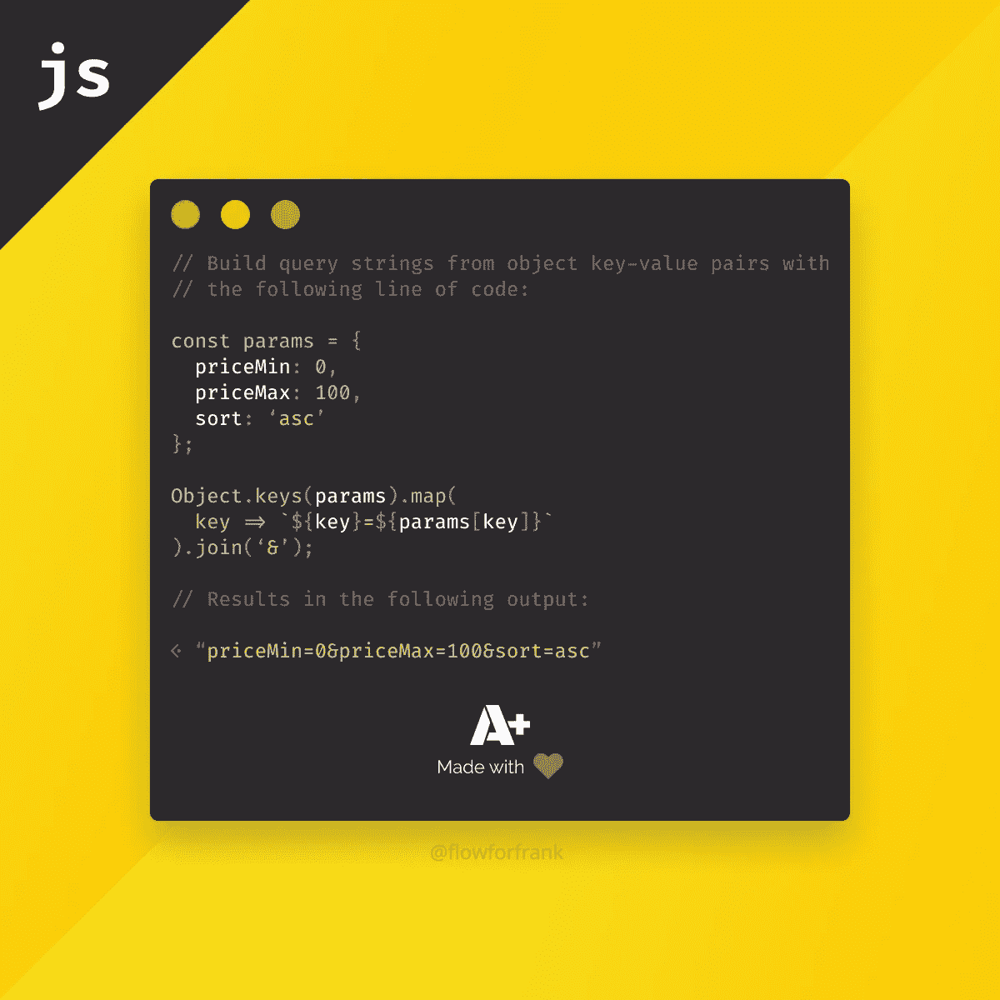
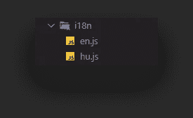
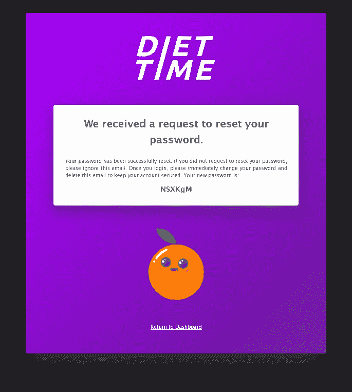

# 我在 HTML 电子邮件中处理可读 CSS 的方法

> 原文：<https://javascript.plainenglish.io/my-approach-to-readable-css-in-html-emails-3e2e9a22a72a?source=collection_archive---------3----------------------->

## 使用 JavaScript 使内嵌的 CSS 在电子邮件中易于管理

Photo by [Webaroo.com.au](https://unsplash.com/@webaroo?utm_source=medium&utm_medium=referral) on [Unsplash](https://unsplash.com?utm_source=medium&utm_medium=referral)

最近，我开始致力于密码恢复的实现，我在想什么会是——即使不是最干净的*——但仍然是一个很好的解决方案，可以让我的电子邮件模板风格化，而不会在阅读内嵌 CSS 时发疯。*

看，HTML 电子邮件的问题在于，你不能从 CSS 样式声明中找出来源，你只有一个有限的选择:确切地说，就是使用内嵌样式。我想通过快递服务器发送电子邮件，所以很明显使用 JavaScript，因此本文诞生了。

然而，在我们开始编码之前，有一点很重要，那就是我们有一大堆用户友好的在线工具，它们都有一个图形用户界面，你可以用它来创建令人瞠目结舌的电子邮件模板。

对于我的问题来说，用 JavaScript 完成所有这些工作似乎是最佳和最简单的解决方案。我只需要一个单一的模板，也想拥有对一切的完全控制。

# 创建模板

首先，您当然希望有一个模板。我创建了一个导出以下字符串的函数:

在这里，您可以看到我使用了一个模板文字，所以我可以包装 HTML 元素并使它们可读。我用一个函数调用解决了内嵌样式问题。它获取 CSS 样式，并将其转换为内嵌样式。但是函数在内部是做什么的，参数从哪里来？

# 添加 CSS

首先，我创建了一个容器对象来存储 CSS 样式，并在其中创建了其他对象来定义每个元素的 CSS 属性。这些是传递给函数调用的对象:

对象中的每个属性都是与其 CSS 值相关联的 CSS 属性的名称。这就是我们传递给`getStyles`函数的内容，该函数的唯一职责是为它创建内嵌的 CSS 样式。

那么，解决方案是什么呢？它实际上可以在一行代码中完成:

我们可以在每个值上循环使用`Object.keys`和`map`对象，其中我们使用冒号将键与值连接起来。之后，我们可以用分号将它们连接在一起。

同一段代码还有其他用例，比如生成查询字符串:

# 添加本地化支持

当它在做的时候，而不是文本本身的来源？这样，我们就可以以相对简单的方式添加本地化支持。我们所要做的就是将一个对象传递给我们的函数，然后引用模板中的键:

在这里，我给函数添加了一个`i18n`参数，该参数将一个对象保存在几个键上。对于每种语言，您都可以创建一个包含必要翻译的新文件。我为他们创建了一个单独的文件夹，名为`i18n`:

每一个都导出了一个带有必要键的对象:

您使用它们的方式是根据您的需要导入模板和一个本地化文件。您可以根据某些变量(例如，请求参数)导入它们，并调用函数来生成模板:

# 最终结果如何？

我在模板中使用了图像，但是要让它们出现，您需要通过受信任的 SMTP 服务器发送电子邮件。否则，您的图像不仅不会出现，更重要的是，您的电子邮件会落入垃圾邮件文件夹。

同样重要的是要提到，在 CSS 方面您有一些限制。电子邮件客户端并不支持所有样式。例如:虽然您看到一个很好的`box-shadow`应用在这里，但这是一个例外。包括 Gmail 在内的大多数电子邮件客户端都不支持它。如果你真的坚持，你最好使用图像。因为你的电子邮件客户端比浏览器多，为它们做一个一致的设计是一个挑战。

这就是为什么我建议只包括最必要和最基本的东西，比如颜色或布局。其他的一切都应该只是赞美，即使没有它们，你的电子邮件也应该看起来很整洁。

那么，您实际上是如何使用快递发送邮件的呢？这值得我在不久的将来写一篇自己的文章，所以一定要跟进。🍊

感谢您花时间阅读本文，快乐造型！

