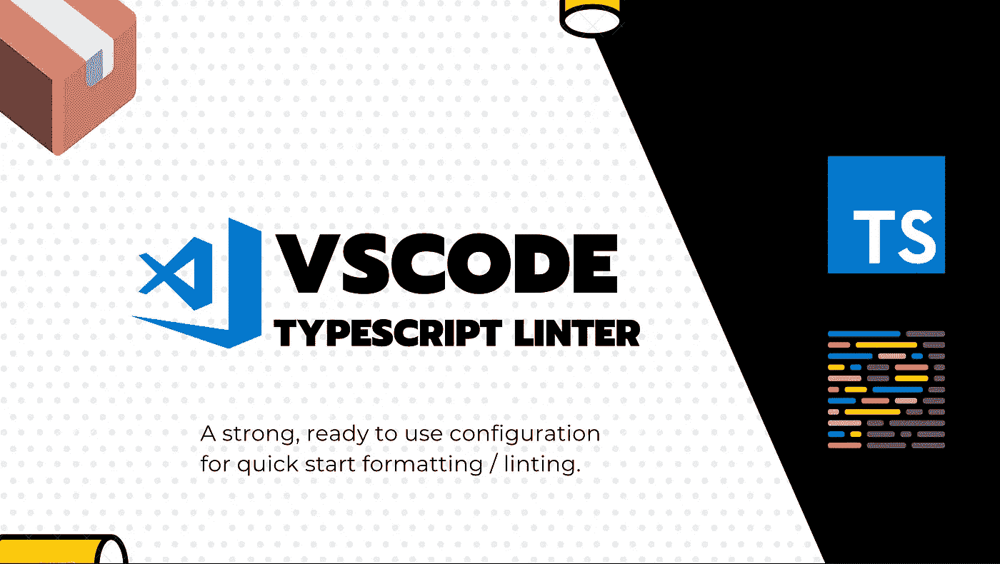

# 我对 Typescript 项目的最佳 VSCode 林挺/格式化配置

> 原文：<https://javascript.plainenglish.io/my-best-vscode-linting-formatting-configuration-for-typescript-projects-ef400ed9b78f?source=collection_archive---------5----------------------->

## 具有一组企业级的 Linter/Formatter 规则，为您的 Typescript 应用程序赢得引导时间。



我想和你分享我基于 TSLint 和 Prettier 的个人配置，我几乎所有的项目都使用它。

**它已投入生产，经过验证且易于设置。**

> 项目自举不应该如此麻烦和昂贵。

**💡免责声明:***我知道代码风格是一个非常有争议的话题，每个人都有自己的假设和偏好。这种分享并不打算成为著名的银弹，它只是一套工作配置，以快速自信地开始你的项目。*

# 代码格式化程序和代码处理器有什么区别？

> **代码格式化程序**解决了代码组织的风格部分。它是关于空格、制表符、分号和引号之类的东西…

为此，我选择使用最流行的 Javascript 格式之一:[](https://prettier.io/)****。****

> ****短评**更多的是关于高质量软件和一般一致性的最佳实践。它是关于用 let/const 代替 var，按字母顺序排列 imports/objects 键。**

**为此，我使用了专门用于打字的 linter[**ts lint**](https://palantir.github.io/tslint/)。他们将逐步迁移到 Eslint 解析器，但是现在，它的功能更强大，也更容易设置。**

# **为什么我应该使用棉绒和格式化程序？**

**当作为一个团队工作时，你希望以最好和最有效的方式实现一个共同的目标。**

**为此，出于某种原因，你可能会同意一些规则。但是人类可能会失败，可能会忘记应用一些模式。在这里，linter 和 formatter 将帮助您与您的团队保持一致。**

**这样，当你的团队中有人阅读你的代码时，你的代码会更加标准化，这有助于你进行评审。**

**此外，自己解决问题真的很麻烦，机器可以通过自动应用一些保存规则来帮助你。**

# **📦我的命题:[极光](https://github.com/ScreamZ/aurora)**

**用于类型脚本项目的一组配置和规则。**

**[](https://github.com/ScreamZ/aurora)**

**利用 Prettier 和 TSLint，我们混合了两者的优点，得到了一个 linter，而不会与其格式化程序发生冲突。这可以通过禁用可能与更漂亮冲突的 TSLint 规则并配置更漂亮来解决这些设置来实现。**

**这显然是固执己见，但你可以扩展它以适应你的需要。**

****目前我分享了两个配置:****

*   ****一个用于通用类型脚本项目**，如云函数项目或 NodeJS 应用。**
*   ****一个用于基于 React 的项目**，比如 NextJs 或者 react-native 项目。**

**为了使用 VSCode，最好安装[漂亮的扩展](https://marketplace.visualstudio.com/items?itemName=esbenp.prettier-vscode)和 [TSLint](https://marketplace.visualstudio.com/items?itemName=ms-vscode.vscode-typescript-tslint-plugin) 一个。**

**另外，在 VScode 中启用`"editor.formatOnSave": true`配置。**

## **⚙️装置**

**[**此链接可访问图书馆**](https://github.com/ScreamZ/aurora)**

**你只需要跑`npm install -D prettier tslint @screamz/aurora`或者`yarn add -D prettier tslint @screamz/aurora`**

**一旦完成，你可以通过在你的`package.json`中添加一个值为`@screamz/aurora`的`prettier`键来注册更漂亮的配置。**

**然后创建一个`tslint-config.json`文件，用正确的配置`@screamz/aurora/tslint-common`或`@screamz/aurora/tslint-react`添加实现`extends`键。**

```
{
  "extends": "@screamz/aurora/tslint-react",
  "linterOptions": {
    "exclude": ["node_modules/**/*"]
  }
}
```

**你也可以覆盖一些东西来匹配你自己的特性，为此，我推荐你看看 Github 上的文档。**