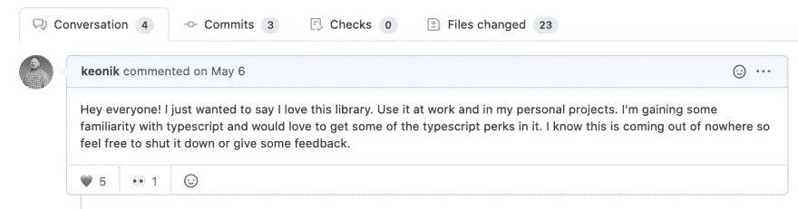
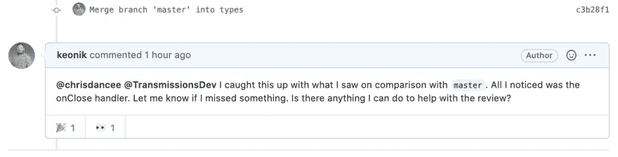

# 我为开源软件做贡献的经历

> 原文：<https://javascript.plainenglish.io/my-experience-contributing-towards-open-source-software-3f48214ff057?source=collection_archive---------16----------------------->


# 故事时间

在过去的一年里，我学习了很多关于 [TypeScript](https://www.typescriptlang.org/) 和[渐进式网络应用](https://web.dev/progressive-web-apps/) (PWA)的知识。当我创建 PWA 的时候，我试着使用[自动完成](https://code.visualstudio.com/docs/languages/typescript#_intellisense)并意识到没有我喜欢的开源项目类型。我看到了向开源项目添加一些新工具的机会🎉这个项目是用 JavaScript 编写的，并使用 [Babel](https://babeljs.io/) 进行捆绑。根据代码库的大小，将项目从 JavaScript 转换为 TypeScript 可能会很困难。

要了解如何转换项目，请尝试阅读[从 JavaScript 迁移到 TypeScript(从头开始)](https://medium.com/javascript-in-plain-english/scripting-javascript-to-typescript-from-scratch-8189c85095da)。

幸运的是，这个库只有几个文件，这是一个测试我技能的好机会。我提交了我的拉动式请求(PR ),对此我很兴奋！



贡献者开始给我积极的反馈，事情正在进展，但是在维护者的待办事项中还有其他优先的请求。正如所料，我的贡献被忽略了一点。从 JavaScript 到 TypeScript 的重写可能需要回顾很多内容。这些人中的大部分人没有得到维护项目的报酬。他们这样做是出于礼貌，也是回报过去为他们做过的社区的一种方式。

其他 PR 被批准并合并到`master`中，我意识到有许多冲突(毕竟这是一个完整的打字稿重写)。我想尽快解决这些问题，但是遇到了一个新的案例，我现在才需要知道。其他人可以从中学习，所以这里是我对它的快速反应，包括一些背景。


# 我们为什么要为开源项目做贡献？

如果你还没有参与任何开源项目，我鼓励你这样做。即使是最简单的事情，比如文档中的打字错误，也会改变 JavaScript 开发人员的消费方式。

## 避免放弃一个项目

我听到许多人抱怨说一个库不适合他们的用例，所以他们放弃了它。有些放弃是有根据的，但许多不是。经常会有人抱怨，直到有人礼貌地向维护者报告问题。

## 减轻维护者的一些责任

下一个冒险是处理和优先化工作，以便有人可以开始。你可以想象，如果全部由你来承担，作为一名维护者会有多大的压力。通过写下问题并贡献一些代码，这些维护者应该会欣喜若狂地看到社区参与到他们的工作中并希望改进它。

## 改变你的观点

我经常遇到不理解开源库如何更新的人。出于某种原因，很容易假设这些组织资金充足，会在短时间内解决所有问题。


进入代码并做出贡献将向您展示它是如何工作的！每个人为了创造有用的东西而付出的所有努力都让我着迷，我喜欢这种帮助他人而不只是让自己受益的想法。

## 这对建立简历和人际关系网很有帮助

我目前仍处于在家工作的状态，最近没有太多的社交活动。通过伸出援手，你可能会结交新朋友或获得新的联系，这可能会带来其他机会。

我的猜测是，大多数开发人员并不经常为开源项目做贡献，尽管在就业市场上有一个共同的期望。

如果你做到了，这对于求职和自由职业者的联系都是一个很好的机会。

# 怎么

## 先决条件

1.  您已经分叉了存储库。
2.  您已经创建了一个分支和 PR 来进入最初的 maintainer 项目。
3.  您有冲突或过时的分叉存储库。
4.  你厌倦了阅读引导信息，想看看该怎么办。

## 为分叉的存储库配置 git remote

以我为例，我将参与到 [react iOS PWA 提示](https://github.com/chrisdancee/react-ios-pwa-prompt/pull/49)中。如果你还没有看过，并且喜欢这个想法，那就去看看吧！iOS 用户没有通用的 google PWA 提示符，因此创建了一个 react 组件来处理这种情况。

```
git remote add upstream [https://github.com/chrisdancee/react-ios-pwa-prompt.git](https://github.com/chrisdancee/react-ios-pwa-prompt.git)
```

如果你想验证它的工作，你可以运行

```
git remote -v
```

您应该会看到它被列为远程存储库之一

## 结账大师

```
git checkout master
```

## 将上游远程合并到主机

```
git merge upstream/master
```

## 推到你分叉的回购上

```
git push
```

## 签出当前正在审核的分支

```
git checkout {name-of-branch}
```

## 解决冲突

确保您测试并尽您所能来捕捉新代码可能引入的错误。🤞

## 把那个推出去

```
git push
```

## 如果您必须通知适当的维护人员

我通常只是在 PR 中标记维护者，让他们知道可以开始了



## 你完了！🎉


我是开源项目的新手，所以我希望在评论中听到其他的好处。感谢您的阅读！