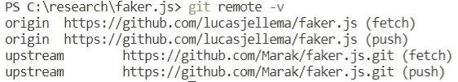
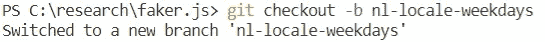
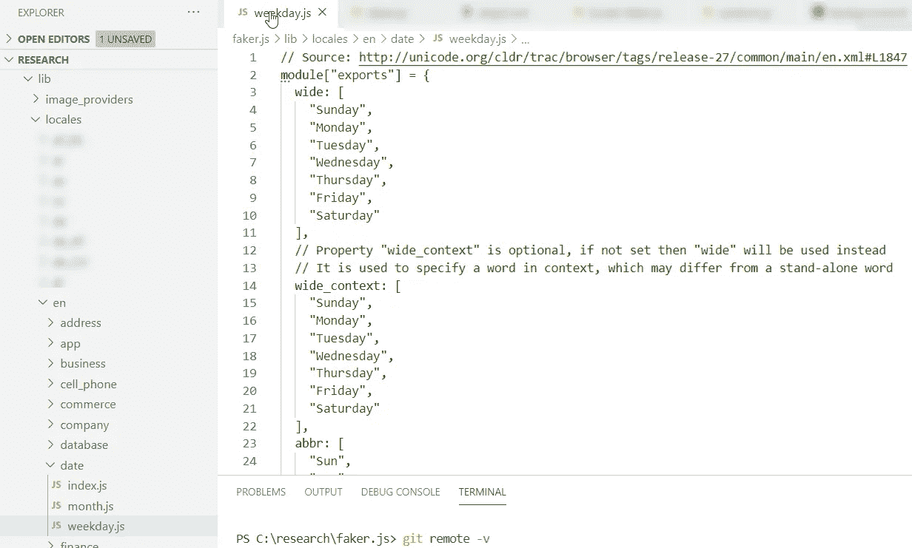
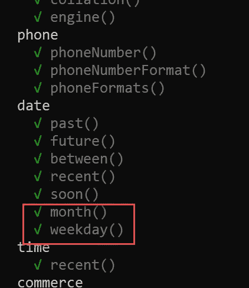
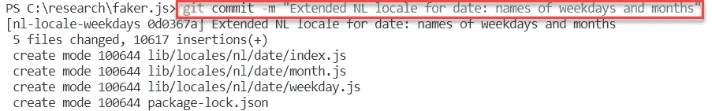
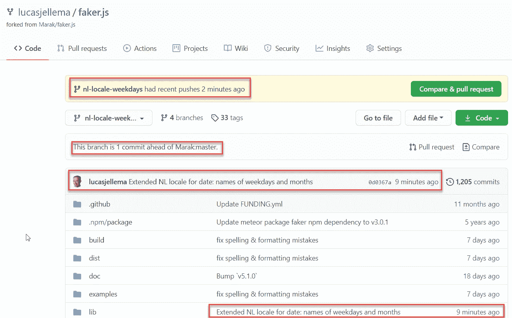
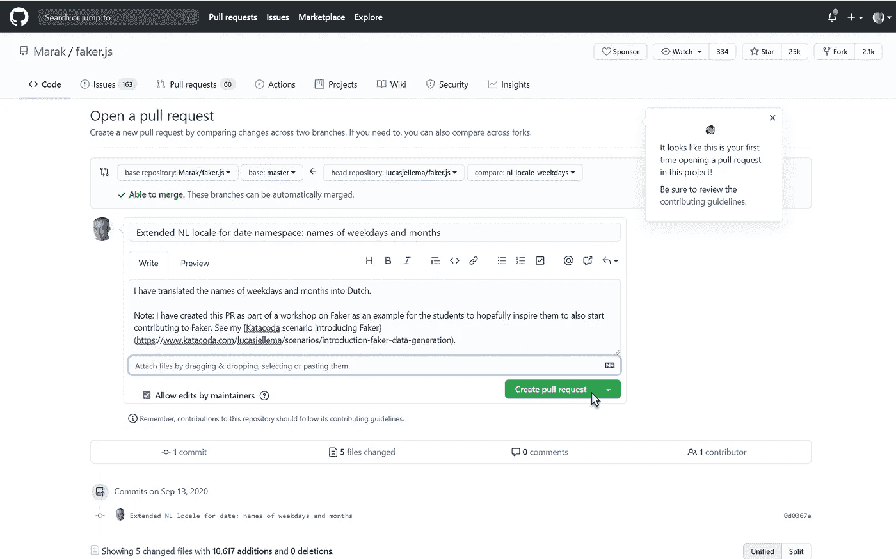
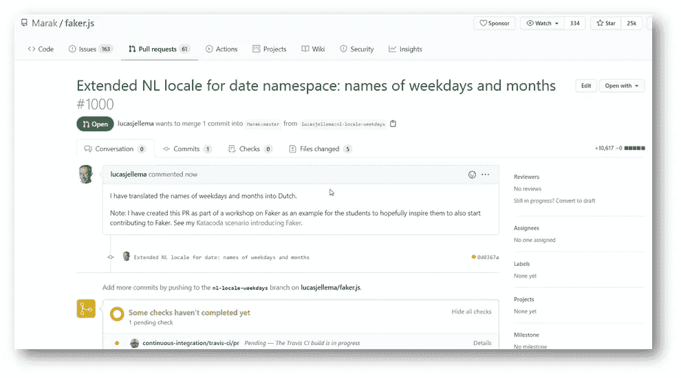

# 开始为开源软件做贡献

> 原文：<https://javascript.plainenglish.io/my-first-contributions-to-an-npm-module-open-source-project-bca5c17bd738?source=collection_archive---------7----------------------->

## 一步一步的指导我如何为一个开源项目做出我的第一份贡献

每个开发人员都应该对他们从中受益匪浅的社区做出贡献。使用开源工具、库和其他资源是我们都在做的事情。我们利用了无数同行的成果。这很好——这就是为什么我们的同事分享他们的工作。但是，如果我们也积极参与，那就太好了。例如，通过文章、演示和视频传播我们所利用的项目。当然，通过贡献代码来帮助改善项目的功能。

像许多开发人员一样，我有点不情愿贡献代码。我不确定具体应该如何做，以及我应该满足什么要求。我可能能够并且应该在更早的时候做出贡献——但是最终我对一个实际的开源项目的第一次代码贡献是在几天前——我仍然在等待我的 Pull 请求被接受。

在这篇文章中，我将分享我是如何做出这一贡献的。这并不是因为代码本身有什么特别之处(老实说，它很蹩脚)，而是为了展示这个过程是多么简单——多亏了 GitHub——以及您真的不应该让这种不情愿阻碍您前进。只是通过这些步骤，做出改进并分享你的改变。这是对那些创造出我们每天都从中受益的软件的无名英雄们的最高形式的赞赏。

# 开源项目:NPM 模块 faker.js

在之前的一篇文章中，我已经介绍了 faker.js。这是一个 NPM 模块，用于生成虚假数据，例如用于测试、演示和培训。Faker.js 是用 JavaScript 编写的，既可以用作服务器端节点应用程序，也可以用作客户端浏览器库。

Faker.js 生成许多类型的数据——姓名、地址、产品、公司、日期、IP 地址等等。它还支持不同的地区——根据世界上许多不同国家的格式和语言的本地化数据。例如，Faker 知道如何为葡萄牙和巴西生成荷兰邮政编码、法国名字、德国地址和葡萄牙产品描述。

Faker.js 很有用。并且非常容易使用。每周下载近 150 万次，有超过 110 名投稿人。一个已经存在了 8 年多的成熟项目。由马拉克维护——他在[的网站](https://marak.com/)上表示“我们的使命是变得令人敬畏，让世界变得更美好。”我愿意加入这项任务，帮助改进 faker.js。

我决定做出的微不足道的贡献包括为荷兰(NL)地区翻译工作日和月份的名称。我就是这样创造一个更好的世界的吗？好吧。这是一个步骤，尽管非常小。这是对马拉克和他们所做工作的感谢。它还增加了 faker.js 的价值，尽管不是一个引人注目的水平。我怀疑这将降低我的门槛——也许还有你，亲爱的读者——为这个项目和其他项目做出进一步的贡献。

# 计划及其执行

所以计划是这样的:我将用荷兰语定义工作日和月份，并将这一贡献提供给 Marak，以便包含在 faker.js 中。

这是怎么做到的？我是否只需编写 JavaScript 代码并向 Marak 发送电子邮件？或者这就是 GitHub 的用武之地？然后走一个更正规的流程？事实上，GitHub 是创建和提交变更的核心机制。

在更详细地展示步骤之前，让我总结一下这个过程。

首先，我创建 faker.js 存储库的一个*分支*。fork 是我自己的库副本——由 GitHub 为我创建和管理。

接下来，我将 fork[ed]存储库克隆到我的笔记本电脑上。这基本上意味着将源代码复制到本地开发环境中。

然后，使用一个 *git 客户端*，我定义并检查一个特性分支。我将在这个分支上对我打算贡献给 faker.js 的新功能进行修改。

现在是编码的时候了。我实施变革。我做了所有的测试来验证我没有损坏任何东西。如果我添加了现有测试没有覆盖的代码，我也会扩展测试集。我运行构建脚本，以验证在我添加了我的更改后它仍然在工作。

如果一切正常——我现在将提交变更的和新的源代码[到特性分支]并推动变更。我的代码贡献现在已经到了 faker.js 库的 fork 中。

GitHub 了解这种情况，并为包含我的更改的*分支*中的特性分支提供了在原始 faker.js 存储库中创建拉请求的选项。这个 PR 是我提供给项目维护人员的；PR 描述了我的变化是什么，也许是为什么，并且包含了我为新特性提交的代码。

在这一点上，理想情况下，PR 被接受——在被审查之后——并且代码被合并到 faker.js 存储库中的主分支中。评论者也有可能提出额外的问题，要求改进，甚至断然拒绝我的提议(就像他们对引入星球大战相关数据生成的公关[所做的那样](https://github.com/Marak/faker.js/pull/562))。

在撰写本文时，[我的 PR](https://github.com/Marak/faker.js/pull/1000) 仍在审核中。我希望它能被接受，简单，直接。但是我觉得有点焦虑。好像我在等待某次考试的成绩。

下面，你会发现我在这里概述的步骤的详细描述。希望足够清楚让你自己尝试一下。

# 一步一步——从分叉到拉动请求

## 1.派生原始存储库

GitHub 中 faker.js 的仓库在 https://github.com/Marak/faker.js 的。转到此 URL。确保您已登录 GitHub 帐户。然后点击*分支*链接，创建您个人的*分支*本次回购。


当分叉完成时，您的 GitHub 帐户中就有了一个新的存储库——它被标记为来自原始(上游)存储库的分叉。


## 2.克隆分叉回购

将存储库克隆到本地开发环境中。这会将 GitHub 中的所有源代码下载到那个环境中。

```
git clone [https://github.com/lucasjellema/faker.js](https://github.com/lucasjellema/faker.js)
```

当我想运行测试、构建或示例时，我需要安装 faker.js 模块的所有依赖项:

```
npm install
```

这将安装例如*mocha*——用于 faker.js 的测试库。

## 3.将原始回购设置为上游

我必须配置一个指向 Git 中上游存储库的 remote，以便将我在 fork 中所做的更改与原始存储库同步。这也允许我将原始存储库中的更改同步到我的 fork。

```
git remote add upstream https://github.com/Marak/faker.js.git
```

验证您为 fork 指定的新上游存储库。



## 4.创建并检出特征分支

为了整齐地组织我将要做的更改——并协调后续的拉请求——我将创建一个分支来处理。这可以在 GitHub 浏览器 UI 或命令行中完成:

```
git checkout -b nl-locale-weekdays
```

此命令创建分支并签出分支。现在在本地完成的任何工作都是在特征分支上完成的。注意:该分支目前只存在于本地——该分支还没有被推送到远程 repo，所以您在 GitHub UI 中还看不到该分支。



## 5.实施变革

在这个特殊的例子中，我想创建文件*lib/locales/en/date/weekday . js*的荷兰语副本。



我可以简单地在目录*lib/locales/nl/date/weekday . js*中创建这个文件的副本。事实证明，我可以轻松地提供文件 *month.js* 的荷兰语版本。我还把*lib/locales/****en****/date/index . js*复制到*lib/locales/****nl****/date*。在将 weekday.js 和 month.js 的内容翻译成荷兰语之前，我编辑了文件*lib/locales/****nl****/index . js*来协调荷兰语区域设置；我添加了一行:`nl.date = require("./date");`来确保 NL 域中的新日期域被加载。

然后，我翻译 weekday.js 和 month.js。

## 6.运行测试和构建

在做出更改之后，我运行了整个测试集。

```
npm test
```

当然，这并不能证明我定义了正确的翻译，但它确实验证了在我做了修改后代码仍然有效。没有必要为这种变化扩展测试集。



如果您添加功能——新的功能，甚至一个新的领域——那么您需要确保更新测试集以保持测试覆盖率。项目所有者要求几个拉请求者在拉请求被接受之前首先扩展测试集。例如，参见 [PR，了解 faker.random.word 和 faker.random.words 的支持词类—需要测试覆盖](https://github.com/Marak/faker.js/pull/907)。

## 7.提交和推送更改

此时，我可以提交我的更改。

```
git commit -m "Extended NL locale for date: names of weekdays and months"
```



并将它们推送到远程存储库(在 GitHub 中)

`git push origin nl-locale-weekdays`

在 GitHub 浏览器 UI 中，可以看到新的提交:



8.使用原始存储库为新功能创建拉式请求

Pull 请求是在 GitHub 浏览器 UI 中创建的:



更多详细信息，请参见 [GitHub 关于发出拉取请求的文档](https://docs.github.com/en/github/collaborating-with-issues-and-pull-requests/creating-a-pull-request-from-a-fork)。

请购单是自动创建和检查的。然后将它提交给 faker.js 项目的核心提交者进行审查。



我现在正在等待我的 PR 被接受。你可以检查进度，甚至加入进来:[有史以来最好的公关](https://github.com/Marak/faker.js/pull/1000)。

请鼓励大家也为 Faker 做出贡献——希望比这个有些低悬的翻译成果更有趣。

用新的名称空间扩展 Faker 怎么样——例如天气、食物、体育、航空、编程语言、云？

或者从一个简单的投稿开始，考虑翻译成荷兰语数据集，如 commerce/product_name、commerce/color、commerce/product_description、commerce/department、finance/account_type、finance/transaction_type、company/bs_verb、company/bs_noun、team/creature (animals)、vehicle/fuel、vehicle/vehicle_type。这里所有这些区域设置都用英文定义:[https://github . com/Marak/faker . js/tree/master/lib/locales/en](https://github.com/Marak/faker.js/tree/master/lib/locales/en)。

# 下一步是什么？

当我在等待 PR 被接受时(或者等待我完成 PR 的更多工作)，我想开始使用我定制的 faker.js 版本，而不是官方版本，遗憾的是，官方版本目前缺少月份和工作日的荷兰语名称。对于任何希望使用 faker.js 的应用程序，这可以通过 package.json 中的依赖项中的特殊语法轻松实现。

他通常会说:

```
"dependencies": {
     "faker": "^5.1.0"   
}
```

我们可以将 package.json 中对 faker 的引用更改为 GitHub repo 中的定制版本:

```
"dependencies": {
     "faker": "lucasjellema/faker.js#nl-locale-weekdays"
}
```

该语法引用了 GitHub Repo 和应该加载 NPM 模块的特定分支。我们还可以引用特定的提交标识符。注意:请参见[https://docs . npmjs . com/files/package.json # git-URLs-as-dependencies](https://docs.npmjs.com/files/package.json#git-urls-as-dependencies)了解 GitHub 的详细信息以及 package . JSON 中对自定义 NPM 模块的其他引用

像往常一样使用`npm install`下载 package.json 中指定的依赖项。在这种情况下，这将从存储库的 my fork 中的 feature 分支下载 faker.js。

当然，最终我希望用包含我的功能的 faker.js 新版本替换定制版本。

下面的代码片段通过生成荷兰月份和工作日来利用我对 faker.js 的 valiant 扩展:

```
const faker = require('faker');
faker.locale = "nl";
// generate month and weekday in the NL locale
// because of my extension of faker.js, 
// this will produce real Dutch valueslet month = faker.date.month();
let weekday = faker.date.weekday();console.log(month);
console.log(weekday);
```