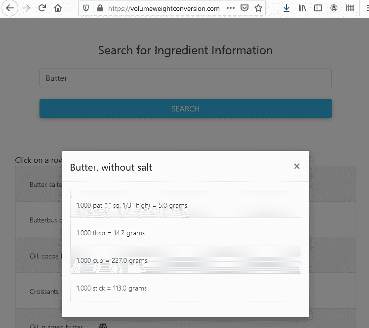

# 我第一次使用 AWS 尝试无服务器

> 原文：<https://javascript.plainenglish.io/my-first-foray-into-serverless-with-aws-3d7ff9df8460?source=collection_archive---------7----------------------->

这一切都是从我妻子说她想要一个网站开始的，在那里她可以输入一种成分，并看到该成分从体积到重量的转换。例如，她想查找砂糖，看到一杯糖是 200 克。经过一系列的研究，搜索，[栈溢出](https://stackoverflow.com/)阅读，学习，我创造了[体积重量转换](https://volumeweightconversion.com/)。

如果你是那种喜欢这种 [TLDR](https://www.urbandictionary.com/define.php?term=TLDR) 版本的人，我使用[无服务器](https://www.serverless.com/)为 API 层创建了[https://volumeweightconversion.com/](https://volumeweightconversion.com/)，并使用以下架构为云创建了 AWS:


Single Page Webapp in Serverless on AWS

如果你还和我在一起，我需要弄清楚从哪里获取数据，然后创建一个 API 来访问它，创建一个前端来调用 API，并在一个网站中将它们连接在一起。

# 数据

使用谷歌，我发现一些网站已经有类似的体积重量信息，但它们的广告太多，性能和格式也不是很好。我还找到了一个包含这些数据的 API，所以我可以调用第三方，但这个练习的一部分也是为了我在无服务器和 AWS 方面的教育，所以我决定继续寻找。我最终发现了美国农业部发布的一个很棒的数据集，叫做国家营养数据库标准参考。

有了我的数据，我现在必须弄清楚如何把它变成一个应用程序。首先，我需要找到存放它的地方。亚马逊提供了许多不同的数据库，具有不同程度的无服务器功能，但由于我也试图保持低成本并快速完成这项工作，我选择了我知道并喜欢的数据库，即 RDS 上的[Postgres](https://aws.amazon.com/rds/postgresql/)，因为它有一个免费层，而且我最熟悉 Postgres。使这变得更容易的是，数据集已经被规范化了，模式被记录了下来，并且很容易为关系数据存储而构建。

也许对于这个应用程序的第二次迭代，我会看看我是否可以将数据存储移动到 [DynamoDB](https://aws.amazon.com/dynamodb/) ，使用 [Redis](https://aws.amazon.com/elasticache/redis/) 在内存中缓存整个数据集，或者如果足够快，也许可以尝试 [S3 选择](https://aws.amazon.com/blogs/aws/s3-glacier-select/)。

我目前使用的数据库应用程序是 [DBeaver](https://dbeaver.io/) ，它提供了一个社区版本。所以我启动了它，阅读了发布的模式文档，创建了表、主键/外键关系、数据类型，并使用下面显示的方便的导入工具批量加载了提供的 CSV。对于 QA，我仔细检查了行数，以确保数据按预期加载。将来，我可能会使用一个[阶跃函数](https://aws.amazon.com/step-functions/)，它会定期调用 Lambda 来自动检查新的数据集，下载它并自动加载 CSV。


DBeaver bulk import dialog

经过一些迭代，编写一些查询来提取我正在寻找的信息，我需要构建一个接口来以编程方式安全地提取数据，所以我当然选择了 [Lambda](https://aws.amazon.com/lambda/features/) 函数。我第一次尝试 Python，但是无法让 [psycopg2](https://github.com/jkehler/awslambda-psycopg2) postgres 数据库连接库在我的 lambda 函数中工作。我也试图从源代码中构建一个，但我不确定 lambda 使用的是哪种 linux 风格/版本，我试图快速完成这个任务。我能够找到一个[节点库](https://node-postgres.com/)来轻松连接到 Postgres，所以我用 node 来编写 API。

# 应用程序接口

我发现[serverless.com](https://www.serverless.com/)提供了一个很棒的基于节点的框架，并且可以部署一个栈到 [AWS CloudFormation](https://aws.amazon.com/cloudformation/) 和其他云提供商，以便于移植。我发现了这个很棒的使用无服务器框架的一步一步作为起点:[https://hacker noon . com/how-to-deploy-a-node-js-application-to-AWS-lambda-using-server less-AE 7 e 7 ebe 0996](https://hackernoon.com/how-to-deploy-a-node-js-application-to-aws-lambda-using-serverless-ae7e7ebe0996)

另一个很好的基本介绍是:
[https://blog . cloudboost . io/如何创建无服务器节点-js-app-with-AWS-lambda-d5ab 23 be 0 CFB](https://blog.cloudboost.io/how-to-create-serverless-node-js-apps-with-aws-lambda-d5ab23be0cfb)

当所有的话都说完了，我的无服务器. yml 看起来如下。

```
service: serverless-nodejs-app
custom:
   stage: ${opt:stage, self:provider.stage}
   private: true
secrets: ${file(secrets.json)}
provider:
   name: aws
   runtime: nodejs12.x
   memorySize: 128 # optional, in MB, default is 1024
   timeout: 5 # optional, in seconds, default is 6
   apiKeys:
      - ${self:service}-${self:custom.stage}-api-key
stage: dev
region: us-east-2# TODO: There is probably a better way to store and encrypt these.
environment:
   PGDATABASE: "<my_postrges_database_name>"
   PGHOST: "<my_postgres_host_here>.us-east-2.rds.amazonaws.com"
   PGPASSWORD: "*<my_postgres_password_here>*"
   PGPORT: "5432"
   PGUSER: "<my_postgres_username>"functions:
   app:
   handler: app.server
   events:
      - http: # this is an API gateway HTTP event trigger
         path: /
         method: ANY
         cors: true
         private: ${self:custom.private}
      - http: # all routes get proxied to the Express router
         path: /{proxy+}
         method: ANY
         cors: true
         private: ${self:custom.private}
```

经过大量的迭代、开发和学习，我终于可以调用我的 Lambda 并得到结果了。

下一步是让它可以公开访问，更安全一点，并通过我的域调用它。合适的工具是 [API Gateway](https://aws.amazon.com/api-gateway/) 和 [Route 53](https://aws.amazon.com/route53/) (在我的例子中)。对于 API Gateway，我不需要做什么，因为无服务器框架为我生成了它以及用于快速部署的 API 键。


API Gateway Configuration with Serverless

## 克-奥二氏分级量表

我必须弄清楚如何通过 53 号公路、API Gateway、Lambda 实现跨来源资源共享(CORS)。我最终通过 API Gateway 接口启用了 CORS，如下所示，但我不确定我是否需要这样做。


Enable CORS in API Gateway

由于这是一个代理，lambda 函数需要将 CORS 头传递回来。在部署到 CloudFront 之前，我想通过 S3 托管的静态代码调用我的 API，所以我在 Node 应用程序中添加了一些原始处理逻辑，允许我直接从 S3 的浏览器轻松调试。

```
var allow_origin = "https://volumeweightconversion.com"if (req.headers.origin == "<MY_S3_BUCKET__REGION>"){allow_origin = req.headers.origin;}res.setHeader('Content-Type', 'application/json');
  res.setHeader('Access-Control-Allow-Origin', allow_origin);
```

## 应用编程接口网关自定义域

在设置 API Gateway 自定义域时，我必须按照下图所示进行配置，否则无法正常工作。我最初将 *Path* 值设置为 **dev** 以为我会通过[https://api.volumeweightconversion.com/dev/](https://api.volumeweightconversion.com/dev/)调用我的 API 端点，但是当下面的方法奏效时，我无法让它生效并继续前进。


API Mappings in API Gateway Custom Domain

我需要注册我的域名，所以我通过 53 号公路注册了，并建立了指向我的服务的 ARNs 的各种记录。因为我希望我的网站是安全的，我还必须添加 DNS 记录来显示我拥有 AWS [证书管理器](https://aws.amazon.com/certificate-manager/)提供证书的域。

此时我能够调用我的 API 并看到来自[邮差](https://www.postman.com/)的响应，简单的*卷曲*如下:

```
curl --location --request POST 'https://api.volumeweightconversion.com/' --header 'x-api-key: <my_api_key>' --header 'Content-Type: application/json' --data-raw '{"food":"rice"}'
```

# 网络应用

现在我有了 API 设置，我需要一个实际的 web 应用程序来调用它。为此我使用了 S3 静态网站托管和 Cloudfront。需要注意的是，我必须创建一个单独的、空的、公共的 S3 桶，以便设置从[www.volumeweightconversion.com](http://www.volumeweightconversion.com)到根 volumeweightconversion.com 的重定向，如下所示:


How to redirect [www.volumeweightconversion.com](http://www.volumeweightconversion.com) to volumeweightconversion.com

在决定使用 [Bootstrap](https://getbootstrap.com/) 、 [JQuery](https://jquery.com/) 和 [MDBootstrap](https://mdbootstrap.com) 之后，我开始尝试正确地呈现表格，验证我的输入，并学习如何使用这个堆栈进行调试。虽然我在职业生涯中做过一些 UI 开发，但我绝不是 UI 专家，所以我遇到了一些需要解决的 UI 问题，包括下面这个有趣的截图，我错误地将一个表格附加到了一个旋转图标上。建议看书，找样本，知道谷歌是你的朋友。


When you mistakenly attach a table to rotating icon.

我发现的一个很棒的调试工具是 [Dashbird.io](https://dashbird.io/) ,因为它们让我很容易看到在我迭代开发时发生的错误。


Very helpful Dashbird.io UI

# 最后的想法

我能够让所有东西都连接起来并正常工作。我在下面附上了一些写这篇文章时的截图。随着时间的推移，我可能会继续添加功能和迭代更多，因为人总是可以改进的。也许我会尝试 react-native 来构建一些移动应用程序，尝试使用 Redis 在搜索栏中自动完成，或者添加更多的特性和功能。我真的很喜欢它是如何快速和容易地启动这个应用程序，并认为无服务器是一个非常强大的工具，快速和容易地启动应用程序。如果您有任何问题，或者希望我进一步深入到这一部分，请随时提问！

 [## 搜索食物成分和重量换算

### 单击带有图标的行，查看该行的体积重量转换。

volumeweightconversion.com](https://volumeweightconversion.com) 

Home Page



Conversions Popup

## **说白了**

通过 [**订阅我们的 YouTube 频道**](https://www.youtube.com/channel/UCtipWUghju290NWcn8jhyAw) **来表达爱意吧！**