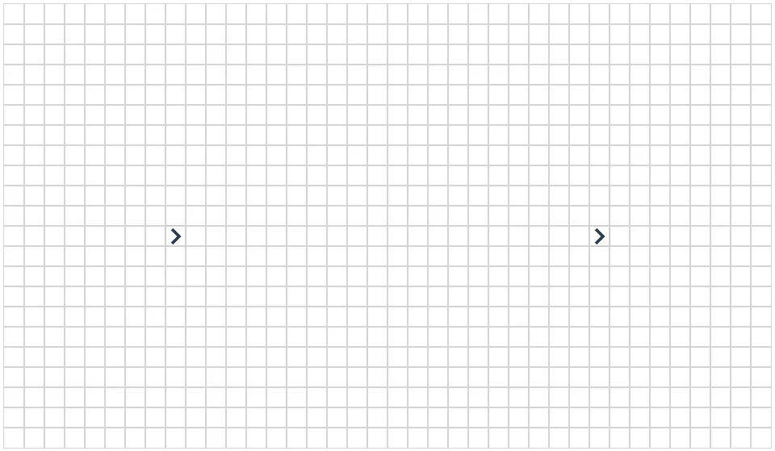
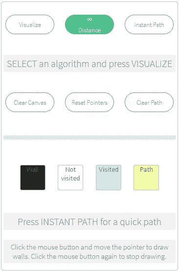
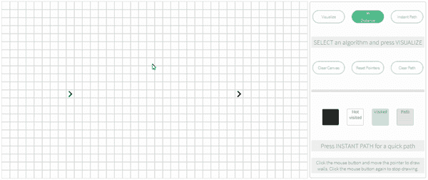
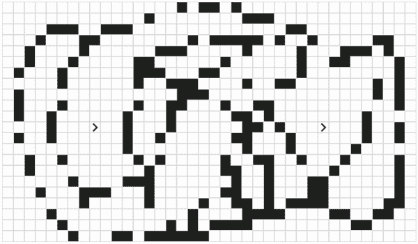
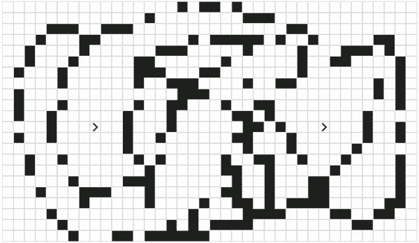
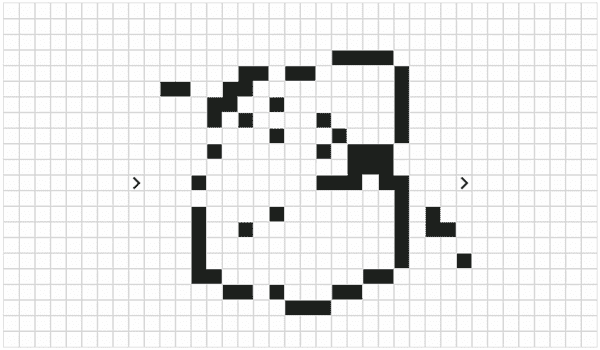

# 我的第一个 Vue.js 项目:寻路可视化工具

> 原文：<https://javascript.plainenglish.io/my-first-vue-js-project-a-pathfinding-visualizer-7229f7c3b017?source=collection_archive---------2----------------------->

## 从图论概念到可视化

事情是这样的。最近，我对 web 开发非常感兴趣，但问题是我以前从未做过。说到这里，我对编程并不陌生。我使用过 C/C++、Java、JavaScript 和我最喜欢的 Python 等语言。Python 在我心中保留了特殊的地位。

好的，让我们来谈谈网络开发和我做的项目以及我做这个项目的经历。

我对 web 开发的兴趣源于 Vue 社区的大肆宣传和热情。所以，我做了基本的 HTML 和 CSS，这样我就可以直接进入 Vue 的领域。而且，我不得不说 Vue 得到的好评是值得的。从你学习它的那一刻起，钻研它是如此容易。多亏了这种语言内置的简单性。对我来说，这也是我如此喜爱 Python 的原因。

好了，说够了。让我给你看看我做的东西。

这个项目被称为*寻路可视化器*，恰如其分，因为它做到了它所说的，它找到了一条从源头到目的地的路径。这个项目是基于图论。

*注:我是在去了 Clement Mihailescu* *建立的* [*网站后受到启发做这个项目的。起初，我使用* ***处理*** *框架构建了一个版本，但后来我学习了 web 开发并构建了 web 版本。*](http://clementmihailescu.github.io/Pathfinding-Visualizer/#)

这是您将在页面上看到的第一个框。好吧，不是第一个盒子，但不管怎样。按下下拉菜单，您可以从可用的算法中选择一种算法。现在，我已经建立了四个算法，我计划在未来几天增加更多。

现在，*这个图是未加权的*。我的意思是所有的边都是一样重的。简单点说吧。*你只能向四个方向行进。*

这是主要的*画布*，一切都将在这里发生。两个蓝色的*箭头*代表*源*和*目的*。现在我可以向四个方向行进以到达目的地。

为了使它更有趣，你可以在中间添加需要在遍历过程中避开的障碍。

这是控制盒。让我带您浏览每个可用的按钮。

1.  **可视化:**这个选项让你看到发生了什么，算法是如何在后台工作的。
2.  如果你只是想要一条路，而不想看到工作，我可以帮你。按下这个按钮*宾果*，你就大功告成了
3.  **Clear Canvas** :如果您想删除画布上绘制的所有内容，或者重新初始化画布，请按此按钮。
4.  **清除路径**:如果你只想清除路径和可视化效果，而不是墙壁，按下它。
5.  **重置指针**:这个应用的另一个特点是你可以选择和放置指针。现在，如果你想重置为默认，按这个。

我知道，这个描述相当模糊。所以，让我向你们展示我所说的一些话的意思。

现在让我们看看一些算法的工作原理。

## 横向优先搜索

这是一种以层次顺序方式进行遍历的图形算法。简单来说就是一层一层的往目的地走。它就像一个有许多层的洋葱。你一层一层地剥开，就能得到洋葱的核心。这个算法给出了可能的最短路径。

## 深度优先搜索

这是另一种图遍历算法。它使用递归。*该算法对特定方向有偏好。简单地说，假设它会一直向上，直到它不能再进一步，在这种情况下，假设它会向左，同样。深度优先这个名字也是。就像拿一块大木头。假设我有一块长度为 8 的木头。起初，我把它切成两半，每半 4 个。我拿起第一半，再次切成两半，每两半 2 片。现在我将拿起我的一个长度为 2 的片段，把它切成两个 1。看我每次都是如何处理新作品的。当我达到长度 1 后，我不能再分了。所以，我会选择另一个长度为 2 的。在我把它分成两部分后，我将使用长度为 4 的第一部分，并做同样的步骤。这种算法一般不会给出最短路径。*

## 贝尔曼-福特算法

这是另一种主要用于网络通信协议的图遍历算法。与上面两个相比，它相对较慢，但非常通用。它使用一种叫做*边缘松弛*的东西来找出路径*。*该算法给出了可能的最短路径。

## Dijkstra 算法

该算法类似于广度优先搜索，但也适用于加权图。因此，与 BFS 相比，它需要更长的运行时间。这个算法给出了可能的最短路径。

到目前为止，我还没有实现最后一个算法，但很快就会实现。

> *如果你想玩它，这里有* ***网站*** *到我的项目托管在 Github 页面上。*

 [## 寻路可视化工具

### 编辑描述

tinku10.github.io](https://tinku10.github.io/pathfinding-visualizer/) 

> 如果你想为项目做贡献，可以在 Github 上叉一下，做一个 pull 请求。

> *这里是****Github****链接到我的项目*

 [## tinku 10/寻路可视化工具

### 网站。在 GitHub 上创建一个帐户，为 Tinku10/pathfinding-visualizer 开发做贡献。

github.com](https://github.com/Tinku10/pathfinding-visualizer/tree/alt-design) 

如果你喜欢这个项目，我会很感激你的参与。这对我帮助很大。

**这个项目还没有完成**。当我在项目中增加新的特性时，我会保持这个帖子的更新。

> **更新**
> 
> **3 月 9 日** : *增加了一个指导你完成项目的教程。*

希望很快能再见到你..