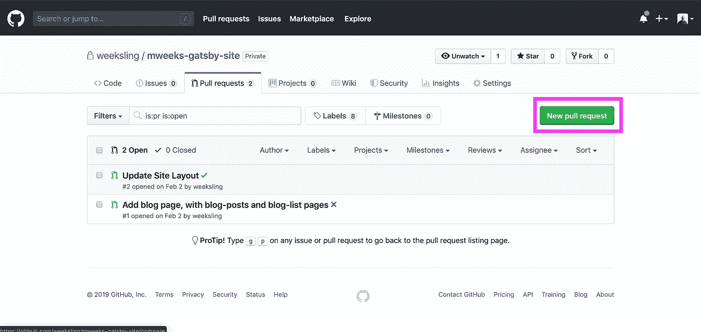

# 我的 Git 管理策略

> 原文：<https://javascript.plainenglish.io/my-git-management-strategy-fbdd342e416d?source=collection_archive---------1----------------------->


# 每一个新的软件项目都需要一个适应各种需求的版本控制策略:

*   一个锁定的主分支，始终可以交付生产
*   易于所有开发团队成员遵循
*   创建清晰的历史记录，便于理解发生了什么变化

另外，下面的策略还支持有效的代码审查，以及创建自动化发布、版本控制和测试的能力。

# 第一，哪些分支是重要的？

## 主要的

您的主分支是您对应用程序当前状态的了解的来源。

任何部署到 main 的代码都可以(也应该)部署到某种形式的生产环境中。

被合并到 main 中的变更应该已经通过了您的团队为代码被认为“完成”而建立的任何检查或保护。这可能包括单元测试覆盖、集成测试、手动测试、QA 批准、安全检查和代码审查。

到

## 发展

如果您的团队在更大的候选版本中构建产品，这个分支将是您合并和集成下一个版本的地方。这个分支本质上比 main 更不稳定，但是它仍然应该代表站点的一个功能版本。

如果您的团队足够自律，只创建功能性的、孤立的特性，您可能实际上不需要开发分支。Pull 请求甚至可以直接发送到 main、integrated，并在那里进行测试，然后一旦获得批准就进行部署——然而，这是一个关于基于主干的开发的更复杂的文章的想法。

## 特征分支

当我们构建功能或对代码库进行更改时，我们从当前的开发分支中分支出来，并对其进行更改。

当变更准备好部署时，我们将针对**开发**打开一个**拉请求**，并通过必要的检查，例如代码审查、自动化测试、林挺和 QA 审查。通过适当的工具，这些更改可以集成并部署到类似生产的环境中，在那里可以与现有代码一起进行测试。

这些分支可以按照您的团队喜欢的方式命名。

我个人遵循在每个分支前面加上变更类型的惯例:

*   功能/
*   家务/
*   修复/
*   改进/

接着是对实际变化的简要描述。

*示例:功能/标题-徽标、修复/博客-馈送-不加载、杂务/升级-节点-包或文档/部署-流程*

# 接下来，我们实际上如何做出改变？

## 首先，发展的分支

```
git checkout develop
git checkout -b feature/blog-reel
```

现在我们有了新的功能分支！

## 接下来，让我们进行一些提交

在提交时，有一个标准是好的，但是有一些通用的最佳规则:

*   每一次提交都是一个功能性的变更，另一个开发人员可以安全地将其引入到其他分支中
*   影响一个足够具体的范围，可以很容易地审查和理解。
*   描述发生的事情，但包括任何必要的描述。

就像所有的命名一样，做你喜欢的，只要你有一个标准。

我个人遵循语义提交，这一点我以后可能会写。

简短的描述:

```
[type]([scope]): [description of change][Explanation of changes][#ISSUE NUMBER]
```

这相当于:

```
feat(blog): Add descriptions to blog reel - Add descriptions to GraphQL Fragments and queries
  - Add description to BlogReelItem container
  - Add descriptions to test fixtures
  - Update tests[#3]
```

看你的要求了，大概也就在一线混吧。一定要让读者意识到这个变化会对软件产生什么影响！

## 当代码完成后，我们创建我们的拉请求！

但是首先，我们要重新设定基数！

```
git rebase develop
```

**好了，现在打开那个拉请求**



在您的拉取请求中，您需要添加一个标题和描述。有一个标准的书写方式是很好的。如果你对真正标准化你制作 PRs 的方式感兴趣，考虑 github-templates。

从这里开始，您团队中的某个人应该对您的代码进行代码审查。如果只有你一个，那就等一天，然后试着重读代码。在难以阅读或理解的地方进行评论并写出问题，如果有重大问题，进行标记。这也是你为其他人进行代码审查时要遵循的相同过程！

这个工作流最重要的部分之一是拥有一个正式的提交和分支策略，以实现更好的工作流系统化和(最终)自动化。在这篇文章中，我详细介绍了如何使用语义提交编写更好的提交:

[](https://link.medium.com/45JihlPwPab) [## 使用语义提交编写更好的提交

### 好的提交可以区分维护良好的产品和糟糕的产品。写得好的提交…

link.medium.com](https://link.medium.com/45JihlPwPab)